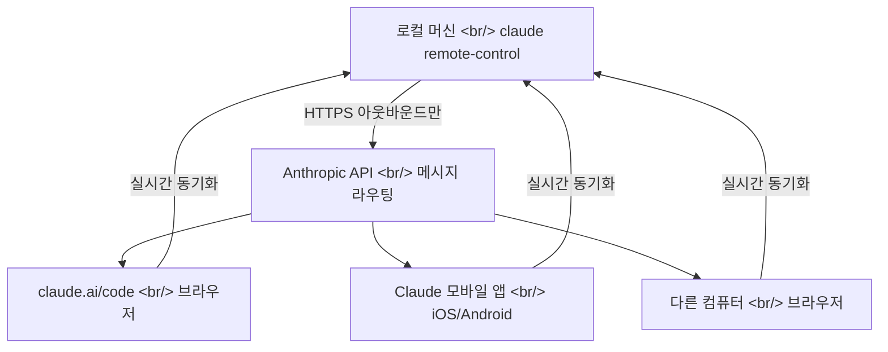
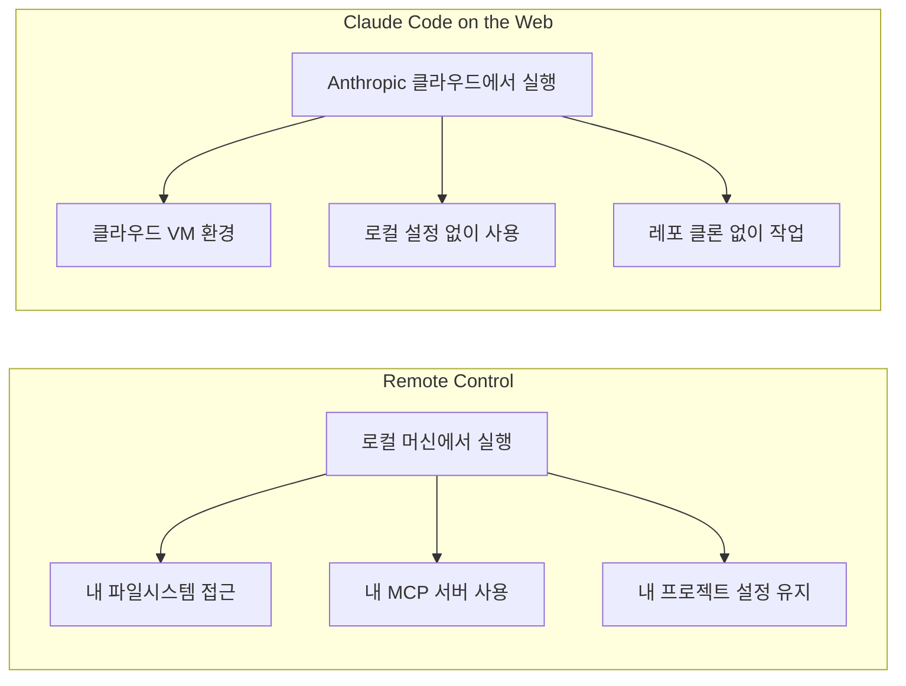

## 개요

사무실에서 Claude Code로 리팩토링을 진행하다가 자리를 비워야 한다. 터미널을 닫으면 세션이 끊긴다. 이전에는 SSH 터널이나 서드파티 도구(happy, hapi 등)를 사용해야 했지만, 이제 Claude Code에 공식 Remote Control 기능이 추가되었다. `claude remote-control` 한 줄이면 스마트폰, 태블릿, 다른 컴퓨터에서 동일한 세션을 이어받을 수 있다.

<!--more-->

## 동작 원리



핵심은 **세션이 항상 로컬 머신에서 실행된다**는 점이다. 코드가 클라우드로 올라가지 않으며, 파일시스템, MCP 서버, 프로젝트 설정이 그대로 유지된다. 로컬 Claude Code 프로세스가 HTTPS 아웃바운드 요청만 보내고, 인바운드 포트는 열지 않는다. Anthropic API가 중간에서 메시지를 라우팅하는 구조다.

네트워크가 끊기거나 노트북이 잠들어도, 머신이 다시 온라인이 되면 자동 재연결된다. 다만 10분 이상 네트워크가 끊기면 세션이 타임아웃된다.

## 사용법

### 기본: 서버 모드

```bash
claude remote-control
```

터미널에 세션 URL과 QR 코드가 표시된다. 스페이스바로 QR 코드를 토글할 수 있어 폰으로 바로 스캔 가능하다.

### 주요 플래그

| 플래그 | 설명 |
|--------|------|
| `--name "My Project"` | claude.ai/code 세션 목록에 표시될 이름 |
| `--spawn same-dir` | 동시 세션이 같은 디렉토리 공유 (기본값) |
| `--spawn worktree` | 각 세션이 독립 git worktree 사용 |
| `--capacity <N>` | 동시 세션 최대 수 (기본 32) |
| `--sandbox` | 파일시스템/네트워크 격리 활성화 |

### 기존 세션에서 활성화

이미 진행 중인 대화형 세션에서 `/remote-control` 명령으로 활성화할 수도 있다. 또는 `/config`에서 "Enable Remote Control for all sessions"를 켜면 모든 세션에 자동 적용된다.

### 연결 방법 (3가지)

1. **URL 직접 입력**: 터미널에 표시된 세션 URL을 브라우저에 입력
2. **QR 코드 스캔**: 스페이스바로 QR 코드 표시 → 폰 카메라로 스캔
3. **세션 목록**: claude.ai/code 또는 Claude 앱에서 세션 이름으로 찾기 (초록 점이 온라인 표시)

## Claude Code on the Web과의 차이



| 구분 | Remote Control | Claude Code on the Web |
|------|---------------|----------------------|
| 실행 위치 | 내 로컬 머신 | Anthropic 클라우드 |
| 파일시스템 | 내 로컬 파일 | 클라우드 VM |
| MCP 서버 | 사용 가능 | 불가 |
| 로컬 설정 필요 | 필요 (프로젝트 클론 필수) | 불필요 |
| 적합한 상황 | 진행 중인 작업 이어하기 | 새 작업 빠르게 시작 |

**Remote Control은 "내 환경에서 계속"**, **Web은 "어디서든 새로 시작"**이다.

## 서드파티 대안과 비교

GeekNews 댓글에서 언급된 서드파티 프로젝트들:

- **[slopus/happy](https://github.com/slopus/happy)**, **[tiann/hapi](https://github.com/tiann/hapi)** — 비슷한 목적의 오픈소스
- SSH 터널을 통한 원격 터미널 접속

공식 Remote Control의 장점은 별도 서버 설정이 필요 없고, Anthropic API를 통한 TLS 보안이 기본 적용된다는 것이다. 단점으로는 댓글에서 지적된 것처럼 "미리 세션을 만들어둬야 한다"는 점이 오픈소스 대안보다 불편할 수 있다.

## 제약사항

- **플랜**: Pro, Max, Team, Enterprise (Team/Enterprise는 관리자가 Claude Code를 먼저 활성화해야 함)
- **API 키 미지원**: claude.ai 로그인 인증만 지원
- **터미널 종속**: claude 프로세스를 닫으면 세션 종료
- **단일 원격 연결**: 서버 모드 외에는 세션당 1개의 원격 연결만 허용
- **버전**: Claude Code v2.1.51 이상 필요 (`claude --version`으로 확인)

## 인사이트

Remote Control의 진짜 가치는 "원격 접속"이 아니라 **"컨텍스트 보존"**에 있다. Claude Code 세션에는 대화 히스토리, 읽은 파일들의 컨텍스트, MCP 서버 연결 상태가 쌓여 있다. 이것을 잃지 않고 디바이스만 바꿀 수 있다는 것이 핵심이다. GeekNews의 "이제 유튜브에서 '바깥에서 바이브코딩하기' 콘텐츠들이 많이 올라오겠네요"라는 댓글이 이 기능의 사용 패턴을 잘 예측한다. cmux의 알림 시스템과 결합하면 — cmux로 여러 에이전트를 모니터링하다가, 자리를 비울 때 Remote Control로 모바일에서 이어받는 — 완전한 멀티디바이스 에이전트 코딩 워크플로우가 가능해진다.
