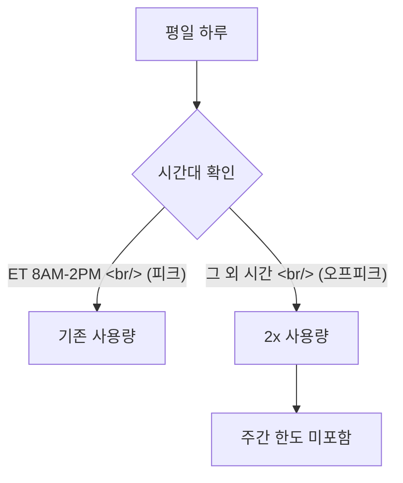
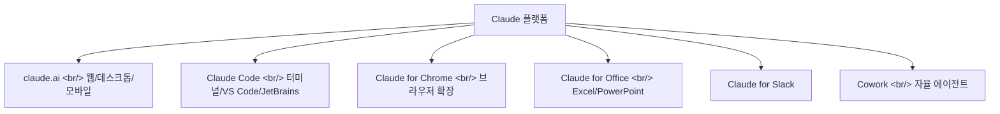

## 개요

Anthropic이 Claude for Chrome 확장 프로그램을 출시했다. 별도 탭이나 앱을 열지 않고 브라우저 안에서 바로 Claude를 호출할 수 있게 되었다. 동시에 3월 13일부터 27일까지 오프피크 시간대 사용량을 2배로 늘리는 프로모션도 시작했다.

<!--more-->

## Claude for Chrome 확장

Claude for Chrome은 Chrome 웹 스토어에서 설치할 수 있다. 핵심 기능:

- **브라우저 내 직접 호출**: 현재 보고 있는 웹페이지의 컨텍스트를 Claude에게 바로 전달
- **Claude Code 연동**: Claude Code와 함께 사용 가능 — 코드 리뷰, 문서 요약 등
- **백그라운드 작업**: 작업을 백그라운드에서 실행하고 완료 시 알림
- **스케줄 워크플로우**: 예약된 작업 자동 실행

이 확장의 전략적 의미는 Claude의 접근성 확대에 있다. 기존에는 claude.ai 사이트, 데스크톱 앱, 또는 API를 통해서만 접근 가능했다면, 이제 브라우저 어디서든 단축키 하나로 호출할 수 있다. ChatGPT, Gemini, Perplexity 등 경쟁 서비스가 이미 브라우저 확장을 제공하고 있는 상황에서 Anthropic도 합류한 것이다.

## 3월 사용량 2배 프로모션

| 구분 | 내용 |
|------|------|
| 기간 | 2026.03.13 ~ 2026.03.27 |
| 대상 | Free, Pro, Max, Team 플랜 (Enterprise 제외) |
| 조건 | 오프피크 시간대 (ET 오전 8시~오후 2시 / PT 오전 5시~11시 **외**의 시간) |
| 적용 | 자동 (별도 신청 불필요) |
| 주간 한도 | 보너스 사용량은 주간 사용 한도에 포함되지 않음 |

**한국 시간 기준으로 오프피크**: ET 오전 8시~오후 2시는 KST 오후 10시~새벽 4시에 해당한다. 즉 **한국에서 낮 시간에 사용하면 대부분 오프피크**에 해당하여 2배 혜택을 받을 수 있다.

적용 범위는 Claude 웹/데스크톱/모바일, Cowork, Claude Code, Claude for Excel, Claude for PowerPoint까지 포함된다.

## Claude 플랫폼 확장 전략

Anthropic은 Claude를 단일 챗봇이 아닌 **모든 작업 환경에 편재하는 AI 레이어**로 확장하고 있다. 터미널(Claude Code), 브라우저(Chrome), 오피스(Excel/PowerPoint), 협업 도구(Slack), 자율 에이전트(Cowork) — 개발자가 일하는 거의 모든 표면에 Claude가 존재하게 되었다.

## 인사이트

Chrome 확장의 출시와 사용량 프로모션의 동시 진행은 명확한 전략이다 — 접근성을 높이고(확장), 시도 비용을 낮추고(프로모션), 습관을 만든다. 한국 사용자에게 특히 유리한 점은 시차 덕분에 업무 시간 대부분이 오프피크에 해당한다는 것이다. 3월 27일까지 Claude Code와 웹 모두 2배 사용량을 활용할 수 있으니, 새 기능이나 대규모 리팩토링을 시도하기에 좋은 시점이다.
