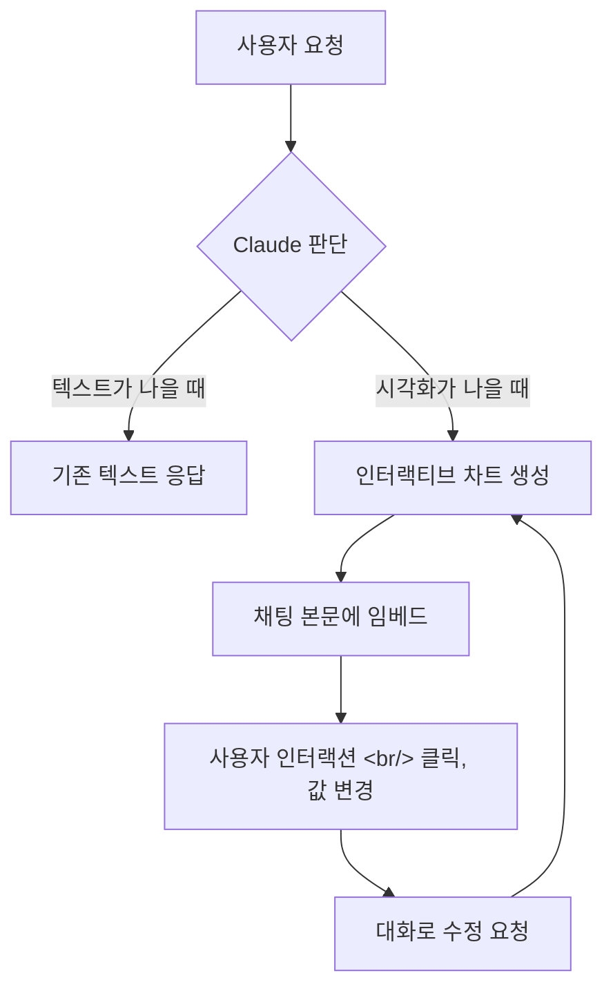
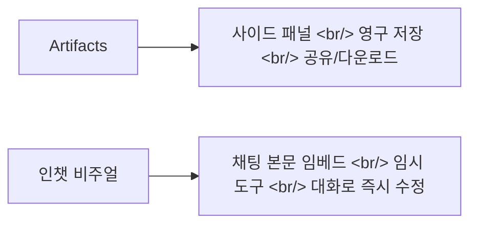

## 개요

Anthropic이 Claude에 대화 속에서 바로 인터랙티브 차트, 다이어그램, 시각화를 생성하는 베타 기능을 추가했다. 지난 가을 "Imagine with Claude" 프리뷰와 기존 Artifacts 기능을 결합한 것으로, 사이드 패널이 아닌 채팅 본문에 직접 임베드되는 "임시 시각화" 방식이 핵심이다.

<!--more-->

## 핵심 변화: 코드 없이, 대화 흐름 안에서

이번 기능의 핵심은 두 가지다. 첫째, 사용자가 "다이어그램으로 그려줘", "시간에 따라 어떻게 변해?"처럼 요청하면 즉시 생성되고, Claude가 알아서 "그림이 더 빠르겠다"고 판단해 자동 생성하기도 한다. 둘째, 결과물이 영구 문서가 아닌 **임시 도구**라는 점이다.

복리 그래프를 만들어 놓고 "기간을 20년으로 늘려줘", "월 적립으로 바꿔줘"처럼 대화로 계속 다듬는 워크플로우가 가능하다. 클릭 가능한 주기율표, 인터랙티브 결정 트리 등 탐색형 시각화가 특히 강점이다.

## Artifacts와의 차이

| 구분 | Artifacts | 인챗 인터랙티브 비주얼 |
|------|-----------|----------------------|
| 위치 | 사이드 패널 | 답변 본문 |
| 수명 | 영구 (저장/공유) | 임시 (대화 흐름 따라 변화) |
| 목적 | 결과물 전달 | 설명 보조 |
| 수정 | 별도 편집 | 대화로 즉시 반영 |

다만 커뮤니티 반응을 보면, 환경에 따라 인라인이 아닌 아티팩트(오른쪽 패널)로 표시되거나 앱 버전별 지원이 들쭉날쭉하다는 경험담이 있다. iOS/iPadOS에서 시각화 지원이 늦다는 보고와 사용량 제한에 빨리 걸렸다는 사례도 공유됐다.

## 실전 활용 시나리오

**학습**: 클릭 가능한 주기율표, 결정 트리 같은 탐색형 자료로 "읽는 공부"에서 "만져보는 공부"로 전환. 수학·과학 분야에서 변수 하나를 바꿨을 때 그래프가 어떻게 변하는지 보는 순간 이해가 빨라진다.

**업무 미팅**: "우리 서비스 퍼널을 단계별로 그려줘", "가설 A/B 비교를 차트로 보여줘"처럼 말로 만든 임시 대시보드를 띄워놓고 질문이 나올 때마다 바로 수정하는 방식이 가능하다.

**데이터 분석**: 포트폴리오 분석을 시각화로 자동 생성해 "사람이 일주일 걸릴 결과"를 수분 만에 얻었다는 반응도 있다.

## 주의할 점: 화려함 ≠ 정확성

The New Stack의 테스트에서 도식은 그럴듯했지만 항공 패턴 다이어그램의 일부 라벨 위치가 틀린 사례가 발견됐다. 시각화는 "이해를 돕는 UI"이지 "정답 인증 배지"가 아니다.

실용적인 사용법은 간단하다:

1. **"표/차트로 보여줘"**로 시작
2. **"이 그래프의 전제와 계산식을 같이 적어줘"**로 검증 장치 추가
3. **"변수 하나만 바꿔서 비교해줘"**로 탐색 반복

이 기능은 모든 요금제(Free, Pro, Max, Team)에서 사용 가능하다.

## 인사이트

Claude의 인챗 인터랙티브 차트는 AI가 답을 "말로" 전달하던 단계에서 사용자가 답을 "눌러서 확인"하는 단계로의 전환 신호다. 텍스트 기반 대화에 시각적 탐색을 결합하는 이 방향은, ChatGPT의 Canvas나 Gemini의 멀티모달 출력과 함께 AI 인터페이스의 진화를 보여준다. 다만 베타인 만큼 렌더링 위치나 속도, 플랫폼 지원은 흔들릴 수 있고, 가장 중요한 것은 화려한 시각화에 현혹되지 않고 원데이터와 전제 조건을 함께 요구하는 습관을 유지하는 것이다.
