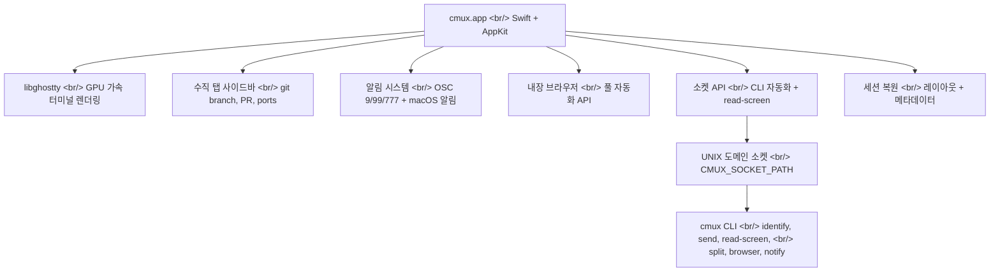
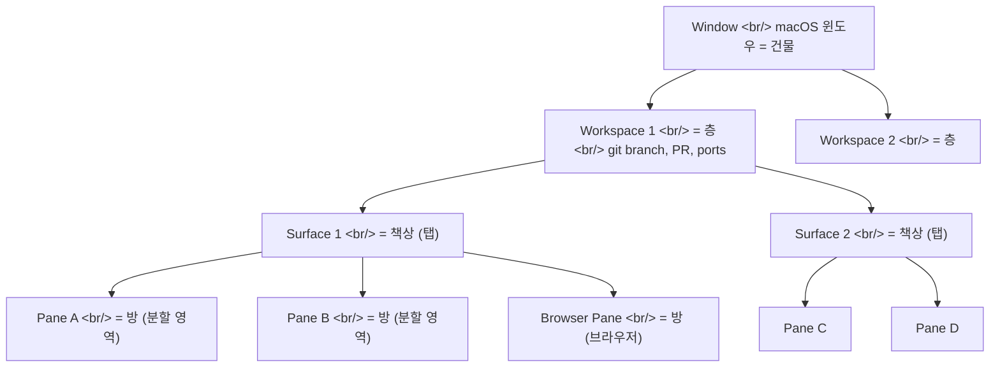

## 개요

AI 코딩 에이전트를 3~4개씩 동시에 돌리다 보면, 터미널 창이 폭발한다. iTerm2 탭이 15개, tmux 세션이 8개 — 어떤 에이전트가 입력을 기다리는지 찾느라 시간을 소모한다. [cmux](https://www.cmux.dev/)는 이 문제를 정면으로 해결하기 위해 설계된 macOS 네이티브 터미널이다.

Swift + AppKit으로 구축되었고, Ghostty의 libghostty를 렌더링 엔진으로 사용한다. AGPL 라이선스로 완전히 무료다. 워크스페이스 사이드바에 git 브랜치, PR 상태, 열린 포트, 알림 텍스트를 실시간으로 표시하고, `read-screen`으로 패인 간 통신을 지원하며, 내장 브라우저는 풀 자동화 API를 제공한다. 전통적인 터미널 멀티플렉서와의 비교가 아니라 — AI 에이전트를 위한 새로운 카테고리의 도구다.

> tmux와의 비교는 [별도 포스트에서 다룬다.](/posts/2026-03-23-tmux-cmux/)

<!--more-->

## 아키텍처: Ghostty 위의 새로운 레이어

cmux는 Ghostty의 **포크가 아니다**. libghostty를 라이브러리로 사용하는 별도의 앱이다 — WebKit을 사용하는 앱들이 Safari의 포크가 아닌 것과 같은 관계다. Mitchell Hashimoto(Ghostty + HashiCorp 창시자) 본인이 "또 하나의 libghostty 기반 프로젝트"라며 긍정적으로 언급했다.



GPU 가속 렌더링은 Ghostty에서 그대로 가져오므로 속도는 동일하다. cmux는 그 위에 워크스페이스 관리, 알림, 브라우저 통합, CLI 자동화 레이어를 올린 것이다. 통신은 UNIX 도메인 소켓을 통해 이루어지며, 각 패인에 `CMUX_SOCKET_PATH` 환경 변수가 자동으로 주입된다.

기존 Ghostty 사용자라면 별도로 Ghostty를 설치할 필요가 없다. cmux가 libghostty를 자체 번들하고 있다. 동시에, Ghostty와 cmux를 함께 설치해도 충돌이 없다.

## 설치 및 초기 설정

### Homebrew 설치

```bash
brew tap manaflow-ai/cmux && brew install --cask cmux
```

또는 공식 사이트에서 DMG를 직접 다운로드할 수 있다.

### CLI 심링크 설정

cmux CLI를 터미널 어디서든 사용하려면 심링크를 설정한다.

```bash
sudo ln -sf /Applications/cmux.app/Contents/MacOS/cmux-cli /usr/local/bin/cmux
```

이 설정 없이도 GUI는 정상 동작하지만, `cmux send`, `cmux read-screen` 같은 CLI 자동화 기능을 사용하려면 필수다.

### Ghostty 설정 호환

cmux는 기존 Ghostty 설정 파일을 그대로 읽는다.

```
~/.config/ghostty/config
```

폰트, 테마, 색상 설정이 자동으로 적용된다. Ghostty를 사용하던 환경이라면 별도 설정 없이 동일한 터미널 환경을 얻을 수 있다. Ghostty를 사용하지 않았더라도 cmux의 기본 설정으로 바로 시작할 수 있다.

### CLI 설치 확인

```bash
# CLI가 정상 설치되었는지 확인
cmux identify --json

# 환경 변수 확인
env | grep CMUX
```

`cmux identify`는 현재 워크스페이스, 서피스, 패인의 ID를 출력한다. cmux 터미널 안에서 실행해야 정상 동작한다.

### 트러블슈팅

| 증상 | 원인 | 해결 |
|------|------|------|
| `cmux: command not found` | CLI 심링크 미설정 | `sudo ln -sf` 명령 실행 |
| 소켓 연결 오류 | cmux 앱이 실행 중이 아님 | cmux.app을 먼저 실행 |
| Ghostty 설정 충돌 | 호환되지 않는 설정 키 | cmux 전용 설정으로 분리 |
| 폰트가 다르게 보임 | Ghostty config 경로 불일치 | `~/.config/ghostty/config` 확인 |

## 핵심 개념: 계층 구조

cmux의 계층 구조는 건물 비유로 이해하면 쉽다.



| 계층 | 비유 | 설명 |
|------|------|------|
| **Window** | 건물 | macOS 윈도우. 보통 하나만 사용 |
| **Workspace** | 층 | 독립적인 작업 컨텍스트. 사이드바 탭으로 표시. git branch, PR 상태, 포트, 알림 메타데이터 포함 |
| **Surface** | 책상 | 워크스페이스 안의 탭. 여러 패인을 포함 |
| **Pane** | 방 | 실제 터미널 또는 브라우저가 실행되는 분할 영역 |

tmux의 Session > Window > Pane과 대응되지만, cmux는 각 워크스페이스에 메타데이터를 연결한다는 점이 결정적 차이다. 사이드바를 한 번 보는 것만으로 각 프로젝트의 git 브랜치, 관련 PR 번호, 현재 열려 있는 포트, 최근 알림 내용을 한눈에 파악할 수 있다.

### 환경 변수

cmux는 각 패인에 자동으로 환경 변수를 주입한다.

| 변수 | 용도 |
|------|------|
| `CMUX_WORKSPACE_ID` | 현재 패인이 속한 워크스페이스 ID |
| `CMUX_SURFACE_ID` | 현재 패인이 속한 서피스 ID |
| `CMUX_SOCKET_PATH` | cmux 소켓 경로 — CLI 통신에 사용 |

에이전트가 `CMUX_WORKSPACE_ID`를 읽으면 자신이 어떤 프로젝트에서 실행 중인지 자동으로 인식할 수 있다. 별도로 프로젝트 경로를 파라미터로 전달할 필요가 없다.

## 워크스페이스 관리

워크스페이스는 cmux의 최상위 작업 단위다. 사이드바에 수직 탭으로 표시되며, 각 탭에는 다음 메타데이터가 실시간으로 갱신된다.

- **Git 브랜치명**: 현재 체크아웃된 브랜치
- **PR 상태/번호**: 해당 브랜치와 연관된 Pull Request
- **작업 디렉토리**: 현재 경로
- **열린 포트**: `localhost:3000`, `localhost:8080` 등
- **최근 알림 텍스트**: 마지막 알림 내용 미리보기

Firefox의 수직 탭을 터미널에 적용한 것과 유사한 UX다. 한 번에 5~6개 프로젝트를 오가는 상황에서 탭 제목만으로 컨텍스트를 파악할 수 있다.

### 워크스페이스 단축키

| 동작 | 단축키 |
|------|--------|
| 새 워크스페이스 | `⌘N` |
| 워크스페이스 전환 | `⌘1` ~ `⌘8` |
| 이름 변경 | `⌘⇧R` |
| 닫기 | `⌘⇧W` |

### CLI로 워크스페이스 관리

```bash
# 새 워크스페이스 생성
cmux new-workspace --name "my-project"

# 워크스페이스 목록 조회
cmux list-workspaces

# 현재 워크스페이스 정보 확인
cmux identify --json
```

`cmux identify --json`의 출력 예시:

```json
{
  "workspace_id": "ws-abc123",
  "surface_id": "sf-def456",
  "pane_id": "pn-ghi789"
}
```

이 ID들은 `cmux send`, `cmux read-screen` 등에서 대상 패인을 지정할 때 사용한다.

## 서피스와 패인

### 서피스 (Surface)

서피스는 워크스페이스 안의 탭이다. 하나의 워크스페이스에 여러 서피스를 두고, 각 서피스에서 서로 다른 작업 맥락을 유지할 수 있다.

| 동작 | 단축키 |
|------|--------|
| 새 서피스 | `⌘T` |
| 다음 서피스 | `⌘⇧]` |
| 이전 서피스 | `⌘⇧[` |
| 서피스 닫기 | `⌘W` |

### 패인 (Pane)

패인은 서피스를 수평/수직으로 분할한 영역이다. 각 패인에서 독립적인 터미널 세션 또는 브라우저가 실행된다.

| 동작 | 단축키 |
|------|--------|
| 오른쪽 분할 | `⌘D` |
| 아래쪽 분할 | `⌘⇧D` |
| 패인 이동 (왼쪽) | `⌥⌘←` |
| 패인 이동 (오른쪽) | `⌥⌘→` |
| 패인 이동 (위) | `⌥⌘↑` |
| 패인 이동 (아래) | `⌥⌘↓` |

핵심 차이: **prefix 키가 없다**. tmux는 `Ctrl+b`를 먼저 누르고 명령 키를 입력해야 하지만, cmux는 macOS 네이티브 단축키를 그대로 사용한다. `⌘D`로 바로 분할, `⌥⌘→`로 바로 이동. iTerm2나 VS Code 터미널에 익숙한 사용자라면 학습 곡선이 거의 없다.

### CLI로 패인 관리

```bash
# 오른쪽으로 분할
cmux split --direction right

# 아래쪽으로 분할
cmux split --direction down

# 특정 패인에 명령 전송
cmux send --pane-id <target-pane-id> "npm run dev"
```

## 알림 시스템

cmux의 알림 시스템은 다층 구조다. AI 에이전트를 동시에 여러 개 돌릴 때, "어떤 에이전트가 입력을 기다리고 있는가"라는 질문에 대한 답을 즉시 제공하도록 설계되었다.

### 4단계 알림

1. **패인 알림 링 (파란 링)**: 입력을 대기 중인 패인 주변에 파란색 링이 표시된다. 현재 보고 있는 서피스에서 어느 패인이 주의를 필요로 하는지 즉시 알 수 있다.

2. **사이드바 unread 뱃지**: 다른 워크스페이스에서 알림이 발생하면 사이드바 탭에 읽지 않은 알림 수가 표시된다. 현재 작업 중인 워크스페이스를 벗어나지 않고도 다른 프로젝트의 상태를 확인할 수 있다.

3. **앱 내 알림 패널**: `⌘I`로 알림 패널을 열면 모든 알림을 시간순으로 확인할 수 있다. 어떤 워크스페이스, 어떤 패인에서 발생한 알림인지 컨텍스트가 함께 표시된다.

4. **macOS 데스크톱 알림**: cmux를 포커스하고 있지 않을 때도 macOS 알림 센터에 알림이 뜬다. 브라우저에서 다른 작업을 하다가도 에이전트가 입력을 기다리면 알 수 있다.

### 알림 단축키

| 동작 | 단축키 |
|------|--------|
| 알림 패널 열기 | `⌘I` |
| 가장 최근 unread로 점프 | `⌘⇧U` |

`⌘⇧U`는 특히 유용하다. 5개 워크스페이스에서 에이전트를 돌리고 있을 때, 이 단축키 하나로 가장 최근에 입력을 요청한 에이전트의 패인으로 즉시 이동한다.

### 표준 이스케이프 시퀀스 지원

cmux의 알림은 표준 터미널 이스케이프 시퀀스(OSC 9, OSC 99, OSC 777)를 사용한다. 별도의 플러그인이나 설정 없이, 이 시퀀스를 출력하는 모든 도구가 자동으로 cmux 알림을 트리거한다.

### CLI로 알림 전송

```bash
# 커스텀 알림 보내기
cmux notify --title "Build done" --body "Success"

# CI/CD 스크립트에서 활용
npm run build && cmux notify --title "Build" --body "Build succeeded" \
  || cmux notify --title "Build" --body "Build FAILED"

# 장시간 작업 완료 알림
python train_model.py && cmux notify --title "Training" --body "Model training complete"
```

이 기능은 Claude Code hooks와도 결합할 수 있다. 에이전트가 특정 작업을 완료하면 자동으로 알림을 보내도록 설정하는 것이다.

## read-screen과 send: 에이전트 간 통신

이 두 기능이 cmux를 단순한 터미널 앱에서 **에이전트 통신 플랫폼**으로 만드는 핵심 차별점이다.

### read-screen

한 패인에서 다른 패인의 터미널 출력을 읽을 수 있다.

```bash
# 대상 패인의 현재 화면 내용 읽기
cmux read-screen --pane-id <target-pane-id>
```

이 명령은 지정된 패인에 현재 표시된 텍스트 내용을 반환한다. 에이전트 A가 에이전트 B의 출력을 읽고, 그 결과에 따라 다음 행동을 결정할 수 있다.

#### 실전 활용 시나리오

```bash
# 에이전트 A: 다른 패인의 테스트 결과 확인
TEST_OUTPUT=$(cmux read-screen --pane-id $TEST_PANE_ID)
if echo "$TEST_OUTPUT" | grep -q "FAIL"; then
    echo "테스트 실패 감지 — 수정 시작"
fi

# 에이전트 B: 빌드 서버 상태 모니터링
BUILD_STATUS=$(cmux read-screen --pane-id $BUILD_PANE_ID)
if echo "$BUILD_STATUS" | grep -q "compiled successfully"; then
    cmux notify --title "Build" --body "빌드 성공"
fi
```

tmux의 `capture-pane`과 유사하지만, cmux의 `read-screen`은 에이전트 간 통신이라는 명확한 의도를 가지고 설계되었다. 환경 변수로 패인 ID가 자동 주입되므로, 에이전트가 자기 자신의 ID와 이웃 패인의 ID를 프로그래밍 방식으로 파악할 수 있다.

### send

다른 패인에 명령을 프로그래밍 방식으로 전송한다.

```bash
# 특정 패인에 명령 전송
cmux send --pane-id <target-pane-id> "npm run test"

# 현재 서피스에 명령 전송
cmux send --surface-id <target-surface-id> "cd ~/projects/my-app"

# 여러 패인에 순차적으로 명령 전송
cmux send --pane-id $PANE_1 "git pull"
cmux send --pane-id $PANE_2 "npm install"
cmux send --pane-id $PANE_3 "docker compose up -d"
```

### read-screen + send 조합

두 기능을 조합하면, 에이전트가 다른 에이전트의 상태를 읽고 그에 따라 명령을 보내는 자율적 워크플로우가 가능하다.

```bash
# 에이전트 A: 빌드 패인 상태 확인 후 다음 단계 진행
while true; do
    STATUS=$(cmux read-screen --pane-id $BUILD_PANE)
    if echo "$STATUS" | grep -q "ready on"; then
        cmux send --pane-id $TEST_PANE "npm run e2e"
        cmux notify --title "Pipeline" --body "E2E 테스트 시작"
        break
    fi
    sleep 2
done
```

## 내장 브라우저

cmux는 터미널과 같은 창에서 브라우저 패인을 열 수 있다. PR 페이지를 옆에 띄워놓고 Claude Code가 코드를 수정하거나, localhost 개발 서버의 결과를 바로 확인하는 워크플로우다.

### 기본 사용법

```bash
# 독립 브라우저 창 열기
cmux browser open http://localhost:3000

# 현재 서피스에 브라우저 분할 패인으로 열기
cmux browser open-split http://localhost:3000

# 현재 브라우저 패인의 URL 이동
cmux browser navigate https://github.com/my/repo/pull/42

# 뒤로/앞으로 이동
cmux browser back
cmux browser forward

# 새로고침
cmux browser reload

# 현재 URL 확인
cmux browser url
```

`open-split`이 핵심이다. 터미널 분할의 한쪽에 브라우저가 들어가므로, 화면을 벗어나지 않고 코드와 결과를 동시에 볼 수 있다.

## 브라우저 자동화 상세

cmux 내장 브라우저는 단순 뷰어가 아니다. Playwright 수준의 풀 자동화 API를 제공한다.

### 대기 (Wait)

페이지 로딩, 요소 렌더링, URL 변경 등을 기다릴 수 있다.

```bash
# CSS 셀렉터로 요소 대기
cmux browser wait --selector ".login-form"

# 텍스트 출현 대기
cmux browser wait --text "Dashboard loaded"

# URL 변경 대기
cmux browser wait --url-contains "/dashboard"

# 페이지 로드 상태 대기
cmux browser wait --load-state networkidle

# JavaScript 함수 결과 대기
cmux browser wait --function "document.readyState === 'complete'"
```

### DOM 조작

```bash
# 클릭
cmux browser click --selector "#submit-button"

# 더블 클릭
cmux browser dblclick --selector ".editable-cell"

# 호버
cmux browser hover --selector ".dropdown-trigger"

# 포커스
cmux browser focus --selector "#email-input"

# 체크박스 토글
cmux browser check --selector "#agree-terms"

# 텍스트 입력 (keystroke 방식)
cmux browser type --selector "#search" --text "query"

# 텍스트 채우기 (값 직접 설정)
cmux browser fill --selector "#email" --text "user@example.com"

# 키 입력
cmux browser press --key "Enter"

# 셀렉트 박스 옵션 선택
cmux browser select --selector "#country" --value "KR"

# 스크롤
cmux browser scroll --selector ".content" --direction down
```

### 정보 추출 (Inspection)

```bash
# 페이지 스냅샷 (접근성 트리 기반)
cmux browser snapshot

# 스크린샷 캡처
cmux browser screenshot --output /tmp/page.png

# 텍스트 추출
cmux browser get text --selector ".result-count"

# HTML 추출
cmux browser get html --selector ".article-body"

# 입력 필드 값 추출
cmux browser get value --selector "#price-input"

# 속성 값 추출
cmux browser get attr --selector "img.logo" --attr "src"

# 요소 개수 확인
cmux browser get count --selector ".list-item"

# 요소 상태 확인
cmux browser is visible --selector ".modal"
cmux browser is enabled --selector "#submit"
cmux browser is checked --selector "#newsletter"

# 요소 찾기
cmux browser find role --role "button"
cmux browser find text --text "Submit"
cmux browser find label --label "Email address"

# 페이지 제목/URL 가져오기
cmux browser get title
cmux browser get url
```

### JavaScript 실행

```bash
# JavaScript 코드 실행
cmux browser eval "document.querySelectorAll('.item').length"

# 초기화 스크립트 추가 (페이지 로드 전 실행)
cmux browser addinitscript "window.__TEST_MODE = true"

# 외부 스크립트 추가
cmux browser addscript --url "https://cdn.example.com/helper.js"

# 커스텀 스타일 추가
cmux browser addstyle "body { background: #f0f0f0; }"
```

### 상태 관리

```bash
# 쿠키 확인
cmux browser cookies

# 로컬 스토리지 확인
cmux browser storage

# 브라우저 세션 상태 저장 (쿠키, 스토리지 포함)
cmux browser state --save /tmp/browser-state.json

# 저장된 상태 복원
cmux browser state --load /tmp/browser-state.json
```

상태 저장/복원은 인증 세션을 유지할 때 유용하다. 한 번 로그인한 후 상태를 저장해 두면, 자동화 스크립트에서 로그인 과정을 반복하지 않아도 된다.

### 탭 관리

```bash
# 열린 탭 목록
cmux browser tab list

# 특정 탭으로 전환
cmux browser tab switch --index 2
```

### 자동화 패턴 예시

실전에서 자주 사용하는 브라우저 자동화 패턴이다.

#### 패턴 1: 네비게이션 후 대기, 정보 추출

```bash
cmux browser navigate https://github.com/my/repo/pull/42
cmux browser wait --selector ".merge-message"
PR_STATUS=$(cmux browser get text --selector ".State")
echo "PR 상태: $PR_STATUS"
```

#### 패턴 2: 폼 작성 후 검증

```bash
cmux browser fill --selector "#title" --text "Fix: resolve memory leak"
cmux browser fill --selector "#body" --text "Closes #123"
cmux browser click --selector "#create-pr"
cmux browser wait --text "Pull request created"
```

#### 패턴 3: 실패 시 디버그 아티팩트 캡처

```bash
cmux browser click --selector "#deploy-button"
cmux browser wait --text "Deployed" || {
    cmux browser screenshot --output /tmp/deploy-failure.png
    cmux browser snapshot > /tmp/deploy-failure-dom.txt
    cmux notify --title "Deploy" --body "배포 실패 — 스크린샷 저장됨"
}
```

## CLI 자동화 전체 명령 레퍼런스

cmux CLI는 cmux 앱의 모든 기능을 프로그래밍 방식으로 제어할 수 있게 한다.

### 워크스페이스 관리

| 명령 | 설명 |
|------|------|
| `cmux new-workspace --name "name"` | 새 워크스페이스 생성 |
| `cmux list-workspaces` | 워크스페이스 목록 조회 |
| `cmux identify` | 현재 패인의 워크스페이스/서피스/패인 ID 출력 |
| `cmux identify --json` | JSON 형식으로 ID 출력 |

### 패인 및 분할

| 명령 | 설명 |
|------|------|
| `cmux split --direction right` | 오른쪽으로 분할 |
| `cmux split --direction down` | 아래쪽으로 분할 |

### 통신

| 명령 | 설명 |
|------|------|
| `cmux send "command"` | 현재 패인에 명령 전송 |
| `cmux send --pane-id ID "command"` | 특정 패인에 명령 전송 |
| `cmux send --surface-id ID "command"` | 특정 서피스에 명령 전송 |
| `cmux read-screen` | 현재 패인의 화면 읽기 |
| `cmux read-screen --pane-id ID` | 특정 패인의 화면 읽기 |

### 알림

| 명령 | 설명 |
|------|------|
| `cmux notify --title "T" --body "B"` | 알림 전송 |

### 브라우저

| 명령 | 설명 |
|------|------|
| `cmux browser open URL` | 브라우저 열기 |
| `cmux browser open-split URL` | 분할 패인으로 브라우저 열기 |
| `cmux browser navigate URL` | URL 이동 |
| `cmux browser snapshot` | 페이지 스냅샷 |
| `cmux browser screenshot` | 스크린샷 |
| `cmux browser click --selector S` | 요소 클릭 |
| `cmux browser wait --selector S` | 요소 대기 |
| `cmux browser eval "JS"` | JavaScript 실행 |

### 환경 변수

모든 cmux 패인에는 다음 환경 변수가 자동 주입된다.

```bash
CMUX_WORKSPACE_ID=ws-abc123
CMUX_SURFACE_ID=sf-def456
CMUX_SOCKET_PATH=/tmp/cmux-socket-xyz
```

스크립트에서 이 변수들을 활용하면 하드코딩 없이 현재 컨텍스트를 자동으로 인식할 수 있다.

## 멀티 에이전트 워크플로우

cmux의 진가는 여러 AI 에이전트를 동시에 관리할 때 나타난다. 아래는 실전 멀티 에이전트 셋업 스크립트다.

### 프로젝트 셋업 자동화

```bash
#!/bin/bash
# cmux 멀티 에이전트 워크플로우 셋업 스크립트

# 1. 프로젝트 워크스페이스 생성
cmux new-workspace --name "my-project"

# 2. 메인 에이전트 패인에서 프로젝트 디렉토리로 이동
cmux send "cd ~/projects/my-app"

# 3. 오른쪽에 두 번째 에이전트용 패인 분할
cmux split --direction right

# 4. 두 번째 패인에서 개발 서버 실행
cmux send --surface-id right "npm run dev"

# 5. 브라우저 분할로 localhost 결과 확인
cmux browser open-split http://localhost:3000
```

### Claude Code 멀티 에이전트 패턴

```bash
# 워크스페이스 1: 백엔드 에이전트
cmux new-workspace --name "backend"
cmux send "cd ~/projects/api && claude"

# 워크스페이스 2: 프론트엔드 에이전트
cmux new-workspace --name "frontend"
cmux send "cd ~/projects/web && claude"

# 워크스페이스 3: 테스트 에이전트
cmux new-workspace --name "testing"
cmux send "cd ~/projects/api && claude"

# 이제 사이드바에서 3개 워크스페이스를 한눈에 볼 수 있다.
# 각 워크스페이스의 git 브랜치, PR 상태, 알림이 표시된다.
# ⌘⇧U로 입력을 기다리는 에이전트로 즉시 점프한다.
```

### 에이전트 간 협업 워크플로우

```bash
# 패인 A: Claude Code가 코드 수정 중
# 패인 B: 테스트 러너

# 패인 B의 스크립트 — 패인 A의 완료를 감지하고 테스트 실행
AGENT_PANE=$1  # 패인 A의 ID

while true; do
    SCREEN=$(cmux read-screen --pane-id $AGENT_PANE)

    # Claude Code가 작업 완료하면 프롬프트가 다시 나타남
    if echo "$SCREEN" | grep -q "claude>"; then
        cmux notify --title "Agent" --body "코드 수정 완료 — 테스트 시작"
        npm run test
        break
    fi
    sleep 5
done
```

## 세션 복원

cmux는 앱을 종료했다가 다시 열면 이전 상태를 복원한다.

### 복원되는 항목

- 워크스페이스 레이아웃 (분할 구조, 패인 배치)
- 워크스페이스 메타데이터 (이름, git 브랜치 등)
- 각 패인의 작업 디렉토리
- 브라우저 패인의 URL

### 복원되지 않는 항목

- **실행 중인 프로세스**: Claude Code 세션, `npm run dev` 같은 라이브 프로세스는 복원되지 않는다. 이것은 tmux와의 핵심 차이점이다 — tmux는 서버가 살아있는 한 세션이 유지되지만, cmux는 프로세스를 다시 시작해야 한다.
- **tmux 세션**: cmux 안에서 tmux를 실행했다면, tmux 세션 자체는 tmux 서버에서 관리하므로 별도로 유지된다.

프로세스 영속성이 중요한 경우, cmux 안에서 tmux를 함께 사용하는 것이 현실적인 대안이다.

## "Primitive, Not Solution" 철학

cmux의 핵심 설계 철학은 **"Primitive, Not Solution"**이다.

- **Solution 접근**: "Claude Code 3개를 동시에 돌리는 UI를 만들어 준다"
- **Primitive 접근**: "`read-screen`, `send`, 알림, 브라우저 API라는 블록을 제공하니, 원하는 워크플로우를 직접 조립해라"

이 철학은 여러 장점을 가진다.

1. **도구 독립성**: Claude Code뿐 아니라 Cursor, Windsurf, Codex, Gemini CLI 등 어떤 AI 에이전트와도 결합할 수 있다.
2. **워크플로우 유연성**: 미리 정해진 워크플로우에 갇히지 않는다. 팀마다 프로젝트마다 다른 방식으로 조합할 수 있다.
3. **미래 호환성**: 새로운 AI 도구가 나와도 기존 primitive들을 그대로 활용할 수 있다.

반면 단점도 있다. 초기 설정이 다소 복잡하고, 최적의 워크플로우를 찾기까지 시행착오가 필요하다. 이 점은 Claude Squad처럼 "완성된 솔루션"을 제공하는 도구와 비교했을 때 진입 장벽이 된다.

## 경쟁 도구 현황

AI 에이전트 터미널 분야는 2025년 하반기부터 급격히 성장하고 있다.

| 도구 | 접근 방식 | 특징 |
|------|-----------|------|
| **cmux** | Primitive 제공 | 네이티브 macOS, Ghostty 기반, read-screen, 브라우저 자동화 |
| **Claude Squad** | 에이전트 오케스트레이션 | GitHub 기반, 에이전트 생명주기 관리에 초점 |
| **Pane** | AI 에이전트용 터미널 | 에이전트 상태 시각화 |
| **Amux** | AI 중심 멀티플렉서 | tmux 대체를 목표 |
| **Calyx** | 신생 경쟁자 | cmux와 다른 접근 방식, 빠르게 성장 중 |

### 커뮤니티 반응

Google DeepMind Research Director Edward Grefenstette, Dagster 창시자 Nick Schrock, HashiCorp 창시자 Mitchell Hashimoto 등이 긍정적 피드백을 남겼다. 일본 개발자 커뮤니티에서도 "Warp → Ghostty → cmux"로 이동했다는 반응이 나오고 있다.

Hacker News에서는 기능에 대한 관심과 함께 안정성에 대한 우려도 제기되었다. 업데이트 주기가 빠르고, macOS 전용이라는 점이 논점이 되었다.

실제 사용 후기에서 가장 많이 언급되는 워크플로우:
> "수직 탭 하나에 WIP 작업 하나. 안에서 Claude Code 한쪽, 브라우저에 PR과 리소스 한쪽. 작업 전환이 자연스럽다."

## 제한사항

cmux를 도입하기 전에 알아야 할 제한사항이다.

### macOS 전용

macOS 14.0+ 에서만 동작한다. Linux나 Windows 지원 계획은 현재 없다. 다만, AI 코딩 에이전트를 로컬에서 돌리는 워크플로우가 주로 macOS 환경에서 이루어지는 현실을 감안하면, 당장의 치명적 제약은 아니다.

### 프로세스 영속성 없음

앱을 종료하면 실행 중인 프로세스가 사라진다. 레이아웃과 메타데이터는 복원되지만, Claude Code 세션이나 개발 서버는 다시 시작해야 한다. 이것이 tmux 대비 가장 큰 구조적 약점이다.

### 빠른 업데이트 주기

활발한 개발이 진행 중이므로 API와 기능이 빈번하게 변경될 수 있다. 자동화 스크립트를 작성할 때 버전 의존성을 고려해야 한다.

### 안정성

HN에서 안정성 우려가 제기된 바 있다. 프로덕션 워크플로우의 핵심 도구로 사용하기 전에 충분한 테스트가 필요하다.

## FAQ

| 질문 | 답변 |
|------|------|
| cmux는 유료인가? | 아니다. AGPL 라이선스로 완전 무료다 |
| Ghostty를 따로 설치해야 하나? | 아니다. libghostty가 번들되어 있다 |
| tmux와 함께 쓸 수 있나? | 된다. cmux 안에서 tmux를 실행할 수 있다 |
| SSH 접속에 사용할 수 있나? | cmux 패인에서 SSH를 실행할 수 있지만, cmux 자체는 원격 서버에 설치할 수 없다 |

## 빠른 링크

- [cmux 공식 사이트](https://www.cmux.dev/) — 문서, 다운로드, 튜토리얼
- [cmux 공식 문서 — 개념](https://www.cmux.dev/ko/docs/concepts) — 핵심 개념 정리
- [cmux 공식 문서 — 시작하기](https://www.cmux.dev/ko/docs/getting-started) — 설치부터 기본 사용법
- [cmux GitHub](https://github.com/manaflow-ai/cmux) — 소스 코드 및 이슈 트래커
- [cmux Homebrew](https://formulae.brew.sh/cask/cmux) — `brew install --cask cmux`
- [AI 코딩 에이전트 전용 터미널 cmux 소개 (daleseo.com)](https://daleseo.com/cmux/) — 상세 사용 가이드
- [cmux 분석 (goddaehee)](https://goddaehee.tistory.com/557) — 설치부터 경쟁 도구까지
- [AI 코딩 에이전트 전용 터미널 cmux 소개 영상](https://www.youtube.com/watch?v=jGj9yCqN08s) — 개발동생 채널
- [tmux vs cmux 비교 분석](/posts/2026-03-23-tmux-cmux/) — tmux와의 상세 비교

## 인사이트

cmux의 포지션은 명확하다 — **터미널 렌더링은 해결된 문제로 취급하고(libghostty), 그 위의 에이전트 UX 레이어에 집중한다**. GPU 가속 렌더링이라는 어려운 문제를 Ghostty 라이브러리에 위임하고, cmux는 워크스페이스 메타데이터, 다층 알림, inter-agent 통신, 브라우저 자동화에 역량을 쏟는다.

특히 `read-screen` + `send` 조합은 에이전트 간 "대화"를 가능하게 한다는 점에서 주목할 만하다. 에이전트 A가 에이전트 B의 출력을 읽고 반응하는 것은 단순 멀티플렉싱을 넘어선, 에이전트 오케스트레이션의 기초 인프라다.

브라우저 자동화 API의 깊이도 인상적이다. `navigate → wait → inspect`, `fill → click → verify`, 실패 시 스크린샷 캡처까지 — Playwright 수준의 자동화를 터미널 CLI 한 줄로 실행할 수 있다. 에이전트가 웹 UI를 직접 조작하고 검증하는 워크플로우가 별도 도구 없이 cmux 안에서 완결된다.

"Primitive, Not Solution" 철학은 양날의 검이다. 어떤 에이전트와도 결합할 수 있는 범용성을 얻지만, 초기 설정의 복잡함이라는 비용을 치른다. Calyx 같은 경쟁자가 더 opinionated한 솔루션으로 빠르게 치고 올라오고 있다는 점도 주시해야 한다.

아직 macOS 전용이고 프로세스 영속성이 없다는 구조적 제약이 있지만, AI 에이전트 중심 개발 환경이 macOS 위에서 주로 이루어지는 현실, 그리고 커뮤니티의 빠른 성장세를 감안하면 cmux는 이 분야에서 가장 완성도 높은 도구로 자리잡고 있다.
