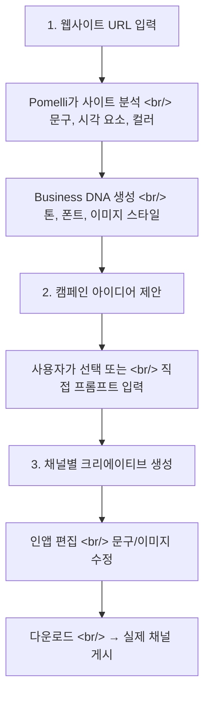

## 개요

소규모 팀에서 마케팅 콘텐츠를 만들 때 가장 큰 병목은 "브랜드 톤을 일관되게 유지하면서 빠르게 여러 채널용 에셋을 뽑아내는 것"이다. [Pomelli](https://pomelli.withgoogle.com/)는 Google Labs에서 공개한 AI 마케팅 도구로, 웹사이트 URL 하나만 입력하면 브랜드 DNA를 자동 추출하고 캠페인 크리에이티브를 생성한다.

<!--more-->

## 3단계 워크플로우

### Step 1: Business DNA

웹사이트 URL을 입력하면 Pomelli가 사이트의 문구와 시각 요소를 분석해 브랜드 프로필(Business DNA)을 만든다. 여기에는 브랜드 톤(문장 분위기), 폰트 느낌, 이미지 스타일, 컬러 팔레트가 포함된다.

중요한 점은 Pomelli가 **"내가 원하는 브랜드"가 아닌 "웹에 드러난 브랜드"**를 따라간다는 것이다. 사이트가 오래됐거나 페이지마다 톤이 다르면, 그 혼란까지 학습한다. 시작 전에 대표 페이지를 정리해두는 것이 좋다.

### Step 2: 캠페인 아이디어

Business DNA가 만들어지면 브랜드에 맞는 캠페인 주제를 제안한다. 직접 프롬프트를 입력할 수도 있다. 프롬프트는 **"대상 고객 + 제안 가치 + 행동"**처럼 짧고 명확하게 적는 것이 효과적이다. 예: "처음 방문 고객에게 10% 할인, 예약 링크 클릭 유도"

### Step 3: 크리에이티브 생성 & 편집

소셜, 웹, 광고 등 채널별 에셋을 생성하고, 인앱에서 문구와 이미지를 수정한 뒤 다운로드한다. 자동 게시까지는 하지 않고 **초안 생성 → 사람의 최종 결정** 워크플로우다.

## 활용 시나리오

| 시나리오 | 예시 | Pomelli의 역할 |
|---------|------|---------------|
| 시즌 캠페인 | 봄 한정 메뉴 출시 | 카페 브랜드 톤으로 Instagram 피드 이미지 + 캡션 변주 |
| 신제품 런칭 | "무설탕, 7일 체험" | 런칭 공지 → 후기 요청 → 재방문 유도 게시물 세트 |
| 예약/상담 유도 | 미용실, 피트니스 | 헤드라인 + CTA 문구를 여러 톤으로 → A/B 테스트 초안 |
| 채용 브랜딩 | 팀 가치/일하는 방식 | 브랜드 톤 유지한 채용 크리에이티브 |
| 재활성화 | 휴면 고객 재유입 | 할인 코드 + 복귀 메시지를 다양한 각도로 생성 |

특히 반복 변주를 빠르게 해주는 것이 강점이다. 같은 캠페인 주제로 톤(캐주얼/프리미엄)을 바꿔가며 여러 버전을 뽑아볼 수 있다.

## 주의사항

- Business DNA가 현재 브랜드와 맞는지 먼저 확인 (웹사이트가 오래됐다면 결과도 오래된 톤)
- 제품명, 가격, 할인 조건 등 사실 정보는 반드시 사람이 재검증
- 건강, 금융, 교육 분야는 과장 광고 여부와 표기 의무 확인 필수
- Google Labs의 공개 베타 — 품질이 들쭉날쭉할 수 있고, 제공 지역과 언어가 제한될 수 있음
- "Pomodoro 타이머"와 이름이 비슷하지만, 시간관리 도구가 아닌 마케팅 도구

## 인사이트

Pomelli가 해결하는 핵심 문제는 **"매번 프롬프트로 브랜드 가이드를 설명하지 않아도 되는 것"**이다. 일반 AI 도구에 "우리 브랜드 톤은 캐주얼하면서도 전문적이고..."라고 매번 설명하는 대신, 웹사이트에서 자동 추출한 프로필을 기반으로 일관된 결과를 낸다. 이 접근은 Claude의 CLAUDE.md나 Cursor의 .cursorrules와 동일한 패턴이다 — 컨텍스트를 매번 전달하는 대신 한 번 설정하고 재사용하는 것. Google이 SMB 마케팅 도구에 이 패턴을 적용한 것이 흥미롭다.
