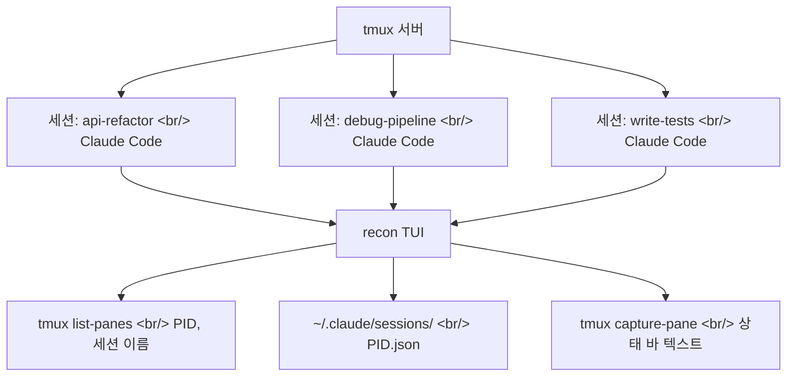

## 개요

Claude Code를 본격적으로 사용하면 세션이 수십 개씩 쌓인다. api-refactor, debug-pipeline, write-tests — 각각 다른 tmux 세션에서 돌아가는데, 어떤 에이전트가 입력을 기다리고 있고 어떤 에이전트가 작업 중인지 한눈에 파악하기 어렵다. [recon](https://github.com/gavraz/recon)은 이 문제를 해결하는 tmux 네이티브 대시보드다.

<!--more-->

## 아키텍처: tmux 위의 TUI



recon은 Rust로 작성되었으며(98K줄), 각 Claude Code 인스턴스가 자체 tmux 세션에서 실행되는 구조를 전제로 한다. 상태 감지는 tmux 패인 하단의 상태 바 텍스트를 읽는 방식으로 동작한다:

| 상태 바 텍스트 | 상태 | 의미 |
|--------------|------|------|
| `esc to interrupt` | **Working** | 응답 스트리밍 또는 도구 실행 중 |
| `Esc to cancel` | **Input** | 권한 승인 대기 — 사용자 개입 필요 |
| 기타 | **Idle** | 다음 프롬프트 대기 |
| *(0 tokens)* | **New** | 아직 인터랙션 없음 |

세션 매칭은 `~/.claude/sessions/{PID}.json` 파일을 사용한다. `ps` 파싱이나 CWD 기반 휴리스틱이 아닌 Claude Code가 직접 쓰는 파일을 읽으므로 정확하다.

## 두 가지 뷰

### Table View (기본)

```
┌─ recon — Claude Code Sessions ─────────────────────────────────────┐
│  #  Session          Git(Branch)    Status  Model      Context     │
│  1  api-refactor     feat/auth      ● Input Opus 4.6   45k/1M     │
│  2  debug-pipeline   main           ● Work  Sonnet 4.6 12k/200k   │
│  3  write-tests      feat/auth      ● Work  Haiku 4.5  8k/200k    │
│  4  code-review      pr-452         ● Idle  Sonnet 4.6 90k/200k   │
└────────────────────────────────────────────────────────────────────┘
```

Git 레포 이름과 브랜치, 모델명, 컨텍스트 사용량(45k/1M 형식)이 한눈에 보인다. Input 상태의 행은 하이라이트되어 즉시 주목할 수 있다.

### Tamagotchi View

각 에이전트가 픽셀 아트 캐릭터로 표현된다. Working은 발이 달린 초록색 블롭, Input은 화난 오렌지색 블롭(깜빡임), Idle은 Zzz가 뜨는 파란 블롭, New는 알 형태다. 에이전트들은 작업 디렉토리별 "방"에 그룹화되며, 2×2 그리드로 페이지네이션된다.

사이드 모니터에 띄워놓고 한눈에 어떤 에이전트가 일하고, 자고, 주의를 필요로 하는지 파악하는 용도로 설계되었다.

## 주요 기능

- **라이브 상태**: 2초마다 폴링, 증분 JSONL 파싱
- **Git 인식**: 세션별 레포 이름과 브랜치 표시
- **컨텍스트 추적**: 토큰 사용량을 used/available 형식으로 표시 (예: 45k/1M)
- **모델 표시**: Claude 모델명과 effort level 표시
- **Resume picker**: `recon resume`로 과거 세션 스캔, Enter로 재개
- **JSON 모드**: `recon --json`으로 스크립팅 및 자동화
- **`recon next`**: 다음 Input 상태 에이전트로 바로 점프

## tmux 통합

```bash
# ~/.tmux.conf에 추가
bind g display-popup -E -w 80% -h 60% "recon"        # prefix + g → 대시보드
bind n display-popup -E -w 80% -h 60% "recon new"    # prefix + n → 새 세션
bind r display-popup -E -w 80% -h 60% "recon resume" # prefix + r → 재개 선택
bind i run-shell "recon next"                         # prefix + i → Input 에이전트로 점프
```

팝업 오버레이로 열리므로 현재 작업을 중단하지 않고 세션을 전환할 수 있다.

## 설치

```bash
cargo install --path .
```

tmux와 Claude Code가 설치되어 있어야 한다. 흥미로운 점은 recon 자체의 커밋 이력에 `Co-Authored-By: Claude Opus 4.6`이 포함되어 있다는 것이다 — Claude Code로 Claude Code 관리 도구를 만드는 메타적 구조다.

## 인사이트

recon은 AI 코딩 에이전트의 "세션 관리" 문제를 tmux라는 검증된 인프라 위에서 해결한다. agentsview(웹 대시보드)나 agf(Fzf 기반 검색)와 달리, tmux 네이티브라는 점이 차별화 포인트다. 터미널을 떠나지 않고 모든 에이전트를 관리할 수 있으며, 다마고치 뷰는 기능적으로도 재미있지만 "에이전트의 상태를 직관적으로 인지"한다는 점에서 UI/UX적으로도 의미 있는 시도다. Claude Code를 동시에 3개 이상 돌리는 워크플로우에서 특히 유용할 것이다.
