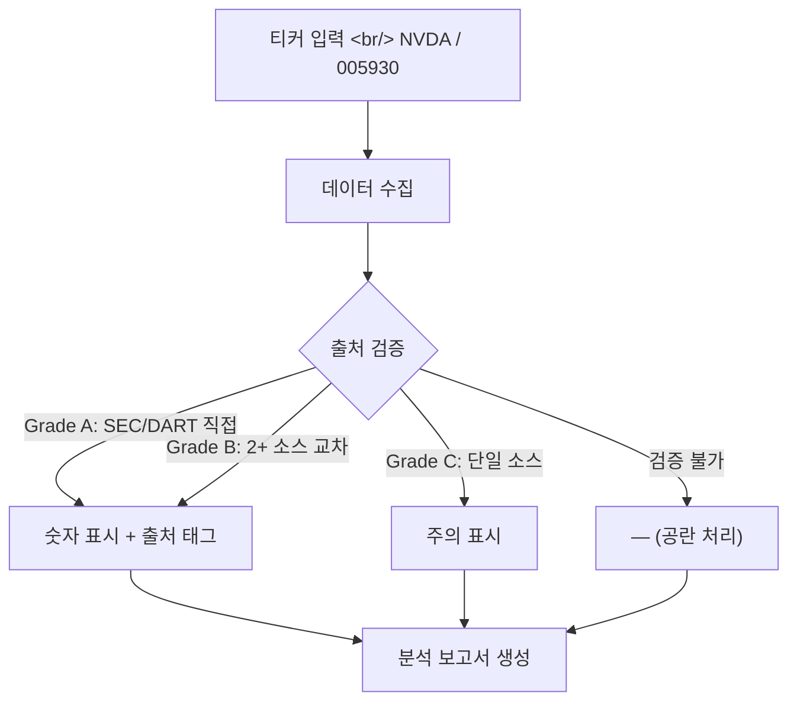
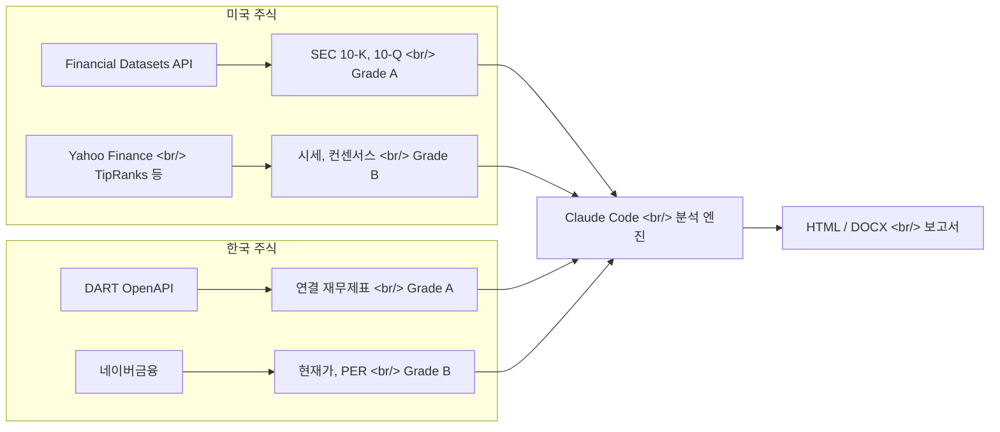

## 개요

"NVDA 분석해줘" 한 마디에 시나리오 분석(Bull/Base/Bear), 확률 가중 R/R Score, 8분기 재무제표, 인터랙티브 HTML 대시보드가 나온다. [stock-analysis-agent](https://github.com/kipeum86/stock-analysis-agent)는 Claude Code 위에서 동작하는 기관급 주식 리서치 자동화 도구다. 미국 주식은 SEC 파일링, 한국 주식은 금감원 DART OpenAPI에서 직접 데이터를 가져온다.

<!--more-->

## 핵심 원칙: Blank beats Wrong



이 에이전트의 핵심 철학은 **"검증할 수 없는 숫자는 공란으로 표시한다"**는 것이다. AI가 그럴듯한 숫자를 만들어내는 hallucination 문제를 정면으로 해결한다. 모든 숫자에 `[Filing]`, `[Portal]`, `[Calc]` 같은 출처 태그가 붙고, Grade A(공시 원본)부터 Grade D(검증 불가 → 공란)까지 4단계 신뢰도 시스템을 적용한다.

## 4가지 출력 모드

| 모드 | 이름 | 형식 | 용도 |
|------|------|------|------|
| **A** | At-a-glance | HTML | 판정 카드 + 180일 이벤트 타임라인 — 스크리닝용 |
| **B** | Benchmark | HTML | 2~5 종목 나란히 비교 매트릭스 |
| **C** | Chart (기본) | HTML | 인터랙티브 대시보드 — 시나리오, KPI, 차트 포함 |
| **D** | Document | DOCX | 3,000+단어 투자 메모 — Goldman Sachs 리서치 노트 스타일 |

Mode C의 대시보드에는 시나리오 카드(Bull/Base/Bear), R/R Score 배지, KPI 타일(P/E, EV/EBITDA, FCF Yield 등), Variant View(시장이 틀린 지점), Precision Risk(인과 체인 분석), Chart.js 차트, 8분기 손익계산서가 모두 포함된다.

## 듀얼 데이터 파이프라인



**미국**: Financial Datasets API(MCP)가 연결되면 SEC 파일링에서 직접 Grade A 데이터를 추출한다. MCP 없이도 Yahoo Finance, SEC EDGAR, TipRanks 등에서 웹 스크래핑으로 동작하지만 최대 Grade B까지만 가능하다.

**한국**: DART OpenAPI로 금융감독원 공시를 직접 연동한다. `fnlttSinglAcntAll` 엔드포인트에서 연결 재무제표(IS/BS/CF)를, 네이버금융에서 현재가·PER·외국인지분율을 가져온다. DART API 키는 무료다.

## R/R Score — 리스크/리워드를 하나의 숫자로

```
R/R Score = (Bull_return% × Bull_prob + Base_return% × Base_prob)
            ─────────────────────────────────────────────────────
                       |Bear_return% × Bear_prob|
```

시나리오별 목표가와 확률을 가중 평균해 단일 점수로 산출한다. 2.0 이상이면 Attractive, 1.0~2.0이면 Neutral, 1.0 미만이면 Unfavorable로 판정한다.

## Variant View — "시장이 틀린 지점"

가장 흥미로운 섹션이다. 일반적인 AI 분석이 "장단점 나열"에 그치는 것과 달리, stock-analysis-agent는 **시장의 컨센서스가 구체적으로 어디서 틀렸는지**를 회사 고유의 증거를 기반으로 제시한다. Q1~Q3 형식으로 3가지 포인트를 추출하며, 각각 "왜 시장이 이것을 놓치고 있는가"를 설명한다.

## 사용법

```bash
# 단일 종목 분석
NVDA 분석해줘
005930 심층 분석

# 동종 비교
삼성전자 vs SK하이닉스 비교
NVDA vs AMD vs INTC

# 포트폴리오/워치리스트
워치리스트 스캔해줘
카탈리스트 캘린더 보여줘
```

Claude Code에서 직접 대화하듯 명령하면 된다. 커밋 이력을 보면 `Co-Authored-By: Claude Opus 4.6`이 포함되어 있어, 이 에이전트 자체도 Claude Code로 개발되었음을 알 수 있다.

## 인사이트

stock-analysis-agent가 보여주는 가장 중요한 패턴은 **"AI hallucination 문제를 시스템 설계로 해결한다"**는 접근이다. 모든 숫자에 출처를 강제하고, 검증할 수 없으면 공란으로 남기는 규칙은 단순하지만 강력하다. 또한 한미 시장을 동시에 지원하면서 각각의 공시 시스템(SEC/DART)에 직접 연동하는 듀얼 파이프라인은, 한국 개발자에게 특히 실용적인 레퍼런스가 된다. 다만 stars 3개의 초기 프로젝트인 만큼, 프로덕션 사용보다는 구조와 프롬프트 설계를 학습하는 용도로 접근하는 것이 현실적이다.
