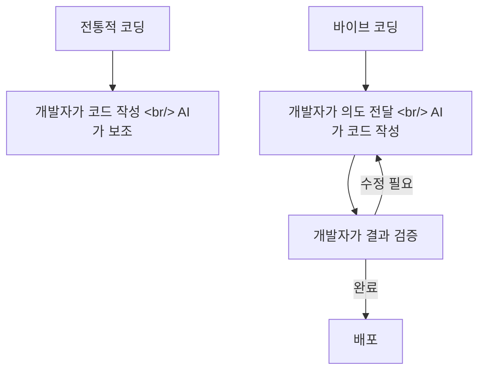

## 개요

"Vibe Coding"이라는 용어가 Andrej Karpathy의 트윗에서 시작되어 하나의 개발 패러다임으로 자리 잡고 있다. YouTube에 공개된 [Vibe Coding Fundamentals In 33 minutes](https://www.youtube.com/watch?v=iLCDSY2XX7E)는 이 패러다임의 기본기를 체계적으로 정리한 영상이다. 코드를 한 줄도 직접 쓰지 않으면서 AI에게 자연어로 지시해 소프트웨어를 만드는 방식의 핵심 원칙을 다룬다.

<!--more-->

## 바이브 코딩이란

Karpathy가 처음 제안한 개념은 단순하다 — "코드를 보기는 하지만 읽지는 않는다. 에러가 나면 에러 메시지를 그대로 AI에게 붙여넣는다. 대부분의 경우 동작한다." 이것이 바이브 코딩의 원형이다.

하지만 이 원형은 프로토타이핑에는 효과적이되, 프로덕션 코드에는 위험하다. Vibe Coding Fundamentals는 이 갭을 메우기 위한 체계적 접근법을 제시한다.

## 핵심 원칙

### 1. 명확한 컨텍스트 전달

AI에게 "채팅 앱 만들어줘"가 아닌, 기술 스택, 디렉토리 구조, 코딩 컨벤션, 비즈니스 요구사항을 구조화된 문서로 전달하는 것이 출발점이다. Claude Code의 CLAUDE.md, Cursor의 .cursorrules 같은 파일이 이 역할을 한다.

### 2. 작은 단위로 반복

한 번에 전체 기능을 요청하지 않고, 작은 단위로 나누어 요청 → 검증 → 다음 요청 사이클을 반복한다. 한 프롬프트에 한 가지 변경만 요청하는 것이 핵심이다.

### 3. 검증 가능한 결과물

"잘 되는 것 같다"가 아닌, 테스트 코드나 실행 결과로 검증한다. TDD(Test-Driven Development)와 바이브 코딩의 결합이 여기서 나온다 — 테스트를 먼저 쓰게 하고, 그 테스트를 통과하는 코드를 AI에게 작성하게 한다.

### 4. 결과물이 아닌 생성 장치

일회성 코드 생성이 아닌, 재현 가능한 워크플로우를 만든다. 프롬프트 자체를 버전 관리하고, 성공한 패턴을 스킬이나 규칙 파일로 저장한다.

## 바이브 코딩의 스펙트럼

바이브 코딩은 단일한 방법론이 아니라 스펙트럼이다:

| 레벨 | 특징 | 적합한 상황 |
|------|------|------------|
| 순수 바이브 | 자연어만으로 코드 생성, 검증 최소화 | 프로토타이핑, 일회성 스크립트 |
| 구조화된 바이브 | CLAUDE.md 등 규칙 파일 + TDD | 사이드 프로젝트, MVP |
| 에이전트 코딩 | 하네스 + 자율 실행 루프 | 프로덕션 기능 개발 |
| 팀 코딩 | 멀티 에이전트 + 코드 리뷰 | 대규모 프로젝트 |

## 빠른 링크

- [Vibe Coding Fundamentals In 33 minutes](https://www.youtube.com/watch?v=iLCDSY2XX7E) — YouTube 원본

## 인사이트

바이브 코딩의 "바이브"라는 표현이 주는 가벼운 인상과 달리, 실제로 이 패러다임이 작동하려면 상당한 엔지니어링 규율이 필요하다. 명확한 컨텍스트 전달, 작은 단위의 반복, 검증 가능한 결과물 — 이것들은 사실 전통적 소프트웨어 엔지니어링의 기본기와 다르지 않다. 차이는 "누가 코드를 쓰느냐"가 바뀌었을 뿐, "어떻게 좋은 소프트웨어를 만드느냐"의 원칙은 그대로라는 것이다. AI Frontier EP 86에서 신정규 대표가 말한 "결과물이 아닌 생성 장치를 만든다"는 조언과 정확히 겹친다.
