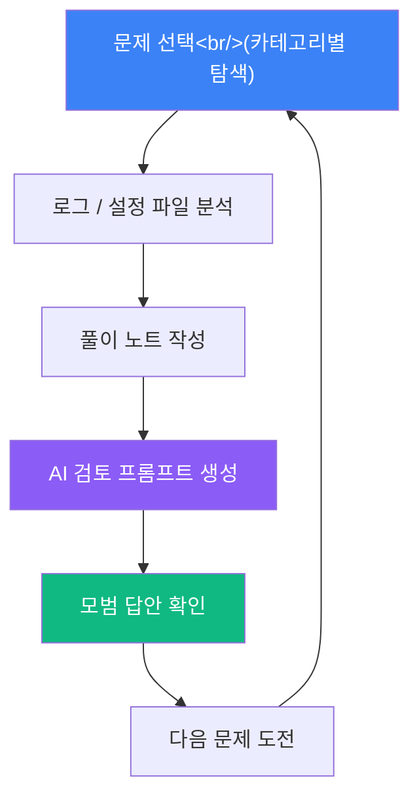
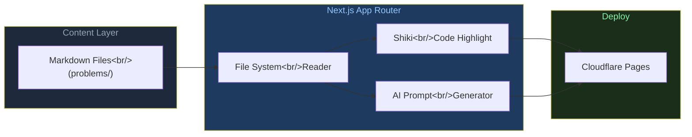

## 개요

인프라 장애는 책으로만 공부해서는 절대 감을 잡을 수 없다. 실제 로그를 읽고, 설정 파일의 어느 줄이 문제인지 짚어내는 경험이 반복되어야 비로소 트러블슈팅 근육이 생긴다. [Infratice](https://infratice.co.kr)는 그 경험을 웹에서 바로 제공하는 Problem-based learning 플랫폼이다. Kubernetes, Linux, Network, CI/CD, Monitoring 등 실무에서 실제로 마주치는 장애 시나리오를 정적 로그와 설정 파일 형태로 제공하고, 사용자가 직접 원인을 분석해 풀이 노트를 작성하면 AI 검토용 프롬프트까지 자동으로 생성해준다.

<!--more-->

GitHub 저장소 [kiku99/Infratice](https://github.com/kiku99/Infratice)는 TypeScript로 작성되었으며 25개의 스타를 받고 있다. Next.js App Router 위에 올라간 정적 콘텐츠 기반 아키텍처가 인상적인데, 모든 문제 데이터는 Markdown 파일로 관리되어 기여하기도 쉽다. 배포는 Cloudflare Pages를 사용해 전 세계 어디서나 빠르게 접근할 수 있다.

---

## 문제 풀이 흐름

Infratice의 학습 흐름은 단순하면서도 실무와 유사한 구조를 갖는다. 문제를 고르고, 주어진 로그와 설정 파일을 읽으며 원인을 추론하고, 풀이 노트를 직접 작성한다. 작성이 끝나면 AI 검토용 프롬프트가 생성되어 ChatGPT나 Claude 같은 도구로 피드백을 받을 수 있고, 마지막으로 모범 답안을 확인해 자신의 분석과 비교해볼 수 있다.

이 흐름에서 핵심은 **AI 검토 프롬프트 생성** 단계다. 단순히 정답을 보여주는 대신, 사용자의 풀이를 바탕으로 AI가 피드백할 수 있는 프롬프트를 자동으로 조합해준다. 덕분에 틀린 부분을 스스로 발견하고 교정하는 능동적 학습이 가능하다. 모범 답안은 그 이후에 제공되므로, 풀이 과정 자체에 집중하게 된다.

---

## 카테고리와 예제 문제

현재 제공되는 문제 카테고리는 다섯 가지다: **Linux**, **Kubernetes**, **Network**, **CI/CD**, **Monitoring**. 각 문제는 `content/problems/{category}/{NNN}-{description}.md` 형식의 Markdown 파일로 저장되어 있어, 누구나 PR을 통해 새 시나리오를 추가할 수 있다.

대표적인 예제 문제 두 가지를 살펴보면:

- **Kubernetes — ImagePullBackOff**: Pod 이벤트 로그와 `kubectl describe` 출력을 읽고, 이미지 태그 오타인지 레지스트리 인증 문제인지 구분하는 시나리오. 실무에서 아주 흔하게 마주치는 장애 유형이다.
- **CI/CD — GitHub Actions 빌드 실패**: `workflow.yml` 설정과 Actions 로그를 분석해 환경 변수 누락, 캐시 충돌, runner 버전 불일치 등 다양한 원인을 탐색하는 문제.

두 문제 모두 실제 운영 환경에서 발생하는 패턴을 그대로 재현하고 있어, 처음 접하는 사람이라면 "이런 상황을 어디서 봤는데..." 하는 데자뷰가 느껴질 것이다.

---

## 기술 스택 및 아키텍처

Infratice는 Next.js App Router를 기반으로 하며, 문제 콘텐츠는 Markdown 파일로 관리된다. 코드 하이라이팅에는 Shiki를 사용해 로그와 설정 파일의 가독성을 높인다. 스타일링은 Tailwind CSS v4, 배포는 Cloudflare Pages를 사용한다.

콘텐츠를 Markdown으로 분리한 선택이 돋보인다. Next.js 앱은 빌드 시 Markdown 파일을 읽어 정적 페이지를 생성하므로, 서버 없이 Cloudflare Pages의 엣지 네트워크에서 모든 것이 처리된다. 새로운 문제를 추가하려면 Markdown 파일 하나만 작성해 PR을 올리면 된다 — 데이터베이스도, API도 필요 없다.

Shiki는 서버 사이드에서 토큰화가 완료되어 클라이언트 자바스크립트 없이도 정확한 문법 강조가 가능하다. 로그 파일이나 YAML 설정 같은 구조적 텍스트를 읽기 좋게 렌더링하는 데 적합한 선택이다.

---

## 함께 살펴볼 것들

이번에 눈에 띈 다른 저장소들도 간단히 소개한다.

- **[youngwoocho02/unity-cli](https://github.com/youngwoocho02/unity-cli)** (57 stars, C#/Go) — Unity Editor를 CLI로 제어하는 단일 Go 바이너리 도구. MCP 없이 단독으로 사용할 수 있어 빌드 자동화나 CI 파이프라인에 바로 연결할 수 있다.
- **[softaworks/agent-toolkit](https://github.com/softaworks/agent-toolkit)** — AI 코딩 에이전트를 위한 큐레이티드 스킬 컬렉션. Claude Code나 Cursor 같은 도구에서 재사용 가능한 스킬을 체계적으로 정리한 저장소다.
- **[alibaba/page-agent](https://github.com/alibaba/page-agent)** — 자연어로 웹 인터페이스를 제어하는 JavaScript in-page GUI 에이전트. 브라우저 안에서 직접 동작하며, 복잡한 UI 자동화를 자연어 명령으로 처리할 수 있다.

---

## 마치며

Infratice는 "로그를 읽는 능력"을 직접 훈련할 수 있는 보기 드문 플랫폼이다. 이론과 실습의 간극을 좁히려는 시도가 기술적으로도 깔끔하게 구현되어 있다. Markdown 기반 콘텐츠 관리 덕분에 커뮤니티 기여도 열려 있으니, 본인이 겪었던 실무 장애 시나리오를 문제로 만들어 기여해보는 것도 좋은 방법이다.

인프라 트러블슈팅에 익숙해지고 싶다면 [infratice.co.kr](https://infratice.co.kr)에서 직접 문제를 풀어보길 권한다.
