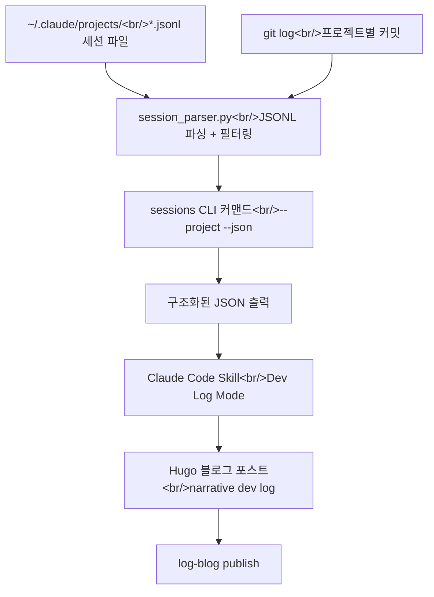

## 개요

log-blog는 Chrome 브라우징 히스토리를 Hugo 블로그 포스트로 변환하는 Python CLI 도구다. 오늘은 두 가지 큰 축으로 작업했다. 첫째, AI 채팅 URL 분류와 Gemini share link 추출 기능을 개선했고, 둘째, Claude Code CLI 세션 데이터를 파싱해서 개발 로그 블로그 포스트를 자동 생성하는 `sessions` 커맨드를 새로 만들었다. 총 4개의 세션에 걸쳐 약 5시간 동안 13개의 커밋이 생성됐다.

<!--more-->

---

## AI 채팅 추출 개선 — AI_LANDING 노이즈 필터

### 배경

Chrome 히스토리에서 AI 서비스 URL을 추출할 때, 실제 대화 페이지와 단순 랜딩/로그인 페이지가 섞여 나오는 문제가 있었다. 두 개의 Chrome 프로필에서 3,575개의 URL 중 96개가 AI 서비스 URL이었는데, 대부분이 `claude.ai/oauth/*`, `chatgpt.com/` (랜딩), `gemini.google.com/app` (ID 없음) 같은 노이즈였다.

진단 결과:
- **Claude**: `claude.ai/code/*` (Claude Code 세션) URL이 대부분이고, `claude.ai/chat/{uuid}` 패턴은 0개
- **ChatGPT**: 대화 URL 1개, 나머지는 랜딩 페이지
- **Gemini**: `gemini.google.com/app/{id}` 대화는 매칭되지만 `gemini.google.com/share/{id}` (공유 링크)가 누락
- **Perplexity**: 히스토리에 URL 자체가 없음

### 구현

`UrlType` enum에 `AI_LANDING`을 추가하고, 대화 패턴 매칭 **이전에** 노이즈 필터를 실행하는 구조로 변경했다.

```python
class UrlType(str, Enum):
    # ... 기존 타입 ...
    AI_LANDING = "ai_landing"  # 노이즈: 랜딩/OAuth/설정 페이지
```

노이즈 패턴 예시:

```python
_AI_NOISE_PATTERNS = [
    re.compile(r"claude\.ai/(?:oauth|chrome|code(?:/(?:onboarding|family))?)?(?:[?#]|$)"),
    re.compile(r"chatgpt\.com/?(?:[?#]|$)"),
    re.compile(r"gemini\.google\.com/(?:app)?(?:/download)?(?:[?#]|$)"),
    # ...
]
```

`content_fetcher.py`에서는 `AI_LANDING` URL을 fetch 시도 없이 즉시 스킵하도록 early-return을 추가했다. 이렇게 하면 Playwright 슬롯을 로그인 벽에 낭비하지 않는다.

`extract --json` 출력에 `url_type` 필드를 포함시켜서, 스킬의 Step 2 분류가 Claude의 추측이 아닌 동일한 regex 엔진을 사용하도록 개선했다.

**결과**: 34개의 AI 채팅 대화가 정상 분류되고, 32개의 노이즈 URL이 필터링됐다.

### Gemini Share Link 지원

`gemini.google.com/share/{id}` 패턴을 Gemini 분류 regex에 추가하고, `ai_chat_fetcher.py`에 `_extract_gemini_share()` 전용 추출기를 구현했다. 공유 링크는 인증 없이 접근 가능하므로 CDP 연결 없이 일반 Playwright로 처리한다.

---

## YouTube Fetcher 수정 — API 브레이킹 체인지 대응

### 배경

블로그 포스트 작성 중 YouTube 트랜스크립트 fetch가 실패했다:

```
AttributeError: type object 'YouTubeTranscriptApi' has no attribute 'list_transcripts'
```

원인은 `youtube-transcript-api` 라이브러리가 v1.x로 업데이트되면서 **클래스 메서드**에서 **인스턴스 메서드**로 변경된 것이다.

| v0.x (기존) | v1.x (신규) |
|---|---|
| `YouTubeTranscriptApi.list_transcripts(video_id)` | `YouTubeTranscriptApi().list(video_id)` |
| `YouTubeTranscriptApi.get_transcript(video_id)` | `YouTubeTranscriptApi().fetch(video_id)` |

### 구현

`youtube_fetcher.py`를 전면 리라이트했다:

```python
def _get_transcript(video_id: str):
    from youtube_transcript_api import YouTubeTranscriptApi
    api = YouTubeTranscriptApi()
    try:
        return api.fetch(video_id, languages=["ko", "en"])
    except Exception:
        pass
    try:
        transcript_list = api.list(video_id)
        for transcript in transcript_list:
            try:
                return transcript.fetch()
            except Exception:
                continue
    except Exception:
        pass
    return None
```

추가로 **YouTube oEmbed API**를 활용해 트랜스크립트 없이도 비디오 메타데이터(제목, 채널명, 썸네일)를 가져올 수 있게 했다. API 키 없이 `urllib.request`만으로 동작하는 zero-dependency 방식이다:

```python
_OEMBED_URL = "https://www.youtube.com/oembed?url=https://www.youtube.com/watch?v={video_id}&format=json"
```

3단계 fallback 체계:
1. 트랜스크립트 + oEmbed 메타데이터 (최상)
2. oEmbed 메타데이터만 (트랜스크립트 불가 시)
3. Playwright 스크래핑 (모든 것 실패 시)

---

## Sessions 커맨드 — Claude Code 세션에서 개발 로그 추출

### 배경

매일 20~40개의 Claude Code CLI 세션을 여러 프로젝트(GitHub + Bitbucket)에 걸쳐 사용하고 있다. 이 세션들에는 디버깅 과정, 아키텍처 결정, 코드 변경 등 풍부한 개발 내러티브가 담겨 있는데, 이를 블로그 포스트로 활용할 방법이 없었다. Chrome 히스토리 기반 파이프라인은 "무엇을 봤는가"는 알려주지만 "무엇을 만들었는가"는 알려주지 못한다.

### 데이터 흐름



### 프로젝트 자동 발견

Claude Code는 세션 파일을 `~/.claude/projects/` 하위에 프로젝트 경로를 인코딩한 디렉토리명으로 저장한다:

```
-Users-lsr-Documents-github-trading-agent/
  ├── f08f2420-0442-475f-a1f8-3691da54eb9d.jsonl
  ├── 30de43c5-8bc2-48d0-86df-c1a6a3f7f6ee.jsonl
  └── ...
```

문제는 디렉토리 이름 자체에 하이픈이 포함될 수 있다는 점이다. 예를 들어 `hybrid-image-search-demo`라는 레포의 경로에서 어디까지가 경로 구분자이고 어디부터가 디렉토리 이름인지 알 수 없다.

**Greedy filesystem matching** 알고리즘으로 해결했다:

```python
def _reverse_map_path(dirname: str) -> Path | None:
    # Worktree 접미사 제거
    if _WORKTREE_SEPARATOR in dirname:
        dirname = dirname.split(_WORKTREE_SEPARATOR)[0]

    raw = "/" + dirname[1:]  # 선행 '-'를 '/'로
    segments = raw.split("-")

    result_parts: list[str] = []
    i = 0
    while i < len(segments):
        matched = False
        for j in range(len(segments), i, -1):
            candidate = "-".join(segments[i:j])
            test_path = "/".join(result_parts + [candidate])
            if os.path.exists(test_path):
                result_parts.append(candidate)
                i = j
                matched = True
                break
        if not matched:
            result_parts.append(segments[i])
            i += 1

    path = Path("/".join(result_parts))
    return path if path.exists() else None
```

가장 긴 매칭을 우선 시도하므로, `/Users/lsr/Documents/bitbucket/hybrid-image-search-demo`처럼 하이픈이 포함된 디렉토리도 정확히 역매핑된다.

### JSONL 파싱 — 스마트 필터링

Claude Code의 JSONL 파일에는 `user`, `assistant`, `system`, `progress` 등 다양한 타입의 메시지가 있다. 모든 것을 포함하면 노이즈가 너무 많고, 핵심만 추출해야 한다.

| 메시지 타입 | 포함 여부 | 추출 대상 |
|---|---|---|
| 사용자 텍스트 | O | 전체 텍스트 (내러티브 뼈대) |
| 어시스턴트 텍스트 | O | 최대 1,500자 (결정/설명) |
| Edit/Write 도구 호출 | O | 파일 경로 + diff 내용 |
| Bash 에러 | O | 커맨드 + stderr |
| Bash 성공 | 요약만 | 커맨드만 기록 |
| WebFetch/WebSearch | 요약만 | URL/쿼리만 기록 |
| Agent 서브태스크 | 요약만 | 위임 설명 + 결과 요약 |
| Read/Grep/Glob | X | 탐색 노이즈 |
| thinking 블록 | X | 내부 추론, 노이즈 |

세션별 최대 100개 항목, 2분 미만 또는 3개 미만 메시지의 세션은 기본 제외(`--include-short`로 포함 가능)한다.

### CLI 사용법

```bash
# 프로젝트 목록 조회
uv run log-blog sessions --list

# 특정 프로젝트의 상세 세션 데이터 (JSON)
uv run log-blog sessions --project log-blog --all --json

# 전체 데이터 (짧은 세션 포함)
uv run log-blog sessions --all --include-short --json
```

출력 JSON은 `sessions`, `git_commits`, `files_changed` 세 가지 핵심 데이터를 포함하며, Claude Code 스킬의 "Dev Log Mode"에서 이를 읽어 내러티브 개발 로그 포스트를 작성한다.

---

## 스킬 업데이트 — Dev Log Mode 추가

`SKILL.md`에 "Dev Log Mode" 섹션을 추가했다. 사용자가 "오늘 뭐 했는지 정리해줘", "dev log 작성해줘" 등을 요청하면 Chrome 히스토리 대신 세션 데이터 기반 플로우를 탄다.

기존 워크플로우와의 차이:

| 항목 | Chrome 히스토리 모드 | Dev Log 모드 |
|---|---|---|
| 데이터 소스 | Chrome SQLite DB | Claude Code JSONL + git log |
| 콘텐츠 성격 | "무엇을 봤는가" | "무엇을 만들었는가" |
| 포스트 스타일 | 주제별 기술 분석 | 문제 → 해결 내러티브 |
| Fetch 필요 | URL별 Playwright/API | 불필요 (세션 데이터에 포함) |

---

## 커밋 로그

| 메시지 | 변경 파일 |
|--------|-----------|
| docs: add design spec for AI chat extraction improvement | specs |
| docs: fix stale references in AI chat extraction spec | specs |
| docs: add implementation plan for AI chat extraction improvement | plans |
| chore: add pytest dev dependency | pyproject.toml, uv.lock |
| feat: add AI_LANDING noise filter and Gemini share link support | url_classifier.py, tests |
| feat: add url_type to extract --json and filter AI_LANDING noise | cli.py, tests |
| feat: skip AI_LANDING URLs in content fetcher | content_fetcher.py |
| feat: add Gemini share link content extraction | ai_chat_fetcher.py |
| docs: update skill to use url_type from extract output | SKILL.md |
| docs: add session-to-devlog feature design spec | specs |
| docs: update session-devlog spec with review fixes | specs |
| docs: add session-devlog implementation plan | plans |
| feat: add sessions command for Claude Code dev log extraction | cli.py, config.py, session_parser.py |

---

## 인사이트

하루 동안 두 가지 방향의 작업이 하나의 목표로 수렴했다. AI 채팅 URL 분류 개선은 "외부에서 본 것"을 더 정확히 캡처하는 일이고, sessions 커맨드는 "내부에서 한 것"을 캡처하는 일이다. 둘이 합쳐져서 log-blog가 "브라우징 로그 도구"에서 "개발 활동 전체를 기록하는 도구"로 진화하는 기반이 됐다.

Greedy filesystem matching 알고리즘은 단순하지만 효과적이다. 하이픈이 포함된 디렉토리명을 역매핑하는 문제는 정규식만으로는 해결할 수 없고, 실제 파일시스템을 탐색하는 것이 가장 확실한 방법이었다. Claude Code의 프로젝트 디렉토리 인코딩이 손실적(lossy)이라는 점을 받아들이고, 런타임에 검증하는 접근이 핵심이다.

`youtube-transcript-api` v1.x 브레이킹 체인지는 라이브러리 의존성 관리의 중요성을 다시 한번 상기시켜 줬다. oEmbed API를 fallback으로 추가한 것은 "트랜스크립트가 없어도 메타데이터라도 가져오자"는 graceful degradation 원칙의 적용이다. 결과적으로 3단계 fallback 체계(트랜스크립트 + oEmbed, oEmbed만, Playwright)가 완성됐고, 각 단계에서 가능한 최대한의 정보를 확보한다.

spec-design-plan-implement 워크플로우(brainstorm → writing-plans → subagent-driven-development)의 효과가 체감된다. AI 채팅 개선은 설계부터 구현까지 7개 태스크를 서브에이전트가 병렬로 처리했고, 스펙 리뷰 루프가 3번 반복되면서 `AI_CHAT_CLAUDE_CODE` 같은 불필요한 타입이 제거되는 등 설계 품질이 실제로 향상됐다.
