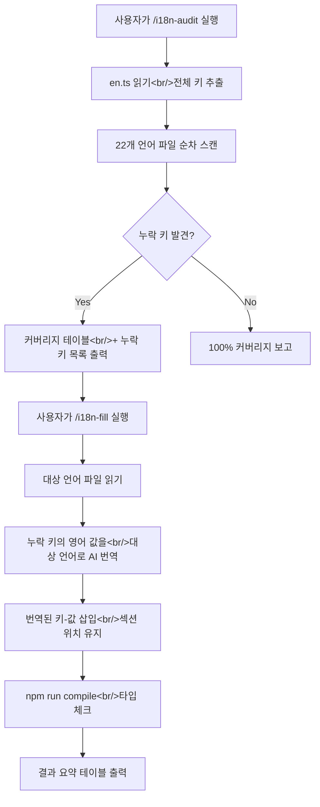

MEGA Code는 Claude Code 세션을 학습 자료로 변환하는 VS Code 확장이다. 23개 언어를 지원하지만 번역 커버리지가 들쭉날쭉한 상태였다 — 한국어 약 90%, 나머지 대부분 20~30%. 매번 수동으로 빠진 키를 찾고 번역하는 과정이 반복되다 보니 자동화가 절실했다.

이번 개발 세션에서는 i18n 워크플로를 자동화하는 두 가지 Claude Code 커맨드(`/i18n-audit`, `/i18n-fill`)를 설계하고 구현했다. 그 과정에서 발견한 Node.js 오버레이 레이스 컨디션과 ChatService PATH 불일치 버그도 함께 수정했다.

<!--more-->

## i18n 자동화 커맨드 설계

### 문제 인식

기존 i18n 작업 세션의 가장 큰 문제점은 세 가지였다:

1. Claude가 파일을 읽지 않고 내용을 가정하는 패턴
2. 누락된 키를 빠뜨리는 불완전한 감사
3. 파일 편집 실패의 반복

이 마찰을 해결하기 위해 Two-Phase 접근법을 채택했다 — 먼저 감사(audit)로 현황을 파악하고, 그 다음 채움(fill)으로 번역을 삽입하는 구조다.

### `/i18n-audit` — 읽기 전용 번역 감사

`.claude/commands/i18n-audit.md`에 작성된 이 커맨드는 `en.ts`를 기준으로 22개 언어 파일의 누락 키를 스캔한다. 핵심 규칙은 단순하다 — **반드시 파일을 읽은 뒤 분석할 것**.

출력 형식은 markdown 테이블이다:

```
| Language | File    | Total | Present | Missing | Coverage |
|----------|---------|-------|---------|---------|----------|
| Korean   | ko.ts   |   N   |    ...  |    ...  |    ...%  |
| Japanese | ja.ts   |   N   |    ...  |    ...  |    ...%  |
```

키 수는 런타임에 `en.ts`에서 동적으로 카운트한다. 282개라고 하드코딩하면 기능 추가 때마다 깨지기 때문이다.

### `/i18n-fill` — AI 번역 자동 채움

감사 결과를 바탕으로 실제 번역을 삽입하는 커맨드다. 선택적으로 언어를 지정할 수 있다:

```bash
/i18n-fill              # 22개 전체
/i18n-fill ko ja        # 한국어, 일본어만
```

번역 시 지켜야 할 guardrail이 명확하게 프롬프트에 포함되어 있다:

- `{param}` 인터폴레이션 플레이스홀더 보존
- HTML 태그의 속성(href, class 등)은 그대로, 보이는 텍스트만 번역
- 기존 번역의 톤과 존댓말 수준 맞추기
- `id.ts`처럼 export 이름이 특수한 경우(`id_`) 그대로 유지



### 설계 과정에서의 주요 결정

스펙 리뷰에서 5가지 중요한 피드백이 나왔다:

1. **인도네시아어 export 이름 문제** — `id.ts`는 `id`가 아닌 `id_`로 export한다. JavaScript 예약어 충돌 때문이다.
2. **하드코딩된 키 수** — "282개"를 런타임 카운트로 변경
3. **키 삽입 위치** — 파일 끝에 몰아넣지 않고 `en.ts`의 섹션 구조에 맞춰 삽입
4. **HTML 태그 보존** — 번역 대상은 태그 내부의 텍스트만
5. **extra key 처리** — `en.ts`에 없지만 언어 파일에 있는 키는 절대 삭제하지 않음

## 버그 수정: Node.js 오버레이 레이스 컨디션

### 증상

Node.js가 설치되어 있지 않은데도 "Node.js missing" 경고 배너가 보이지 않는 현상. 사용자 입장에서는 모든 것이 정상인 것처럼 보인다.

### 원인 분석

오버레이 상태 전달 구조를 추적한 결과, **push-only 설계의 빈틈** 4개를 발견했다:

1. **Gap 1: 초기 로드 레이스 컨디션** — `node-overlay` HTML이 `class="hidden"`으로 시작하지만 `updateNodeUI()`는 `node:statusUpdate` 메시지가 도착해야만 실행된다. 메시지가 리스너 등록 전에 도착하면 영원히 hidden 상태로 남는다.

2. **Gap 2: `onDidChangeVisibility`가 node 상태를 무시** — 패널을 숨겼다 다시 열 때 `sendAuthStatus()`만 재전송하고 node 상태는 복구 경로가 없다.

3. **Gap 3: `sendNodeStatus`가 visibility를 체크하지 않음** — 패널이 숨겨진 상태에서 보낸 메시지가 소실된다.

### 수정 내용

auth 시스템이 이미 사용하고 있던 **Push + Pull + Pending** 트리플 안전 패턴을 node 상태에도 적용했다:

```typescript
// dashboard-provider.ts — 새로 추가된 필드
private pendingNodeUpdate = false;
private lastNodeAvailable: boolean | null = null;

// sendNodeStatus — visibility 체크 추가
public sendNodeStatus(available: boolean): void {
  this.lastNodeAvailable = available;
  if (!this.view) return;
  if (!this.view.visible) {
    this.pendingNodeUpdate = true;
    return;
  }
  this.view.webview.postMessage({
    type: 'node:statusUpdate',
    data: { available },
  });
}
```

Webview 측에서는 `DOMContentLoaded`와 agent zone 전환 시 `node:requestStatus`를 요청하도록 추가했다:

```typescript
// card-scripts-init.ts — DOMContentLoaded에 추가
vscode.postMessage({ type: 'node:requestStatus' });
vscode.postMessage({ type: 'auth:requestStatus' });

// card-scripts-tabs.ts — zone 전환 시 추가
if (zone === 'agent') {
  vscode.postMessage({ type: 'node:requestStatus' });
  vscode.postMessage({ type: 'auth:requestStatus' });
}
```

수정 파일 3개: `dashboard-provider.ts`, `card-scripts-init.ts`, `card-scripts-tabs.ts`.

## 버그 수정: ChatService PATH 불일치

### 증상

Claude CLI가 터미널에서 정상 작동하는데도 Q&A 패널에서 "Error: Claude CLI not found"가 표시되는 현상.

### 원인

`ClaudeCliChecker.isAvailable()`과 `ChatService.runClaude()`가 서로 다른 PATH를 사용하고 있었다:

```typescript
// ClaudeCliChecker — 확장 PATH 사용 (OK)
const env = { ...process.env, PATH: buildExtendedPath() };
execFile('claude', ['--version'], { timeout: 5000, env }, ...);

// ChatService — 기본 PATH 사용 (BUG)
const proc = spawn('claude', args, {
  timeout: DEFAULT_CHAT_TIMEOUT_MS,
  stdio: ['pipe', 'pipe', 'pipe'],
  // env 없음! VS Code 기본 PATH만 사용
});
```

`ClaudeCliChecker`는 `/opt/homebrew/bin` 등을 포함한 확장 PATH로 `claude`를 찾아 "사용 가능"이라고 판정하지만, 실제로 `ChatService`가 spawn할 때는 그 경로가 없어서 `ENOENT`가 발생했다.

### 수정

`buildExtendedPath()`를 공유 유틸리티로 추출하고 세 곳에서 동일하게 사용하도록 통합했다:

```typescript
// src/dependency/extended-path.ts (새 파일)
export function buildExtendedPath(): string {
  const home = os.homedir();
  const extra: string[] = [];
  if (process.platform !== 'win32') {
    extra.push(
      '/usr/local/bin',
      '/opt/homebrew/bin',
      path.join(home, '.local/bin'),
      path.join(home, '.claude/bin'),
      path.join(home, '.nvm/versions/node'),
      path.join(home, '.local/share/fnm'),
      path.join(home, '.volta/bin'),
      path.join(home, '.nodenv/shims'),
      '/usr/bin',
    );
  }
  const current = process.env.PATH || '';
  return [...extra, current].join(path.delimiter);
}
```

기존에 `node-checker.ts`와 `claude-cli-checker.ts`가 각각 자체 `buildExtendedPath()`를 갖고 있었는데, 이미 드리프트가 발생해 node-checker는 7개 경로, cli-checker는 4개 경로만 포함하고 있었다. 통합으로 잠재 버그까지 함께 해결했다.

수정 파일 4개: `extended-path.ts`(신규), `claude-cli-checker.ts`, `node-checker.ts`, `chat-service.ts`.

## 기타 작업

- **`/explain-code` 스킬 설계** — 바이브 코더(코드 구조를 모르는 사용자)를 위한 코드 투어 스킬. `/mend-logic`이나 `/mend-ui`를 사용하기 전에 코드 구조를 이해할 수 있도록 "Bird's Eye → Room by Room → Glossary" 3단계로 설명한다.
- **문서 구조 정리** — developer README를 `docs/`로 이동, walkthrough 문서 제거
- **버전 0.1.1 릴리스** — README에 "Reliability Improvements" 섹션 추가

## 커밋 로그

| 메시지 | 변경 파일 |
|--------|-----------|
| fix(webview): add pull-based recovery for Node.js overlay status | dashboard-provider.ts, card-scripts-init.ts, card-scripts-tabs.ts |
| fix(chat): unify PATH resolution so ChatService finds Claude CLI | chat-service.ts, claude-cli-checker.ts, extended-path.ts, node-checker.ts |
| docs: restructure -- move developer README to docs/ | README-for-developers.md 외 다수 |
| chore: bump version to 0.1.1 | package.json, package-lock.json |
| docs: add bug reports, specs, and implementation plans | 6개 문서 파일 |
| docs: add i18n commands design spec | i18n-commands-design.md |
| docs: address spec review feedback for i18n commands | i18n-commands-design.md |
| docs: add i18n commands implementation plan | i18n-commands-plan.md |
| feat: add /i18n-audit command for translation key auditing | i18n-audit.md |
| feat: add /i18n-fill command for AI-powered translation gap filling | i18n-fill.md |
| chore: allow .claude/commands/ to be tracked in git | .gitignore |

## 인사이트

### Push-only 메시징은 반드시 깨진다

VS Code webview와 extension host 사이의 메시지 전달은 비동기다. push-only 방식은 타이밍에 따라 메시지가 유실될 수 있다. auth 시스템은 이미 Pull + Pending 패턴을 갖추고 있었지만, 같은 프로젝트 내에서 node 상태는 빠져 있었다. **한 시스템에서 해결한 패턴은 동일한 제약을 가진 다른 시스템에도 적용해야 한다.**

### PATH 불일치는 "체크는 통과하지만 실행은 실패"를 만든다

의존성 체크와 실제 사용이 서로 다른 환경(PATH)에서 동작하면, 체크 결과가 무의미해진다. 특히 VS Code extension host의 PATH는 시스템 셸과 다를 수 있다는 점을 항상 염두에 둬야 한다. `buildExtendedPath()`를 공유 유틸리티로 추출한 것은 단순한 DRY가 아니라 **정합성 보장**이다.

### i18n 자동화에서 가장 중요한 규칙: "반드시 읽고 나서 분석하라"

Claude가 파일 내용을 가정하고 분석하는 것이 i18n 세션에서 가장 큰 마찰이었다. `/i18n-audit`와 `/i18n-fill` 프롬프트 모두 첫 번째 규칙으로 "ALWAYS read a file before editing it"을 명시하고 있다. AI 도구의 프롬프트 설계에서 **가장 흔한 실패 모드를 첫 번째 규칙으로 막는 것**이 효과적이다.
