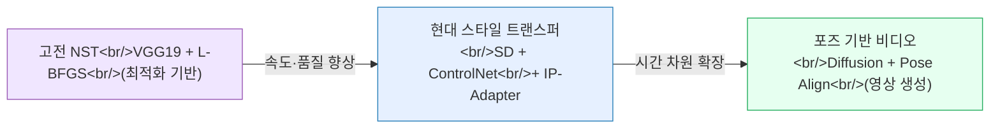
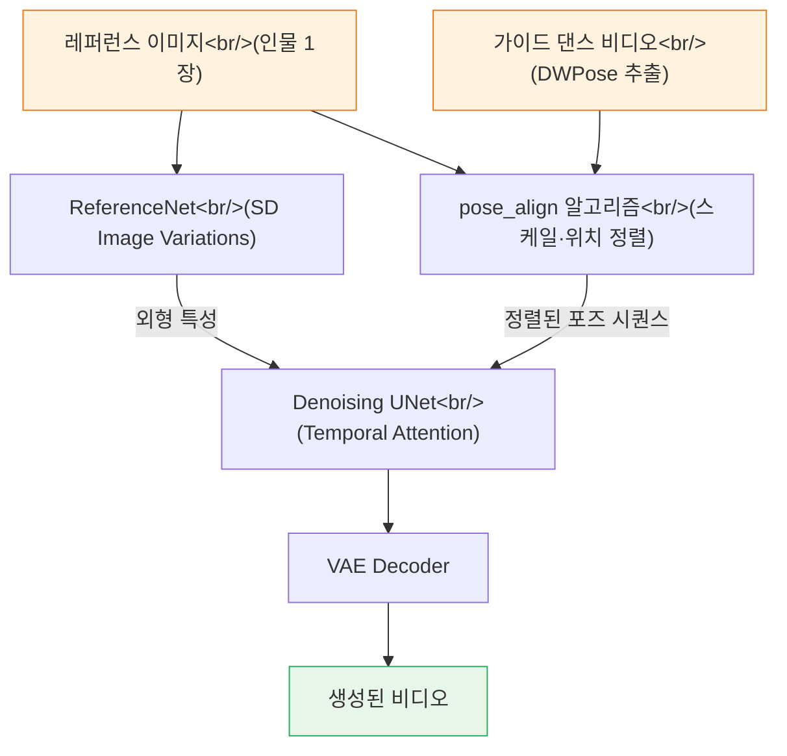

## 개요

이미지의 스타일을 다른 이미지에 입히는 기술은 2015년 Gatys et al.의 논문 이후 놀라운 속도로 발전해왔다. 초기에는 VGG19 네트워크를 이용한 느린 최적화 방식이 전부였지만, 이제는 Stable Diffusion 기반의 실시간 스타일 트랜스퍼를 거쳐 포즈 기반 가상 인간 비디오 생성까지 가능한 시대가 됐다. 이번 글에서는 각 시대를 대표하는 세 가지 오픈소스 프로젝트를 살펴보며, 기술이 어떤 방향으로 진화했는지 정리해본다.

<!--more-->

세 프로젝트는 접근 방식이 완전히 다르다. `nazianafis/Neural-Style-Transfer`는 고전적인 최적화 기반 방식으로 원리를 이해하기 좋고, `philz1337x/style-transfer`는 Stable Diffusion 생태계를 활용해 훨씬 빠르고 정교한 결과를 낸다. 마지막으로 텐센트 뮤직의 `TMElyralab/MusePose`는 스타일 트랜스퍼의 개념을 확장해, 포즈 정보를 기반으로 정지 이미지를 춤추는 비디오로 변환한다.

---

## 세 가지 접근법의 스펙트럼

아래 다이어그램은 세 기술이 어떤 축으로 구분되는지를 보여준다.



- **고전 NST**: 단일 이미지 한 쌍에 대해 수백 번 역전파를 반복하는 최적화 프로세스. 원리가 명확하고 구현이 단순하지만 속도가 느리다.
- **현대 스타일 트랜스퍼**: Stable Diffusion의 latent space를 활용해 구조 보존(ControlNet Canny)과 스타일 주입(IP-Adapter)을 분리 처리한다. 속도와 품질이 크게 향상됐다.
- **포즈 기반 비디오 생성**: 스타일이라는 개념을 포즈와 동작으로 확장한다. 레퍼런스 이미지의 외형을 유지하면서, 타겟 댄스 영상의 움직임을 그대로 입힌다.

---

## 1. nazianafis/Neural-Style-Transfer — 원리를 이해하는 출발점

### 고전 Gatys 방식의 구현

`nazianafis/Neural-Style-Transfer`(59 stars)는 2015년 Gatys et al.의 논문 "A Neural Algorithm of Artistic Style"을 PyTorch + VGG19로 구현한 교육용 프로젝트다. 코드가 간결하고 각 손실 함수의 역할이 코드에서 명확히 드러나기 때문에, Neural Style Transfer의 원리를 처음 공부하는 사람에게 이상적인 레퍼런스다.

핵심 아이디어는 하나의 콘텐츠 이미지와 하나의 스타일 이미지를 입력으로 받아, 세 가지 손실 함수를 최소화하는 방향으로 출력 이미지를 직접 최적화하는 것이다. 신경망의 가중치는 고정하고, 픽셀 값 자체를 업데이트한다는 점이 일반적인 학습과 다르다.

### 손실 함수 구조

세 가지 손실이 합산되어 최적화를 이끈다.

- **Content Loss**: `conv4_2` 레이어의 feature map 간 L2 거리. 구조와 레이아웃을 보존한다.
- **Style Loss**: `conv1_1`부터 `conv5_1`까지 다섯 레이어의 Gram matrix 간 차이. Gram matrix는 feature map 간의 채널 상관관계를 포착해 텍스처와 스타일을 표현한다.
- **Total Variation Loss**: 인접 픽셀 간 차이의 합. 노이즈를 억제하고 결과를 부드럽게 만든다.

```python
# Gram matrix 계산 예시
def gram_matrix(feature_map):
    b, c, h, w = feature_map.size()
    features = feature_map.view(b * c, h * w)
    gram = torch.mm(features, features.t())
    return gram.div(b * c * h * w)

# 전체 손실
total_loss = alpha * content_loss + beta * style_loss + gamma * tv_loss
```

최적화 알고리즘으로는 L-BFGS를 사용하는데, 이는 2차 미분 근사를 활용하는 준뉴턴 방법으로 Adam보다 빠르게 수렴한다. 단점은 이미지 해상도가 높아질수록 메모리 사용량이 급격히 늘고, 이미지 한 쌍당 수백 번의 forward/backward pass가 필요하다는 것이다. 실용적인 용도보다는 Gram matrix가 어떻게 스타일을 인코딩하는지, VGG 레이어 깊이에 따라 포착되는 정보가 어떻게 달라지는지를 실험하기 좋다.

---

## 2. philz1337x/style-transfer — Stable Diffusion 기반의 실용적 스타일 트랜스퍼

### ControlNet + IP-Adapter 조합

`philz1337x/style-transfer`(55 stars)는 고전 NST의 속도 문제를 Stable Diffusion 생태계로 해결한 프로젝트다. 핵심 아이디어는 두 가지 컴포넌트를 조합하는 것이다. **ControlNet Canny**로 콘텐츠 이미지의 엣지 구조를 보존하고, **IP-Adapter**로 스타일 이미지의 시각적 특성을 diffusion 과정에 주입한다.

- **ControlNet Canny**: 콘텐츠 이미지에서 Canny edge map을 추출해 denoising 과정의 가이드 신호로 사용한다. 이를 통해 원본 이미지의 윤곽과 구조가 결과물에 유지된다.
- **IP-Adapter (Image Prompt Adapter)**: 스타일 이미지를 CLIP image encoder로 인코딩한 뒤, cross-attention을 통해 UNet에 주입한다. 텍스트 프롬프트 없이도 이미지 자체가 스타일 가이드 역할을 한다.

두 컴포넌트를 함께 쓰면 "구조는 콘텐츠 이미지에서, 색감과 텍스처는 스타일 이미지에서"라는 명확한 역할 분리가 가능해진다. 고전 NST에서 가중치를 조정해가며 균형을 맞추던 작업이 훨씬 직관적으로 바뀐다.

### 배포 방식

두 가지 방법으로 실행할 수 있다.

**Cog (Replicate) 방식**: Docker 기반 패키징 도구 `cog`를 이용해 Replicate 플랫폼에 배포하거나 로컬에서 컨테이너로 실행한다.

```bash
# 로컬 실행
cog predict -i image=@content.jpg -i style_image=@style.jpg

# Replicate API
curl -X POST https://api.replicate.com/v1/predictions \
  -H "Authorization: Token $REPLICATE_API_TOKEN" \
  -d '{"version": "...", "input": {"image": "...", "style_image": "..."}}'
```

**A1111 WebUI 방식**: AUTOMATIC1111의 Stable Diffusion Web UI에 ControlNet 익스텐션과 IP-Adapter를 설치하면 GUI에서 동일한 파이프라인을 사용할 수 있다. 개발자가 ClarityAI.cc에서 유료 버전도 운영하고 있으며, 이쪽은 업스케일링과 같은 추가 기능이 포함되어 있다.

고전 NST와 비교하면 결과물의 품질이 높고 속도도 빠르다. 특히 포토리얼리스틱한 스타일보다 예술적 스타일(수채화, 유화 등)을 적용할 때 두드러진 차이를 보인다. 모델 자체가 이미 방대한 이미지-텍스트 쌍으로 학습되어 있어, 텍스처와 색감의 표현력이 VGG19 기반 Gram matrix보다 훨씬 풍부하다.

---

## 3. TMElyralab/MusePose — 포즈 기반 가상 인간 비디오 생성

### AnimateAnyone의 실용적 구현

`TMElyralab/MusePose`(2,659 stars)는 텐센트 뮤직 엔터테인먼트의 Lyra Lab이 개발한 포즈 기반 이미지-투-비디오 프레임워크다. Alibaba의 AnimateAnyone 논문 아이디어를 실용적으로 구현한 Moore-AnimateAnyone을 최적화한 버전으로, Muse 시리즈(MuseV, MuseTalk, MusePose) 중 포즈 애니메이션을 담당한다.

핵심 목표는 단 하나의 레퍼런스 인물 이미지와 댄스 비디오만으로, 그 인물이 해당 댄스를 추는 것처럼 보이는 비디오를 생성하는 것이다. 배경, 의상, 얼굴 특성은 레퍼런스 이미지에서 유지하고, 동작과 포즈는 가이드 비디오에서 가져온다.

### MusePose 파이프라인



### pose_align — 핵심 기여

MusePose의 가장 중요한 기술적 기여는 `pose_align` 알고리즘이다. 레퍼런스 이미지의 인물과 가이드 비디오의 인물은 키, 체형, 카메라 거리가 다를 수 있다. 그대로 사용하면 포즈가 어색하게 맞지 않는 문제가 생긴다.

`pose_align`은 두 인물의 DWPose 키포인트를 기반으로 스케일, 위치, 비율을 자동으로 정렬한다. 이 전처리 단계를 거쳐야 생성 품질이 유지된다.

```python
# pose_align 실행 예시
python pose_align.py \
    --imgfn_refer reference_person.jpg \
    --vidfn_guide dance_video.mp4 \
    --outfn_align aligned_pose.mp4
```

### 모델 구조

- **ReferenceNet**: Stable Diffusion Image Variations 기반. 레퍼런스 이미지의 외형 특성(의상, 얼굴 등)을 인코딩해 UNet에 공급한다.
- **Denoising UNet**: Temporal Attention 레이어가 추가된 UNet으로, 프레임 간 시간적 일관성을 유지한다.
- **DWPose**: 각 프레임에서 인체 키포인트를 추출하는 포즈 추정 모델. OpenPose보다 정확도가 높다.
- **VAE**: latent space에서 pixel space로 복원한다.

2025년 3월에 학습 코드가 공개되어 커스텀 데이터셋으로 파인튜닝도 가능해졌고, ComfyUI 워크플로우도 지원한다. 가상 패션 피팅, K-pop 아이돌 댄스 생성 등 엔터테인먼트 분야에서 활발히 활용되고 있다.

---

## 세 프로젝트 비교

| 항목 | Neural-Style-Transfer | style-transfer | MusePose |
|---|---|---|---|
| 기반 기술 | VGG19 + L-BFGS | SD + ControlNet + IP-Adapter | Diffusion + DWPose |
| 출력 형식 | 이미지 | 이미지 | 비디오 |
| 속도 | 느림 (분 단위) | 빠름 (초 단위) | 느림 (영상 길이 비례) |
| 학습 필요 | 없음 | 없음 (프리트레인 사용) | 없음 (프리트레인 사용) |
| 용도 | 교육·실험 | 실용적 스타일 적용 | 가상 인간·댄스 영상 |
| GPU 요구 | 낮음 | 중간 | 높음 |

고전 NST는 GPU 없이도 CPU로 돌릴 수 있고, 중간 과정을 시각화하며 원리를 실험하기 좋다. 실제 사용 목적이라면 style-transfer가 품질 대비 진입 장벽이 낮다. MusePose는 결과가 가장 인상적이지만 그만큼 인프라 요구사항도 높다.

---

## 마치며

세 프로젝트를 같이 보면 AI 이미지 생성 기술의 진화 경로가 선명하게 보인다. 처음에는 단순히 "한 이미지의 스타일을 다른 이미지에 입히는 것"에서 출발했지만, 이제는 시간 차원까지 확장되어 인물의 동작과 포즈를 자유롭게 제어할 수 있게 됐다. 공통점은 모두 딥러닝 모델이 이미 학습한 시각적 표현을 활용한다는 것이다. 고전 NST는 분류 모델(VGG19)의 feature를, 현대 방법들은 생성 모델(Stable Diffusion)의 latent space를 이용한다.

MusePose 같은 프로젝트가 오픈소스로 공개되고 학습 코드까지 제공되면서, 가상 인간 기술의 진입 장벽은 계속 낮아지고 있다. 앞으로는 단순한 댄스 생성을 넘어 실시간 아바타 제어, 개인화된 가상 인플루언서 생성 등으로 적용 범위가 넓어질 것으로 보인다.
