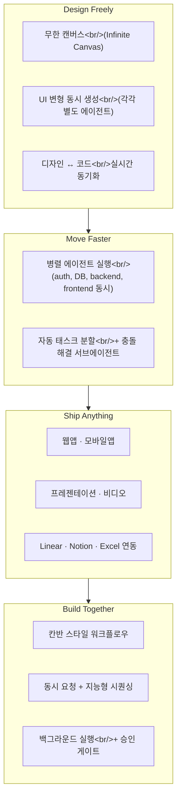

## 개요

Replit이 시리즈 D에서 90억 달러 가치 평가를 받으며 4억 달러를 확보한 직후 **Agent 4**를 출시했다. Agent 2(2025년 2월) → Agent 3(2025년 9월) → Agent 4로 이어지는 진화에서, 이번 버전의 핵심 전환은 "코딩 에이전트"에서 **"크리에이티브 협업 플랫폼"**으로의 패러다임 변화다. 웹앱, 모바일앱, 랜딩 페이지, 프레젠테이션, 데이터 시각화, 심지어 애니메이션 비디오까지 — 코드를 넘어 지식 노동 전반을 다루는 방향으로 확장됐다.

<!--more-->

---

## Agent 3에서 무엇이 달라졌나

Agent 3는 **장시간 자율 운영**에 초점을 맞췄다 — 스스로 테스트하고, 버그를 고치고, 몇 시간이든 독립적으로 돌아가는 에이전트. Agent 4는 방향을 틀었다. 순수한 자율성 대신 **"크리에이티브 제어"**를 강조한다. 에이전트가 조율과 반복 작업을 처리하되, 창의적 판단은 사람이 내리는 구조다.

이 전환은 2026년의 지배적 트렌드 — "코딩 에이전트 → 지식 노동 에이전트" — 와 정확히 맞물린다. OpenAI의 Cowork, Notion의 Custom Agents와 같은 맥락에서 Replit도 순수 코드 생성을 넘어선 것이다.

---

## 4가지 핵심 기둥

### 1. Design Freely — 무한 캔버스

빌드 환경 안에 디자인 캔버스가 통합됐다. 무한 캔버스에서 자유롭게 디자인을 탐색하면서 **여러 UI 변형을 동시에 생성**할 수 있는데, 각 변형은 별도의 에이전트가 처리한다. 가장 인상적인 부분은 디자인과 코드가 실시간으로 동기화된다는 점이다 — 별도의 디자인-투-개발 핸드오프가 없다.

### 2. Move Faster — 병렬 에이전트

Agent 4의 기술적 핵심이다. 인증, 데이터베이스, 백엔드, 프론트엔드 같은 **프로젝트 구성 요소를 여러 에이전트가 동시에 처리**한다. 태스크를 자동으로 작은 단위로 분할하고, 충돌이 발생하면 전용 서브에이전트가 해결한다. 순차 처리 대신 병렬 처리로 전환한 것이 "프로덕션 수준 소프트웨어 10배 빠르게"라는 Replit의 주장의 기반이다.

단, 병렬 에이전트는 현재 **Pro/Enterprise 티어 전용**이며 Core 사용자에게는 일시적으로 제공된다.

### 3. Ship Anything — 코드를 넘어서

하나의 통합 프로젝트에서 웹앱, 모바일앱, 랜딩 페이지, 프레젠테이션, 데이터 시각화, 애니메이션 비디오를 모두 만들 수 있다. Linear, Notion, Excel, Stripe 같은 외부 서비스와의 연동도 지원한다.

Replit CEO Amjad Masad는 Agent 4가 "애플리케이션 하나를 만드는 것이 아니라 회사 전체를 만들고 유지할 수 있다"고 했다 — 피치 덱, 애니메이션 로고, 결제 연동까지 한 플랫폼에서 처리하겠다는 비전이다.

### 4. Build Together — 칸반 워크플로우

기존의 순차적 채팅 스레드를 **태스크 기반 칸반 워크플로우**로 대체했다. 여러 팀원이 동시에 요청을 제출하면 에이전트가 지능형 시퀀싱으로 처리한다. 백그라운드에서 실행되다가 병합 전에 승인 게이트를 거치는 구조다.

---

## Agent 3 vs Agent 4 비교

| 항목 | Agent 3 (2025.09) | Agent 4 (2026.03) |
|------|-------------------|-------------------|
| 핵심 철학 | 장시간 자율 운영 | 크리에이티브 협업 |
| 디자인 | 별도 도구 필요 | 무한 캔버스 내장 |
| 에이전트 실행 | 순차 (단일) | 병렬 (다중) |
| 작업 범위 | 코드 중심 | 앱 + 슬라이드 + 비디오 |
| 팀 워크플로우 | 채팅 스레드 | 칸반 + 승인 게이트 |
| 외부 연동 | 제한적 | Linear, Notion, Stripe 등 |
| 가격 | 유료 플랜 | Core 이상 (병렬은 Pro+) |

---

## 빠른 링크

- [Replit 공식 블로그 — Introducing Agent 4](https://blog.replit.com/introducing-agent-4-built-for-creativity) — 공식 출시 발표
- [Agent 4 제품 페이지](https://replit.com/agent4) — 기능 소개 및 시작하기
- [AINews — Replit Agent 4: The Knowledge Work Agent](https://www.latent.space/p/ainews-replit-agent-4-the-knowledge) — Latent Space 분석

---

## 인사이트

Agent 4에서 가장 주목할 전환은 "자율성의 후퇴"다. Agent 3가 "에이전트가 알아서 다 해준다"를 밀었다면, Agent 4는 "에이전트가 반복 작업을 처리하되 창의적 결정은 사람이 한다"로 방향을 틀었다. 이것은 현재 AI 코딩 도구 시장 전체에서 나타나는 패턴이다 — 완전 자율보다는 **인간-AI 협업의 접점을 어디에 둘 것인가**가 핵심 과제로 부상하고 있다.

병렬 에이전트 아키텍처도 흥미롭다. 인증, DB, 백엔드, 프론트엔드를 동시에 처리하면서 충돌을 서브에이전트가 해결한다는 설계는, [TradingAgents의 멀티에이전트 토론 구조](/posts/2026-03-17-trading-agents/)와 마찬가지로 "여러 에이전트의 협업이 단일 에이전트보다 낫다"는 2026년의 핵심 가설을 공유한다. 다만 "10배 빠르다"는 주장은 실제 사용에서 검증이 필요하다 — 병렬 에이전트 간 충돌 해결 비용이 순차 처리 대비 얼마나 되는지가 관건이다.
