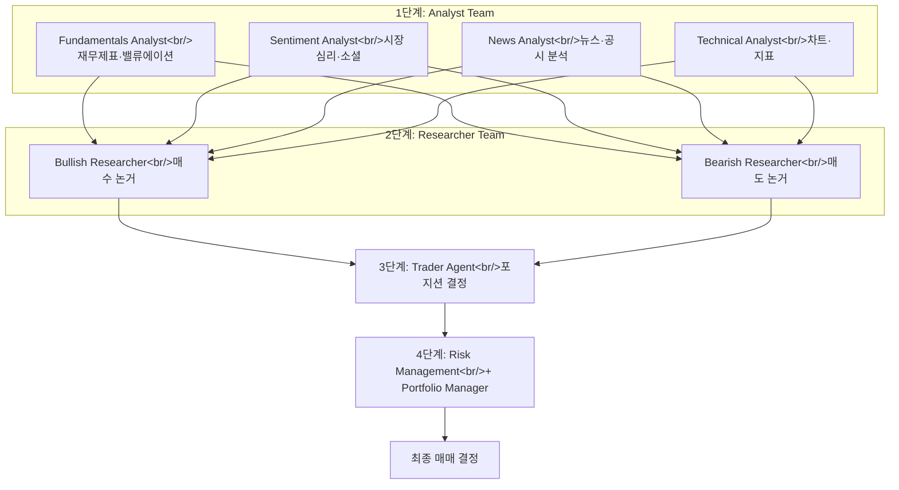

## 개요

> 이전 글: [주식 트레이딩 에이전트 개발기 #2 — Expert Agent Team과 KOSPI200 데이터 삽질기](/posts/2026-03-05-trading-agent-expert-team/)

[#2](/posts/2026-03-05-trading-agent-expert-team/)에서 직접 Expert Agent Team 아키텍처를 구축하면서 느낀 것이 있다 — 멀티에이전트 토론 구조가 단일 LLM보다 훨씬 풍부한 분석을 만들어낸다는 점. 그런데 이 아이디어를 본격적으로 프레임워크화한 프로젝트가 있었다. [TradingAgents](https://github.com/TauricResearch/TradingAgents)는 2026년 3월 기준 32,395개 스타를 기록하고 있는 멀티에이전트 트레이딩 프레임워크로, 실제 트레이딩 펌의 조직 구조를 LLM 에이전트로 모사한다.

<!--more-->

---

## TradingAgents 아키텍처

### 4단계 파이프라인

TradingAgents의 파이프라인은 실제 증권사 리서치팀의 의사결정 흐름을 따른다. arXiv 논문 [2412.20138](https://arxiv.org/abs/2412.20138)로 학술적 근거를 갖추고 있으며, 별도로 Trading-R1 기술 보고서도 공개됐다.



**Analyst Team**은 4명의 전문 분석가로 구성된다. Fundamentals Analyst는 재무제표와 밸류에이션을, Sentiment Analyst는 시장 심리와 소셜 데이터를, News Analyst는 뉴스와 공시를, Technical Analyst는 차트 패턴과 기술적 지표를 담당한다. 각 에이전트는 독립적으로 보고서를 작성한다.

**Researcher Team**은 Bullish와 Bearish 두 명의 연구원이 분석가 보고서를 바탕으로 매수·매도 논거를 구성하고 **토론**한다. 이 단계가 TradingAgents의 핵심 차별점이다 — 단순히 정보를 모으는 게 아니라, 상반된 시각을 의도적으로 충돌시킨다. [#2](/posts/2026-03-05-trading-agent-expert-team/)에서 직접 구현한 Expert Team과 비교하면, TradingAgents는 토론 라운드를 여러 번 반복하며 합의에 도달하는 구조가 추가되었다.

**Trader Agent**는 분석가·연구원 보고서를 종합해 실제 포지션 결정을 내린다. 마지막으로 **Risk Management**와 **Portfolio Manager**가 최종 승인 단계를 담당한다.

### 우리 시스템과의 비교

[#2](/posts/2026-03-05-trading-agent-expert-team/)에서 구축한 Expert Agent Team은 4명의 전문가 + Chief Analyst 구조였다. TradingAgents와 비교하면:

| 항목 | 우리 시스템 (#2) | TradingAgents |
|------|-----------------|---------------|
| 분석 에이전트 | 4명 (동일) | 4명 (동일) |
| 토론 구조 | Chief Analyst 종합 | Bullish vs Bearish 토론 |
| 리스크 관리 | 없음 | Risk Management + Portfolio Manager |
| 데이터 소스 | KIS API + NAVER Finance | Alpha Vantage + 뉴스 API |
| LLM | Claude API | GPT-5.4, Gemini 3.1, Claude 4.6 등 |
| 한국 시장 | KOSPI200 직접 지원 | 미지원 |

핵심 차이는 **Bullish vs Bearish 토론 구조**와 **리스크 관리 레이어**다. 우리 시스템은 Chief Analyst가 의견을 종합하지만, TradingAgents는 상반된 입장을 명시적으로 충돌시킨 뒤 Trader가 판단한다. 이 구조가 더 풍부한 분석을 만들어낼 수 있지만, API 호출 비용도 그만큼 증가한다.

---

## 빠른 시작

```bash
git clone https://github.com/TauricResearch/TradingAgents.git
cd TradingAgents
pip install -r requirements.txt
```

```python
from tradingagents.graph.trading_graph import TradingAgentsGraph
from tradingagents.default_config import DEFAULT_CONFIG

ta = TradingAgentsGraph(debug=True, config=DEFAULT_CONFIG)
_, decision = ta.propagate("NVDA", "2024-05-10")
print(decision)
```

`propagate()` 호출 하나로 전체 파이프라인이 실행된다. 티커 심볼과 날짜만 넘기면 Analyst Team 전체가 병렬로 보고서를 작성하고, Researcher Team의 토론을 거쳐 Trader의 최종 결정이 반환된다.

### LLM 프로바이더 교체

v0.2.1에서 GPT-5.4, Gemini 3.1, Claude 4.6, Grok 4.x, Ollama를 모두 지원한다. 설정 파일에서 교체 가능:

```python
config = DEFAULT_CONFIG.copy()
config["llm_provider"] = "anthropic"
config["deep_think_llm"] = "claude-sonnet-4-6"
config["quick_think_llm"] = "claude-haiku-4-6"
```

특정 모델에 lock-in되지 않는다는 점이 실무 도입에서 중요한 장점이다. 우리 시스템은 Claude API에 묶여 있었는데, TradingAgents의 프로바이더 추상화 레이어를 참고할 만하다.

---

## 실전 배포 전 고려사항

논문과 기술 보고서에서 제시하는 백테스트 결과는 인상적이다. 그러나 실전 배포 전에 몇 가지 고려사항이 있다.

**API 비용**: 에이전트 간 토론 라운드가 많아질수록 API 비용이 급격히 증가한다. 분석 1회에 수십 번의 LLM 호출이 발생할 수 있다.

**환각 리스크**: LLM은 환각(hallucination)을 일으킨다 — 특히 구체적인 수치나 날짜를 다룰 때. 사실 검증 레이어가 없으면 잘못된 정보가 투자 결정에 반영될 수 있다. 이 점에서 [stock-analysis-agent의 "Blank beats wrong" 원칙](/posts/2026-03-16-stock-analysis-agent/)이 좋은 참고가 된다.

**주문 집행 미포함**: 오픈소스 프레임워크이므로 실제 주문 집행(order execution) 레이어는 별도로 구현해야 한다. 우리 시스템처럼 KIS API 연동이 필요하다.

**한국 시장 미지원**: KOSPI200이나 DART 공시를 다루려면 추가 개발이 필요하다. 이 부분은 우리 시스템의 강점이다.

---

## 다음 단계

TradingAgents의 Bullish vs Bearish 토론 구조와 리스크 관리 레이어는 우리 시스템에 도입할 가치가 있다. 특히:

1. **Chief Analyst → 토론 구조로 전환**: 단순 종합 대신 상반된 입장의 명시적 충돌
2. **Risk Management 레이어 추가**: 포트폴리오 전체 맥락에서의 리스크 체크
3. **LLM 프로바이더 추상화**: Claude 외 다른 모델도 실험할 수 있는 구조

TradingAgents 프레임워크를 직접 fork해서 KIS API와 DART 데이터를 연동하는 것도 하나의 방향이다. 기본 아키텍처는 이미 검증됐으니, 한국 시장 특화 레이어만 올리면 된다.

---

## 빠른 링크

- [TauricResearch/TradingAgents](https://github.com/TauricResearch/TradingAgents) — 멀티에이전트 트레이딩 프레임워크 (32K stars)
- [arXiv 논문 2412.20138](https://arxiv.org/abs/2412.20138) — 학술적 근거
- [stock-analysis-agent 포스트](/posts/2026-03-16-stock-analysis-agent/) — Claude Code 기반 실전 분석 도구 (이전 포스트)
- [#2 Expert Agent Team](/posts/2026-03-05-trading-agent-expert-team/) — 시리즈 이전 글

## 인사이트

TradingAgents를 살펴보면서 느낀 것은, 멀티에이전트 토론 구조의 핵심 가치가 "더 많은 정보"가 아니라 **"반대 의견의 구조화"**라는 점이다. Bullish와 Bearish가 동일한 데이터를 놓고 정반대의 해석을 제시하면, 투자자는 양쪽 논거를 모두 본 상태에서 판단할 수 있다. 이것은 확증 편향(confirmation bias)에 빠지기 쉬운 단일 LLM 분석의 근본적 한계를 구조적으로 극복하는 방법이다.

32,000개 스타는 이 아이디어에 대한 커뮤니티의 공감을 보여준다. LLM 기반 금융 분석은 이미 "가능한가"의 단계를 넘어 "어떻게 신뢰할 수 있게 만들 것인가"의 단계로 진입했다.
