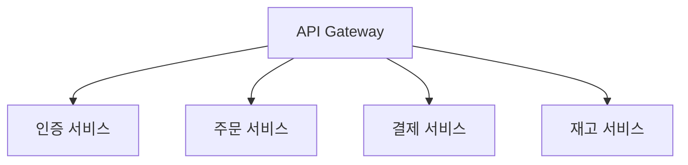
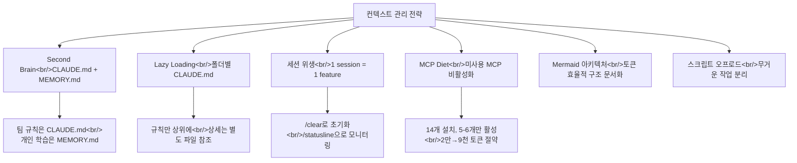
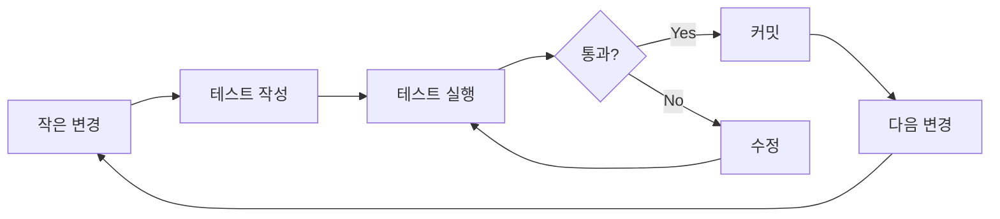
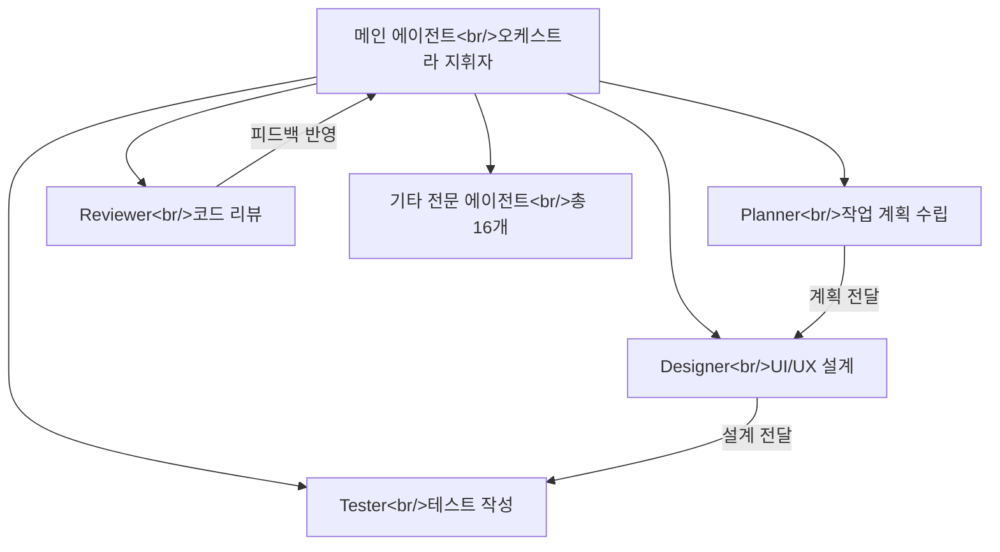

## 개요

Claude Code를 설치하고 기본 사용법을 익힌 뒤에도, "왜 나는 남들만큼 효과를 못 보지?"라는 의문이 드는 경우가 많다. 대화가 길어지면 Claude가 점점 멍청해지고, 같은 실수를 반복하고, 코드를 수정하다가 다른 곳이 망가진다. 이런 문제의 대부분은 **컨텍스트 관리와 워크플로우**의 문제다.

이 글에서는 두 편의 영상을 기반으로 실전에서 바로 적용할 수 있는 전략과 패턴을 정리한다. 첫 번째는 메타 엔지니어가 정리한 [컨텍스트 관리와 실전 워크플로우 20분 총정리](https://www.youtube.com/watch?v=DCsv0rKKrN4)로, Second Brain 구축부터 WAT 프레임워크까지 다룬다. 두 번째는 Anthropic 해커톤 우승자 Afan Mustafa의 [Claude Code 10가지 꿀팁](https://www.youtube.com/watch?v=QhZJyg47JW0)으로, GitHub 스타 7만 이상을 달성한 10개월간의 실전 노하우를 초급-중급-고급 단계로 풀어낸다.

두 영상의 핵심 메시지는 같다. **Claude Code의 성능은 얼마나 좋은 컨텍스트를 주느냐에 달려 있고, 그 컨텍스트를 체계적으로 관리하는 시스템이 곧 생산성이다.**

<!--more-->

## 컨텍스트 관리의 핵심 원칙

### Second Brain — 지식을 구조화하라

Claude Code와 작업하면서 발견한 패턴, 해결책, 의사결정 이유를 로컬 markdown 파일에 기록해두는 전략이다. 메타 엔지니어는 프로젝트 의사 결정 기록 문서를 만들어 목차별로 개발 중 마주한 패턴, 해결책, 의사 결정 이유를 정리해두었다. 다음에 비슷한 작업을 할 때 Claude에게 이 파일만 읽히면 된다.

이전에는 이 문서를 수동으로 관리했지만, 현재는 `/memory` 명령으로 자동화되었다. Claude가 작업하면서 자동으로 학습한 내용 — 빌드 명령, 디버깅 인사이트, 코드 패턴 — 을 `MEMORY.md`에 저장하고, 매 세션 시작 시 자동으로 로드한다. "기억해줘"라고 말하면 저장되고, `/memory`로 확인하거나 편집할 수 있다.

| 파일 | 역할 | 범위 | 관리 방식 |
|------|------|------|-----------|
| `CLAUDE.md` | 팀 공유 규칙, 코딩 컨벤션, 아키텍처 결정 | 프로젝트 전체 | 수동 |
| `MEMORY.md` | 개인 선호, 반복 실수 패턴, 학습 내용 | 개인 | 자동 (`/memory`) |
| `TODO.md` | 세션 간 작업 연속성 유지 | 세션 단위 | 수동 + AI 협업 |

핵심은 **CLAUDE.md에 모든 것을 넣지 않는 것**이다. 개인 메모리는 `MEMORY.md`로, 팀 공유 지식은 `CLAUDE.md`로 분리하는 것을 추천한다.

### Lazy Loading — 필요할 때만 로드하라

사람들이 하는 흔한 실수가 API 스펙, DB 스키마, 코딩 컨벤션, 아키텍처 문서를 전부 CLAUDE.md 하나에 몰아넣는 것이다. 문제는 CLAUDE.md가 매 세션마다 자동으로 로드된다는 점이다. API 엔드포인트 50개, DB 테이블 스키마 30개가 들어 있다면 매번 수천 토큰이 날아간다. 정작 작업에 필요한 건 그중 5%도 안 된다.

**나쁜 예** — CLAUDE.md에 API 엔드포인트 50개를 모두 포함:

```markdown
# CLAUDE.md
## API Endpoints
POST /api/users ...
GET /api/users/:id ...
(50개 엔드포인트 전부 나열)
```

**좋은 예** — CLAUDE.md에는 참조만 두고, 상세는 별도 파일로 분리:

```markdown
# CLAUDE.md
## 참조 문서
- API 스펙: docs/api-spec.md
- DB 스키마: docs/db-schema.md
- 아키텍처: docs/architecture.md
```

이 전략을 사용하면 **Lazy Loading**이 된다. "DB 스키마 업데이트 해줘"라고 하면 Claude가 CLAUDE.md에서 `docs/db-schema.md` 파일만 읽고 작업을 수행한다. 다른 API 스펙이나 프론트엔드 아키텍처 문서는 로드하지 않는다. Afan Mustafa는 이를 **Progressive Disclosure**라고 표현했다 — 회사에서 신입에게 업무 매뉴얼을 통째로 주는 것보다 목차만 주고 필요할 때 찾아보라고 하는 것이 낫다.

루트 CLAUDE.md가 커지는 것이 걱정된다면 **폴더별 CLAUDE.md**를 따로 만들면 된다:

```
project/
├── CLAUDE.md              # 전체 규칙 (간결하게)
├── apps/api/
│   └── CLAUDE.md          # API 서버 전용 규칙
├── web/
│   └── CLAUDE.md          # 프론트엔드 전용 규칙
├── supabase/
│   └── CLAUDE.md          # DB 관련 규칙
└── docs/
    └── architecture.md    # Mermaid 다이어그램 포함
```

특정 폴더에서 작업할 때 해당 폴더의 CLAUDE.md만 자동으로 로드된다. 루트 CLAUDE.md의 비대화를 막으면서 컨텍스트 오염도 방지할 수 있다.

### 아키텍처를 Mermaid 다이어그램으로 정리하라

매번 시스템 구조를 말로 설명하는 대신 **Mermaid 다이어그램**으로 아키텍처를 정리하면 Claude가 훨씬 빠르게 이해하고 컨텍스트도 효율적으로 저장된다.



이런 다이어그램을 `docs/architecture.md` 같은 별도 파일에 기능별로 정리해두고 CLAUDE.md에서 참조하면, Lazy Loading과 결합하여 Claude가 필요한 아키텍처만 읽고 기능을 짤 수 있다. 자연어로 설명하는 것보다 토큰 효율이 훨씬 높다.

### 세션 위생 — 하나의 세션, 하나의 기능

컨텍스트 윈도우는 200K 토큰이 한계다. 많아 보이지만 실제로 쓰다 보면 생각보다 금방 찬다. Afan Mustafa는 이를 **"Context is milk"**라고 표현했다 — 시간이 지나면 상한다. 대화가 길어질수록 앞에서 나눈 내용이 흐릿해진다.

핵심 원칙:

- **한 세션 = 한 기능**. "결제 시스템 전체 만들어줘"가 아니라 "Stripe webhook handler 구현해줘" 단위로 쪼개야 한다. 로그인 기능 구현이 끝났다면 `/clear`로 초기화하거나 아예 새 세션을 시작하고 다음 기능으로 넘어간다
- **적절한 시점에 `/compact`**를 실행한다. 자동 압축에만 맡기면 중요한 맥락이 날아갈 수 있다. 큰 기능 하나를 완성했을 때, 또는 작업 방향이 바뀔 때 한 번씩 실행하면 중요한 맥락은 살리면서 불필요한 내용만 정리해준다
- **/statusline**으로 현재 토큰 사용량을 상시 모니터링한다. 자동차 운전할 때 연료 게이지가 없으면 불안한 것처럼, 눈에 보여야 관리가 된다

**핵심 원칙은 "신선한 컨텍스트가 부풀어진 컨텍스트보다 낫다"**이다. 이전 대화에 집착하지 말고, 매 작업마다 깨끗한 세션으로 시작하는 것이 오히려 더 좋은 결과를 만든다.

### MCP 다이어트 — 사용하지 않는 도구는 끄라

MCP를 여러 개 연결하면 도구 설명만으로 토큰을 크게 소비한다. Afan Mustafa의 실제 설정을 보면 **MCP를 14개나 설치**해두었지만 동시에 켜놓는 건 **5~6개**뿐이다. 나머지는 필요할 때만 켠다.

시스템 프롬프트가 약 **2만 토큰**까지 차지할 수 있는데, 안 쓰는 MCP를 꺼두면 **9,000 토큰**으로 반 이상 줄일 수 있다. 너무 많이 켜두면 Claude가 쓸 수 있는 컨텍스트 공간이 200K에서 **7만 토큰까지** 줄어들 수 있다.

두 영상 모두 같은 조언을 한다:

1. `/mcp`로 현재 활성화된 MCP를 확인한다
2. 지금 작업에 안 쓰는 MCP는 비활성화한다
3. 특히 **Notion, Linear 같은 MCP는 도구 설명이 매우 커서** 토큰을 크게 잡아먹는다
4. 자주 쓰는 기능만 골라서 **커스텀 MCP**를 만들어 쓴다. 필요한 엔드포인트만 래핑하면 토큰 절약은 물론 응답 품질도 올라간다



### 무거운 작업은 스크립트로 오프로드하라

무거운 데이터 처리를 대화 안에서 시키면 컨텍스트가 오염된다. 10만 행짜리 CSV를 파싱해야 하는 DB 마이그레이션을 예로 들면, Claude가 그 10만 행을 읽어야 하고, 모두 컨텍스트에 저장해야 하고, 처리해야 한다. 이 과정에서 컨텍스트가 오염되고 품질이 떨어진다.

대신 이렇게 한다:

1. Claude에게 CSV를 파싱하는 **DB 마이그레이션 스크립트를 작성**해 달라고 한다
2. Claude에게 그 스크립트를 **실행**하게 한다
3. 스크립트가 처리한 **결과(JSON 등)만** Claude가 받아서 다음 작업을 진행한다

Claude는 10만 행의 CSV를 직접 읽을 필요가 없다. 스크립트가 처리한 결과값만 받으면 된다. 무거운 데이터는 스크립트로, 결과 요약만 Claude가 받으면 컨텍스트가 깨끗하게 유지된다.

## 실전 워크플로우 패턴

### Plan 모드 — 먼저 설계하고, 그 다음 구현하라

두 영상 모두 **Plan 모드를 먼저 실행하라**고 강조한다. Afan은 "건축할 때 설계도 없이 벽돌부터 쌓지 않는 것처럼"이라고 비유했다. 플랜 없이 바로 실행하면 Claude가 엉뚱한 방향으로 코드를 대량 수정해버리는 참사가 발생할 수 있다. 컨텍스트도 낭비되고, 사용량(usage)도 낭비된다.

구체적인 실전 워크플로우:

1. **Plan 모드**에서 Claude에게 작업을 설명한다
2. Claude가 계획을 제시한다 — 어떤 파일을 수정해야 하고, 어떤 접근을 해야 하는지
3. **계획을 리뷰**하고 피드백을 준다. 계획이 틀렸다면 수정 방향을 알려주고, 다른 옵션을 원한다면 대안을 요청한다
4. 만족스러운 계획이 나오면 **Accept 모드로 전환**하여 실행한다
5. 완료되면 `/clear` 후 다음 단계로 넘어간다

**핵심은 플랜을 짜는 세션과 구현하는 세션을 분리하는 것이다.**

### Thinking 프로세스를 반드시 읽어라

Claude가 사고하는 과정(thinking)을 무시하면 안 된다. Claude가 "이 함수는 X를 하는 것 같으니까 이걸 하겠다"라며 가정을 세우는 순간이 있는데, **그 가정이 틀릴 때가 있다**. 그 순간에 `Escape`로 바로 중단시키고 가정을 수정해줘야 한다. 잘못된 가정 위에 쌓인 코드는 전부 쓸모없다. **초반에 잡는 것이 핵심**이다.

### Cross-AI 비평

메타 엔지니어가 유용하게 쓰는 팁이다. Claude의 플랜을 **ChatGPT나 Gemini에게 보여주고 비평**을 받는다.

> "이 대화를 분석해서 Claude가 놓치고 있는 거나 잘못된 접근이 있으면 지적해줘"

각 AI 모델이 정말 다른 시선으로 문제를 정의하고 다른 솔루션을 제시하는 것을 볼 수 있다. 여기서 한 단계 더 나아가면, 이 과정 자체를 **커스텀 스킬로 자동화**할 수 있다. 예를 들어 `with-multiple-ai`라는 스킬을 만들면 한 AI 모델의 플랜을 다른 AI에게 전달하고, 피드백을 취합해서 요약을 보여주는 워크플로우를 자동화할 수 있다.

### TDD 기반 스마트 코딩

AI가 만든 코드를 사람이 꼼꼼히 보기 어렵기 때문에, **작은 단위의 TDD 루프**가 필수적이다.



- 변경 단위를 작게 유지한다
- 매 변경 후 **테스트를 작성하고 실행**한다
- 통과하면 **바로 커밋**한다. 문제가 생겨도 마지막 커밋으로 돌아가면 되니까 디버깅이 훨씬 쉬워진다
- 에러가 발생하면 **로그를 해석하지 말고 통째로 붙여넣는다** — 사람이 해석해서 정보를 빠뜨리거나 잘못된 정보를 줄 수 있다. Claude는 스택트레이스 분석에 매우 뛰어나므로 원본 그대로 주는 것이 가장 좋다

### TODO.md로 작업 연속성 유지

AI는 오늘 할 일, 내일 할 일, 모레 할 일을 우리처럼 다 알고 있지 않다. **TODO.md를 프로젝트 시작부터 끝까지 하나의 파일에서 관리**하면서 AI와 공유하는 것이 핵심이다.

실전 워크플로우:

1. 오늘 할 일을 정리한다 — 결제 구현, 랜딩 페이지 다듬기, 구독 시스템, 버그 1번·2번 수정
2. `TODO.md`에 체크리스트로 작성한다
3. Claude에게 "TODO.md 파일부터 시작해줘"라고 지시한다
4. **Agent Teams** 기능으로 여러 태스크를 병렬 처리한다
5. 세션 종료 시 "TODO.md에 업데이트해줘"라고 말하면 진행 상황이 자동으로 반영된다

이렇게 하면 여러 세션에 걸쳐서 **작업의 연속성을 유지**할 수 있다.

### WAT Framework

NetworkChuck가 제안한 **WAT(Workflow-Agent-Tools)** 프레임워크는 Claude Code 프로젝트 관리의 구조를 잡는 틀이다. 메타 엔지니어도 실제로 써보고 나쁘지 않았다고 한다.

- **W (Workflow)** — 작업의 흐름과 단계를 plain English로 명확하게 정의한다. 코드를 쓰기 전에 이 작업이 어떤 단계로 이루어져야 하는지를 글로 적는다
- **A (Agent)** — 각 단계를 수행할 에이전트를 배치한다. Self-healing 메커니즘이 핵심이다 — 에러가 나면 스스로 로그를 읽고, 원인을 파악하고, 코드를 수정하고, 다시 실행한다. 에이전트들로 역할을 분리해서 병렬 처리하면 10분 걸릴 작업을 3~4분에 끝낼 수 있다
- **T (Tools)** — 거대한 스크립트 하나보다 **작은 단위의 스크립트 여러 개**가 훨씬 낫다. `deploy-all.sh` 대신 원잡(one-job) 단위로 쪼개야 한다. Claude가 스크립트 실행 중 실패했을 때 작은 스크립트 하나를 디버깅하는 것이 훨씬 효율적이다

**구체적 예시 — 블로그에 댓글 기능 추가하기:**

```
W (Workflow):
  1. comments 테이블 스키마 설계 및 마이그레이션
  2. API 엔드포인트 구현
  3. 프론트엔드 UI 구현
  4. 각 단계마다 테스트 작성 및 통과 확인

A (Agent):
  - Claude가 코디네이터로서 에이전트들에게 작업 분배
  - API 구현하는 동안 다른 서브에이전트가 테스트를 미리 설계
  - 에러 발생 시 self-healing으로 자동 복구

T (Tools):
  - scripts/migrate.sh → DB 마이그레이션 실행
  - MCP GitHub → PR 자동 생성
  - Hooks → 커밋마다 테스트 자동 실행
```

이 프레임워크의 핵심은 **AI의 추론과 코드 실행을 분리**하는 것이다. Claude에게 생각하게 하고, 실행은 별도 도구나 스크립트에 맡기면 복잡한 워크플로우도 안정적으로 관리할 수 있다.

### 모델 선택 전략

모든 작업에 Opus를 쓸 필요는 없다. Afan Mustafa는 식당 비유를 들었다 — 간단한 식사에 코스 요리를 시키진 않는 것처럼.

| 모델 | 적합한 작업 | 비유 |
|------|------------|------|
| **Haiku** | 파일 찾기, 간단한 수정, 포맷 변경 | 간단한 식사 |
| **Sonnet** | 여러 파일 동시 수정, 일반 코딩, 버그 수정 | 일반 식사 |
| **Opus** | 전체 구조 설계, 복잡한 버그, 멀티파일 리팩토링 | 코스 요리 |

**레퍼런스 코드를 같이 주는 것**도 중요하다. Claude에게 뭔가 만들어달라고 할 때 비슷한 오픈소스 코드를 같이 보여주면 결과물의 품질이 확연히 달라진다. 미술 시간에 빈 종이에 그리라는 것과 참고 작품을 보고 그리라는 건 완전히 다르다.

## 고급 활용: 서브에이전트와 자동화

### 서브에이전트 — 전문화된 16개의 에이전트

Afan Mustafa의 시스템에는 **16개의 전문 서브에이전트**가 있다. 오케스트라 지휘자가 직접 모든 악기를 연주하지 않듯이, 각 에이전트에게 할 일을 하나씩만 주고 결과물을 다음 에이전트에게 넘기는 방식이다.



서브에이전트를 활용하면 각 역할의 컨텍스트를 독립적으로 유지할 수 있고, 메인 에이전트가 오케스트레이션만 담당하므로 복잡한 프로젝트도 체계적으로 진행할 수 있다.

### Git Worktrees — 병렬 작업의 핵심

보통은 하나의 작업이 끝나야 다음을 시작하지만, `git worktree`를 사용하면 같은 프로젝트에서 **여러 작업 폴더를 동시에** 만들 수 있다. 사무실에서 책상 하나로 일하던 것을 **책상 5개 놓고 동시에 진행**하는 것과 같다.

```bash
# worktree 생성
git worktree add ../project-feature-a feature-a
git worktree add ../project-feature-b feature-b

# 각 worktree에서 독립적인 Claude Code 세션 실행
cd ../project-feature-a && claude
cd ../project-feature-b && claude
```

각 폴더에서 Claude를 따로 실행하면 에이전트 5개가 동시에 다른 기능을 개발한다. 서로 충돌하지 않는 기능이라면 동시에 개발을 진행하고, 완료 후 main에 머지하는 방식이다.

### Hooks — 자동 학습 시스템

Claude Code의 Hook 기능은 **알람 시계**와 같다. 특정 시점에 자동으로 실행되는 명령어를 설정할 수 있다.

| Hook | 타이밍 | 활용 예시 |
|------|--------|----------|
| `session_start` | 새 대화 시작 시 | 지난 기록 자동 불러오기, TODO.md 로드 |
| `pre_compact` | 컨텍스트 압축 전 | 중요 내용을 MEMORY.md에 먼저 저장 |
| `stop` | 대화 종료 시 | 이번 세션에서 배운 것을 자동 기록 |

이 세 개를 조합하면 **Claude가 대화가 끝나도 배운 것을 기억하는 시스템**이 된다. 매번 수동으로 컨텍스트를 설정하는 수고를 줄이고, Claude가 프로젝트에 대해 점점 더 많이 "기억"하게 된다.

### 보안 주의사항

Afan Mustafa가 강조한 주의사항도 빠뜨릴 수 없다:

1. **MCP를 너무 많이 켜지 마라** — 컨텍스트 공간이 크게 줄어든다
2. **자동 압축만 믿지 마라** — 중요한 맥락이 날아갈 수 있다
3. **보안에 신경 써라** — Claude가 외부 데이터를 읽을 때 악의적인 명령이 숨어 있을 수 있다. 이를 **Prompt Injection**이라 하며, Afan의 가이드에는 이를 자동으로 감지하는 보안 도구도 포함되어 있다

## 빠른 링크

- [메타 엔지니어의 클로드코드 완벽 가이드 — 실전편](https://www.youtube.com/watch?v=DCsv0rKKrN4) — 컨텍스트 관리, TDD 워크플로우, WAT 프레임워크, Cross-AI 비평
- [Claude Code 10가지 꿀팁 — Anthropic 해커톤 우승자](https://www.youtube.com/watch?v=QhZJyg47JW0) — Progressive Disclosure, 시스템 프롬프트 다이어트, 서브에이전트, Git Worktrees, Hooks

## 인사이트

두 영상을 관통하는 인사이트는 **"Claude Code는 도구가 아니라 시스템이다"**라는 점이다. 단순히 프롬프트를 잘 쓰는 것을 넘어, 지식 관리(CLAUDE.md, MEMORY.md), 세션 설계(Plan-Implement 분리, `/clear`), 도구 최적화(MCP Diet), 자동화(Hooks, 서브에이전트)까지 아우르는 **개발 시스템**을 구축해야 한다.

특히 인상적인 것은 두 영상의 출발점이 다른데도 결론이 수렴한다는 점이다. 메타 엔지니어는 대규모 팀 환경에서, Afan Mustafa는 개인 해커톤 프로젝트에서 출발했지만, 둘 다 **컨텍스트 효율성**과 **작업 단위의 분리**를 최우선으로 꼽는다. 이는 Claude Code의 컨텍스트 윈도우라는 물리적 제약이 만들어낸 자연스러운 수렴이다.

실천 우선순위를 정한다면: 먼저 **CLAUDE.md를 정리하고 폴더별로 분리**하라. 그 다음 **Plan 모드를 습관화**하라. 그리고 **TODO.md로 세션 간 연속성을 확보**하라. 마지막으로 **서브에이전트와 Hooks로 자동화를 확장**하라. 한 번에 모두 적용하려 하지 말고, 한 단계씩 워크플로우에 녹여가는 것이 핵심이다.
