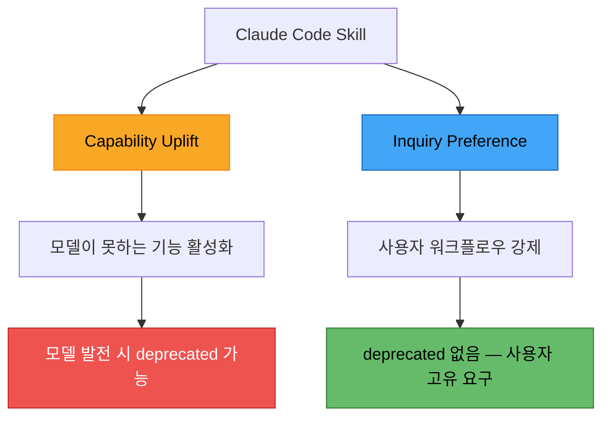
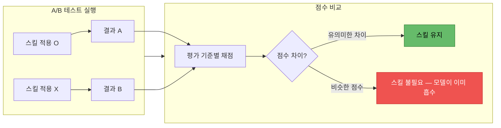
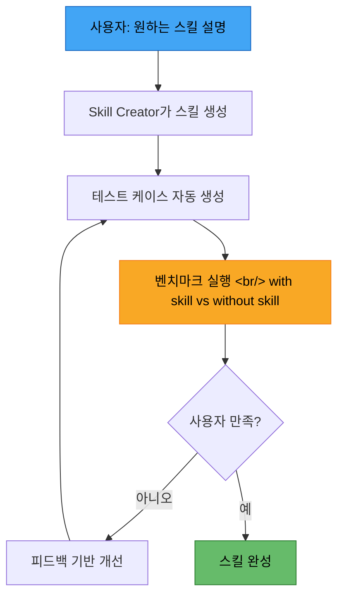

## 개요

Anthropic이 Claude Code Skills의 대규모 업데이트를 발표했다. 가장 눈에 띄는 변화는 **빌트인 벤치마킹 시스템**의 도입이다. 스킬이 실제로 결과물의 품질을 높이는지 A/B 테스트 방식으로 수치화할 수 있게 되었고, Skill Creator V2가 테스트 케이스 생성부터 반복 개선까지 전 과정을 자동화한다. 새로운 프론트매터 옵션들도 추가되어 스킬의 실행 방식을 세밀하게 제어할 수 있다.

<!--more-->

## 스킬의 두 가지 분류: Capability Uplift vs Inquiry Preference

Anthropic은 공식적으로 스킬을 두 가지 범주로 나누었다.

### Capability Uplift Skills

모델이 기본적으로 할 수 없는 일을 가능하게 만드는 스킬이다. 특정 API 호출 패턴이나 외부 도구 연동 등이 여기에 해당한다. 이 유형의 스킬은 **모델이 발전하면 불필요해질 수 있다**. 모델 자체가 해당 능력을 흡수하면 스킬 없이도 동일한 결과를 낼 수 있기 때문이다.

### Inquiry Preference Skills

사용자의 특정 워크플로우나 선호도를 강제하는 스킬이다. 예를 들어 "응답을 항상 한국어로 작성하라", "PR 리뷰 시 반드시 보안 체크리스트를 따르라" 같은 규칙들이다. 이 유형은 모델이 아무리 발전해도 **사용자 고유의 요구사항이므로 deprecated될 일이 없다**.

이 분류가 중요한 이유는 바로 다음에 설명할 **벤치마킹 시스템** 때문이다. Capability Uplift 스킬은 벤치마크 결과에 따라 퇴역 여부를 판단할 수 있다.

## 벤치마킹 시스템: 스킬의 가치를 수치로 증명하다

V2의 핵심 기능이다. 스킬이 실제로 결과물의 품질을 높이는지 **정량적으로 측정**할 수 있는 빌트인 평가 시스템이 추가되었다.

### 작동 방식

**Multi-agent 지원**으로 A/B 테스트를 동시에 실행할 수 있다. 스킬이 적용된 에이전트와 적용되지 않은 에이전트가 동일한 태스크를 수행하고, 결과를 평가 기준에 따라 비교한다.

### 자동 생성되는 평가 기준 예시

Skill Creator가 소셜 미디어 포스트 생성 스킬을 만들 때 자동으로 생성한 7가지 평가 기준 사례:

| # | 평가 기준 | 설명 |
|---|----------|------|
| 1 | Platform coverage | 지정된 플랫폼별 포스트가 모두 생성되었는가 |
| 2 | Language match | 요청한 언어로 작성되었는가 |
| 3 | X character limit | X(트위터) 글자 수 제한을 준수하는가 |
| 4 | Hashtags | 적절한 해시태그가 포함되었는가 |
| 5 | Factual content | 원본 내용과 사실적으로 일치하는가 |
| 6 | Tone differentiation | 플랫폼별 톤이 적절히 차별화되었는가 |
| 7 | Tone compliance | 지정된 톤 가이드라인을 따르는가 |

스킬 적용 여부에 따라 이 기준들의 점수가 **유의미하게 차이**나면 해당 스킬은 가치가 있는 것이고, **점수가 비슷하면** 모델이 이미 해당 능력을 갖추고 있으므로 스킬이 불필요하다는 뜻이다.

## 스킬 크리에이터 V2: 만들고 평가하고 개선하는 자동화 루프

Skill Creator Skill이 V2로 업그레이드되면서 단순 생성을 넘어 **전체 라이프사이클을 자동화**한다.

### 설치 및 사용

1. `/plugin` 명령 실행
2. "skill creator skill" 검색 후 설치
3. 원하는 스킬을 자연어로 설명
4. 자동으로 스킬 생성 → 테스트 케이스 생성 → 벤치마크 실행 → 결과 확인

### 자동화 루프

기존 스킬의 개선도 가능하다. 이미 만들어진 스킬을 Skill Creator에 넘기면 현재 성능을 벤치마크한 뒤 개선점을 찾아 반복적으로 최적화한다.

**Progressive disclosure guidance**가 내장되어 있어, 스킬 작성 경험이 적은 사용자도 단계적으로 안내받으며 스킬을 완성할 수 있다.

### Implicit Triggering 개선

이전 버전에서는 implicit trigger(슬래시 명령 없이 자동 실행)가 잘 작동하지 않는 문제가 있었다. V2에서는 Skill Creator가 **description 최적화**를 함께 수행하면서 implicit triggering의 정확도가 크게 향상되었다. 스킬의 설명문이 모델이 언제 이 스킬을 호출해야 하는지 더 명확하게 전달하도록 자동으로 다듬어진다.

## 새로운 프론트매터 옵션들

V2에서 추가된 프론트매터 옵션으로 스킬의 동작을 세밀하게 제어할 수 있다.

| 옵션 | 설명 |
|------|------|
| `user_invocable: false` | 모델만 트리거 가능, 사용자가 직접 호출 불가 |
| `user_enable: false` | 사용자가 slash command로 사용 불가 |
| `allow_tools` | 스킬이 사용할 수 있는 도구를 제한 |
| `model` | 스킬을 실행할 모델 지정 |
| `context: fork` | Sub-agent에서 스킬 실행 |
| `agents` | Sub-agent 정의 (`context: fork` 필요) |
| `hooks` | 스킬별 hooks를 YAML 형식으로 정의 |

특히 `context: fork`와 `agents` 조합이 흥미롭다. 스킬 실행을 별도의 sub-agent에 위임하여 메인 컨텍스트를 오염시키지 않고 독립적으로 작업을 수행할 수 있다. 벤치마킹의 multi-agent A/B 테스트도 이 구조 위에서 동작한다.

`user_invocable: false`는 사용자에게 노출하지 않으면서 모델이 내부적으로 판단하여 호출하는 "백그라운드 스킬"을 만들 때 유용하다.

## 빠른 링크

- [Claude Skills V2 업데이트 영상](https://www.youtube.com/watch?v=t81f188Tvec)
- [Claude Code 공식 문서](https://docs.anthropic.com/en/docs/claude-code)
- [Anthropic 공식 사이트](https://www.anthropic.com)

## 인사이트

이번 V2 업데이트의 핵심은 **스킬의 실효성을 객관적으로 측정할 수 있게 된 것**이다.

지금까지 스킬은 "만들면 좋아질 것이다"라는 가정 위에서 운영되었다. 하지만 빌트인 벤치마킹의 도입으로 스킬이 실제로 결과물의 품질을 높이는지, 아니면 모델이 이미 충분히 잘하는 영역에 불필요한 프롬프트를 추가하는 것인지 수치로 판단할 수 있게 되었다.

**Capability Uplift vs Inquiry Preference** 분류도 실용적이다. 모든 스킬을 동일하게 취급하지 않고, 모델 발전에 따라 자연스럽게 퇴역시킬 스킬과 영구적으로 유지할 스킬을 구분하는 프레임워크를 제공한다.

Skill Creator V2가 생성-평가-개선 루프를 자동화한 것도 진입 장벽을 크게 낮춘다. 스킬 작성 자체가 프롬프트 엔지니어링의 영역이었는데, 이제는 "무엇을 원하는지"만 말하면 최적화된 스킬이 벤치마크 검증까지 마친 상태로 완성된다. 스킬 생태계가 양적으로도 질적으로도 빠르게 성장할 것으로 보인다.
