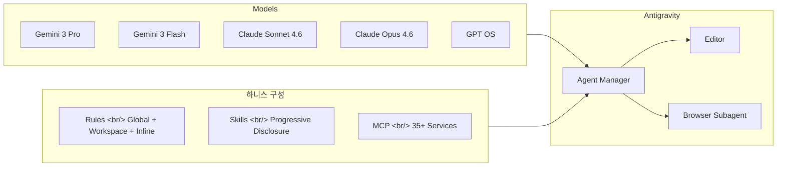
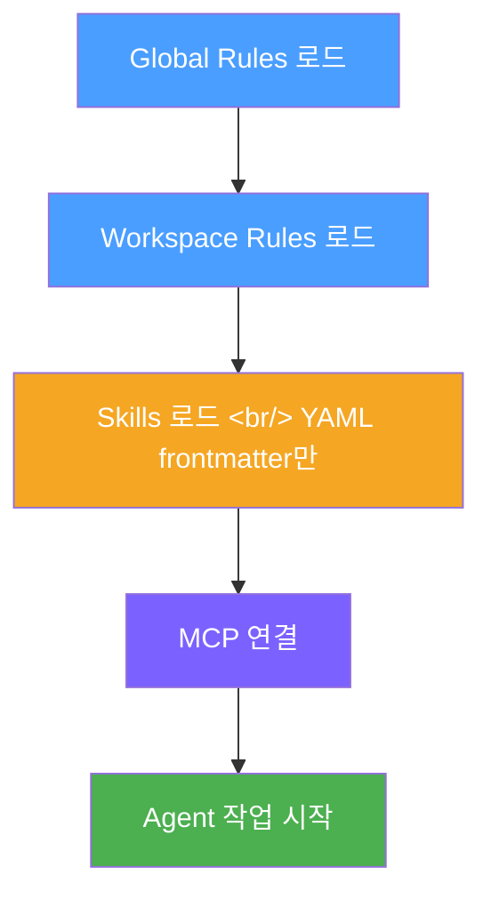
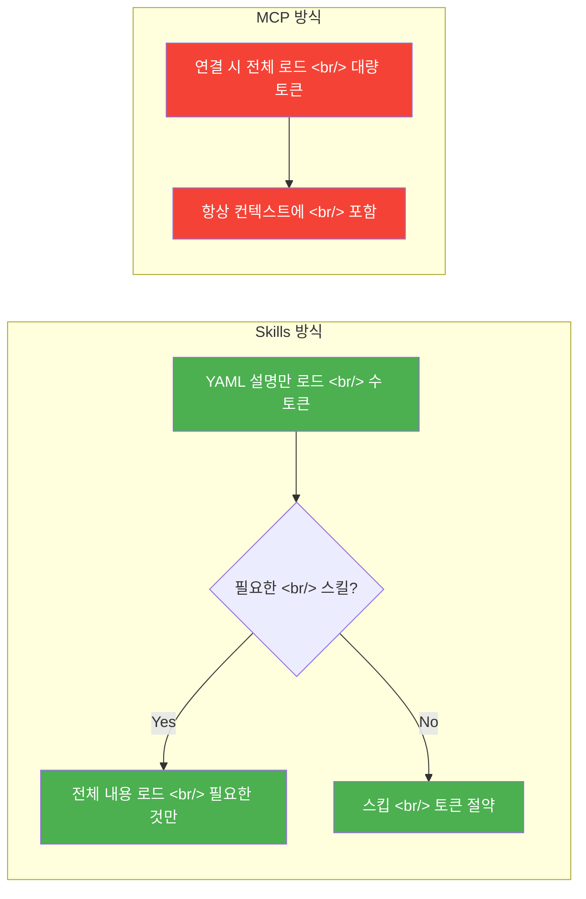

## 개요

[이전 글: Harness(하니스) — Claude Code를 범용 AI에서 전담 직원으로](/posts/2026-03-06-claude-code-harness/)에서 하니스 엔지니어링의 개념과 Claude Code에서의 Skills, Agents, Commands 핵심 구성 요소를 다뤘다. 이번 글에서는 Google이 무료로 제공하는 AI 개발 도구 **Antigravity**를 통해 하니스를 실전에서 어떻게 구축하고 활용하는지 살펴본다. Rules 계층 구조, Skills의 토큰 효율성, MCP 연동, 그리고 바이브 코딩으로 결제 기능이 포함된 SaaS까지 만드는 과정을 정리했다.

<!--more-->

## Antigravity: 하니스의 실전 무대

Antigravity는 Google이 제공하는 무료 AI 개발 도구다. Cursor($20/월), GitHub Copilot($10/월), Replit($25/월) 같은 유료 도구의 대안으로 주목받고 있다.

핵심 구조는 **Agent Manager**가 Editor와 Browser를 관리하는 형태다. 단순 코드 자동완성이 아니라 **에이전트 중심 개발** 방식을 채택했다. 에이전트가 계획을 세우고, 파일을 생성하고, 코드를 작성하고, 에러가 발생하면 스스로 수정까지 한다.

특히 인상적인 점은 **멀티 모델 지원**이다. Gemini 3 Pro/Flash는 물론, Claude Sonnet 4.6/Opus 4.6, GPT OS까지 선택할 수 있다. Google 도구에서 Anthropic과 OpenAI 모델을 쓸 수 있다는 건 하니스 관점에서 중요하다. 동일한 Rules와 Skills 체계 아래에서 모델만 바꿔가며 최적의 조합을 찾을 수 있기 때문이다.

## 하니스 구성 요소 실전 적용

하니스 엔지니어링의 핵심은 AI가 작업을 시작하기 전에 **제어 구조와 작업 환경을 설계**하는 것이다. 말의 하니스(마구)처럼 힘을 묶는 게 아니라 올바른 방향으로 이끄는 것이고, Test Harness처럼 실행 환경을 감싸서 제어하는 것이다.

Antigravity에서 에이전트가 활성화되는 흐름은 다음과 같다.

### Rules: 3계층 규칙 체계

Antigravity의 Rules는 세 가지 계층으로 나뉜다.

| 계층 | 위치 | 용도 |
|------|------|------|
| **Global Rules** | `.gemini/gemini.md` | 모든 프로젝트에 공통 적용되는 규칙 |
| **Workspace Rules** | `.agents/rules/` 또는 `.agent/rules/` | 프로젝트별 규칙 |
| **Inline Rules** | 에이전트 채팅 내 직접 입력 | 즉각적인 리마인더 |

Global Rules는 Gemini CLI와 경로를 공유한다(`.gemini/`). 즉 Antigravity에서 설정한 규칙이 Gemini CLI에서도 동일하게 적용된다. 사용 쿼터는 별도로 관리되지만, 하니스 설정은 하나로 통일되는 셈이다.

### Activation Mode: 규칙의 발동 조건

Rules에는 네 가지 활성화 모드가 있다.

- **Always-on** — 항상 적용
- **Model Decision** — 모델이 필요하다고 판단하면 적용
- **GLB (File Pattern Matching)** — 파일 확장자 패턴에 따라 적용
- **Manual** — 직접 멘션해야 적용

GLB 패턴이 특히 실용적이다. 예를 들어 `*.py` 파일을 다룰 때 자동으로 "UV 가상환경을 사용하라"는 규칙을 적용할 수 있다. 파일 타입에 따라 다른 컨벤션을 강제할 수 있으니, 한 프로젝트에서 Python과 TypeScript를 동시에 다루는 경우에 유용하다.

## 스킬과 MCP: 토큰 효율의 차이

### Progressive Disclosure: 스킬의 핵심 설계

Antigravity의 Skills는 **Progressive Disclosure** 방식으로 동작한다. 처음에는 YAML frontmatter(description)만 로드한다. 에이전트가 해당 스킬이 필요하다고 판단했을 때 비로소 전체 내용을 읽는다.

이 설계가 MCP와의 결정적 차이를 만든다. Context7 같은 MCP는 연결 시점에 대량의 컨텍스트를 한꺼번에 로드한다. 반면 Skills는 필요한 시점에 필요한 만큼만 컨텍스트를 소비한다. 토큰 예산이 제한된 환경에서 이 차이는 크다.

### Skill Creator와 공식 스킬 설치

Antigravity에는 **Skill Creator**가 내장되어 있다. 스킬을 직접 만들고 반복적으로 개선할 수 있다. Anthropic의 공식 스킬을 GitHub에서 가져와 설치하는 것도 가능하다.

스킬을 글로벌로 적용하려면 `.gemini/skills/` 폴더에 드래그하면 된다. Git을 사용하지 않는 경우에는 ZIP으로 다운로드해서 배치할 수 있다.

### MCP: 외부 서비스 연동

MCP(Model Context Protocol)는 35개 이상의 외부 서비스를 에이전트에 연결한다. 데이터베이스, API, GitHub 등을 에이전트가 직접 조작할 수 있게 해준다. 에이전트 워크플로우를 구성하면 데이터 수집부터 리포트 생성, 대시보드 구축까지 자동화할 수 있다.

Skills와 MCP를 적절히 조합하는 것이 하니스 설계의 핵심이다. 자주 쓰는 패턴은 Skills로, 외부 서비스 연동은 MCP로 분리하면 토큰 효율과 기능성을 동시에 확보할 수 있다.

## 바이브 코딩으로 SaaS까지

### 바이브 코딩이란

바이브 코딩(Vibe Coding)은 Andrej Karpathy가 2025년 2월에 제안한 개념이다. 코드를 한 줄씩 작성하는 대신, AI에게 원하는 결과를 설명하고 AI가 코드를 생성하는 방식이다. 개발자는 방향을 잡고 결과를 검증하는 역할에 집중한다.

Antigravity에서의 바이브 코딩은 에이전트가 계획 → 파일 생성 → 코드 작성 → 에러 자체 수정까지 전 과정을 수행한다. **Browser Subagent**가 Chrome을 직접 제어해서 UI 테스트와 디버깅까지 자동화한다.

### 4가지 프로젝트로 보는 난이도 곡선

영상에서 소개된 4개 프로젝트는 단순한 것에서 복잡한 것으로 자연스럽게 난이도가 올라간다.

| 프로젝트 | 난이도 | 핵심 요소 |
|----------|--------|-----------|
| **LinkInBio** | 입문 | 정적 페이지, 기본 레이아웃 |
| **Reading Tracker App** | 초급 | CRUD, 데이터 저장 |
| **AI SNS Post Generator** | 중급 | AI API 연동, 콘텐츠 생성 |
| **AI Background Removal SaaS** | 고급 | 결제(TossPayments), 관리자 대시보드, MRR 추적 |

마지막 SaaS 프로젝트가 인상적이다. TossPayments 결제 연동, 관리자 대시보드, MRR(Monthly Recurring Revenue) 트래킹까지 포함된 실제 서비스 수준의 결과물을 바이브 코딩으로 만들어낸다.

### 디버깅 프레임워크

바이브 코딩에서도 에러는 발생한다. 영상에서 제시한 디버깅 프레임워크는 간결하다.

1. **에러 메시지 읽기** — 무엇이 실패했는지 파악
2. **재현하기** — 동일 조건에서 에러 확인
3. **컨텍스트와 함께 AI에 전달** — 에러 로그, 관련 코드, 재현 조건을 묶어서 전달

결국 디버깅도 하니스의 일부다. 에러 컨텍스트를 잘 구조화해서 전달하는 것 자체가 AI를 올바른 방향으로 이끄는 제어 구조이기 때문이다.

## 빠른 링크

- [Harness Engineering 안티그래비티에 앤트로픽 클로드 스킬 적용하기](https://www.youtube.com/watch?v=2ThXWO3-Db4) — Antigravity 하니스 구조, Rules/Skills/MCP 실전 적용
- [코딩 없이 SaaS와 결제 기능 만들어주는 Antigravity](https://www.youtube.com/watch?v=aZot7xrkwRg) — 바이브 코딩, 4개 프로젝트 예제, TossPayments 연동
- [이전 글: Harness(하니스) — Claude Code를 범용 AI에서 전담 직원으로](/posts/2026-03-06-claude-code-harness/) — 하니스 엔지니어링 개념과 핵심 구성 요소

## 인사이트

이전 글에서 하니스를 "AI를 범용에서 전담으로 바꾸는 제어 구조"로 정의했다. Antigravity를 살펴보면서 이 개념이 도구를 넘어 **패턴**으로 수렴하고 있다는 걸 느낀다.

Claude Code의 CLAUDE.md와 Antigravity의 `.gemini/gemini.md`는 이름만 다를 뿐 역할이 같다. Skills의 Progressive Disclosure도 Claude Code의 스킬 시스템과 동일한 설계 철학을 공유한다. 도구는 다르지만 하니스 구성 요소 — Rules, Skills, MCP — 는 거의 1:1로 대응된다.

주목할 점은 **토큰 효율**이다. MCP가 편리하지만 연결 시점에 대량의 컨텍스트를 소비한다. Skills의 Progressive Disclosure는 이 문제를 우아하게 해결한다. 하니스를 설계할 때 "무엇을 컨텍스트에 넣을까"보다 "언제 컨텍스트에 넣을까"를 먼저 고민해야 하는 이유다.

바이브 코딩으로 SaaS까지 만들 수 있다는 건, 이제 개발의 병목이 코딩 능력이 아니라 **하니스 설계 능력**으로 이동하고 있다는 신호다. 어떤 Rules를 세울지, 어떤 Skills를 준비할지, 에러 컨텍스트를 어떻게 구조화할지 — 이것이 결과물의 품질을 결정한다.
