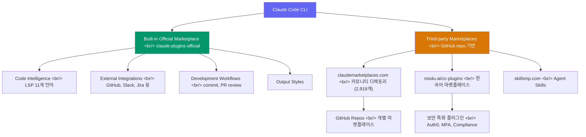
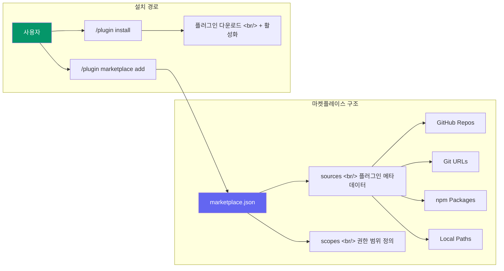

## 개요

Claude Code가 플러그인 시스템을 도입한 이후, 생태계가 빠르게 확장되고 있다. 공식 마켓플레이스 하나로 시작했지만 지금은 커뮤니티 디렉토리, 한국어 전용 마켓플레이스까지 선택지가 다양해졌다. 이 글에서는 주요 마켓플레이스 네 곳을 비교하고, 목적에 맞는 선택 기준을 정리한다.

<!--more-->

## 생태계 구조

Claude Code 플러그인 생태계는 크게 세 계층으로 나뉜다.



## 1. 공식 마켓플레이스 — claude-plugins-official

Anthropic이 직접 운영하는 기본 마켓플레이스다. Claude Code를 설치하면 자동으로 사용 가능하다.

### 주요 카테고리

| 카테고리 | 내용 | 예시 |
|---------|------|------|
| **Code Intelligence** | LSP 기반 언어 지원 (11개 언어) | TypeScript, Python, Rust, Go 등 |
| **External Integrations** | 외부 서비스 연동 | GitHub, GitLab, Jira, Slack, Figma |
| **Development Workflows** | 개발 프로세스 자동화 | commit-commands, pr-review-toolkit |
| **Output Styles** | 출력 형식 커스터마이징 | — |

### 설치 방법

```bash
# 플러그인 설치
/plugin install plugin-name@claude-plugins-official

# 설치된 플러그인 확인
/plugin list
```

**장점**: Anthropic이 제공하므로 안정성과 호환성이 보장된다. 별도 마켓플레이스 등록 없이 바로 사용할 수 있다.

**단점**: 플러그인 수가 제한적이고, 커뮤니티의 다양한 요구를 모두 반영하기 어렵다.

## 2. claudemarketplaces.com — 커뮤니티 디렉토리

@mertduzgun이 운영하는 독립 프로젝트로, Anthropic과는 공식적인 관계가 없다. 현재 **2,919개 마켓플레이스**를 색인하고 있어 규모 면에서 가장 크다.

### 인기 마켓플레이스 (Stars 기준)

| 마켓플레이스 | Stars | 플러그인 수 | 특징 |
|------------|------:|----------:|------|
| f/prompts.chat | 144.8k | — | 프롬프트 중심 |
| anthropics/claude-code | 65.1k | 13 | 공식 레포 |
| obra/superpowers | 46.9k | — | 확장 기능 |
| upstash/context7 | 45k | — | 컨텍스트 관리 |
| affaan-m/everything-claude-code | 41.3k | — | 종합 리소스 |
| ComposioHQ/awesome-claude-skills | 32k | 107 | 스킬 모음 |
| wshobson/agents | 28k | 73 | 에이전트 특화 |
| eyaltoledano/claude-task-master | 25.3k | — | 태스크 관리 |

### 카테고리 분류

3D-Development, Agents, Authentication, Automation, Backend, Claude, Code-Quality 등 세분화된 카테고리로 정리되어 있다. Sponsored listing(ideabrowser.com, supastarter 등)도 포함되어 있으므로, 스폰서 표시 여부를 확인하는 습관이 필요하다.

**장점**: 압도적인 규모, 카테고리 검색, Stars 기반 인기도 확인 가능.

**단점**: 품질 검증이 없고, Anthropic 비공식이므로 보안 판단은 사용자 몫이다.

## 3. skillsmp.com (SkillsMP)

Agent Skills 전문 마켓플레이스로, 한국어 지원(`skillsmp.com/ko`)을 제공한다. 다만 현재 접근 시 HTTP 403 오류가 발생하는 상태로, 안정성에 대한 확인이 필요하다.

**장점**: 한국어 UI 지원, Agent Skills 특화.

**단점**: 접근 불안정(403 에러), 콘텐츠 확인 불가.

## 4. modu-ai/cc-plugins — 한국어 커뮤니티

"모두의AI 공식 Claude Code Plugin Marketplace"를 표방하는 한국어 최적화 마켓플레이스다.

### 특징

- **Stars**: 56 (성장 초기)
- **라이선스**: GPL-3.0 (Copyleft)
- **기술 스택**: MoAI-ADK (AI Development Kit), DDD 방법론 기반
- **주력 분야**: Auth0 보안, MFA, 토큰 보안, 컴플라이언스

### 설치

```bash
# 마켓플레이스 등록
/plugin marketplace add modu-ai/cc-plugins

# 등록 후 플러그인 설치
/plugin install plugin-name@modu-ai-cc-plugins
```

**장점**: 한국어 문서, 보안 특화 플러그인, 국내 커뮤니티 연결.

**단점**: 아직 초기 단계로 플러그인 수가 적고, GPL-3.0 라이선스의 제약을 이해해야 한다.

## 마켓플레이스 종합 비교

| 항목 | 공식 (Anthropic) | claudemarketplaces.com | skillsmp.com | modu-ai/cc-plugins |
|------|:---:|:---:|:---:|:---:|
| **규모** | 소 | 대 (2,919) | 미확인 | 소 |
| **운영 주체** | Anthropic | 커뮤니티 (개인) | 미확인 | 한국 커뮤니티 |
| **품질 검증** | O | X | 미확인 | 부분적 |
| **한국어 지원** | X | X | O | O |
| **보안 신뢰도** | 높음 | 낮음 (직접 확인 필요) | 미확인 | 중간 |
| **설치 편의성** | 내장 | 별도 등록 필요 | — | 별도 등록 필요 |
| **자동 업데이트** | O (설정 가능) | 마켓플레이스별 상이 | — | — |
| **주력 분야** | 범용 | 범용 | Agent Skills | 보안 |

## 플러그인 시스템 아키텍처

Claude Code의 마켓플레이스 시스템은 GitHub repo를 기반으로 동작한다.



### 지원하는 플러그인 소스 유형

| 소스 유형 | 예시 | 용도 |
|----------|------|------|
| GitHub repo | `owner/repo` | 가장 일반적 |
| Git URL | `https://github.com/...` | 직접 URL 지정 |
| Local path | 로컬 디렉토리 경로 | 로컬 개발/테스트 |
| npm package | `@scope/package` | Node.js 생태계 |

### 팀 마켓플레이스 설정

팀에서 공유 마켓플레이스를 사용하려면 `.claude/settings.json`에 설정한다.

```json
{
  "extraKnownMarketplaces": [
    "your-org/internal-plugins"
  ]
}
```

## 선택 기준 — 어떤 마켓플레이스를 쓸까

### 상황별 추천

**"처음 시작한다"** — 공식 마켓플레이스부터. 별도 설정 없이 바로 사용 가능하고, LSP 플러그인으로 코드 인텔리전스를 먼저 강화하는 것이 좋다.

**"다양한 플러그인이 필요하다"** — claudemarketplaces.com에서 검색한 뒤, Stars와 최근 업데이트 날짜를 확인하고 개별 마켓플레이스를 등록한다. ComposioHQ/awesome-claude-skills(107개)나 wshobson/agents(73개)가 실용적이다.

**"한국어 환경에서 쓴다"** — modu-ai/cc-plugins를 등록한다. 한국어 문서와 국내 커뮤니티 지원이 있다.

**"보안이 중요하다"** — 공식 마켓플레이스를 기본으로 사용하고, 서드파티는 소스 코드를 직접 검토한 후에만 설치한다.

## 보안 고려사항

플러그인 생태계에서 보안은 가장 중요한 문제다.

1. **Anthropic은 서드파티 플러그인을 검증하지 않는다.** 공식 문서에도 "user must trust plugins"라고 명시되어 있다.

2. **설치 전 확인 사항**:
   - GitHub repo의 Stars, Issues, 최근 커밋 활동
   - 라이선스 (GPL-3.0 같은 Copyleft 라이선스는 상업 프로젝트에 영향)
   - 플러그인이 요구하는 권한(scopes) 범위
   - 소스 코드에서 외부 API 호출이나 데이터 전송 여부

3. **자동 업데이트 설정**: 신뢰하는 마켓플레이스만 자동 업데이트를 켜고, 나머지는 수동으로 관리한다.

4. **Sponsored listing 주의**: claudemarketplaces.com의 스폰서 리스팅은 품질 보증이 아니다. 광고임을 인지해야 한다.

## 빠른 링크

- [Claude Code 공식 플러그인 문서](https://code.claude.com/docs/en/discover-plugins)
- [claudemarketplaces.com](https://claudemarketplaces.com/)
- [skillsmp.com](https://skillsmp.com/ko)
- [modu-ai/cc-plugins](https://github.com/modu-ai/cc-plugins)
- [마켓플레이스 생성 가이드](https://code.claude.com/docs/ko/plugin-marketplaces)

## 인사이트

Claude Code 플러그인 생태계는 아직 **초기 성장 단계**다. 2,919개 마켓플레이스가 색인될 만큼 빠른 성장이 이루어지고 있고, 공식 마켓플레이스의 체계적인 카테고리 분류와 한국어 커뮤니티의 자체 마켓플레이스 운영은 긍정적 신호다. 그러나 품질 검증 체계 부재, 플러그인 간 호환성 표준 미정립, GitHub Stars에만 의존하는 신뢰 모델은 개선이 필요하다. VS Code 확장 생태계가 성숙하기까지 수년이 걸렸던 것처럼, Claude Code도 시간이 필요하다. 지금은 공식 마켓플레이스를 중심으로 사용하면서, 커뮤니티 마켓플레이스는 선별적으로 활용하는 전략이 합리적이다.
