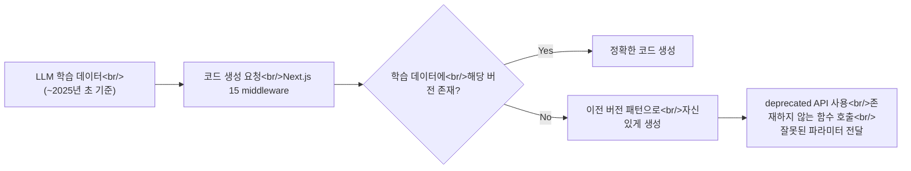
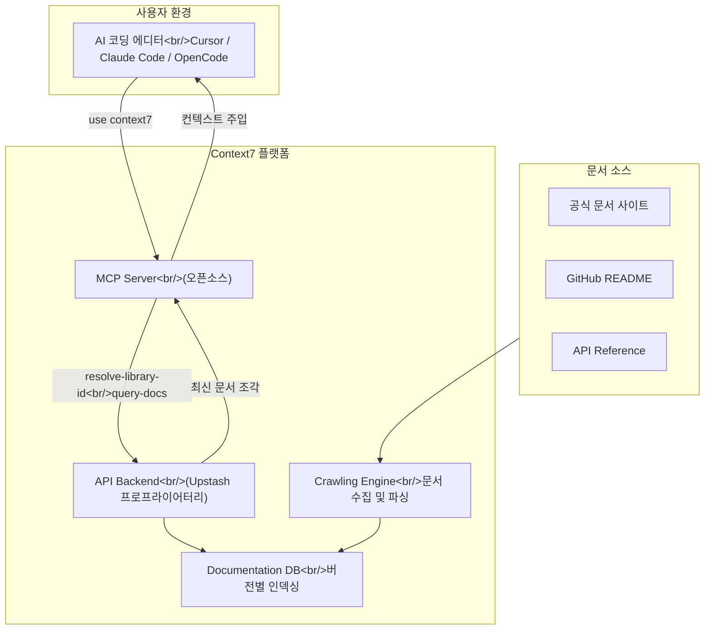

## 개요

AI 코딩 어시스턴트를 사용하다 보면 한 번쯤은 겪는 일이 있다. Cursor나 Claude Code가 자신 있게 작성해준 코드가 실제로는 존재하지 않는 API를 호출하고 있거나, 2년 전에 deprecated된 패턴을 사용하고 있는 것이다. LLM의 학습 데이터에는 시간적 한계가 있고, 라이브러리는 끊임없이 업데이트된다. **Context7**은 이 간극을 메우기 위해 최신 버전의 문서를 LLM 프롬프트에 직접 주입하는 플랫폼이다. GitHub 스타 약 49,800개를 기록하며 빠르게 성장 중인 이 도구를 깊이 분석해본다.

<!--more-->

## LLM 환각 문제: 왜 발생하는가

LLM이 코드를 생성할 때 발생하는 환각(hallucination)은 단순한 "실수"가 아니라 구조적 문제다.



대표적인 사례들:

| 상황 | 증상 |
|------|------|
| Next.js App Router 관련 코드 요청 | Pages Router 패턴을 혼합하여 생성 |
| Supabase 최신 Auth API 사용 | `supabase.auth.api` (deprecated) 호출 |
| Tailwind CSS v4 설정 | v3 config 포맷으로 생성 |
| Cloudflare Workers 새 API | 존재하지 않는 메서드 조합 |

문제의 핵심은, LLM이 **"모른다"고 말하지 않는다**는 점이다. 학습 데이터에 유사한 패턴이 있으면 그것을 기반으로 그럴듯한 코드를 생성하고, 개발자는 런타임 에러가 발생할 때까지 이를 알아차리지 못한다.

## Context7의 해결 방식

Context7의 접근법은 단순하면서도 효과적이다: **LLM이 코드를 생성하기 전에, 해당 라이브러리의 최신 공식 문서를 프롬프트 컨텍스트에 삽입**한다.



### 동작 흐름

1. 사용자가 프롬프트에 `use context7`을 추가
2. Context7 MCP 서버가 라이브러리를 식별 (`resolve-library-id`)
3. 해당 라이브러리의 최신 문서에서 관련 섹션을 검색 (`query-docs`)
4. 검색된 문서 조각을 LLM 컨텍스트에 삽입
5. LLM이 최신 문서를 기반으로 코드 생성

이 과정이 중요한 이유는, 단순히 "최신 문서를 읽어라"가 아니라 **쿼리와 관련된 문서 섹션만 선별적으로 추출**한다는 점이다. 전체 문서를 컨텍스트에 넣으면 토큰 낭비이자 오히려 성능 저하를 일으킬 수 있다.

## CLI vs MCP: 두 가지 사용 모드

Context7은 두 가지 방식으로 사용할 수 있다.

### 1. CLI + Skills 모드 (MCP 불필요)

```bash
# 설치 및 설정
npx ctx7 setup   # OAuth 인증 → API 키 생성 → skill 설치

# 라이브러리 검색
ctx7 library nextjs middleware

# 특정 라이브러리의 문서 조회
ctx7 docs /vercel/next.js "middleware authentication JWT"
```

CLI 모드는 MCP를 지원하지 않는 환경이나, 단순히 터미널에서 빠르게 문서를 확인하고 싶을 때 유용하다.

### 2. MCP 모드 (네이티브 통합)

MCP(Model Context Protocol)를 지원하는 클라이언트에서는 Context7이 자동으로 동작한다.

**제공되는 MCP Tool**:

| Tool | 용도 | 입력 | 출력 |
|------|------|------|------|
| `resolve-library-id` | 라이브러리 이름을 Context7 ID로 변환 | `"nextjs"` | `/vercel/next.js` |
| `query-docs` | 라이브러리 ID로 관련 문서 검색 | library ID + query | 문서 조각 |

**MCP 모드의 핵심 장점**: 사용자가 `use context7`만 프롬프트에 추가하면, 나머지는 LLM이 자동으로 tool call을 수행한다.

### 모드 비교

| 기준 | CLI 모드 | MCP 모드 |
|------|----------|----------|
| 설정 복잡도 | 낮음 (npx 한 줄) | MCP 서버 등록 필요 |
| 자동화 수준 | 수동 | 완전 자동 |
| MCP 지원 필요 | 불필요 | 필수 |
| 적합한 상황 | 빠른 문서 확인, MCP 미지원 환경 | 일상적인 AI 코딩 워크플로우 |

## Library ID 시스템과 버전 타겟팅

Context7의 Library ID는 GitHub 스타일의 경로를 사용한다:

```
/supabase/supabase
/vercel/next.js
/mongodb/docs
/langchain-ai/langchainjs
```

이 ID 체계가 흥미로운 이유는, 단순히 패키지 이름이 아니라 **문서의 출처를 명시적으로 식별**한다는 점이다. `react`라고만 검색하면 여러 결과가 나올 수 있지만, `/facebook/react`는 하나의 정확한 소스를 가리킨다.

### 버전 타겟팅

프롬프트에 버전을 명시하면 Context7이 자동으로 해당 버전의 문서를 매칭한다:

```
Create a Next.js 15 middleware that validates JWT. use context7
```

위 프롬프트에서 "Next.js 15"를 감지하여 v15 문서에서 middleware 관련 섹션을 가져온다.

## Claude Code에서의 실전 사용

### 설정

```bash
npx ctx7 setup
```

### 실전 프롬프트 패턴

**기본 사용**:
```
Supabase Edge Function에서 Row Level Security를 우회하는 
서비스 역할 키 사용법을 알려줘. use context7
```

**버전 지정**:
```
Tailwind CSS v4에서 custom theme을 설정하는 방법. use context7
```

### Context7이 없을 때 vs 있을 때

```typescript
// ❌ Context7 없이 — LLM이 오래된 패턴 생성 가능
import { createMiddlewareClient } from '@supabase/auth-helpers-nextjs'
// auth-helpers-nextjs는 deprecated, @supabase/ssr로 대체됨

// ✅ Context7 사용 — 최신 공식 문서 기반
import { createServerClient } from '@supabase/ssr'
import { NextResponse, type NextRequest } from 'next/server'

export async function middleware(request: NextRequest) {
  let supabaseResponse = NextResponse.next({ request })
  const supabase = createServerClient(
    process.env.NEXT_PUBLIC_SUPABASE_URL!,
    process.env.NEXT_PUBLIC_SUPABASE_ANON_KEY!,
    {
      cookies: {
        getAll() { return request.cookies.getAll() },
        setAll(cookiesToSet) {
          cookiesToSet.forEach(({ name, value }) => 
            request.cookies.set(name, value))
          supabaseResponse = NextResponse.next({ request })
          cookiesToSet.forEach(({ name, value, options }) =>
            supabaseResponse.cookies.set(name, value, options))
        },
      },
    }
  )
  await supabase.auth.getUser()
  return supabaseResponse
}
```

## Upstash 커넥션과 비즈니스 모델

Context7은 **Upstash**가 만든 프로젝트다. Upstash는 서버리스 Redis, Kafka, QStash 등을 제공하는 인프라 회사로, 최근 AI/LLM 도구 생태계로 확장하고 있다.

### 오픈소스 경계

| 컴포넌트 | 공개 여부 |
|----------|----------|
| MCP Server 소스 | 오픈소스 (GitHub) |
| CLI 도구 | 오픈소스 |
| API Backend | 비공개 (Upstash 프로프라이어터리) |
| Crawling/Parsing Engine | 비공개 |
| Documentation DB | 비공개 |

MCP 서버와 CLI를 오픈소스로 공개하여 커뮤니티 신뢰와 채택을 얻되, 핵심 가치인 문서 크롤링/파싱/인덱싱 엔진은 독점함으로써 비즈니스 모트를 형성한다.

**수익 모델**: 기본 사용은 무료(rate limit 있음)이고, context7.com/dashboard에서 API 키를 발급받으면 더 높은 rate limit를 사용할 수 있다.

## 대안과의 비교

| 방식 | 정확도 | 자동화 | 구축 비용 | 의존성 |
|------|--------|--------|----------|--------|
| 수동 문서 복사 | 높음 | 없음 | 없음 | 없음 |
| 자체 RAG | 높음 | 높음 | 매우 높음 | 자체 인프라 |
| Context7 | 높음 | 높음 | 거의 없음 | Upstash |
| 웹 검색 통합 | 중간 | 중간 | 낮음 | 검색 API |

Context7의 가장 큰 장점은 **설정 비용 대비 효과**다. `npx ctx7 setup` 한 줄로 수십 개 라이브러리의 최신 문서에 접근할 수 있다.

## 비판적 분석

### 강점

1. **극도로 낮은 진입 장벽**: `npx ctx7 setup` 한 줄이면 끝
2. **버전 인식**: 프롬프트에 버전을 명시하면 자동 매칭
3. **광범위한 클라이언트 지원**: Cursor, Claude Code, OpenCode 등 30개 이상의 클라이언트와 통합
4. **커뮤니티 모멘텀**: 약 49,800 스타는 문서 DB의 품질과 커버리지를 지속적으로 개선할 동력

### 한계와 리스크

1. **단일 장애점(SPOF)**: 백엔드 API가 Upstash에 완전히 의존. 서비스 장애 시 대안이 없다
2. **문서 커버리지의 불확실성**: 어떤 라이브러리가 DB에 있는지, 얼마나 최신인지 투명하게 공개되지 않는다
3. **프롬프트 토큰 소비**: 문서 조각이 컨텍스트에 주입되므로 토큰을 소비한다
4. **"use context7" 키워드 의존**: 프롬프트에 키워드를 붙여야 동작하는 것은 사용자가 판단해야 한다는 뜻이다
5. **벤더 락인 경로**: 무료 사용 → rate limit 도달 → 유료 전환의 전형적인 프리미엄 모델

## 빠른 링크

- [Context7 GitHub](https://github.com/upstash/context7)
- [Context7 웹사이트](https://context7.com)
- [API 키 발급](https://context7.com/dashboard)
- [Claude Code 플러그인 마켓플레이스](https://claudemarketplaces.com/plugins/upstash-context7)

## 인사이트

Context7은 기술적으로 복잡한 도구가 아니다. "최신 문서를 LLM 컨텍스트에 넣어준다"는 아이디어 자체는 누구나 떠올릴 수 있다. 하지만 **수천 개 라이브러리의 문서를 지속적으로 크롤링하고, 버전별로 인덱싱하며, 관련 섹션만 정확히 추출하는 인프라**를 실제로 구축하고 무료로 제공하는 것은 완전히 다른 문제다. Context7의 진짜 가치는 코드가 아니라 이 **데이터 파이프라인**에 있다. MCP 생태계의 관점에서 보면, Context7은 MCP가 "왜" 필요한지를 가장 설득력 있게 보여주는 사례 중 하나다. 다만 장기적으로는 이런 기능이 AI 코딩 도구 자체에 내장될 가능성이 높다. Cursor나 Claude Code가 자체적으로 문서 인덱싱을 제공하기 시작하면, Context7의 독립적인 가치는 줄어들 수 있다.
