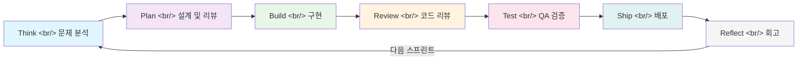
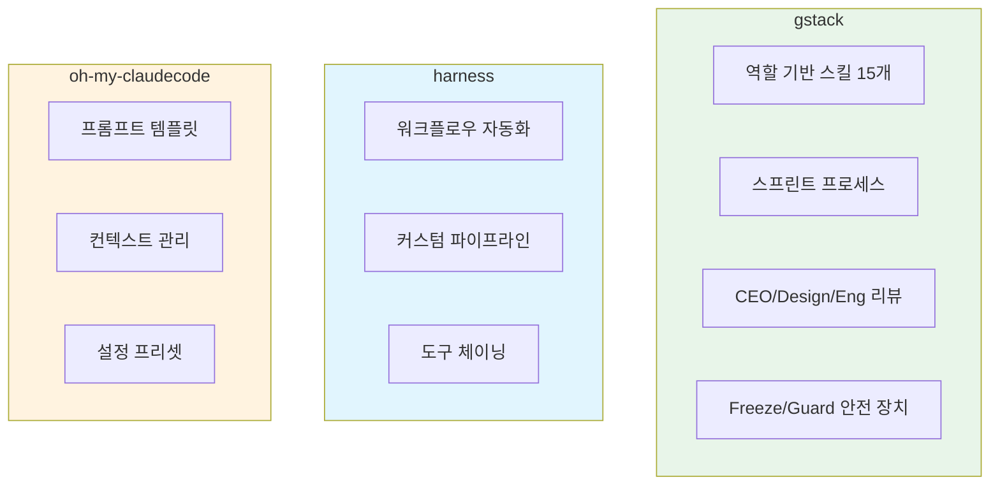

## 개요

Y Combinator CEO **Garry Tan**이 자신의 Claude Code 개발 환경을 오픈소스로 공개했다. **gstack**은 Claude Code를 15개의 전문 스킬과 6개의 파워 툴로 구성된 가상 엔지니어링 팀으로 변환하는 스킬 프레임워크로, 공개 첫날 GitHub 스타 10,000개를 돌파하며 현재 27,000개 이상을 기록하고 있다. 60일간 600,000줄 이상의 프로덕션 코드를 작성했다는 Garry Tan의 주장과 함께, 하루 10,000~20,000줄의 사용 가능한 코드를 생산할 수 있다는 점이 개발자 커뮤니티의 폭발적인 관심을 끌었다.

<!--more-->

## 스프린트 아키텍처

gstack의 핵심은 소프트웨어 개발의 전체 라이프사이클을 **7단계 스프린트 프로세스**로 구조화한 것이다. 단순히 코드를 생성하는 것이 아니라, 실제 엔지니어링 팀이 수행하는 사고 → 계획 → 구현 → 리뷰 → 테스트 → 배포 → 회고의 순환을 Claude Code 안에서 재현한다.



이 프로세스에서 주목할 점은 **10~15개의 스프린트를 병렬로 실행**할 수 있다는 것이다. Claude Code의 멀티 태스크 기능을 활용해 여러 기능을 동시에 개발하되, 각 스프린트가 독립적인 리뷰와 테스트 단계를 거치도록 설계되어 있다.

## 15개 스킬의 역할 분석

gstack은 엔지니어링 팀의 각 역할을 독립된 스킬로 매핑한다. 각 스킬은 `/` 커맨드로 호출되며, 컨텍스트에 따라 자동으로 로딩되기도 한다.

### CEO & 경영진 역할

| 스킬 | 커맨드 | 역할 |
|------|--------|------|
| CEO Review | `/plan-ceo-review` | 비즈니스 관점에서 계획 검토, 우선순위 조정 |
| Design Review | `/plan-design-review` | UX/UI 관점의 설계 리뷰 |
| Eng Review | `/plan-eng-review` | 기술적 타당성, 아키텍처 리뷰 |
| Office Hours | `/office-hours` | 자유로운 질의응답, 방향성 논의 |

**CEO Review**는 Garry Tan이 "Boulder Ocean" 철학이라고 부르는 접근 방식을 따른다. 핵심은 CEO가 세부 구현에 간섭하지 않되, 전략적 방향과 우선순위에 대해서는 명확한 피드백을 제공하는 것이다. 실제로 이 리뷰에서 나오는 대부분의 권고사항은 기본적으로 수용(accept)되도록 설계되어 있어, Claude가 스스로 판단하여 빠르게 진행할 수 있다.

### 엔지니어링 역할

| 스킬 | 커맨드 | 역할 |
|------|--------|------|
| Code Review | `/review` | PR 수준의 코드 리뷰 수행 |
| QA | `/qa` | 자동화 테스트 및 품질 검증 |
| Ship | `/ship` | 배포 프로세스 관리 |
| Investigate | `/investigate` | 버그 추적, 로그 분석 |
| Careful | `/careful` | 신중한 모드로 전환, 위험한 변경 감지 |

### 운영 및 문서화 역할

| 스킬 | 커맨드 | 역할 |
|------|--------|------|
| Document Release | `/document-release` | 릴리즈 노트 자동 생성 |
| Retro | `/retro` | 스프린트 회고, 개선점 도출 |
| Browse | `/browse` | 웹 검색 및 참조 자료 수집 |
| Codex | `/codex` | 코드베이스 지식 관리 |

### 파워 툴 (안전 장치)

| 툴 | 커맨드 | 기능 |
|----|--------|------|
| Freeze | `/freeze` | 특정 파일/디렉토리 변경 금지 |
| Guard | `/guard` | 변경 감시 및 경고 |
| Unfreeze | `/unfreeze` | freeze 해제 |

`/freeze`와 `/guard`는 특히 중요한 안전 장치다. 병렬 스프린트를 실행할 때 여러 Claude 인스턴스가 동일한 파일을 동시에 수정하는 충돌을 방지한다. 예를 들어 핵심 설정 파일이나 데이터베이스 스키마를 freeze하면, 해당 스프린트에서는 그 파일을 건드리지 않는다.

## 설치 및 사용법

설치는 간단하다. Claude Code의 스킬 디렉토리에 클론하고 셋업 스크립트를 실행하면 된다:

```bash
git clone https://github.com/garrytan/gstack.git ~/.claude/skills/gstack
cd ~/.claude/skills/gstack
./setup
```

설치 후 Claude Code에서 바로 사용할 수 있다:

```
> /plan-ceo-review
> 포모도로 타이머 앱을 만들고 싶어. React + TypeScript로.

[CEO Review 스킬 활성화]
- 목표 명확성: ✅
- 시장 차별점: 권고 - 기존 타이머 대비 차별화 포인트 정의 필요
- 기술 스택 적합성: ✅ React + TS는 이 규모에 적합
- MVP 범위: 타이머 기본 기능 + 세션 기록으로 한정 권고

수용하시겠습니까? [Y/n]
```

CEO 리뷰가 끝나면 자연스럽게 다음 단계로 넘어간다:

```
> /plan-eng-review

[Eng Review 스킬 활성화]
- 컴포넌트 구조 제안 (ASCII 플로우차트 생성)
- 상태 관리: useReducer 권고
- 테스트 전략: Vitest + React Testing Library
```

gstack의 특징 중 하나는 **ASCII 플로우차트를 자동 생성**하여 계획 단계에서 아키텍처를 시각화한다는 점이다. Mermaid가 아닌 ASCII 아트를 사용하는 이유는 Claude Code의 터미널 환경에서 바로 확인할 수 있기 때문이다.

## 기존 도구와의 비교

Claude Code 생태계에는 gstack 외에도 여러 확장 도구가 존재한다. 대표적으로 **harness**와 **oh-my-claudecode**가 있다.



| 특성 | gstack | harness | oh-my-claudecode |
|------|--------|---------|------------------|
| 핵심 철학 | 가상 팀 시뮬레이션 | 워크플로우 자동화 | 프롬프트 최적화 |
| 스킬 수 | 15 + 6 파워 툴 | 커스텀 정의 | 템플릿 기반 |
| 리뷰 프로세스 | CEO/Design/Eng 3단 리뷰 | 없음 | 없음 |
| 병렬 실행 | 10-15 스프린트 | 파이프라인 기반 | 미지원 |
| 안전 장치 | freeze/guard/unfreeze | 없음 | 없음 |
| 설치 방식 | git clone + setup | npm/pip | dotfiles |

gstack의 가장 큰 차별점은 **프로세스 지향적**이라는 것이다. 다른 도구들이 "Claude Code를 더 잘 쓰는 법"에 집중한다면, gstack은 "소프트웨어 팀이 일하는 방식 자체를 Claude Code 안에 이식"하려 한다. CEO 리뷰라는 개념 자체가 다른 도구에는 없는 고유한 레이어다.

## Garry Tan의 배경이 말해주는 것

Garry Tan은 단순한 CEO가 아니다. Palantir의 초기 엔지니어로 Palantir 로고를 직접 디자인했고, 이후 YC의 파트너를 거쳐 CEO가 되었다. 이 배경이 gstack의 설계에 그대로 반영된다:

- **Palantir 경험** → 데이터 중심의 의사결정, 구조화된 리뷰 프로세스
- **YC 경험** → 빠른 MVP, 스프린트 기반 개발, "Ship fast" 문화
- **디자인 감각** → Design Review 스킬의 존재, UX를 코드 리뷰와 동등하게 취급

하루 10,000~20,000줄이라는 숫자는 과장처럼 들릴 수 있지만, 병렬 스프린트와 Claude Code의 코드 생성 능력을 고려하면 물리적으로 불가능한 수치는 아니다. 다만 "사용 가능한(usable)" 코드의 기준이 무엇인지는 논의가 필요하다.

## 비판적 분석

### 강점

- **구조화된 개발 프로세스**: 무작정 "코드 짜줘"가 아닌, 계획 → 리뷰 → 구현의 단계를 강제하여 코드 품질을 높인다
- **안전 장치**: `/freeze`와 `/guard`로 병렬 작업 시 충돌을 예방하는 것은 실무적으로 매우 유용하다
- **낮은 진입 장벽**: git clone 한 번으로 설치가 끝나며, MIT 라이선스로 자유롭게 사용 가능하다
- **컨텍스트 자동 로딩**: 상황에 맞는 스킬이 자동으로 활성화되어 매번 수동으로 호출할 필요가 없다

### 약점 및 우려

- **Claude Code 종속**: Anthropic의 Claude Code에만 작동한다. Cursor, Windsurf 등 다른 AI 코딩 도구에서는 사용할 수 없다
- **"마법의 탄환" 착각**: 27,000 스타의 상당 부분은 Garry Tan의 네임 밸류에서 온 것이다. 동일한 도구를 무명의 개발자가 공개했다면 이 정도 관심을 받았을지 의문이다
- **LOC 지표의 한계**: 줄 수(LOC)는 생산성의 좋은 지표가 아니다. 600,000줄이 모두 의미 있는 코드인지, 보일러플레이트와 생성된 코드가 포함된 수치인지 명확하지 않다
- **팀 시뮬레이션의 한계**: CEO Review, Design Review 등이 실제 인간 리뷰어의 깊이를 대체할 수 있는지는 검증이 필요하다. LLM의 리뷰는 패턴 매칭에 가깝고, 도메인 특화된 비즈니스 판단을 내리기는 어렵다
- **TypeScript + Go Template 혼합**: 스킬 정의가 여러 언어로 분산되어 있어, 커스터마이징 시 진입 장벽이 있다

## 빠른 링크

- [GitHub 저장소: garrytan/gstack](https://github.com/garrytan/gstack)
- [Claude Code 공식 문서](https://docs.anthropic.com/en/docs/claude-code)
- [Y Combinator](https://www.ycombinator.com/)
- [YouTube: 하루만에 만개의 깃허브 스타를 받은 gstack](https://www.youtube.com/watch?v=vfn_Ezu1qfk)

## 인사이트

gstack이 보여주는 가장 흥미로운 패턴은 **AI 코딩 도구의 진화 방향**이다. 초기에는 "코드를 더 빨리 생성하는 것"이 목표였지만, gstack은 "소프트웨어 개발 프로세스 전체를 AI 안에 캡슐화하는 것"으로 목표를 확장했다. 이는 단순한 코드 생성 도구에서 **개발 방법론 프레임워크**로의 전환을 의미한다.

특히 `/freeze`와 `/guard` 같은 안전 장치의 존재는, 병렬 AI 에이전트 실행이 실무에서 실제 문제를 일으킨다는 것을 방증한다. 여러 Claude 인스턴스가 동시에 같은 코드베이스를 수정할 때의 충돌 관리는 앞으로 AI 코딩 도구 생태계 전체가 풀어야 할 과제다.

다만 gstack의 인기가 도구 자체의 우수성보다 Garry Tan이라는 브랜드에 더 많이 기인한 측면은 분명히 있다. 중요한 것은 이 프레임워크가 실제 프로덕션 환경에서 검증되었는지, 그리고 Garry Tan 본인 외의 개발자들도 동일한 생산성 향상을 경험하는지다. 27,000개의 스타가 27,000명의 활성 사용자를 의미하지는 않는다. Vibe coding의 시대에 도구 선택은 신중해야 하며, 스타 수보다는 자신의 워크플로우에 실질적으로 도움이 되는지를 기준으로 판단해야 한다.
