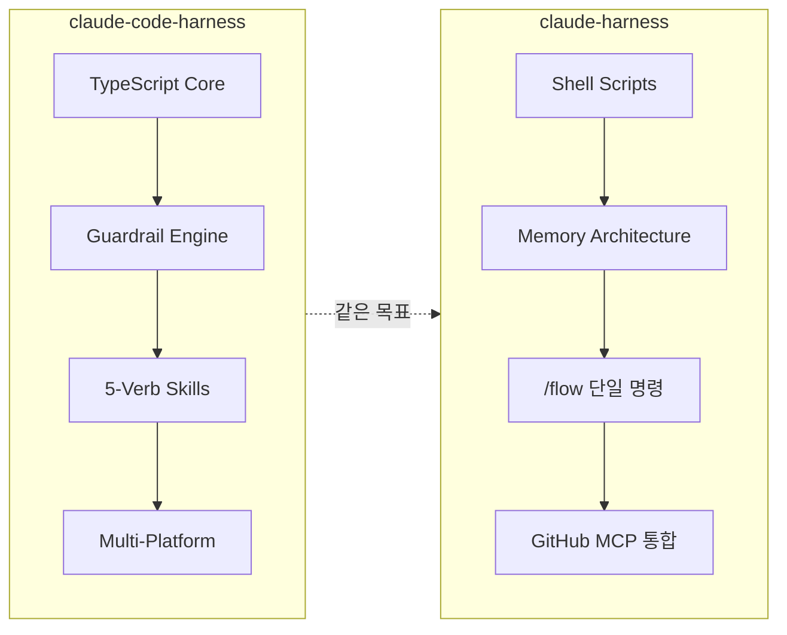
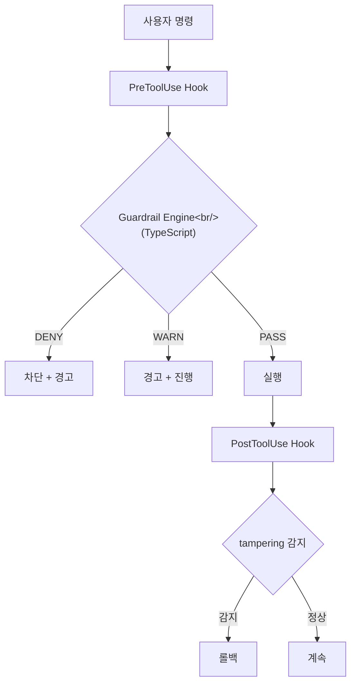
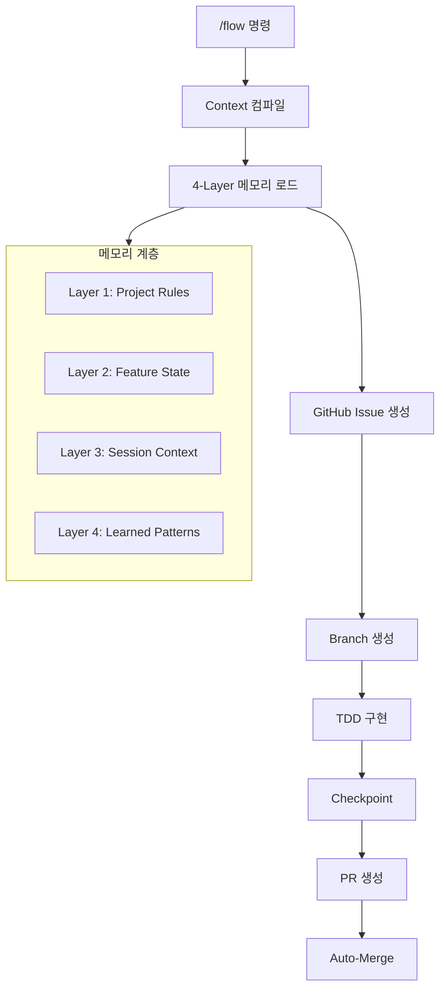
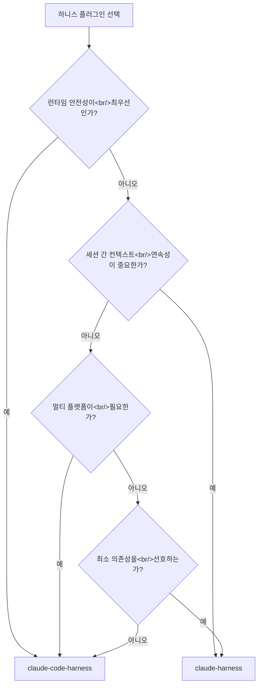

## 개요

> **하니스 시리즈 글:**
> 1. [Harness(하니스) — Claude Code를 범용 AI에서 전담 직원으로](/posts/2026-03-06-claude-code-harness/) — 개념과 핵심 구조
> 2. [Harness Engineering #2 — Antigravity로 하니스 실전 구축하기](/posts/2026-03-19-harness-antigravity/) — Google Antigravity 실전
> 3. **이 글** — 커뮤니티 하니스 플러그인 비교 분석
> 4. [HarnessKit 개발기 #1 — Zero-Based Vibe Coder를 위한 Adaptive Harness Plugin](/posts/2026-03-20-harnesskit-dev1/) — 분석 결과를 바탕으로 직접 만든 플러그인

이 글은 [HarnessKit](/posts/2026-03-20-harnesskit-dev1/)을 설계하기 전 사전 조사로 작성되었다. 기존 하니스 플러그인들의 장단점을 분석하고, 어떤 부분을 수용하고 어떤 부분을 개선할지 판단하기 위해 GitHub에서 가장 활발한 두 구현체를 비교했다 — Chachamaru127의 [claude-code-harness](https://github.com/Chachamaru127/claude-code-harness)(281★)와 panayiotism의 [claude-harness](https://github.com/panayiotism/claude-harness)(73★). 같은 문제를 풀지만 접근 방식이 완전히 다르다.

<!--more-->

## 설계 철학 비교



두 플러그인 모두 Anthropic의 "[Effective harnesses for long-running agents](https://www.anthropic.com/engineering/effective-harnesses-for-long-running-agents)" 아티클에서 출발한다. 하지만 구현 전략이 갈린다.

**claude-code-harness**는 **런타임 안전성**에 집중한다. TypeScript로 작성된 가드레일 엔진이 매 도구 호출을 감시하고, deny/warn 규칙으로 위험한 명령을 차단한다. "매번 같은 형태로 무너지지 않고 진행"하는 것이 핵심 가치다.

**claude-harness**는 **컨텍스트 연속성**에 집중한다. 5-layer 메모리 아키텍처로 세션 간 맥락을 보존하고, `/flow` 단일 명령으로 계획부터 머지까지 전 과정을 자동화한다. "한 번 시작하면 끝까지 자동으로 흘러가게" 하는 것이 핵심 가치다.

## 아키텍처 상세

### claude-code-harness — TypeScript 가드레일 엔진



| 구성 요소 | 설명 |
|-----------|------|
| `core/guardrails/` | pre-tool, post-tool, permission, tampering 감지 |
| `core/engine/lifecycle.js` | 세션 라이프사이클 관리 |
| `core/state/` | 상태 스키마, 마이그레이션, 저장소 |
| `skills-v3/` | 5-verb 스킬 (plan, work, review, validate, release) |
| `agents-v3/` | reviewer, scaffolder, worker, team-composition |

**5-Verb 시스템**이 이 플러그인의 뼈대다:

1. **Plan** — 요구사항을 `Plans.md`로 구조화
2. **Work** — 구현 (`--parallel` 지원, Breezing 모드)
3. **Review** — 코드 리뷰 공정
4. **Validate** — 재실행 가능한 검증 (evidence pack 생성)
5. **Release** — 머지 + 릴리스

특이한 점은 **멀티 플랫폼 지원**이다. Claude Code 외에도 Cursor, Codex, OpenCode 설정 파일이 포함되어 있다. 이는 특정 AI 코딩 도구에 종속되지 않겠다는 의지를 보여준다.

**가드레일 엔진**은 TypeScript로 컴파일된 바이너리가 매 도구 호출 시 stdin으로 JSON을 받아 패턴 매칭한다. Shell 스크립트의 `grep` 기반 매칭과 달리 구조화된 AST 수준의 검사가 가능하다. `tampering.js`는 가드레일 설정 자체를 우회하려는 시도까지 감지한다.

### claude-harness — Shell 기반 메모리 아키텍처



| 구성 요소 | 설명 |
|-----------|------|
| `hooks/` | 8개 hook (session-start, pre-tool-use, stop, pre-compact 등) |
| `skills/` | 6개 skill (setup, start, flow, checkpoint, merge, prd-breakdown) |
| `schemas/` | JSON Schema로 상태 검증 (active-features, memory-entries, loop-state 등) |
| `setup.sh` | 원타임 초기화 |

**`/flow` 단일 명령**이 이 플러그인의 핵심이다. 컨텍스트 컴파일 → GitHub Issue → Branch → TDD 구현 → Checkpoint → PR → Merge까지 하나의 명령으로 처리한다. 옵션으로 세부 제어가 가능하다:

```
/flow "Add dark mode"           # 풀 라이프사이클
/flow --no-merge "Add feature"  # 머지 전 중단
/flow --autonomous              # 전체 feature 배치 처리
/flow --team                    # ATDD (Agent Teams)
/flow --quick                   # 계획 생략 (단순 작업)
```

**메모리 아키텍처**가 차별점이다. 4개 계층(Project Rules → Feature State → Session Context → Learned Patterns)으로 컨텍스트를 구조화하고, 세션 시작 시 자동으로 컴파일한다. `pre-compact` hook은 컨텍스트 압축 전에 중요 정보를 저장하여 장시간 세션에서도 맥락이 유실되지 않도록 한다.

모든 hook이 **순수 Shell 스크립트**다. Node.js나 Python 런타임 없이 `bash` + `jq`만으로 동작한다. 설치가 단순하고 의존성이 없다는 장점이 있지만, 복잡한 패턴 매칭에는 한계가 있다.

## 비교표

| 기준 | claude-code-harness | claude-harness |
|------|-------------------|---------------|
| **언어** | TypeScript (core) + Shell (hooks) + Markdown (skills) | Shell + Markdown |
| **Stars** | 281 | 73 |
| **버전** | v3.10.6 | v10.2.0 |
| **핵심 모델** | 5-Verb (Plan→Work→Review→Validate→Release) | /flow 단일 명령 (end-to-end) |
| **가드레일** | TypeScript 엔진 (deny/warn/pass + tampering 감지) | Shell 기반 pre-tool-use hook |
| **메모리** | 상태 스키마 + 마이그레이션 | 4-Layer 아키텍처 (Project→Feature→Session→Learned) |
| **GitHub 연동** | 간접 (gh CLI) | GitHub MCP 통합 |
| **TDD** | 스킬에서 권장 | /flow에서 강제 (RED→GREEN→REFACTOR) |
| **멀티 플랫폼** | Claude Code, Cursor, Codex, OpenCode | Claude Code 전용 |
| **Agents** | reviewer, scaffolder, worker, team-composition | Agent Teams (ATDD 모드) |
| **PRD 지원** | Plans.md 기반 | `/prd-breakdown` → GitHub Issues 자동 생성 |
| **자율 실행** | `/harness-work all` (배치) | `/flow --autonomous` (feature 루프) |
| **런타임 의존성** | Node.js (TypeScript core) | 없음 (bash + jq) |

## 어떤 플러그인이 맞는가



**claude-code-harness를 선택해야 할 때:**
- 위험한 명령 차단이 중요한 팀 환경
- Cursor, Codex 등 여러 AI 코딩 도구를 병행
- 검증(validation) 결과를 증거로 남겨야 할 때
- 단계별 세분화된 워크플로우가 필요할 때

**claude-harness를 선택해야 할 때:**
- "한 명령으로 끝까지" 자동화를 원할 때
- 장시간 세션에서 맥락 유실이 문제일 때
- Node.js 의존성 없이 가볍게 시작하고 싶을 때
- GitHub Issues/PR과의 긴밀한 통합이 필요할 때

## Anthropic Superpowers와의 관계

두 플러그인 모두 [obra/superpowers](https://github.com/obra/superpowers)(71,993★)를 의식하고 있다. claude-code-harness의 벤치마크 문서는 세 플러그인을 직접 비교하면서 각각의 강점을 정리한다:

> 워크플로우의 **폭**을 넓히고 싶다면 Superpowers.
> **요건 → 설계 → 태스크**의 규율을 강화하고 싶다면 cc-sdd.
> 계획 · 구현 · 리뷰 · 검증을 **무너지지 않는 표준 플로우**로 바꾸고 싶다면 Claude Harness.

실제로 Superpowers는 하니스보다는 **워크플로우 프레임워크**에 가깝다. brainstorming → writing-plans → executing-plans → code-review까지의 흐름을 제공하지만, 런타임 가드레일이나 메모리 아키텍처 같은 인프라 수준의 기능은 전면에 내세우지 않는다. 세 플러그인은 경쟁 관계가 아니라 **레이어가 다르다**.

## 인사이트

- **TypeScript vs Shell — 트레이드오프가 명확하다.** TypeScript 가드레일 엔진은 구조화된 검사와 tampering 감지가 가능하지만 Node.js 의존성을 요구한다. Shell hook은 의존성 제로이지만 패턴 매칭의 정교함에 한계가 있다. 프로젝트의 보안 요구 수준이 선택 기준이 된다.
- **"5-Verb"와 "/flow"는 같은 문제의 다른 해법이다.** 단계를 명시적으로 분리하면 각 단계를 독립적으로 제어할 수 있지만 마찰이 생긴다. 단일 명령으로 통합하면 마찰은 줄지만 세밀한 개입이 어렵다. 팀 규모가 클수록 전자, 개인 개발자는 후자가 유리하다.
- **메모리 계층화는 하니스의 다음 전장이다.** panayiotism의 4-layer 메모리 아키텍처는 세션 간 맥락 보존이라는 근본 문제를 정면으로 다룬다. Chachamaru127도 state/migration 모듈을 갖고 있지만 메모리보다는 가드레일에 무게를 둔다. 장기적으로는 메모리 아키텍처가 하니스 품질을 결정하는 핵심 요소가 될 것이다.
- **하니스 생태계는 분화 중이다.** 범용 워크플로우(Superpowers), 런타임 안전성(claude-code-harness), 컨텍스트 연속성(claude-harness), 적응형 프리셋(HarnessKit) — 각각 다른 축을 공략한다. 이는 하니스가 단일 솔루션이 아니라 **도구 체인**으로 진화하고 있음을 의미한다.
