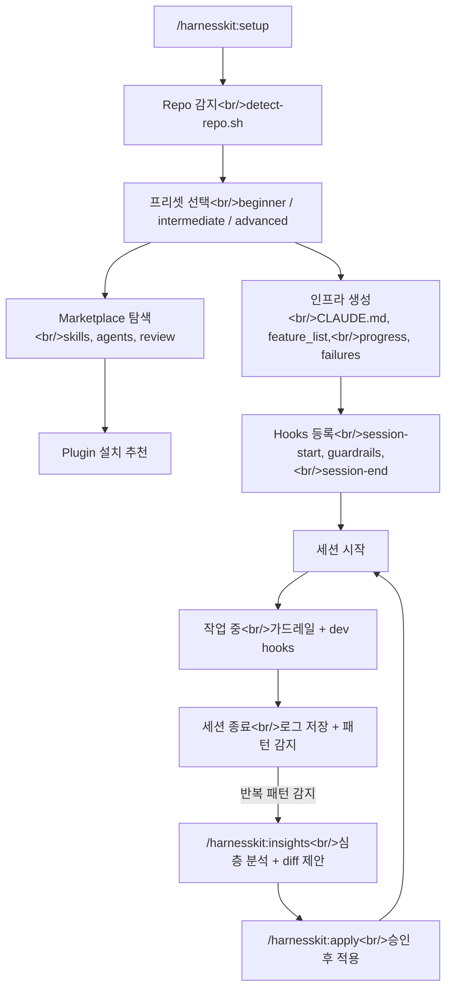

## 개요

HarnessKit은 **zero-based vibe coder를 위한 Claude Code Plugin**이다. Anthropic의 "Effective harnesses for long-running agents" 아티클과 기존 harness engineering 구현체들(autonomous-coding, claude-harness 등)을 분석한 뒤, 장점을 수용하고 단점을 개선하는 방향으로 설계했다. 핵심 사이클은 **감지 -> 설정 -> 관찰 -> 개선**이며, 총 19시간에 걸쳐 설계 스펙부터 v0.1.0 구현까지 완료했다.

<!--more-->

## 설계: Harness Engineering이란

### 배경

Vibe coding에서 AI agent는 세션이 끝나면 모든 맥락을 잃는다. feature_list.json에 `passes: false`를 기록하고, progress 파일로 핸드오프하고, failures.json으로 실패를 학습하는 **인프라**를 세션 바깥에 구축해야 agent가 일관성을 유지한다. 이것이 harness engineering의 핵심이다.

기존 구현체들의 문제는 명확했다:
- repo 속성을 수동으로 파악해야 한다
- 경험 수준에 관계없이 동일한 가드레일을 적용한다
- 한번 설정하면 개선 루프가 없다

### 설계 원칙: Marketplace First, Customize Later

초기 설계에서는 skill seed 템플릿을 플러그인 내부에 두고 `/skill-builder`로 생성하는 방식이었다. 하지만 논의 과정에서 **"바퀴를 재발명하지 말자"**는 원칙이 확립되었다:

> "이미 나온 강력한 plugin이 있다면 그대로 차용하겠다"

이에 따라 skills/agents 템플릿을 모두 제거하고, marketplace에서 검증된 plugin을 먼저 탐색/설치한 뒤, 사용 패턴을 분석하여 부족한 영역만 `/skill-builder`로 커스터마이즈하는 구조로 전환했다.



## 구현: 4개 Plan 하루 완성

### Plan 1: Plugin Skeleton + Repo Detection

Plugin 매니페스트(`plugin.json`)와 repo 자동 감지 스크립트가 핵심이다. `detect-repo.sh`는 파일 존재 패턴만으로 language, framework, package manager, test framework, linter를 판별한다. 토큰 소비 0.

```bash
# detect-repo.sh 핵심 로직 (발췌)
TOOL=$(echo "$INPUT" | jq -r '.tool_name' 2>/dev/null || echo "")
[ "$TOOL" != "Bash" ] && exit 0

CMD=$(echo "$INPUT" | jq -r '.tool_input.command // ""' 2>/dev/null || echo "")
```

프리셋은 3단계로 나뉜다:

| 프리셋 | 가드레일 | 브리핑 | 넛지 임계값 |
|--------|----------|--------|-------------|
| beginner | 강 (대부분 BLOCK) | 상세 (full) | 2세션 |
| intermediate | 균형 (core BLOCK, 일부 WARN) | 요약 (concise) | 3세션 |
| advanced | 최소 (대부분 WARN/PASS) | 한 줄 (minimal) | 5세션 |

### Plan 2: File Generation + Toolkit

`init.md` skill이 모든 harness 인프라 파일을 생성한다. CLAUDE.md는 `base.md` + framework 템플릿 + preset 필터로 조합된다. `.claudeignore`는 감지된 프레임워크에 맞는 제외 패턴을 적용한다.

Dev hooks도 여기서 등록된다:
- `post-edit-lint.sh` -- PostToolUse: 파일 수정 후 자동 lint
- `post-edit-typecheck.sh` -- PostToolUse: .ts/.tsx 수정 후 tsc 실행
- `pre-commit-test.sh` -- PreToolUse: git commit 전 테스트 (beginner만)

### Plan 3: Hooks System (TDD)

가장 까다로웠던 부분. 세 개의 core hook을 TDD로 구현했다.

**guardrails.sh (PreToolUse)**: stdin으로 JSON을 받아 패턴 매칭:

```json
{"tool_name": "Bash", "tool_input": {"command": "git push --force origin main"}}
```

프리셋별 룰 매트릭스:

| 패턴 | Beginner | Intermediate | Advanced |
|------|----------|--------------|----------|
| `sudo` | BLOCK | BLOCK | BLOCK |
| `rm -rf /` | BLOCK | BLOCK | BLOCK |
| `.env` 쓰기 | BLOCK | BLOCK | WARN |
| `git push --force` | BLOCK | BLOCK | WARN |
| `git reset --hard` | BLOCK | WARN | PASS |
| `it.skip`, `test.skip` | WARN | PASS | PASS |

**session-start.sh (SessionStart)**: progress, features, failures를 읽어 프리셋에 맞는 브리핑을 출력한다.

**session-end.sh (Stop)**: `current-session.jsonl` scratch 파일을 읽어 세션 로그를 생성하고 failures.json을 업데이트한다.

### Plan 4: Insights + Apply

`/harnesskit:insights`는 축적된 세션 데이터를 5가지 차원에서 분석한다:
1. 에러 패턴 (반복 에러, root cause)
2. Feature 진행도 (완료율, 병목)
3. 가드레일 활동 (BLOCK/WARN 빈도)
4. Toolkit 사용 현황 (어떤 plugin이 쓰이는가)
5. 프리셋 적합도 (승급/강등 조건)

거절된 제안은 `insights-history.json`에 기록되어 동일 category + target 조합을 10세션간 억제한다.

## 문제 해결

### session-end.sh grep 파이프 실패

`grep`이 매칭 결과가 없으면 exit code 1을 반환하는데, `grep ... | jq -s ...` 파이프에서 이 문제가 발생했다. `|| echo "[]"` fallback이 부분 출력(`[]\n[]`)을 만들어 `jq --argjson`이 깨졌다.

**해결**: grep 결과를 변수에 먼저 담고(`|| true`), 비어있지 않을 때만 jq로 파이핑.

### 사용자 프로젝트에 직접적 영향이 없다는 피드백

초기 스펙은 `.harnesskit/` 내부 파일만 생성했다. 사용자 입장에서는 "harness를 설치했는데 코딩할 때 차이를 못 느끼겠다"는 문제가 있었다.

> "초기 repo에는 직접 설치하는 형태를 기대했는데 여태 이야기한 것으로는 그런 직접적 반영이 안되는 느낌이야"

**해결**: Section 9 전체를 추가하여 Harness Toolkit Generation을 정의. Marketplace plugin 탐색/설치, dev hooks 구성, dev commands 등록, agent 추천까지 포함시켰다. 이후 "Marketplace First, Customize Later"로 한번 더 리팩터링.

### Insights 자동 실행 vs 수동 트리거

사용자는 처음에 hooks가 자동으로 `/insights`를 실행하는 형태를 기대했다.

> "처음엔 hooks로 /insights를 실행하고 제안하는 형태를 가정했는데 혹시 다른 형태인가요?"

**해결**: Hybrid 방식으로 합의. Shell hooks는 토큰 0으로 반복 패턴만 감지하고 넛지를 출력. 실제 `/insights`는 사용자가 수동으로 트리거하면 Claude가 심층 분석. 진단(내장 insights)과 처방(HarnessKit insights)을 분리.

## 커밋 로그

| 메시지 | 변경 |
|--------|------|
| docs: add HarnessKit design spec and harness engineering research guide | 설계 스펙 초안 |
| docs: resolve spec review issues (10/10 fixed, approved) | 스펙 리뷰 10건 반영 |
| docs: add Harness Toolkit generation, file impact matrix, v2 roadmap | Section 9 추가 + v2 로드맵 |
| docs: integrate /skill-builder for skill generation and improvement | skill-builder 연동 |
| docs: add 'Curate Don't Reinvent' principle across all toolkit areas | 외부 위임 원칙 |
| docs: add 4 implementation plans for HarnessKit v0.1.0 | Plan 1-4 작성 |
| feat: initialize plugin skeleton with manifest and directory structure | plugin.json + 디렉토리 구조 |
| feat: add beginner/intermediate/advanced preset definitions | 3단계 프리셋 JSON |
| feat: add repo detection script with test suite | detect-repo.sh + 11개 테스트 |
| feat: add /harnesskit:setup skill with detection, preset selection, and reset mode | setup skill |
| feat: add orchestrator agent for multi-step flow coordination | orchestrator agent |
| test: add integration test for setup flow components | setup flow 19개 테스트 |
| feat: add CLAUDE.md templates (base + nextjs + fastapi + react-vite + django + generic) | 6개 CLAUDE.md 템플릿 |
| feat: add .claudeignore and feature_list starter templates | .claudeignore + starter.json |
| feat: add skill seed templates for /skill-builder generation | 8개 seed 템플릿 |
| feat: add agent templates (planner, reviewer, researcher, debugger) | 4개 agent 템플릿 |
| feat: add dev hooks (auto-lint, auto-typecheck, pre-commit-test) | PostToolUse/PreToolUse dev hooks |
| feat: add dev command skills (test, lint, typecheck, dev) and update manifest | 4개 dev command skills |
| feat: add init skill -- orchestrates all harness + toolkit generation | init.md |
| test: add template validation tests for init | 34개 템플릿 검증 테스트 |
| test: add fixtures for hooks testing | mock JSON/JSONL fixtures |
| feat: add guardrails hook with preset-aware blocking rules | guardrails.sh + 7개 테스트 |
| feat: add session-start hook with preset-aware briefing | session-start.sh + 3개 테스트 |
| feat: add session-end hook with log saving, failure tracking, and nudge detection | session-end.sh + 5개 테스트 |
| test: add hooks integration test -- full session lifecycle | 6개 통합 테스트 |
| feat: add /harnesskit:status skill -- quick dashboard | status.md |
| feat: add /harnesskit:insights skill -- analysis, report, and proposal generation | insights.md |
| feat: add /harnesskit:apply skill -- proposal review and application | apply.md |
| feat: register all skills in plugin manifest | plugin.json 최종 업데이트 |

## 인사이트

**Subagent-Driven Development의 위력**: 4개 Plan을 subagent에게 task 단위로 위임하고, spec compliance review + code quality review 2단계 검증을 거쳤다. 하루 만에 85개 테스트가 통과하는 v0.1.0을 완성할 수 있었던 핵심 요인이다.

**"Marketplace First" 원칙의 진화**: 처음에는 seed 템플릿을 직접 작성하고 `/skill-builder`로 커스터마이즈하는 설계였다. 하지만 "이미 좋은 plugin이 있는데 왜 만드나?"라는 사용자 피드백으로 전환했다. skill/agent 템플릿을 모두 제거하고 marketplace 우선 탐색으로 바꾼 것은 상당한 코드 삭제를 수반했지만, 유지보수 부담을 크게 줄였다.

**Shell Hook의 0-token 설계**: guardrails, session-start, session-end 모두 순수 bash + jq로 구현하여 Claude API 호출 없이 동작한다. 세션당 토큰 소비를 최소화하면서도 위험 행동 차단, 브리핑, 로그 수집을 자동화할 수 있었다.

**v2를 위한 데이터 파이프라인 확보**: v1의 진짜 가치는 기능 자체보다 데이터 축적 구조다. session-logs, failures.json, insights-history.json이 쌓이면 v2에서 agent 자동 생성, skill 자동 생성, 프리셋 자동 조정이 가능해진다. v1은 v2의 토대다.
