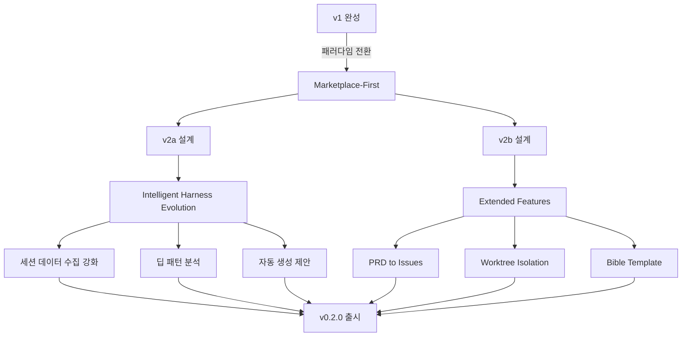

## 개요

[이전 글: #1 — Zero-Based Vibe Coder를 위한 Adaptive Harness Plugin 설계와 구현](/posts/2026-03-20-harnesskit-dev1/)

v1이 85개 테스트를 통과하며 완성된 직후, 근본적인 질문이 떠올랐다 — "기존 마켓플레이스 플러그인이 있는데 굳이 커스텀 템플릿을 만들어야 하나?" 이 질문이 26시간 마라톤 세션의 방향을 결정했다.

<!--more-->



---

## Marketplace-First 패러다임 전환

### 배경

v1에는 12개 이상의 커스텀 스킬/에이전트 템플릿이 있었다 — nextjs, python-fastapi, common, generic 등 8개 스킬 템플릿과 planner, reviewer, researcher, debugger 4개 에이전트 템플릿. 이 템플릿들은 유지보수 부담이 컸고, Claude Code 플러그인 마켓플레이스에 이미 검증된 플러그인들이 존재했다.

### 구현

핵심 커밋 하나가 이 전환을 말해준다: **모든 커스텀 스킬/에이전트 템플릿 삭제**. 대신 HarnessKit은 마켓플레이스 플러그인을 **큐레이션**하고, insights 데이터가 정당화할 때만 `/skill-builder`를 통해 커스텀 스킬을 생성하는 방식으로 전환했다.

> "Curate, Don't Reinvent" — 바퀴를 다시 발명하지 말고, 검증된 것을 큐레이션하자

init, apply, insights 스킬 모두 이 원칙에 맞게 재작성되었다.

---

## v2a: Intelligent Harness Evolution

### 배경

v1의 관찰 시스템은 기본적인 세션 로그 수집에 그쳤다. v2a는 수집된 데이터에서 **패턴을 분석하고 자동으로 개선안을 제안**하는 지능형 진화 시스템을 목표로 했다.

브레인스토밍 과정에서 3가지 핵심 결정이 내려졌다:
- **점진적 복잡도** — insights 데이터를 보고 언제 진화할지 판단
- **diff 기반 제안** — 변경사항을 diff로 제안하고, 사용자가 승인 후 적용
- **최소한의 커맨드** — "많은 커맨드가 좋은 사용성을 의미하지 않는다"

### 구현

v2a 스펙은 5가지 핵심 기능을 정의했다:

1. **세션 데이터 수집 강화** — tool call sequence, 시간 분포, 플러그인 사용 패턴
2. **딥 패턴 분석** — time-sink 감지, 반복 행동 식별, coverage gap 분석
3. **자동 생성 제안** — 사용 패턴 기반으로 agent, skill, hook 자동 생성 제안
4. **리뷰 내재화 파이프라인** — 마켓플레이스 플러그인 → 데이터가 정당화하면 커스텀 대체
5. **A/B 테스트 통합** — `/skill-builder`와 연동한 스킬 품질 비교

```python
# v2a 세션 종료 시 데이터 추출 예시 (base.md 로깅 프로토콜)
# tool call sequence, time distribution, plugin usage를 자동 기록
```

구현은 subagent-driven development로 진행되어 7개 태스크로 분할 실행했다.

---

## v2b: Extended Harness Features

### PRD to GitHub Issues (`/harnesskit:prd`)

PRD 문서를 받아 GitHub 이슈로 분해하고 `feature_list.json`에 동기화하는 스킬이다. vibe coder가 요구사항을 체계적으로 관리할 수 있게 돕는다.

### Worktree Isolation (`/harnesskit:worktree`)

하네스 인식 git worktree 관리 스킬이다. 병렬 개발을 위한 격리 환경을 제공하되, 기존 Claude Code의 worktree 기능을 활용하여 처음부터 만들지 않았다 — marketplace-first 원칙의 연장선이다.

### Bible Template — 설계 진화의 흥미로운 사례

Bible은 하네스 엔지니어링 원칙을 담은 큐레이션된 템플릿이다. 처음에는 사용자가 자유롭게 확장 가능하도록 설계했으나, 세션 중 중요한 우려가 제기되었다:

> "사용자가 자유롭게 추가하면 일관성 없는 가이드라인으로 플러그인 품질이 떨어지지 않을까?"

이 피드백으로 Bible은 **플러그인 관리자만 업데이트할 수 있는 상수(constant) 큐레이션 템플릿**으로 재설계되었다. 품질 저하 방지를 위한 의도적 제약이다.

---

## 플러그인 포맷 구조 변경

Claude Code 공식 플러그인 포맷으로의 전환이 2라운드에 걸쳐 진행되었다:

1. **1차**: `harnesskit/` 중첩 디렉토리 → `skills/SKILL.md` 플랫 구조
2. **2차**: `skills/setup.md` → `skills/setup/SKILL.md` 디렉토리 기반 구조 (공식 컨벤션)

26개 이상의 파일이 영향을 받은 대규모 리팩토링이었다.

### 제품화

마지막 단계는 HarnessKit을 실제 배포 가능한 제품으로 만드는 것이었다:
- Production-grade README와 MIT 라이선스
- **Privacy Policy**: "No external data collection" — 모든 데이터가 `.harnesskit/`에 로컬 저장
- 버전 0.2.0으로 범프, 모든 v2b 스킬 등록
- 모노레포 감지 강화: `detect-repo.sh`가 backend/frontend 하위 디렉토리 스캔

---

## 커밋 로그

| 메시지 | 변경 |
|--------|------|
| refactor: marketplace-first approach — remove skill/agent templates | 대규모 삭제 + 재작성 |
| docs: add HarnessKit v2a design spec | v2a 설계 문서 |
| docs: add v2a implementation plan | 구현 계획 |
| feat(v2a): add tool usage and plugin logging protocol | base.md 로깅 |
| test(v2a): add session data fixtures | 테스트 픽스처 |
| feat(v2a): add tool call sequence, time distribution extraction | 데이터 추출 |
| feat(v2a): add v2a config schema initialization | 설정 스키마 |
| feat(v2a): add v1→v2a migration path | 마이그레이션 |
| feat(v2a): add review internalization, custom toolkit to status | 상태 대시보드 |
| feat(v2a): add agent/hook/review proposals to apply | 적용 실행 경로 |
| feat(v2a): add time-sink, repeated actions, coverage gap analysis | 딥 분석 |
| docs: add HarnessKit v2b design spec | v2b 설계 문서 |
| docs: redesign bible as constant curated template | Bible 재설계 |
| feat(v2b): add curated bible template | Bible 구현 |
| feat(v2b): add /harnesskit:prd skill | PRD 스킬 |
| feat(v2b): add /harnesskit:worktree skill | Worktree 스킬 |
| feat(v2b): add A/B eval comparison to apply | 스킬 비교 평가 |
| feat(v2b): register prd + worktree skills, bump to 0.2.0 | 버전 범프 |
| docs: add production README, LICENSE, .gitignore | 제품화 |
| refactor: restructure to official Claude Code plugin format | 1차 구조 변경 |
| docs: add privacy policy | 개인정보 보호 |
| refactor: restructure skills/agents to official plugin format | 2차 구조 변경 |
| feat: enhance detect-repo.sh for monorepos | 모노레포 감지 |

---

## 인사이트

26시간 마라톤 세션에서 가장 인상적이었던 것은 **"Curate, Don't Reinvent"** 원칙의 채택이다. v1에서 공들여 만든 12개 이상의 템플릿을 과감하게 삭제하고 마켓플레이스 우선 접근으로 전환한 것은 기술적으로도, 철학적으로도 큰 전환이었다. Bible 템플릿의 설계 변경도 흥미로운 사례다 — "사용자에게 자유를 주자"에서 "품질을 위해 의도적으로 제약하자"로의 전환은 플러그인 생태계의 성숙도와 관련된 중요한 교훈이다. v2a/v2b의 핵심은 결국 **데이터 기반 판단** — insights가 정당화할 때만 커스텀 스킬을 생성하고, 그 전까지는 검증된 마켓플레이스 플러그인을 사용하는 것이다.
