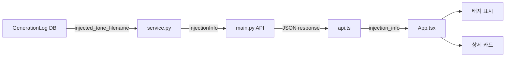
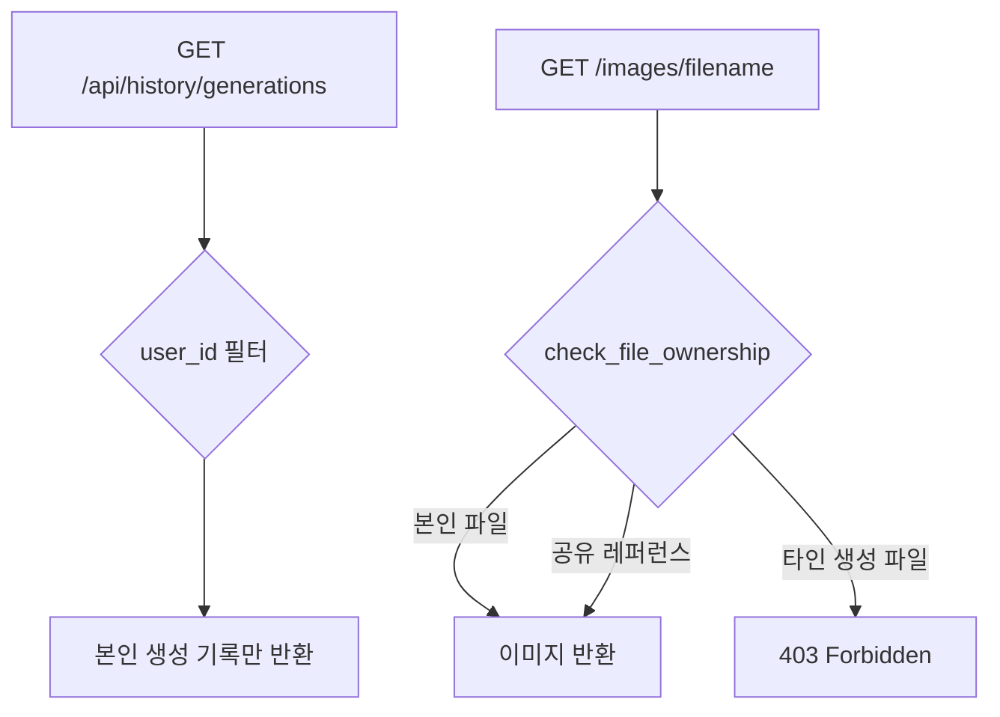

## 개요

이전 글에서 Google OAuth 로그인 벽을 구현한 데 이어, 이번에는 **자동 주입(tone/angle) 시스템의 시각적 피드백**, **사용자별 데이터 격리**, 그리고 **이미지 생성 병렬화**를 구현했다. PRD v3에서 정의한 비교 생성(톤+앵글 vs 톤만) 결과를 사용자가 직관적으로 확인할 수 있도록 UI를 대폭 개선했다.

[이전 글: #1 — 하이브리드 이미지 검색 개발기 — Google OAuth 로그인 월 구현](/posts/2026-03-17-hybrid-search-auth/)

<!--more-->

## 자동 주입 레퍼런스 시각화

### 배경

PRD v3의 핵심 기능 중 하나는 시스템이 자동으로 톤/앵글 레퍼런스를 주입하는 것이다. 그런데 실제로 어떤 이미지가 톤/앵글로 적용되었는지 사용자에게 전혀 보이지 않는 상태였다. 생성된 이미지를 보면서 "왜 이 색감이 나왔지?"라는 의문이 생겨도 확인할 방법이 없었다.

### 구현

백엔드부터 프론트엔드까지 풀스택으로 injection 정보 파이프라인을 구성했다.



**백엔드** — `schemas.py`에 `InjectionInfo` 모델을 추가하고, `service.py`에서 DB의 `injected_tone_filename`, `injected_angle_filename` 필드를 읽어 구조화된 응답으로 변환했다:

```python
def _build_injection_info_from_row(row: dict) -> InjectionInfo | None:
    tone_fn = row.get("injected_tone_filename")
    angle_fn = row.get("injected_angle_filename")
    reason = row.get("injection_reason")
    if not tone_fn and not angle_fn:
        return None
    return InjectionInfo(
        tone=InjectedReference(filename=tone_fn, score=0.0) if tone_fn else None,
        angle=InjectedReference(filename=angle_fn, score=0.0) if angle_fn else None,
        reason=reason,
    )
```

**프론트엔드** — 두 가지 시각 요소를 추가했다:

1. **썸네일 배지**: 이미지 카드 좌상단에 `톤`, `앵글` 태그를 amber/blue 컬러로 표시
2. **상세 모달 카드**: `GeneratedImageDetail.tsx`에서 실제 주입된 레퍼런스 이미지를 썸네일로 보여주고, 주입 사유(reason)를 텍스트로 표시

### 디버깅 — 주입 레퍼런스가 표시되지 않는 문제

처음 구현 후 실제 생성을 해봤는데, 톤/앵글 표시가 전혀 나오지 않았다. 스크린샷을 찍어 확인해보니 `injection_info`가 null로 오고 있었다. 원인은 `_build_injection_info_from_row`에서 DB 컬럼명과 실제 row 키가 불일치한 것이었다. row dict에서 올바른 필드를 매핑하도록 수정하여 해결했다.

추가로, 레퍼런스 이미지 선택 로직에서 `ImageCategories` 구조체가 제대로 로드되지 않는 문제도 발견했다. `images.json` 로딩 시 `categories` 필드를 파싱하도록 수정:

```python
categories = ImageCategories(**img["categories"]) if "categories" in img else ImageCategories()
doc = ImageDocument(
    id=img["id"],
    filename=img["filename"],
    labels=labels,
    categories=categories,
)
```

### 비교 이미지 hover 오버레이

톤+앵글 적용 버전과 톤만 적용 버전을 비교하기 위해, 이미지 카드에 hover 시 비교 이미지를 오버레이로 보여주는 기능을 구현했다. 처음에는 별도 카드로 표시하는 방안도 검토했지만, 사용성을 고려해 같은 카드 위에 hover 효과로 전환하는 방식을 채택했다.

구현 과정에서 hover 시 `톤` 텍스트 위치가 이동하는 문제가 있었다. CSS `position: absolute`로 고정하여 해결했고, 텍스트 크기도 가독성을 위해 키웠다.

## 검색 결과 가로 스크롤 전환

### 배경

"참조찾기" 버튼으로 열리는 검색 결과 팝업이 `grid grid-cols-6` 기반의 세로 그리드였다. 이미지가 많아지면 스크롤이 길어지고 한눈에 비교하기 어려웠다.

### 구현

팝업 내 3개 그리드(구성요소별, 통합결과, 전체보기)를 모두 **단일 가로 행 + 좌우 화살표** 방식으로 교체했다.

`ScrollableRow` 컴포넌트를 새로 만들어 재사용:

```tsx
const ScrollableRow: React.FC<{ children: React.ReactNode }> = ({ children }) => {
    const scrollRef = useRef<HTMLDivElement>(null);
    const [canScrollLeft, setCanScrollLeft] = useState(false);
    const [canScrollRight, setCanScrollRight] = useState(true);

    const scroll = (direction: 'left' | 'right') => {
        const el = scrollRef.current;
        if (!el) return;
        const scrollAmount = 540; // ~3 cards
        el.scrollBy({ left: direction === 'left' ? -scrollAmount : scrollAmount, behavior: 'smooth' });
    };

    return (
        <div className="relative group/scroll">
            {canScrollLeft && (
                <button onClick={() => scroll('left')}
                    className="absolute left-0 top-0 bottom-0 z-10 w-10 ...">
                    <ChevronLeft size={20} />
                </button>
            )}
            <div ref={scrollRef} onScroll={updateScrollState}
                className="flex gap-2.5 overflow-x-auto custom-scrollbar-hidden">
                {children}
            </div>
            {canScrollRight && (
                <button onClick={() => scroll('right')} className="...">
                    <ChevronRight size={20} />
                </button>
            )}
        </div>
    );
};
```

기존 `grid grid-cols-6 gap-2.5`를 모두 `<ScrollableRow>`로 교체하고, 각 이미지 카드를 `flex-shrink-0 w-[200px]`로 고정 너비를 설정했다. 처음에는 160px이었으나 가로 레이아웃에서 좀 더 큰 카드가 적합하여 200px로 조정했다.

## 사용자별 데이터 격리

### 배경

멀티유저 환경에서 생성 기록이 `user_id` 필터 없이 전체 조회되고 있었다. 다른 사용자의 생성 이미지가 히스토리에 노출될 수 있는 보안 문제가 있었다.

### 구현

단순한 표시 제한이 아닌, 백엔드 레벨에서의 완전한 격리를 구현했다:



1. **`get_generation_history(user_id=...)`** — 쿼리에 `user_id` 필터 추가
2. **`check_file_ownership(filename, user_id)`** — 생성/업로드 파일의 소유권 확인. 레퍼런스 이미지(`image_ref_*` 디렉토리)는 공유 자산이므로 허용, `gen_*`/`upload_*` 파일은 소유자만 접근 가능
3. **`/images/{filename}` 엔드포인트** — 인증 의존성 추가 및 소유권 검증

```python
async def check_file_ownership(filename: str, user_id: int) -> bool:
    """Check if a generated or uploaded file belongs to the given user.
    Returns True if the file is not found in any table (legacy/orphan data).
    """
```

## 비동기 병렬 생성

### 배경

PRD 2.4에서 비교 생성(톤+앵글 vs 톤만)을 `Promise.all`로 병렬 실행하도록 명시했지만, 실제 백엔드는 순차 호출(`await` 연속)로 구현되어 있었다. 4장 생성 기준으로 대기 시간이 두 배였다.

### 구현

`asyncio.gather`와 `asyncio.Semaphore`를 활용하여 Gemini API 호출을 병렬화했다:

```python
import asyncio

# Limit concurrent Gemini API calls
_gemini_semaphore = asyncio.Semaphore(4)
```

기존에 for 루프로 순차 생성하던 `_generate_batch` 함수를 리팩토링하여, 비교 모드일 때 두 배치를 `asyncio.gather`로 동시 실행하도록 변경했다. Semaphore로 동시 호출 수를 제한하여 API rate limit을 방지했다.

## DB 관리 편의 — `make db-clean`

개발 중 데이터를 자주 초기화해야 했는데, 매번 sqlite3 명령어를 수동으로 입력하는 것이 번거로웠다. Makefile에 `db-clean` 타겟을 추가:

```makefile
db-clean:
	@sqlite3 data/logs.db "DELETE FROM search_logs; DELETE FROM image_selections; DELETE FROM generation_logs; DELETE FROM manual_uploads;"
	@echo "Cleared: search_logs, image_selections, generation_logs, manual_uploads"
```

스키마와 `alembic_version`, `images`, `users` 테이블은 보존하고 로그 데이터만 정리한다.

## 커밋 로그

| 메시지 | 변경 |
|--------|------|
| perf: parallelize image generation with async Gemini API | `backend/src/main.py` |
| data: update images.json with refreshed labels and metadata | `data/images.json` |
| feat: comparison hover overlay, injection badges, and scrollable search results | `App.tsx`, `GeneratedImageDetail.tsx`, `SearchResultsPopup.tsx` |
| feat: add comparison images and injection info to generation history API | `schemas.py`, `api.ts` |
| chore: add db-clean Makefile target for clearing log tables | `Makefile` |
| chore: remove stale docs and skill file, update gitignore | `.gitignore` 외 4파일 |
| fix: isolate user data — filter history by user_id and enforce image ownership | `database/__init__.py`, `service.py`, `main.py` |
| docs: update README with auto-injection system | `README.md` 외 2파일 |

## 인사이트

- **시각적 피드백은 디버깅 도구이기도 하다** — 톤/앵글 주입 정보를 UI에 표시하는 과정에서 실제 주입 로직의 버그(카테고리 미로딩, 필드명 불일치)를 여럿 발견했다. "보이게 만들면 버그도 보인다."
- **데이터 격리는 처음부터** — 멀티유저 기능을 나중에 추가하면 기존 쿼리를 전부 뒤져야 한다. `user_id` 필터는 테이블 설계 단계부터 넣어두는 것이 맞다.
- **Semaphore로 API 병렬화 제어** — `asyncio.gather`만으로는 rate limit에 걸릴 수 있다. `Semaphore(4)` 같은 동시성 제한을 함께 사용해야 안정적이다.
- **가로 스크롤 UX** — 이미지 검색 결과는 세로 그리드보다 가로 스크롤이 직관적이다. 특히 카테고리별 결과를 한 줄씩 보여주면 비교가 쉬워진다. hover 시 나타나는 화살표 버튼은 스크롤바를 숨기면서도 조작성을 유지하는 좋은 패턴이다.
