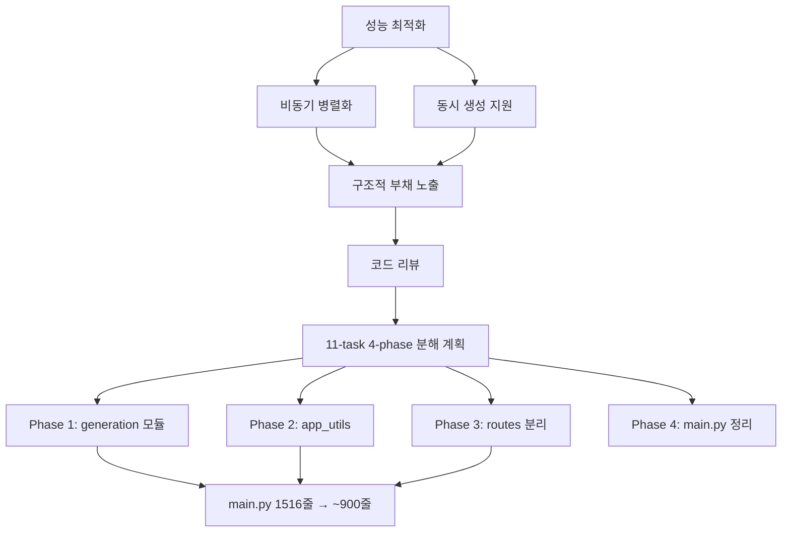
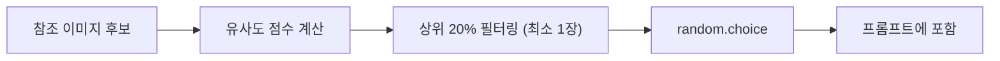

## 개요

[이전 글: #2](/posts/2026-03-20-hybrid-search-dev2/)

"동작하게 만들기"에서 "제대로 만들기"로의 전환이 이번 세션의 주제다. Gemini API를 비동기로 전환하고 동시 생성을 지원한 뒤, 성능 최적화 과정에서 드러난 구조적 부채를 해결하기 위해 1,516줄의 main.py를 11-task, 4-phase 계획으로 체계적으로 분해했다.

<!--more-->



---

## 비동기 병렬화

### 배경

기존 이미지 생성 파이프라인은 `async def` 안에서 동기 `client.models.generate_content()`를 호출하고 있었다 — 이벤트 루프 전체를 블로킹하는 구조였다. `google-genai` SDK v1.62.0에 이미 비동기 API `client.aio.models.generate_content()`가 존재했으나 사용하지 않고 있었다.

### 구현: 2단계 병렬화

```python
# 1단계: 배치 내 병렬화 — 개별 이미지 동시 생성
async def _generate_single_image(...):
    async with semaphore:  # Semaphore(4) — API rate limit 준수
        return await client.aio.models.generate_content(...)

results = await asyncio.gather(
    *[_generate_single_image(item) for item in batch]
)

# 2단계: 배치 간 병렬화 — primary + comparison 동시 실행
primary, comparison = await asyncio.gather(
    generate_batch(primary_items),
    generate_batch(comparison_items)
)
```

4장 이미지 + comparison 모드 기준, 기존에 8번 순차 호출하던 것이 `Semaphore(4)` 제한 내에서 병렬 실행되어 체감 속도가 크게 개선되었다.

### 프론트엔드: 동시 생성 지원

비동기 전환 후에도 UI가 생성 중 버튼을 잠그고 있었다. `generating: boolean`을 `generatingCount: number`로 교체하여 여러 생성 요청을 동시에 실행할 수 있게 했다.

```typescript
// Before: boolean lock — 한 번에 하나만
const [generating, setGenerating] = useState(false);

// After: counter — 동시 생성 허용
const [generatingCount, setGeneratingCount] = useState(0);
// 버튼은 프롬프트가 비어있을 때만 disable
// 스피너: "2건 이미지 생성 중..."
```

---

## 생성 품질 개선

### 프롬프트 구조화

Gemini에 보내는 프롬프트에 **구조화된 섹션 헤더**(`### 핵심 생성 주제 ###`, 구분선 등)를 추가하여 지시사항을 명확하게 전달하도록 개선했다. 디테일 뷰에 full prompt preview를 추가하여 실제로 어떤 프롬프트가 전송되었는지 확인 가능해졌다.

### 참조 이미지 랜덤화

기존에는 tone/angle 참조 이미지로 항상 가장 높은 점수의 이미지 하나만 선택했다 — 같은 쿼리에 항상 같은 결과가 나오는 결정론적 구조였다.



`random.choice`로 상위 20% 풀에서 랜덤 선택하도록 변경했다. search-based와 fallback 경로 모두, tone과 angle 참조 모두에 적용된다. 작은 변경이지만 생성 결과의 다양성이 크게 향상되었다.

---

## 구조적 리팩토링: main.py 분해

### 코드 리뷰 결과

비동기 코드 추가 후 요청한 코드 리뷰에서 main.py의 문제가 명확해졌다:
- **1,516줄에 7가지 책임**: app bootstrap, auth, image serving, search, generation injection, Gemini service, generation orchestration
- **APIRouter 미사용** — 모든 라우트가 `@app.get`/`@app.post`로 직접 등록
- **전역 가변 상태** — `images_data`, `hybrid_pipeline` 등이 모듈 레벨 변수
- **145줄짜리 `_generate_single_image` 함수**

### 분해 계획

11개 태스크, 4단계 분해 계획을 수립:

| Phase | 추출 대상 | 결과 |
|-------|----------|------|
| 1 | `generation/injection.py`, `prompt.py`, `service.py` | 생성 핵심 로직 분리 |
| 2 | `app_utils.py` | 공유 유틸리티 |
| 3 | `routes/auth.py`, `meta.py`, `images.py`, `search.py`, `history.py`, `generation.py` | APIRouter 기반 라우트 분리 |
| 4 | main.py 최종 정리 | ~100줄 목표 |

### 실행과 기술적 결정

Subagent-driven development로 실행 — 각 태스크를 별도 서브에이전트에 위임하고 2단계 리뷰(스펙 준수 + 코드 품질)를 거쳤다.

리팩토링 중 내린 핵심 결정들:
- **전역 변수 → 명시적 파라미터**: `images_data`, `hybrid_pipeline` 등을 읽는 함수는 명시적 파라미터를 받도록 변경
- **순환 import 방지**: 라우트 모듈은 main.py의 전역 변수를 함수 본문 내에서만 접근 (모듈 스코프에서 접근하지 않음)
- **`_gemini_semaphore`**: `generation/service.py`로 이동, main.py에서 삭제
- **발견된 기존 버그**: `get_image_file_legacy`에 auth dependency 누락 — 동작 보존 리팩토링이므로 기록만 하고 수정하지 않음

### 결과

세션 종료 시점에 Phase 1 완료, Phase 2 완료, Phase 3 진행 중 (`routes/auth.py`, `routes/meta.py` 추출 완료). main.py가 **1,516줄에서 약 900줄로 감소**했고, 나머지 라우트 추출이 남아있다.

---

## 커밋 로그

| 메시지 | 변경 |
|--------|------|
| feat: allow concurrent image generations by removing button lock | boolean → counter, 동시 생성 UI |
| feat: add structured prompt headers and full prompt preview | 프롬프트 품질 + 디버깅 |
| feat: randomize tone/angle ref selection from top 20% candidates | 생성 다양성 확보 |
| refactor: extract generation/injection.py from main.py | Phase 1 — 인젝션 분리 |
| refactor: extract generation/prompt.py from main.py | Phase 1 — 프롬프트 분리 |
| refactor: extract generation/service.py from main.py | Phase 1 — Gemini 서비스 분리 |
| refactor: extract app_utils.py with shared utilities | Phase 2 — 유틸리티 분리 |
| refactor: extract routes/auth.py with APIRouter | Phase 3 — 인증 라우트 분리 |

---

## 인사이트

이번 세션은 **성능 최적화가 구조적 리팩토링을 촉발하는** 전형적인 패턴을 보여준다. 비동기 병렬화를 추가하면서 main.py의 복잡도가 임계점을 넘었고, 코드 리뷰가 체계적 분해의 계기가 되었다. 리팩토링에서 가장 중요했던 원칙은 **동작 보존** — 기존 버그도 의도적으로 유지하면서 구조만 변경하는 것이다. 참조 이미지 랜덤화는 한 줄 변경에 가까운 작은 수정이지만, 생성 AI 파이프라인에서 "결정론적 최적"보다 "확률적 다양성"이 사용자 경험에 더 크게 기여한다는 점을 보여주는 좋은 사례다.
