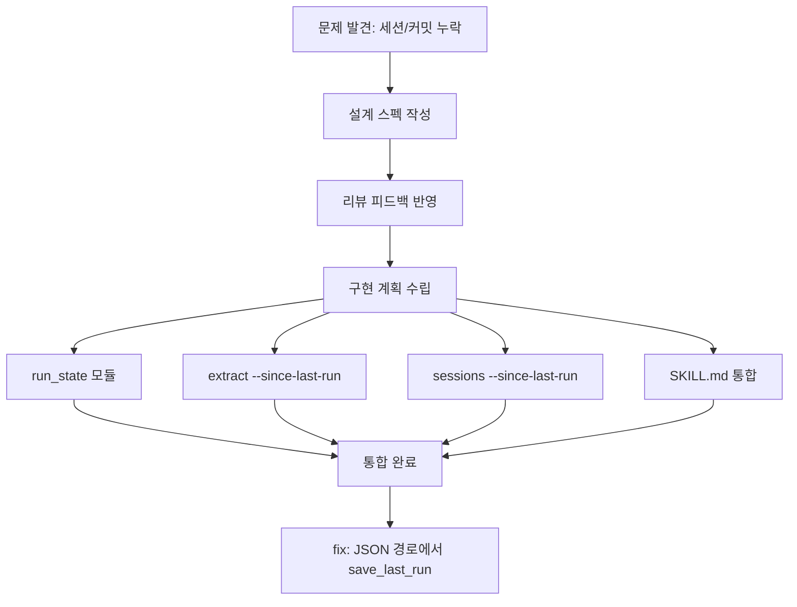
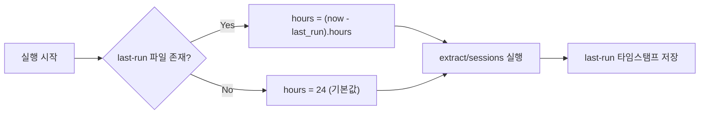

## 개요

[이전 글: #1 — Sessions 명령어와 개발일지 자동화](/posts/2026-03-17-log-blog-sessions/)

log-blog 스킬을 실행하면서 근본적인 문제를 발견했다 — 브라우저 히스토리만 추출되고, Claude Code 세션과 커밋 기반 개발일지가 초기 리스트에 포함되지 않았다. 이 문제를 해결하기 위해 두 흐름을 통합하고, `--since-last-run` 플래그로 시간 범위를 자동 관리하도록 개선했다.

<!--more-->



---

## 문제 발견

log-blog 스킬을 실행하면 Step 1에서 `extract --json`으로 브라우저 히스토리만 추출했다. Claude Code 세션과 git 커밋 기반 개발일지는 별도로 요청해야만 리스트업되었다.

사용자의 피드백이 직접적이었다:

> "커밋을 내가 안했을 리가 없는데 혹시 오류아냐?"
> "세션과 커밋 기반으로는 왜 포스트를 만들지 않나요?"

매일 두 작업(브라우저 히스토리 + 개발일지)을 실행할 것이므로, 초기부터 양쪽 모두 리스트업하는 통합 흐름이 필요했다.

---

## 설계: Unified Skill Flow

### 핵심 결정

브레인스토밍에서 3가지 접근을 검토한 후, **시간은 늘어나더라도 매번 양쪽 모두 실행하는 방식**을 선택했다:

- Step 1에서 `extract`와 `sessions --list`를 **동시에 실행**
- Step 3에서 브라우저 기반 항목과 dev log 후보를 **함께 제시**
- 사용자 승인 후 브라우저 항목은 `fetch`로, dev log은 `sessions --project`로 진행

### --since-last-run 추적

`--hours 24` 기본값의 문제: 이틀에 한 번 실행하면 하루치가 누락되고, 하루에 두 번 실행하면 중복된다.

해결책: **last-run 타임스탬프 기반 시간 범위 자동 계산**



---

## 구현

### run_state 모듈

`run_state.py`를 추가하여 last-run 타임스탬프를 관리한다:

```python
# 마지막 실행 시각 로드/저장
def load_last_run() -> Optional[datetime]: ...
def save_last_run(timestamp: datetime) -> None: ...
def hours_since_last_run() -> Optional[float]: ...
```

타임스탬프는 프로젝트 루트의 `.log-blog-last-run` 파일에 ISO 8601 형식으로 저장된다.

### extract/sessions에 --since-last-run 플래그 추가

`extract`와 `sessions` 명령어 모두에 `--since-last-run` 플래그를 추가했다. 이 플래그가 설정되면:
1. `hours_since_last_run()`으로 마지막 실행 이후 경과 시간 계산
2. 해당 시간을 `--hours` 값으로 사용
3. last-run 파일이 없으면 기본 24시간으로 폴백
4. 실행 완료 후 `save_last_run()` 호출

### SKILL.md 통합

스킬 문서를 수정하여 Step 1에서 양쪽 명령어를 동시에 실행하도록 통합했다:

```bash
# Step 1: 동시 실행
uv run log-blog extract --json --since-last-run
uv run log-blog sessions --list --since-last-run
```

Step 3의 사용자 확인 화면에도 dev log 후보가 자동으로 포함되도록 스킬 문서를 개선했다.

### 버그 수정: JSON 출력 경로에서 save_last_run

마지막 커밋은 `--json` 플래그 사용 시 `save_last_run`이 호출되지 않는 버그를 수정했다. JSON 출력 경로에서도 실행 완료 후 타임스탬프가 저장되도록 했다.

---

## 커밋 로그

| 메시지 | 변경 |
|--------|------|
| docs: add unified skill flow and session data bug fix design spec | 설계 스펙 |
| docs: address spec review feedback | 리뷰 피드백 반영 |
| docs: add last-run tracking feature to unified skill flow spec | last-run 추적 스펙 추가 |
| docs: add implementation plan | 구현 계획 |
| feat: add run_state module for last-run timestamp tracking | run_state 모듈 |
| feat: add --since-last-run flag to extract command | extract 플래그 |
| feat: add --since-last-run flag to sessions command | sessions 플래그 |
| feat: unify browser history and dev log flows in SKILL.md | 스킬 통합 |
| fix: save_last_run in JSON output path of extract command | JSON 경로 버그 수정 |

---

## 인사이트

이번 개선의 트리거는 "사용자가 직접 도구를 사용하면서 느낀 불편함"이었다. 개발자가 자신의 도구를 직접 사용하는 dogfooding의 가치를 다시 확인했다. `--since-last-run` 플래그는 기술적으로 단순하지만 (타임스탬프 저장/로드), 사용자 경험에 미치는 영향은 크다 — "몇 시간을 지정할까?" 라는 판단을 완전히 제거해준다. 설계 → 리뷰 → 구현의 3단계 워크플로우가 9개 커밋에 걸쳐 체계적으로 진행된 점도 log-blog 프로젝트의 성숙도를 보여준다.
