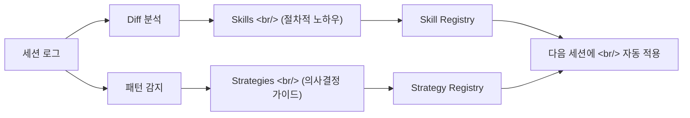
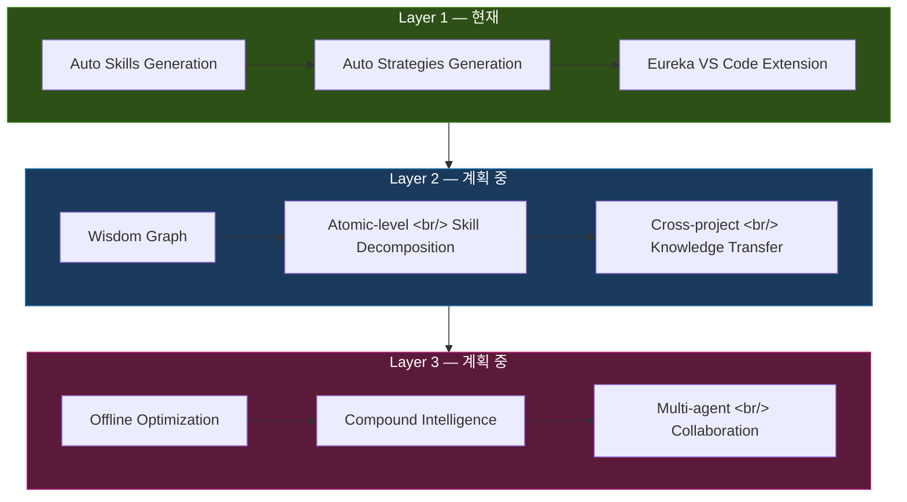

## 개요

AI 코딩 에이전트가 코드를 생성하는 시대는 이미 왔다. 하지만 한 가지 근본적인 질문이 남는다 — **에이전트 자체는 어떻게 개선되는가?** 현재 대부분의 AI 코딩 도구는 매 세션마다 백지 상태에서 시작한다. 이전 작업에서 무엇을 배웠든 다음 세션에는 반영되지 않는다.

[MEGA Code](https://www.megacode.ai/)는 이 문제를 정면으로 공략한다. 세션 로그에서 **Skills**(재사용 가능한 노하우)과 **Strategies**(의사결정 가이드)를 자동 추출하여, AI 코딩 에이전트가 경험을 축적하고 스스로 진화하는 인프라를 구축하겠다는 야심 찬 프로젝트다. 벤치마크에 따르면 토큰 사용량을 1/5로 줄이면서도 구조적 품질을 3배 향상시켰다고 한다.

이 포스트에서는 MEGA Code의 핵심 개념, 3-Layer 아키텍처, 벤치마크 주장에 대한 분석, 그리고 다른 메타러닝 접근법과의 비교까지 깊이 파고들어 본다.

<!--more-->

## 핵심 개념: Skills vs Strategies

MEGA Code의 자기진화 메커니즘은 두 가지 핵심 개념 위에 세워져 있다. 얼핏 비슷해 보이지만, 역할과 추출 방식이 근본적으로 다르다.

### Skills — 재사용 가능한 노하우

**Skill**은 특정 작업을 수행하는 구체적인 절차적 지식이다. "어떻게(How) 하는가"에 대한 답이다.

예시:
- **React 컴포넌트 테스트 작성**: Jest + React Testing Library로 컴포넌트를 마운트하고, user event를 시뮬레이션하고, assertion을 작성하는 일련의 패턴
- **API 에러 핸들링 표준화**: try-catch 블록의 구조, 에러 타입별 분기, 사용자에게 노출할 메시지 포맷
- **DB 마이그레이션 스크립트 생성**: 스키마 변경을 감지하고, rollback 가능한 마이그레이션 파일을 생성하는 절차

Skill은 diff에서 추출된다. 에이전트가 코드를 수정한 이력(before → after)을 분석하여 "이 패턴은 반복적으로 적용할 수 있는 노하우다"라고 판단되면 Skill로 등록된다.

### Strategies — 의사결정 가이드

**Strategy**는 상황에 따른 판단 기준이다. "무엇을(What) 선택하는가"에 대한 답이다.

예시:
- **상태 관리 도구 선택**: 컴포넌트 수가 10개 미만이면 React Context, 글로벌 상태가 복잡하면 Zustand, 서버 상태가 주요하면 TanStack Query
- **테스트 전략 결정**: 유틸 함수는 unit test, API 통합은 integration test, 핵심 유저 플로우는 E2E test
- **리팩토링 우선순위**: 변경 빈도가 높은 파일부터, 의존성이 적은 모듈부터

Strategy는 반복적인 편집 패턴에서 추출된다. 에이전트가 비슷한 상황에서 일관된 선택을 반복하면, 그 선택 기준이 Strategy로 추상화된다.

## Diff-to-Skill 파이프라인

MEGA Code의 핵심 엔진은 세션 로그의 diff를 Skill로 변환하는 파이프라인이다. 단순히 코드 변경 이력을 저장하는 것이 아니라, 추상화된 재사용 가능한 지식으로 승격시키는 과정이다.

### 파이프라인 동작 방식

1. **Diff 수집**: 에이전트가 코드를 수정할 때마다 before/after diff가 기록된다
2. **패턴 클러스터링**: 유사한 diff들을 그룹핑한다. 예를 들어 "API 호출 후 에러 핸들링 추가" 패턴이 3번 이상 반복되면 하나의 클러스터로 묶인다
3. **추상화**: 구체적인 변수명, 함수명을 제거하고 패턴의 본질만 남긴다. `fetchUser` → `fetchEntity`, `UserError` → `EntityError`처럼 일반화한다
4. **Skill 생성**: 추상화된 패턴에 이름, 설명, 적용 조건, 코드 템플릿을 부여하여 Skill로 등록한다
5. **검증**: 생성된 Skill이 새로운 세션에서 실제로 유용한지 피드백 루프를 통해 검증한다

이 과정에서 흥미로운 점은 **양적 임계치**가 존재한다는 것이다. 한 번 나타난 패턴은 무시되고, 반복적으로 등장하는 패턴만 Skill로 승격된다. 이는 노이즈를 줄이고 실제로 재사용 가능한 지식만 축적하는 효과가 있다.

### Strategy 추출 메커니즘

Strategy 추출은 더 상위 수준에서 이루어진다. Diff 자체가 아니라 에이전트의 **선택 패턴**을 분석한다.

예를 들어, 에이전트가 상태 관리 코드를 작성할 때:
- 세션 A: 작은 앱 → Context API 선택
- 세션 B: 복잡한 앱 → Zustand 선택
- 세션 C: 서버 상태 중심 → TanStack Query 선택

이런 선택 이력이 쌓이면, "앱의 복잡도와 상태 특성에 따라 상태 관리 도구를 다르게 선택하라"는 Strategy가 자동 생성된다.

## 3-Layer 아키텍처

MEGA Code는 점진적으로 복잡도를 높여가는 3단계 아키텍처를 제시한다.

### Layer 1: Auto Skills & Strategies + Eureka (현재)

현재 가용한 단계다. 세션 로그에서 Skills과 Strategies를 자동 추출하고, VS Code extension인 **Eureka**를 통해 개발자에게 제공한다.

**Eureka Extension의 역할:**
- 추출된 Skills/Strategies를 VS Code 내에서 직접 조회 가능
- 현재 작업 컨텍스트에 맞는 Skill을 자동 추천
- 개발자가 수동으로 Skill을 편집하거나 새로 등록할 수 있는 인터페이스 제공
- 프로젝트별 Skills/Strategies를 분리 관리

Eureka는 단순한 코드 스니펫 관리 도구가 아니다. **컨텍스트 인식 기반 추천**이 핵심이다. 현재 열려 있는 파일, 커서 위치, 최근 편집 이력을 분석하여 관련된 Skill을 능동적으로 제안한다.

### Layer 2: Wisdom Graph (계획 중)

Skill과 Strategy를 **원자 수준(atomic level)**으로 분해하겠다는 구상이다. 하나의 복합 Skill을 더 작은 단위로 쪼개고, 이들 사이의 관계를 그래프로 모델링한다.

**왜 원자 모듈화가 중요한가?**

현재 Layer 1의 Skills은 상대적으로 거친(coarse-grained) 단위다. "React 컴포넌트 테스트 작성"이라는 Skill은 내부적으로 여러 세부 단계를 포함한다. 문제는 이 중 일부만 필요한 상황에서도 전체 Skill이 적용되어 불필요한 토큰을 소비한다는 것이다.

Wisdom Graph는 이를 해결한다:
- `컴포넌트 마운트` → `이벤트 시뮬레이션` → `assertion 작성` 각각이 독립된 atomic Skill
- 필요한 부분만 선택적으로 조합
- 프로젝트 간 지식 전이(cross-project knowledge transfer)가 가능해짐

이는 마치 Unix 철학의 "한 가지 일을 잘하는 작은 프로그램들을 조합한다"와 유사하다.

### Layer 3: Offline Optimization + Compound Intelligence (계획 중)

가장 야심 찬 단계다. 에이전트가 실시간 세션이 아닌 **오프라인 상태**에서 기존 Skill/Strategy를 최적화하고, 여러 에이전트의 경험을 통합하는 **Compound Intelligence**를 구현한다.

이 단계가 실현되면:
- 에이전트 A가 프론트엔드에서 배운 노하우를 에이전트 B의 백엔드 작업에 적용
- 밤 사이에 축적된 Skill들을 자동으로 정리, 병합, 최적화
- 다수의 에이전트가 협업하는 Multi-agent 시나리오에서 지식 공유

## 벤치마크 분석

MEGA Code 팀이 공개한 벤치마크 수치는 인상적이다:

| 지표 | Baseline | MEGA Code | 개선율 |
|------|----------|-----------|--------|
| 토큰 사용량 | 897K | 169K | **81% 감소 (약 1/5)** |
| 구조적 품질 | 1x | 3x | **3배 향상** |

### 토큰 사용량 1/5 감소

이 수치가 의미하는 바는 크다. 토큰 사용량 감소는 곧:
- **비용 절감**: LLM API 호출 비용이 1/5로 감소
- **속도 향상**: 처리할 토큰이 줄어들면 응답 속도도 빨라짐
- **컨텍스트 윈도우 효율화**: 제한된 컨텍스트 윈도우를 더 유용한 정보에 할당 가능

토큰 감소의 메커니즘은 명확하다. Skills가 축적되면 에이전트는 매번 "처음부터 생각"할 필요 없이 검증된 패턴을 바로 적용한다. 이는 Few-shot prompting과 유사하지만, 프롬프트 자체를 줄이는 것이 아니라 **불필요한 탐색과 시행착오를 제거**하는 방식이다.

### 구조적 품질 3배 향상

"구조적 품질"의 정확한 측정 기준이 공개되지 않은 점은 주의가 필요하다. 가능한 측정 방식으로는:
- 코드 구조의 일관성 (naming convention, 파일 구조 등)
- 아키텍처 패턴 준수율
- 테스트 커버리지
- 코드 리뷰 통과율

벤치마크 조건 (어떤 프로젝트, 어떤 태스크, 비교 대상 모델 등)의 세부사항이 추가로 공개되면 더 정확한 평가가 가능할 것이다.

## 다른 메타러닝 접근법과의 비교

MEGA Code만이 "AI 에이전트의 자기 개선"에 도전하는 것은 아니다. 유사한 방향의 프로젝트들과 비교해 보자.

### HarnessKit의 Observe-Improve Loop

HarnessKit은 에이전트의 행동을 관찰(observe)하고, 결과를 기반으로 프로세스를 개선(improve)하는 루프를 구축한다.

- **공통점**: 세션 이력을 분석하여 에이전트를 개선한다
- **차이점**: HarnessKit은 프로세스 레벨의 개선에 집중하고, MEGA Code는 지식(Skills/Strategies) 레벨의 개선에 집중한다. HarnessKit이 "어떤 순서로 작업하면 효율적인가"를 최적화한다면, MEGA Code는 "어떤 코드 패턴을 적용하면 좋은가"를 최적화한다.

### Superpowers의 Memory 시스템

Superpowers는 에이전트에게 장기 기억(long-term memory)을 부여한다.

- **공통점**: 세션 간 지식 유지
- **차이점**: Superpowers의 memory는 상대적으로 raw한 형태의 기억 저장에 가깝고, MEGA Code의 Skills/Strategies는 구조화되고 추상화된 지식이다. Memory가 "일기장"이라면, Skills은 "교과서"에 가깝다.

### Claude의 Memory/CLAUDE.md

Anthropic의 Claude Code도 `CLAUDE.md`와 memory 시스템을 통해 프로젝트 컨텍스트를 유지한다.

- **공통점**: 세션 간 지식 전달
- **차이점**: Claude의 memory는 사용자가 명시적으로 관리하고 `CLAUDE.md`에 기록하는 반면, MEGA Code는 자동 추출을 목표로 한다. 자동화 수준에서 MEGA Code가 더 야심 찬 접근이지만, 자동 추출의 정확도와 노이즈 관리가 핵심 과제가 된다.

| 접근법 | 지식 형태 | 추출 방식 | 추상화 수준 |
|--------|----------|----------|------------|
| MEGA Code | Skills + Strategies | 자동 (diff 분석) | 높음 |
| HarnessKit | Process 패턴 | 반자동 (observe loop) | 중간 |
| Superpowers | Raw memory | 자동 (세션 기록) | 낮음 |
| Claude Memory | 구조화된 노트 | 수동 + 반자동 | 중간 |

## 비판적 분석

### 강점

1. **명확한 문제 정의**: "에이전트가 경험에서 배우지 못한다"는 문제를 정확히 짚었다
2. **Skills/Strategies 구분**: 절차적 지식과 의사결정 지식을 분리한 프레임워크가 깔끔하다
3. **점진적 아키텍처**: 3-Layer 접근으로 현재 가용한 가치와 미래 비전을 분리했다
4. **인상적인 벤치마크**: 토큰 1/5 감소는 실질적 비용 절감으로 직결된다

### 약점과 열린 질문

1. **Skill 품질 관리**: 자동 추출된 Skill이 실제로 유용한지 어떻게 검증하는가? 잘못된 패턴이 Skill로 등록되면 오히려 코드 품질이 하락할 수 있다
2. **프로젝트 종속성**: 프로젝트 A에서 추출한 Skill이 프로젝트 B에서도 유효한가? 도메인별 컨벤션이 다른 환경에서 cross-project transfer의 한계는?
3. **Skill 충돌**: 두 Skill이 상충하는 패턴을 권장하면 어떻게 처리하는가?
4. **벤치마크 투명성**: 구조적 품질 3배 향상의 측정 기준과 실험 조건이 충분히 공개되지 않았다
5. **Layer 2/3의 실현 가능성**: Wisdom Graph와 Compound Intelligence는 아직 구상 단계다. Layer 1의 성과가 곧 Layer 2/3의 성공을 보장하지는 않는다
6. **Lock-in 리스크**: Skills/Strategies가 MEGA Code 플랫폼에 종속되면, 다른 도구로의 전환이 어려워질 수 있다

### 기대와 우려

가장 기대되는 부분은 **Wisdom Graph**다. 현재 AI 코딩 도구들의 가장 큰 문제 중 하나인 "맥락 없는 코드 생성"을 해결할 잠재력이 있다. 하지만 원자 수준의 Skill 분해가 실제로 가능한지, 그리고 그 분해된 조각들을 의미 있게 재조합할 수 있는지는 여전히 증명되지 않았다.

## 빠른 링크

- [MEGA Code 공식 사이트](https://www.megacode.ai/) — 제품 소개 및 접근 신청
- [Eureka VS Code Extension](https://marketplace.visualstudio.com/) — VS Code Marketplace에서 검색
- [MEGA Code 벤치마크 리포트](https://www.megacode.ai/) — 토큰 감소 및 품질 향상 데이터

## 인사이트

1. **"경험에서 배우는 에이전트"는 AI 코딩의 다음 전선이다.** 코드 생성 능력은 이미 범용화되고 있다. 차별화는 "더 잘 생성하는가"가 아니라 "사용할수록 더 나아지는가"에서 나올 것이다.

2. **Skills vs Strategies 구분은 인간 전문가의 지식 구조를 반영한다.** 숙련된 개발자는 "어떻게 구현하는가"(절차적 지식)와 "무엇을 선택하는가"(전략적 판단)를 별도로 축적한다. MEGA Code가 이 구조를 자동화하려는 시도는 이론적으로 건전하다.

3. **토큰 효율성은 비용 문제를 넘어 품질 문제다.** 컨텍스트 윈도우가 제한된 상황에서, 불필요한 토큰을 줄이면 정말 중요한 정보에 더 많은 공간을 할당할 수 있다. 이는 단순한 비용 절감이 아니라 에이전트의 "주의력" 개선이다.

4. **자동 추출의 정확도가 핵심 병목이 될 것이다.** 잘못된 Skill이 등록되면 에이전트가 잘못된 패턴을 반복 적용한다. "쓰레기가 들어가면 쓰레기가 나온다(GIGO)"의 메타 버전이 발생할 수 있다. Skill의 품질 관리 메커니즘이 MEGA Code의 성패를 가를 것이다.

5. **경쟁은 "누가 먼저 자기진화 루프를 완성하는가"로 수렴하고 있다.** MEGA Code, HarnessKit, Superpowers 모두 같은 방향을 가리키고 있다. 최종 승자는 가장 빠른 팀이 아니라, 가장 신뢰할 수 있는 자기진화 루프를 구축한 팀이 될 가능성이 높다.
