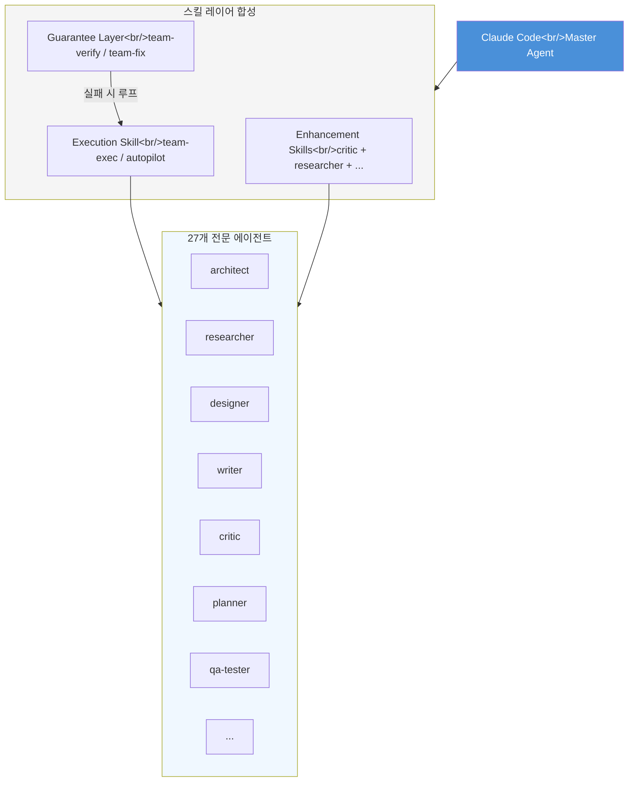
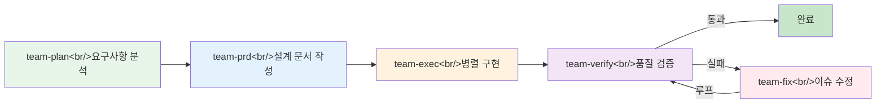
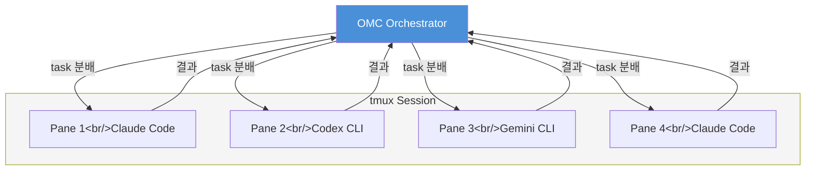

## 개요

[oh-my-claudecode(OMC)](https://github.com/Yeachan-Heo/oh-my-claudecode)는 Claude Code 위에서 동작하는 **Teams-first 멀티 에이전트 오케스트레이션 프레임워크**다. GitHub 스타 10,400개 이상, v4.9.0까지 빠르게 진화하면서 "Zero config, Zero learning curve"를 표방한다. 핵심 아이디어는 단순하다 — Claude Code의 마스터 에이전트를 교체하는 것이 아니라, **스킬 주입(skill injection)** 방식으로 27개 전문 에이전트와 28개 스킬을 레이어링한다. 이 글에서는 OMC의 아키텍처, Team Mode 파이프라인, 오케스트레이션 모드 비교, 그리고 언제 써야 하는지까지 깊이 파고든다.

<!--more-->

## 스킬 합성 아키텍처 — 레이어링 모델

OMC가 다른 Claude Code 확장과 근본적으로 다른 점은 **모드 전환(mode switching)**이 아닌 **레이어 합성(layer composition)**이라는 것이다.

전통적인 접근은 "플래닝 모드로 전환 → 실행 모드로 전환"처럼 컨텍스트를 끊고 모드를 바꾼다. OMC는 Claude Code의 스킬 시스템을 활용해 행동을 **겹쳐 쌓는다**.

스킬 합성의 공식은 다음과 같다:

```
[Execution Skill] + [0-N Enhancement Skills] + [Optional Guarantee]
```

구체적으로:

- **Execution Skill**: 실제 작업을 수행하는 핵심 스킬 (예: `team-exec`, `autopilot`)
- **Enhancement Skills**: 부가 행동을 주입하는 스킬 (예: `critic`, `researcher`)
- **Optional Guarantee**: 품질 보증 레이어 (예: `team-verify`, `team-fix`)

이 방식의 최대 장점은 **컨텍스트가 끊기지 않는다**는 것이다. 플래닝에서 실행으로 넘어갈 때 이전 대화의 맥락이 그대로 유지된다. Claude Code의 마스터 에이전트가 살아 있는 상태에서 스킬이 행동을 주입하기 때문이다.



## Team Mode 파이프라인

v4.1.7부터 canonical이 된 **Team Mode**는 OMC의 핵심 오케스트레이션 모드다. 5단계 스테이지드 파이프라인으로 구성된다.



각 단계를 자세히 보면:

### 1. team-plan — 요구사항 분석

사용자의 요청을 받아 **architect**와 **planner** 에이전트가 협력한다. 작업 범위를 정의하고, 필요한 파일과 모듈을 식별하며, 의존성 그래프를 만든다.

### 2. team-prd — 설계 문서 작성

plan 결과를 바탕으로 **writer**와 **designer** 에이전트가 PRD(Product Requirements Document)를 생성한다. 이 문서는 이후 단계의 컨텍스트로 주입된다.

### 3. team-exec — 병렬 구현

PRD에 따라 여러 에이전트가 **병렬로** 구현을 수행한다. 여기서 tmux CLI 워커가 활용될 수 있다. 각 워커는 독립적인 Claude Code(또는 Codex, Gemini) 프로세스로 split-pane에서 실행된다.

### 4. team-verify — 품질 검증

**qa-tester**와 **critic** 에이전트가 구현 결과를 검증한다. 테스트 실행, 코드 리뷰, 요구사항 충족 여부를 확인한다.

### 5. team-fix — 수정 루프

검증에서 발견된 이슈를 수정한다. 수정 후 다시 team-verify로 돌아가는 **루프 구조**다. 이 루프가 OMC의 품질 보증 메커니즘의 핵심이다.

## 오케스트레이션 모드 비교

OMC는 Team Mode 외에도 여러 오케스트레이션 모드를 제공한다. 각 모드는 다른 상황에 최적화되어 있다.

| 모드 | Magic Keyword | 특징 | 적합한 상황 |
|------|---------------|------|-------------|
| **Team Mode** | `team` | 5단계 파이프라인, 병렬 실행 | 멀티 파일/멀티 역할 대규모 작업 |
| **omc team (CLI)** | — | CLI에서 직접 Team Mode 실행 | CI/CD 통합, 스크립트 자동화 |
| **ccg** | — | Codex + Gemini + Claude 삼중 모델 어드바이저 | 설계 의사결정, 아키텍처 리뷰 |
| **Autopilot** | `autopilot`, `ap` | 자율 실행, 최소 개입 | 반복 작업, 잘 정의된 태스크 |
| **Ultrawork** | `ulw` | 고강도 집중 모드 | 복잡한 단일 파일 리팩토링 |
| **Ralph** | `ralph`, `ralplan` | 계획 중심, 신중한 실행 | 기획 단계, 리스크가 높은 변경 |

### ccg — Tri-Model Advisor

특히 흥미로운 것은 `/ccg` 스킬이다. Claude Code 안에서 **Codex**와 **Gemini**의 의견을 함께 받아 Claude가 종합하는 구조다. 모델 간 관점 차이를 활용해 더 나은 의사결정을 유도한다.

### deep-interview — 코딩 전 소크라테스식 질문

코딩을 시작하기 전에 사용자에게 **반복적인 질문**을 던져 요구사항을 명확히 한다. "무엇을 만들 것인가"보다 "왜 만드는가", "어떤 제약이 있는가"를 먼저 파악한다.

## tmux CLI 워커와 멀티 모델 지원

v4.4.0에서 도입된 **tmux CLI Workers**는 OMC의 병렬 실행 능력을 극적으로 확장했다.



핵심 특징:

- **실제 프로세스 스폰**: 각 pane에서 독립적인 `claude`, `codex`, `gemini` CLI 프로세스가 실행된다
- **멀티 모델 라우팅**: 작업 특성에 따라 적절한 모델로 라우팅한다. Smart model routing으로 **토큰 비용 30-50% 절감**을 주장한다
- **시각적 모니터링**: tmux split-pane으로 각 워커의 진행 상황을 실시간으로 볼 수 있다
- **HUD Statusline**: 현재 활성 에이전트, 진행 단계, 토큰 사용량을 한눈에 보여준다

## Magic Keyword 시스템

OMC의 사용 경험에서 가장 눈에 띄는 것은 **magic keyword** 시스템이다. 복잡한 명령어 대신 자연어 키워드로 오케스트레이션 모드를 활성화한다.

| Keyword | 동작 |
|---------|------|
| `ralph` | Ralph 모드 활성화 — 신중한 계획 우선 |
| `ralplan` | Ralph의 플래닝 단계만 실행 |
| `ulw` | Ultrawork 모드 — 고강도 집중 |
| `plan` | 플래닝 스킬 활성화 |
| `autopilot` / `ap` | Autopilot 모드 — 자율 실행 |

이 키워드들은 Claude Code의 프롬프트에서 자연어로 사용할 수 있다:

```
"ralph, 이 프로젝트의 인증 시스템을 리팩토링해줘"
"ap 모든 테스트 파일에 타입 어노테이션 추가해"
```

## 3-Tier 메모리 시스템

장시간 세션에서 컨텍스트 유실은 AI 코딩 도구의 고질적 문제다. OMC는 3단계 메모리 시스템으로 이를 해결한다.

| 계층 | 용도 | 특징 |
|------|------|------|
| **Priority Memory** | 최우선 컨텍스트 | 항상 프롬프트에 주입, 프로젝트 규칙/제약 |
| **Working Memory** | 현재 작업 컨텍스트 | 세션 중 자동 업데이트, 진행 상태 추적 |
| **Manual Notes** | 사용자 지정 메모 | 수동 관리, 장기 보존 |

Priority Memory는 CLAUDE.md와 유사한 역할을 하지만, OMC가 자동으로 관리하며 에이전트 간에 공유된다. Working Memory는 Team Mode의 각 단계에서 자동으로 업데이트되어, 다음 단계의 에이전트가 이전 단계의 결정 사항을 알 수 있게 한다.

## 설치와 빠른 시작

설치는 Claude Code의 플러그인 시스템을 통해 이루어진다:

```bash
# 1. 플러그인 추가
/plugin marketplace add https://github.com/Yeachan-Heo/oh-my-claudecode

# 2. 설치
/plugin install oh-my-claudecode

# 3. 초기 설정
/omc-setup
```

설치 후 바로 사용할 수 있다. "Zero configuration"을 표방하는 만큼, `/omc-setup` 이후 추가 설정 없이 magic keyword로 바로 시작 가능하다.

npm 패키지명은 `oh-my-claude-sisyphus`이며, TypeScript(6.9M)와 JavaScript(5.2M)로 작성되어 있다.

## 트레이드오프 — OMC vs 순수 Claude Code

OMC가 만능은 아니다. 레이어를 쌓는 만큼 비용이 따른다.

### OMC를 써야 하는 경우

- **멀티 파일/멀티 역할 작업**: 프론트엔드 + 백엔드 + 테스트를 동시에 변경해야 할 때
- **장시간 세션**: 컨텍스트 유실이 문제가 되는 2시간 이상의 작업
- **계획이 중요한 작업**: 아키텍처 변경, 대규모 리팩토링처럼 먼저 생각하고 실행해야 하는 경우
- **팀 워크플로우 시뮬레이션**: 혼자 작업하지만 architect → developer → reviewer 흐름이 필요할 때

### 순수 Claude Code가 나은 경우

- **단순한 작업**: 함수 하나 수정, 버그 하나 수정 같은 작업에 Team Mode 파이프라인은 과도하다
- **토큰 비용이 민감한 경우**: 5단계 파이프라인은 순수 Claude Code 대비 **상당한 추가 토큰을 소비**한다
- **투명성이 중요한 경우**: 오케스트레이션 레이어가 추가될수록 "왜 이런 결정을 했는지" 추적이 어려워진다
- **빠른 반복이 필요한 경우**: plan → prd → exec → verify → fix 루프는 시간이 걸린다

### 핵심 트레이드오프 요약

| 항목 | OMC | 순수 Claude Code |
|------|-----|------------------|
| 토큰 비용 | 높음 (멀티 에이전트) | 낮음 |
| 작업 시간 | 길지만 품질 높음 | 빠르지만 단순 |
| 투명성 | 오케스트레이션 레이어로 낮음 | 높음 |
| 컨텍스트 유지 | 3-Tier 메모리로 우수 | 기본 수준 |
| 멀티 파일 작업 | 병렬 실행으로 강력 | 순차 처리 |
| 가드레일 | 자동 verify/fix 루프 | 수동 확인 |

## 비판적 분석

OMC는 인상적인 프로젝트지만, 몇 가지 점에서 냉정하게 볼 필요가 있다.

**코드베이스 규모에 대한 의문**. TypeScript 6.9M + JavaScript 5.2M은 "Zero config" 도구치고는 거대하다. 스킬 정의와 에이전트 프롬프트가 대부분이겠지만, 이 규모의 코드베이스는 유지보수 부담이 크다.

**"27개 에이전트"의 실체**. 27개 전문 에이전트가 실제로 얼마나 차별화된 행동을 하는지는 프롬프트 엔지니어링의 질에 달려 있다. `architect`와 `planner`의 경계, `critic`과 `qa-tester`의 차이가 실질적인지 검증이 필요하다.

**Smart model routing의 30-50% 절감 주장**. 이 수치의 벤치마크 조건이 명시되어 있지 않다. 단순 작업에서 작은 모델로 라우팅하면 절감되겠지만, 복잡한 작업에서의 재시도 비용은 포함되었는지 불분명하다.

**Guardrail 민감도**. team-verify → team-fix 루프가 과도하게 민감하면 불필요한 수정 사이클이 반복될 수 있다. 이는 토큰 낭비로 직결된다.

그럼에도 불구하고, OMC가 제시하는 **스킬 합성이라는 패러다임** 자체는 가치가 있다. 모드 전환 대신 레이어링으로 컨텍스트를 보존하면서 행동을 확장하는 접근은, AI 코딩 도구의 다음 단계로서 설득력이 있다. 특히 Team Mode의 plan → prd → exec → verify → fix 파이프라인은 소프트웨어 엔지니어링의 실제 워크플로우를 잘 반영하고 있다.

## 빠른 링크

- [oh-my-claudecode GitHub](https://github.com/Yeachan-Heo/oh-my-claudecode)
- [ROBOCO 소개 글](https://roboco.io/posts/oh-my-claudecode-distilled/)
- [npm: oh-my-claude-sisyphus](https://www.npmjs.com/package/oh-my-claude-sisyphus)

## 인사이트

OMC가 제시하는 **스킬 합성이라는 패러다임** 자체는 가치가 있다. 모드 전환 대신 레이어링으로 컨텍스트를 보존하면서 행동을 확장하는 접근은, AI 코딩 도구의 다음 단계로서 설득력이 있다. 특히 Team Mode의 plan → prd → exec → verify → fix 파이프라인은 소프트웨어 엔지니어링의 실제 워크플로우를 잘 반영하고 있다. 다만 이러한 복잡한 오케스트레이션이 실제로 순수 Claude Code 대비 어느 정도의 품질 향상을 가져오는지에 대한 정량적 벤치마크가 부족하다. "느낌"이 아닌 "수치"로 증명해야 할 시점이다.
