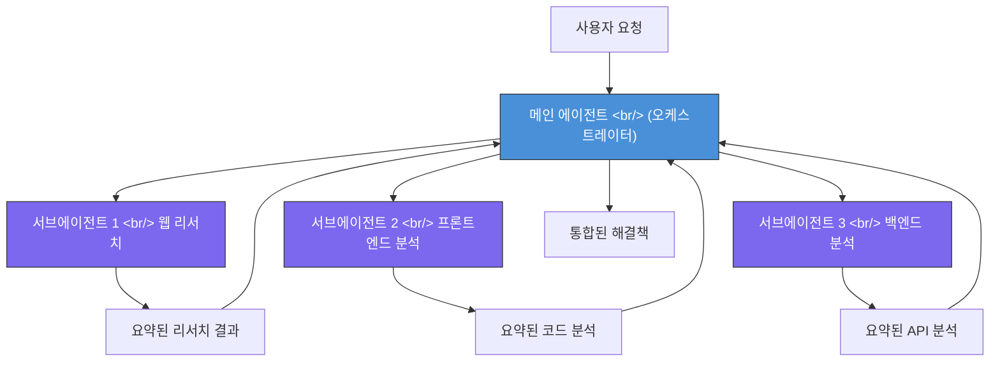
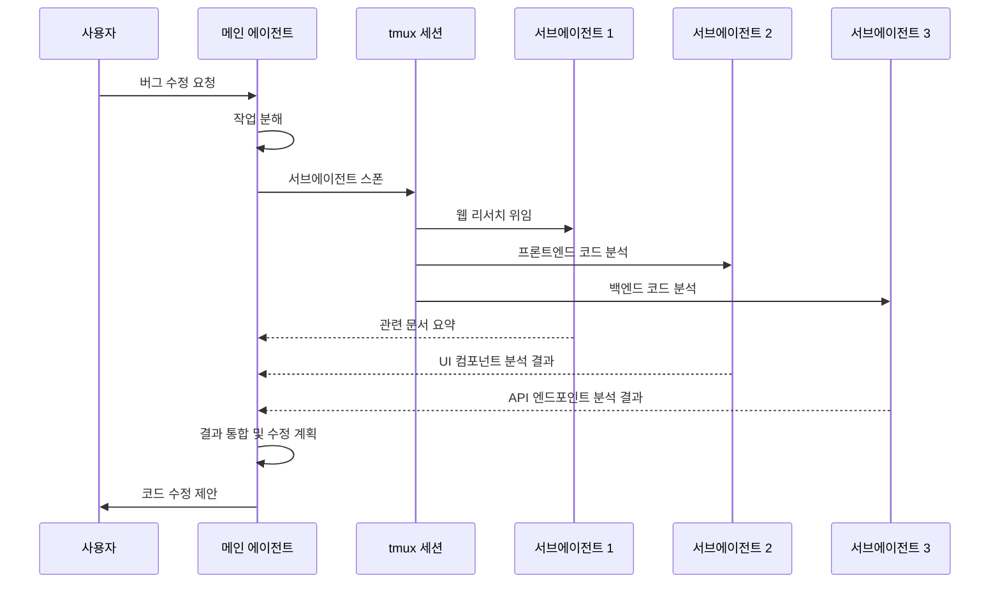

## 개요

AI 코딩 도구의 패러다임이 바뀌고 있다. 하나의 거대한 LLM이 모든 작업을 처리하던 시대에서, **여러 개의 경량 서브에이전트가 병렬로 리서치하고 메인 에이전트가 통합하는 아키텍처**로 전환되고 있다. OpenAI가 GPT 5.4 mini/nano를 "서브에이전트용으로 명시적 설계"했다고 발표한 것은 이 흐름이 단순한 트렌드가 아니라 산업 표준이 되었음을 의미한다. Cole Medin의 [The Subagent Era Is Officially Here](https://www.youtube.com/watch?v=GX_EsbcXfw8) 영상을 바탕으로, 서브에이전트 아키텍처의 핵심 개념과 실전 활용 전략을 깊이 있게 정리한다.

<!--more-->

## 왜 서브에이전트인가 — Context Rot 문제

### Context Rot이란

LLM은 context window에 많은 정보를 넣을수록 성능이 떨어진다. 이를 **context rot**이라 부른다. 200K 토큰 context window를 가진 모델이라 해도, 실제로 200K 토큰을 채우면 초반에 넣은 정보를 "잊거나" 중요도를 잘못 판단하는 현상이 발생한다.

이 문제는 AI 코딩 도구에서 특히 치명적이다:

- **대규모 코드베이스 분석**: 수십 개의 파일을 context에 넣으면, 정작 핵심 파일의 내용을 놓친다
- **멀티스텝 디버깅**: 프론트엔드 코드, 백엔드 코드, 에러 로그를 동시에 분석할 때 정보가 섞인다
- **웹 리서치 + 코드 수정**: 검색 결과와 코드를 함께 처리하면 두 작업 모두 품질이 떨어진다

### 서브에이전트가 해결하는 방식

서브에이전트 아키텍처는 이 문제를 근본적으로 해결한다. 각 서브에이전트는 **독립된 context window**를 가지므로, 자신이 맡은 작업에만 집중할 수 있다. 메인 에이전트는 각 서브에이전트의 결과 요약만 받으므로 context가 깔끔하게 유지된다.



핵심은 **context 격리**다. 각 서브에이전트가 10K 토큰씩 사용하더라도, 메인 에이전트에는 각각 1K 토큰 정도의 요약만 전달된다. 메인 에이전트의 context는 3K 토큰만 추가되는 셈이다.

## 서브에이전트 전용 모델 비교

OpenAI가 GPT 5.4 nano를 "서브에이전트용"으로 명시한 것은 업계 최초다. Google도 Gemini 3.1 Flash Light를 "intelligence at scale" 콘셉트로 출시하며 같은 방향으로 움직이고 있다.

### 주요 모델 스펙 비교

| 모델 | 처리 속도 | 입력 비용 (1M 토큰) | 출력 비용 (1M 토큰) | 주요 용도 |
|------|----------|-------------------|-------------------|----------|
| Claude Haiku 4.5 | 53 tok/s | $1.00 | $5.00 | 범용 서브에이전트 |
| GPT 5.4 nano | 188 tok/s | $0.20 | $1.00 | 전용 서브에이전트 |
| GPT 5.4 mini | ~120 tok/s | $0.40 | $2.00 | 중간 복잡도 작업 |
| Gemini 3.1 Flash Light | ~150 tok/s | $0.15 | $0.60 | 대규모 병렬 처리 |

GPT 5.4 nano의 수치가 눈에 띈다:

- **비용**: Claude Haiku 4.5 대비 **1/5 수준** — 서브에이전트를 5개 돌려도 같은 비용
- **처리량**: **3.5배 빠른 throughput** — 병렬 서브에이전트의 대기 시간이 크게 줄어든다
- **설계 철학**: "충분히 똑똑하되, 빠르고 저렴하게" — 서브에이전트에 최적화된 트레이드오프

### 왜 전용 모델이 필요한가

서브에이전트는 메인 에이전트와 성격이 다르다:

- **메인 에이전트**: 복잡한 추론, 계획 수립, 코드 생성 — 정확도가 최우선
- **서브에이전트**: 정보 수집, 코드 읽기, 패턴 탐색 — 속도와 비용이 최우선

GPT-4o나 Claude Sonnet 같은 대형 모델을 서브에이전트로 쓰면 비용이 급격히 증가한다. 3개의 서브에이전트를 5번 호출하면 15회의 LLM 호출이 발생하는데, 대형 모델로는 비현실적인 비용이 된다. nano급 모델이 서브에이전트 아키텍처를 경제적으로 실현 가능하게 만든 셈이다.

## 실전 아키텍처 — 서브에이전트는 어떻게 동작하는가

### Claude Code의 Agent Tool 방식

Claude Code는 서브에이전트 아키텍처의 **first mover**다. `Agent Tool`을 통해 서브에이전트를 생성하며, 각 서브에이전트는 독립된 context에서 파일 읽기, 검색, 분석 작업을 수행한다.



특히 Claude Code의 **Agent Team** 기능은 tmux를 활용해 여러 서브에이전트를 동시에 터미널 세션으로 스폰한다. 이 방식 덕분에 tmux에 대한 개발자들의 관심이 다시 높아지는 현상까지 나타났다.

### OpenAI Codex의 접근 방식

OpenAI Codex는 다른 방식을 취한다. 샌드박스 환경에서 에이전트를 실행하며, GPT 5.4 nano를 서브에이전트로 활용해 비용을 최소화한다. Claude Code가 로컬 터미널 기반이라면, Codex는 클라우드 샌드박스 기반이라는 차이가 있다.

두 접근의 핵심적인 차이:

| 특성 | Claude Code Agent Tool | OpenAI Codex |
|------|----------------------|--------------|
| 실행 환경 | 로컬 터미널 (tmux) | 클라우드 샌드박스 |
| 서브에이전트 모델 | Claude Haiku 4.5 | GPT 5.4 nano |
| 병렬화 방식 | tmux 세션 분할 | 컨테이너 기반 |
| 파일 접근 | 로컬 파일시스템 직접 접근 | 샌드박스 내 복사본 |
| 비용 구조 | API 호출 비용만 | 컴퓨팅 + API 비용 |

### 현재 서브에이전트를 지원하는 AI 코딩 도구들

서브에이전트는 더 이상 실험적 기능이 아니다. 주요 AI 코딩 도구들이 모두 채택했다:

- **Claude Code** — Agent Tool (first mover, 가장 성숙한 구현)
- **OpenAI Codex** — GPT 5.4 nano 기반 서브에이전트
- **Gemini CLI** — 실험적 서브에이전트 지원
- **GitHub Copilot** — 에이전트 모드에서 서브태스크 분할
- **Cursor** — Background Agent를 통한 병렬 처리
- **Open Code** — 오픈소스 구현체

## Best Practices — 서브에이전트 활용의 정석

Cole Medin이 영상에서 강조한 실전 팁은 매우 구체적이다.

### 서브에이전트를 써야 할 때: 리서치

서브에이전트의 최적 활용처는 **리서치**다:

1. **코드 분석**: "이 모듈의 의존성 구조를 파악해줘"
2. **웹 검색**: "이 에러 메시지의 해결 방법을 찾아줘"
3. **문서 탐색**: "이 라이브러리의 마이그레이션 가이드를 정리해줘"
4. **패턴 탐색**: "이 프로젝트에서 비슷한 구현이 있는지 찾아줘"

#### 실전 예시: 3개의 병렬 리서치 서브에이전트

Cole Medin이 소개한 실제 버그 수정 사례를 보자:

```
[버그] 사용자 프로필 업데이트 시 이미지가 저장되지 않는 문제

메인 에이전트의 작업 분해:
├── 서브에이전트 1: 웹 리서치
│   → "multer file upload not saving express.js" 검색
│   → Stack Overflow, GitHub Issues에서 해결책 수집
│   → 결과: multer storage 설정 누락 가능성 높음
│
├── 서브에이전트 2: 프론트엔드 분석
│   → ProfileEdit.tsx의 form submission 로직 분석
│   → FormData 구성 방식 확인
│   → 결과: Content-Type 헤더가 multipart로 설정되지 않음
│
└── 서브에이전트 3: 백엔드 분석
    → upload.route.ts의 multer 미들웨어 설정 확인
    → 파일 저장 경로 및 권한 확인
    → 결과: destination 경로는 정상, 미들웨어 순서 문제 발견

메인 에이전트 통합:
→ 프론트엔드 Content-Type 수정 + 백엔드 미들웨어 순서 조정
```

세 서브에이전트가 **동시에** 각자의 영역을 조사했기 때문에, 순차적으로 진행했을 때보다 시간이 1/3로 줄었다. 그리고 각 서브에이전트는 자기 영역의 코드만 context에 넣었기 때문에, context rot 없이 정확한 분석이 가능했다.

### 서브에이전트를 쓰면 안 될 때: 구현

Cole Medin이 강하게 경고한 안티패턴이 있다. **구현 작업을 서브에이전트에 분할하지 마라.**

왜 안 되는가:

```
[안티패턴] 프론트엔드/백엔드/DB를 서브에이전트로 분할

서브에이전트 A: React 컴포넌트 작성
서브에이전트 B: Express API 작성
서브에이전트 C: DB 스키마 작성

문제:
- A가 만든 API 호출 형식 ≠ B가 만든 API 응답 형식
- B가 기대하는 DB 스키마 ≠ C가 만든 스키마
- 타입 불일치, 필드명 불일치, 인터페이스 불일치
→ 통합 시 대규모 수정 필요 → 서브에이전트 안 쓴 것만 못함
```

구현은 본질적으로 **컴포넌트 간 통신 계약**이 중요하다. 서브에이전트들은 서로의 context를 공유하지 않으므로, 인터페이스 합의가 불가능하다. 리서치는 각자 독립적으로 수행해도 결과를 합칠 수 있지만, 코드 구현은 그렇지 않다.

**올바른 패턴:**
- 리서치 → 서브에이전트 (병렬)
- 구현 → 메인 에이전트 (순차, 통합된 context에서)

## 서브에이전트 아키텍처의 한계와 주의점

### 1. 오케스트레이션 오버헤드

서브에이전트를 관리하는 메인 에이전트도 비용이 든다. 작업 분해, 서브에이전트 프롬프트 작성, 결과 통합 — 이 모든 과정이 메인 에이전트의 context를 소비한다. 단순한 작업에 서브에이전트를 쓰면 오히려 비효율적이다.

**기준**: 파일 2-3개만 읽으면 해결되는 문제에는 서브에이전트가 필요 없다. 5개 이상의 파일을 cross-reference해야 하거나, 웹 검색이 필요한 경우에 서브에이전트가 빛을 발한다.

### 2. 결과 품질의 편차

서브에이전트가 nano급 경량 모델을 사용하면, 복잡한 추론이 필요한 리서치에서는 품질이 떨어질 수 있다. "이 코드의 버그를 찾아줘"가 아니라 "이 파일의 구조를 정리해줘" 수준의 작업이 서브에이전트에 적합하다.

### 3. 보안 고려사항

서브에이전트가 외부 웹 검색을 수행하는 경우, prompt injection 공격에 노출될 수 있다. 검색 결과에 포함된 악의적 지시가 서브에이전트를 통해 메인 에이전트에 전달될 위험이 있다.

## 앞으로의 전망

서브에이전트 아키텍처는 단순히 "빠르게 검색하는 도구"를 넘어, AI 코딩의 근본적인 패턴을 바꾸고 있다:

1. **모델 전문화 가속**: 범용 모델 하나가 아닌, 역할별 최적화 모델의 조합이 표준이 된다
2. **비용 구조 변화**: 큰 모델 1회 호출보다, 작은 모델 N회 호출이 더 경제적이고 정확한 결과를 낸다
3. **개발자 워크플로우 변화**: tmux, 터미널 멀티플렉서 같은 "구식" 도구가 AI 에이전트 인프라로 재조명된다

OpenAI, Google, Anthropic이 모두 서브에이전트용 경량 모델을 출시하고 있다는 것은 명확한 시그널이다. **서브에이전트 시대는 이미 도래했다.**

## 빠른 링크

- [Cole Medin — The Subagent Era Is Officially Here](https://www.youtube.com/watch?v=GX_EsbcXfw8)
- [OpenAI GPT 5.4 모델 카드](https://openai.com/)
- [Claude Code 공식 문서](https://docs.anthropic.com/en/docs/claude-code)

## 인사이트

서브에이전트 아키텍처의 진정한 의미는 "더 빠른 코딩"이 아니라 **정보 처리 방식의 근본적 변화**에 있다. 하나의 만능 LLM에 모든 것을 맡기던 방식에서, 역할별로 최적화된 경량 모델들이 협업하는 구조로 전환되고 있다. 이는 소프트웨어 엔지니어링에서 마이크로서비스가 모놀리스를 대체한 흐름과 놀라울 정도로 유사하다. OpenAI가 모델 출시 헤드라인에 "서브에이전트용"을 명시한 것은 이 패러다임이 실험이 아닌 산업 표준임을 선언한 것이다. 개발자로서 주목해야 할 것은 모델 자체가 아니라, 이 아키텍처를 자신의 워크플로우에 어떻게 녹이느냐다.
