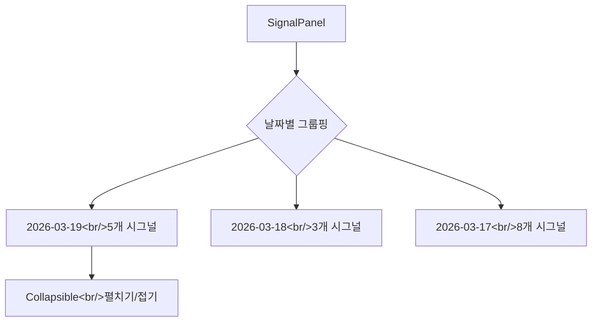

## 개요

이번 개발 로그에서는 trading-agent의 backend 안정화 작업을 중점적으로 다룬다. DART 재무 데이터 클라이언트의 연도 fallback과 PBR 계산 로직 추가, market scanner 파이프라인에서 `current_price`가 누락되던 버그 수정, FastMCP 미들웨어의 `async/sync` 혼용 문제 해결, 그리고 프론트엔드에서는 SignalPanel에 날짜별 그룹핑과 DAG 워크플로우 시각화 개선을 진행했다.

[이전 글: #4](/posts/2026-03-17-trading-agent-dev4/)

<!--more-->

## DART 클라이언트 개선

### 배경

DART(전자공시시스템) API에서 재무 데이터를 가져올 때 두 가지 문제가 있었다:

1. **연도 데이터 누락**: 최신 연도의 재무제표가 아직 공시되지 않은 경우, API가 빈 응답을 반환했다. 이전 연도로 fallback하는 로직이 없어서 분석 에이전트가 재무 데이터 없이 판단해야 했다.
2. **PBR 미계산**: PER은 API에서 직접 제공하지만 PBR(주가순자산비율)은 제공하지 않았다. 시가총액과 순자산 데이터가 있음에도 PBR을 계산하지 않고 있었다.
3. **업종별 필드 차이**: 금융업과 일반 기업의 재무제표 항목명이 달라서 특정 업종에서 파싱 에러가 발생했다.

### 구현

`backend/app/services/dart_client.py`에서 다음을 개선했다:

**연도 Fallback 로직:**
```python
# 최신 연도부터 시도하여 데이터가 있는 연도를 찾음
for year in range(current_year, current_year - 3, -1):
    result = await self._fetch_financial_data(corp_code, year)
    if result and result.get("list"):
        break
```

**PBR 자동 계산:**
```python
# 순자산(자본총계)과 시가총액으로 PBR 계산
if total_equity and total_equity > 0:
    pbr = market_cap / total_equity
```

**업종별 필드 매핑:**

금융업(`은행`, `보험`, `증권`)은 `영업이익` 대신 `영업수익`을 사용하고, `매출액` 대신 `이자수익` 등의 항목을 참조하도록 분기 처리했다.

## Market Scanner 파이프라인 수정

### 배경

Market scanner가 종목을 스캔한 뒤, 각 전문가 에이전트(기술적 분석, 펀더멘털 분석 등)에게 전달할 때 `current_price` 필드가 누락되는 문제가 있었다. Scanner가 가격 데이터를 가져오지만 하위 expert 호출 시 해당 값을 전달하지 않았다.

### 구현


`backend/app/agents/market_scanner.py`에서 expert 호출 시 `current_price`를 명시적으로 전달하도록 수정했다:

```python
# Before: expert에 price 정보 누락
expert_result = await expert.analyze(stock_code, stock_name)

# After: current_price를 pipeline 전체에 전달
expert_result = await expert.analyze(stock_code, stock_name, current_price=price)
```

또한 `market_scanner_experts.py`에서 chief analyst의 토론(debate) 로직을 단순화했다. 기존에는 모든 expert 의견을 순차적으로 토론시켰는데, 불필요한 라운드를 줄여 응답 시간을 개선했다.

## FastMCP 미들웨어 async/sync 버그 수정

### 문제

MCP 서버의 미들웨어에서 `context.state`에 접근하는 메서드가 동기(sync) 함수임에도 `await`로 호출하고 있었다:

```python
# Bug: sync 함수에 await 사용
state = await ctx.get_state("trading_mode")  # TypeError!
```

FastMCP의 context state 메서드는 동기 함수인데, 이를 `await`하면 coroutine이 아닌 값에 대해 `TypeError`가 발생하거나, 일부 Python 버전에서는 조용히 무시되어 `None`을 반환했다.

### 해결

`open-trading-api/MCP/Kis Trading MCP/module/middleware.py`와 `tools/base.py`에서 `await`를 제거:

```python
# Fix: sync 메서드는 await 없이 직접 호출
state = ctx.get_state("trading_mode")
```

## Scheduled Tasks 활성화

`backend/app/models/database.py`에서 스케줄러 관련 설정을 업데이트했다:

- 기존에 비활성화되어 있던 scheduled task들을 활성화
- Cron 타이밍을 한국 장 운영 시간에 맞게 조정 (장 시작 전 스캔, 장 중 모니터링, 장 마감 후 리포트)

## 프론트엔드 개선

### SignalPanel 날짜별 그룹핑

`frontend/src/components/dashboard/SignalPanel.tsx`에 날짜별 collapsible 섹션을 추가했다. 기존에는 모든 시그널이 시간순으로 나열되어 특정 날짜의 시그널을 찾기 어려웠다.



### 일별 차트 데이터 확장

`backend/app/services/market_service.py`에서 일별 차트 데이터 조회 기간을 30일에서 90일로 확장했다. 기술적 분석에서 이동평균선(60일, 90일) 계산에 충분한 데이터가 필요했기 때문이다.

### DAG 워크플로우 스타일링

`frontend/src/components/AgentWorkflow.css`와 `AgentWorkflow.tsx`에서 에이전트 파이프라인 DAG 시각화의 레이아웃과 expert chip 스타일링을 개선했다. 노드 간 간격, 커넥터 라벨 위치, 전체 컨테이너 정렬을 조정하여 가독성을 높였다.

## 커밋 로그

| 메시지 | 변경 |
|--------|------|
| feat: improve DART client with year fallback, PBR calculation, and industry-variant fields | `dart_client.py` |
| fix: pass current_price through scanner pipeline and simplify chief debate | `market_scanner.py`, `market_scanner_experts.py` |
| fix: remove await from sync FastMCP context state methods | `middleware.py`, `tools/base.py` |
| feat: enable scheduled tasks and adjust cron timings | `database.py` |
| feat: extend daily chart data from 30 to 90 days | `market_service.py` |
| feat: add date-grouped collapsible sections to SignalPanel | `SignalPanel.tsx`, `App.css` |
| style: improve DAG workflow layout and expert chip styling | `AgentWorkflow.css`, `index.css` |

## 인사이트

- **async/sync 혼용은 조용한 버그를 만든다.** Python에서 sync 함수를 `await`하면 일부 런타임에서 에러 대신 `None`을 반환하는 경우가 있다. FastMCP처럼 sync/async가 혼재하는 라이브러리를 쓸 때는 각 메서드의 시그니처를 반드시 확인해야 한다.
- **파이프라인에서 데이터 전달 누락은 흔한 실수다.** Scanner가 가격을 가져오고도 expert에 전달하지 않은 건 각 단계가 독립적으로 테스트되었기 때문이다. End-to-end 테스트의 필요성을 다시 한번 느꼈다.
- **재무 데이터 API는 업종별 차이를 고려해야 한다.** 금융업의 재무제표 구조는 일반 기업과 근본적으로 다르다. DART API를 래핑할 때 이런 변이를 미리 매핑해두지 않으면 런타임에서 `KeyError`가 터진다.
- **차트 데이터 기간과 분석 지표는 함께 설계해야 한다.** 90일 이동평균을 계산하려면 최소 90일치 데이터가 필요한데, 30일만 가져오고 있었다. 기술적 분석 지표를 추가할 때 데이터 소스의 범위도 같이 점검해야 한다.
