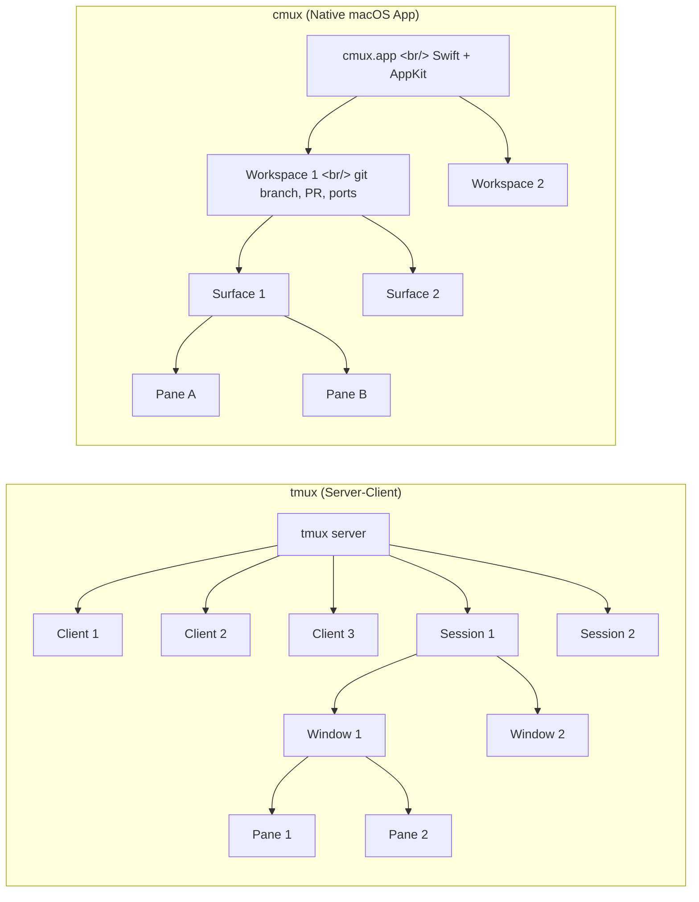
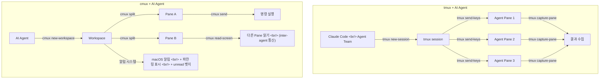

## 개요

2007년에 탄생한 tmux는 19년간 서버 관리와 개발 환경의 핵심 도구로 자리잡았다. 최근 Claude Code의 Agent Team 기능이 tmux 위에서 병렬 에이전트를 생성하면서 다시 주목받고 있다. 한편, Manaflow AI가 만든 cmux는 "AI 에이전트를 위한 터미널"이라는 콘셉트로 등장했다. Ghostty의 렌더링 엔진(libghostty)을 기반으로 한 네이티브 macOS 앱이다.

이 글에서는 두 도구의 아키텍처, 핵심 개념, AI 에이전트 지원 방식을 비교하고, 실전에서 어떻게 조합하면 좋은지 정리한다.

<!--more-->

## 아키텍처 비교

두 도구는 근본적으로 다른 설계 철학을 갖고 있다.



| 항목 | tmux | cmux |
|------|------|------|
| 유형 | Terminal multiplexer | AI agent terminal |
| 아키텍처 | Server-client | Native macOS app |
| OS 지원 | Cross-platform (Linux, macOS, BSD, Solaris) | macOS 14.0+ only |
| UI | TUI (텍스트 기반) | GUI (네이티브 AppKit) |
| 렌더링 | 자체 TUI | Ghostty 엔진 (libghostty) |
| 라이선스 | ISC | AGPL |

tmux는 서버 프로세스가 모든 세션을 관리하고, 클라이언트가 접속해서 보는 구조다. 터미널을 닫아도 서버가 살아있으면 세션이 유지된다. cmux는 macOS 네이티브 앱으로, 사이드바에 워크스페이스별 git branch, PR 상태, 열린 포트, 알림 등 메타데이터를 시각적으로 표시한다.

## 핵심 개념 매핑

두 도구의 계층 구조는 대응 관계가 명확하다.

| tmux | cmux | 설명 |
|------|------|------|
| Session | Workspace | 최상위 작업 단위 |
| Window | Surface | Session/Workspace 안의 탭 |
| Pane | Pane | 화면 분할 영역 |

### 조작 방식의 차이

tmux는 **prefix key** 방식이다. `Ctrl+b`를 먼저 누르고 명령 키를 입력한다. 학습 곡선이 가파르지만 키보드만으로 모든 조작이 가능하다.

cmux는 **macOS 네이티브 단축키**를 사용한다. prefix 없이 바로 동작한다.

| 동작 | tmux | cmux |
|------|------|------|
| 새 세션/워크스페이스 | `tmux new -s name` | `Cmd+N` |
| 수평 분할 | `Ctrl+b %` | `Cmd+D` |
| 수직 분할 | `Ctrl+b "` | `Cmd+Shift+D` |
| 새 윈도우/서피스 | `Ctrl+b c` | `Cmd+T` |
| 세션 목록 | `Ctrl+b s` | 사이드바에 항상 표시 |

## AI 에이전트 지원

이 부분이 두 도구의 가장 큰 차이점이다.



### tmux의 AI 에이전트 활용

tmux는 원래 AI를 위해 설계된 도구가 아니다. 하지만 프로그래밍 가능한 API를 통해 AI 도구들이 활용하고 있다.

- **Claude Code**: Agent Team 기능에서 tmux 세션을 생성해 병렬 에이전트를 구동
- **Codex, Gemini CLI**: 비슷한 방식으로 tmux를 활용
- `tmux send-keys`로 명령 전송, `tmux capture-pane`으로 출력 수집

### cmux의 네이티브 AI 지원

cmux는 처음부터 AI 에이전트를 위해 설계되었다.

- **알림 시스템**: 입력 대기 중인 pane에 파란 링 표시, 워크스페이스 탭에 unread 뱃지, macOS 데스크톱 알림까지 지원. `Cmd+Shift+U`로 가장 최근 알림으로 점프.
- **read-screen**: 한 pane이 다른 pane의 내용을 읽을 수 있다. 에이전트 간 통신의 핵심 기능이다.
- **send**: 다른 pane에 프로그래밍 방식으로 명령을 전송한다.
- **환경 변수**: `CMUX_WORKSPACE_ID`, `CMUX_SURFACE_ID`, `CMUX_SOCKET_PATH` — 에이전트가 자신의 컨텍스트를 자동으로 인식한다.
- **내장 브라우저**: 터미널 안에서 웹 페이지를 열 수 있다.

### CLI 자동화 비교

```bash
# tmux — 프로그래밍 방식 제어
tmux new-session -d -s work
tmux split-window -h
tmux send-keys -t work:0.1 "npm run dev" Enter
tmux capture-pane -t work:0.0 -p

# cmux — AI 에이전트 전용 CLI
cmux new-workspace
cmux split --direction right
cmux send --pane-id $CMUX_PANE_ID "npm run dev"
cmux read-screen --pane-id $TARGET_PANE_ID
```

## "Primitive, Not Solution" 철학

cmux의 핵심 설계 철학은 **"Primitive, Not Solution"**이다. 완성된 워크플로우를 제공하는 대신, `read-screen`, `send`, 알림 같은 저수준 빌딩 블록을 제공한다. AI 에이전트가 이 요소들을 조합해서 자신만의 워크플로우를 구성하도록 맡긴다.

이 접근 방식은 다양한 AI 도구와의 호환성을 높이고, 에이전트의 자율성을 극대화한다.

## 경쟁 도구 현황

AI 에이전트 터미널 분야는 빠르게 성장하고 있다.

| 도구 | 특징 |
|------|------|
| **cmux** | 네이티브 macOS, Ghostty 기반, read-screen |
| **Claude Squad** | GitHub 기반 에이전트 오케스트레이션 |
| **Pane** | AI 에이전트용 터미널 |
| **Amux** | AI 중심 멀티플렉서 |
| **Calyx** | 신생 경쟁자 |

## 실전 권장 조합: tmux + cmux

결론적으로, tmux와 cmux는 대체 관계가 아니라 **보완 관계**다.

- **tmux**: 세션 영속성(서버 기반), 크로스 플랫폼 지원, 원격 서버 작업
- **cmux**: GUI 시각화, AI 에이전트 알림, inter-agent 통신 (read-screen)

로컬 macOS 환경에서 AI 에이전트를 활용한 개발을 할 때는 cmux를 메인으로 사용하되, 원격 서버 작업이나 세션 영속성이 필요한 경우 tmux를 함께 사용하는 것이 현재로서는 가장 효과적인 조합이다.

## 설치

```bash
# tmux
brew install tmux

# cmux
brew tap manaflow-ai/cmux && brew install --cask cmux
```

## 빠른 링크

- [tmux GitHub](https://github.com/tmux/tmux) — 43,430 stars, C 기반 오픈소스
- [cmux 공식 사이트](https://cmux.com) — Manaflow AI
- [cmux: 코딩 에이전트를 위한 터미널 — Dale Seo](https://daleseo.com/cmux/) — 실전 가이드
- [tmux vs cmux 비교 — goddaehee](https://goddaehee.tistory.com/557) — 설치부터 경쟁 도구까지
- [TMUX 마스터클래스 — YouTube](https://www.youtube.com/watch?v=vlg8X0N8z08)

## 인사이트

tmux는 19년 동안 검증된 안정성과 크로스 플랫폼 지원이 강점이다. 원격 서버, CI/CD, 세션 영속성이 필요한 모든 시나리오에서 여전히 최고의 선택이다. cmux는 AI 에이전트 시대에 맞게 설계된 도구로, 알림 시스템과 read-screen 기능이 멀티 에이전트 워크플로우에 최적화되어 있다. 두 도구는 대체 관계가 아니라 보완 관계다. tmux가 "세션이 죽지 않는 인프라"라면, cmux는 "에이전트가 서로 대화하는 인터페이스"다. AI 코딩 도구가 tmux 위에서 에이전트를 스폰하고, cmux가 그 에이전트들의 상태를 시각적으로 관리하는 조합이 현재로서는 가장 강력한 터미널 환경이다.
