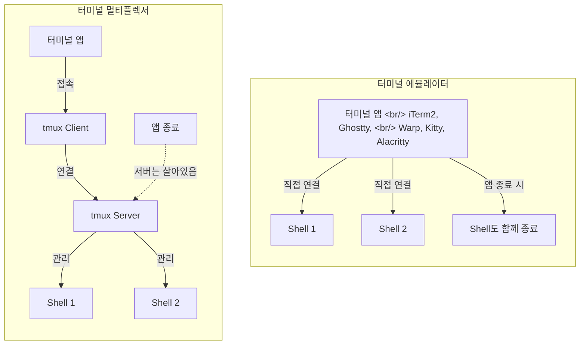
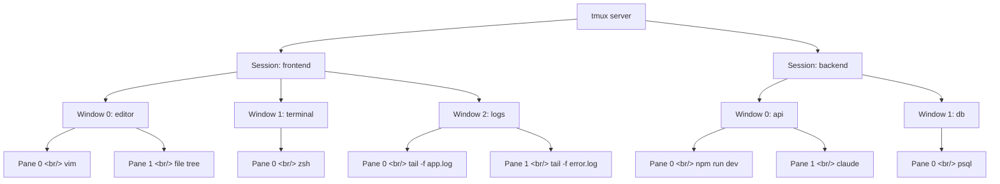

## 개요

2007년 Nicolas Marriott이 만든 tmux는 19년이 지난 지금도 터미널 환경의 핵심 인프라로 자리잡고 있다. 최근 Claude Code의 Agent Team 기능이 tmux 위에서 병렬 에이전트를 스폰하면서, AI 코딩 에이전트 시대에 다시 한번 강력한 주목을 받고 있다. Codex, Gemini CLI, OpenCode 등 터미널 기반 코딩 에이전트들도 tmux의 프로그래밍 가능한 API를 적극 활용한다.

이 글에서는 tmux의 아키텍처부터 세션/윈도우/패인 관리, 커스터마이징, 플러그인 생태계, 그리고 AI 에이전트와의 연동까지 한 편으로 완전 정복한다. tmux vs cmux 비교는 [별도 포스트](/posts/2026-03-23-tmux-cmux/)에서 다루고 있으므로, 이 글에서는 tmux 자체에 대한 딥다이브에 집중한다.

<!--more-->

## 터미널 에뮬레이터 vs 터미널 멀티플렉서

tmux를 이해하려면 먼저 터미널 에뮬레이터와 터미널 멀티플렉서의 근본적 차이를 알아야 한다.



**터미널 에뮬레이터**는 화면을 그려주는 앱이다. iTerm2, Ghostty, Warp, Kitty, Alacritty 등이 여기에 해당한다. 쉘에 직접 연결되므로, 앱을 닫으면 실행 중이던 프로세스와 세션이 모두 사라진다.

**터미널 멀티플렉서**는 세션을 관리하는 서버다. tmux와 screen이 대표적이다. 터미널 에뮬레이터 위에서 동작하며, 서버-클라이언트 구조 덕분에 터미널 앱을 닫아도 세션이 유지된다.

> 터미널 에뮬레이터는 "화면을 그려주는 앱"이고, 터미널 멀티플렉서는 "세션을 관리하는 서버"다. 멀티플렉서를 쓰면 탭 관리, 화면 분할, 세션 관리를 터미널 에뮬레이터가 아니라 멀티플렉서가 전부 담당하게 된다.

이 구조적 차이 때문에 tmux를 사용할 때 터미널 에뮬레이터에서 가장 중요한 기준은 **얼마나 가볍고 빠른지**다. 탭 관리나 화면 분할 같은 기능은 tmux가 다 해주므로, 터미널 앱 자체는 빠른 렌더링에 집중하면 된다.

## tmux 아키텍처

tmux는 서버-클라이언트 모델로 동작한다. 이 구조가 tmux의 모든 강점 -- 세션 영속성, 다중 클라이언트 접속, 프로그래밍 가능한 제어 -- 의 근간이다.

### 서버-클라이언트 모델

```
┌─────────────────────────────────────────────────┐
│                  tmux server                     │
│  (백그라운드 프로세스, 모든 세션을 관리)            │
│                                                  │
│  ┌──────────┐  ┌──────────┐  ┌──────────┐       │
│  │ Session 0│  │ Session 1│  │ Session 2│       │
│  │ frontend │  │ backend  │  │ devops   │       │
│  └──────────┘  └──────────┘  └──────────┘       │
└─────────────┬──────────┬──────────┬─────────────┘
              │          │          │
       ┌──────┘    ┌─────┘    ┌────┘
       ▼           ▼          ▼
   Client A    Client B   Client C
   (iTerm2)    (Ghostty)  (SSH)
```

- **tmux server**: `tmux` 명령을 처음 실행하면 백그라운드에 서버 프로세스가 시작된다. 이 서버가 모든 세션, 윈도우, 패인을 관리한다.
- **tmux client**: 사용자가 보는 화면이다. 서버에 접속해서 특정 세션의 내용을 표시한다.
- **소켓 통신**: 클라이언트와 서버는 Unix 소켓(`/tmp/tmux-{uid}/default`)으로 통신한다.

### 세션 영속성

이 구조의 핵심 이점은 **세션 영속성**이다.

1. Ghostty에서 tmux를 실행하고 Claude Code와 개발 서버를 띄워 놓는다
2. Ghostty를 완전히 종료한다
3. Ghostty를 다시 열고 `tmux attach`를 입력한다
4. Claude Code와 개발 서버가 그대로 살아있다

터미널 에뮬레이터는 사라졌지만, tmux 서버가 백그라운드에서 모든 프로세스를 계속 관리하고 있었기 때문이다. SSH 접속이 끊겨도, 노트북 덮개를 닫았다 열어도, tmux 세션은 유지된다.

## 설치 및 초기 설정

### 설치

```bash
# macOS
brew install tmux

# Ubuntu/Debian
sudo apt install tmux

# Fedora
sudo dnf install tmux

# 버전 확인
tmux -V
```

### 첫 실행

```bash
# 새 세션 시작 (이름 자동 부여: 0, 1, 2...)
tmux

# 이름을 지정해서 세션 시작
tmux new-session -s work

# 축약형
tmux new -s work
```

### 기본 설정 파일

tmux 설정은 `~/.tmux.conf`에 작성한다. 최소한의 필수 설정부터 시작하자.

```bash
# ~/.tmux.conf — 최소 필수 설정

# 스크롤백 히스토리 확장 (기본 2,000줄 → 50,000줄)
set -g history-limit 50000

# 마우스 지원 활성화
set -g mouse on

# 윈도우/패인 인덱스를 1부터 시작 (0은 키보드 왼쪽 끝이라 불편)
set -g base-index 1
setw -g pane-base-index 1
```

설정 파일 수정 후 적용하는 방법:

```bash
# tmux 내부에서 설정 리로드
tmux source-file ~/.tmux.conf

# 또는 prefix + : 로 명령 모드 진입 후
source-file ~/.tmux.conf
```

## 핵심 개념: Session, Window, Pane

tmux는 3계층 구조로 이루어져 있다.



| 계층 | 설명 | 비유 |
|------|------|------|
| **Session** | 최상위 작업 단위. 독립된 프로젝트나 작업 맥락 | 데스크톱의 가상 데스크톱 |
| **Window** | 세션 안의 탭. 하나의 전체 화면 | 브라우저의 탭 |
| **Pane** | 윈도우 안의 분할 영역. 각각 독립된 쉘 | IDE의 분할 패널 |

하나의 세션 안에 여러 윈도우를 만들 수 있고, 하나의 윈도우 안에 여러 패인을 분할할 수 있다. tmux 하단 상태 바에서 현재 세션 이름과 윈도우 목록을 확인할 수 있다.

## Prefix Key 시스템

tmux의 모든 단축키는 **prefix key**를 먼저 누른 뒤 명령 키를 입력하는 방식이다. 기본 prefix는 `Ctrl+b`다.

> 컨트롤 B라는 예약어가 좀 불편하다. 키보드에서 컨트롤 B를 입력하는 게 좀 불편하기 때문에 컨트롤 스페이스로 키 매핑을 해 두고 사용하고 있다.

즉, `Ctrl+b` 를 누르고 손을 떼고, 그 다음에 명령 키를 누르면 된다. 동시에 누르는 것이 아니다.

### 완전 단축키 레퍼런스

#### 세션 관련

| 단축키 | 동작 |
|--------|------|
| `Prefix + d` | 현재 세션에서 detach (나가기) |
| `Prefix + s` | 세션 목록 보기 |
| `Prefix + $` | 현재 세션 이름 변경 |
| `Prefix + (` | 이전 세션으로 전환 |
| `Prefix + )` | 다음 세션으로 전환 |
| `Prefix + : new` | 새 세션 생성 (tmux 내부에서) |

#### 윈도우 관련

| 단축키 | 동작 |
|--------|------|
| `Prefix + c` | 새 윈도우 생성 |
| `Prefix + w` | 윈도우 목록 보기 (세션 포함, 트리 뷰) |
| `Prefix + ,` | 현재 윈도우 이름 변경 |
| `Prefix + n` | 다음 윈도우로 이동 |
| `Prefix + p` | 이전 윈도우로 이동 |
| `Prefix + 0~9` | 해당 번호의 윈도우로 직접 이동 |
| `Prefix + &` | 현재 윈도우 닫기 (확인 메시지 있음) |
| `Prefix + l` | 마지막으로 사용한 윈도우로 전환 |

#### 패인 관련

| 단축키 | 동작 |
|--------|------|
| `Prefix + %` | 수평 분할 (좌우로 나누기) |
| `Prefix + "` | 수직 분할 (상하로 나누기) |
| `Prefix + 방향키` | 해당 방향의 패인으로 이동 |
| `Prefix + o` | 다음 패인으로 순환 이동 |
| `Prefix + z` | 현재 패인 줌 토글 (전체 화면 ↔ 원래 크기) |
| `Prefix + x` | 현재 패인 닫기 (확인 메시지 있음) |
| `Prefix + q` | 패인 번호 표시 (번호 입력으로 이동) |
| `Prefix + {` | 현재 패인을 이전 위치로 swap |
| `Prefix + }` | 현재 패인을 다음 위치로 swap |
| `Prefix + Space` | 패인 레이아웃 순환 변경 |
| `Prefix + !` | 현재 패인을 새 윈도우로 분리 |

#### 기타

| 단축키 | 동작 |
|--------|------|
| `Prefix + :` | 명령 모드 진입 |
| `Prefix + ?` | 모든 키 바인딩 목록 보기 |
| `Prefix + t` | 시계 표시 |
| `Prefix + [` | 복사 모드 진입 (스크롤 가능) |

## 세션 관리

### 세션 생성

```bash
# 터미널에서 새 세션 생성
tmux new -s frontend
tmux new -s backend
tmux new -s devops

# 세션 생성 + 첫 윈도우 이름 지정
tmux new -s work -n editor

# 세션 생성하되 attach하지 않기 (백그라운드)
tmux new -d -s background-job
```

tmux 윈도우 내부에서 새 세션을 생성하려면:

```
Prefix + : → new -s session-name
```

### 세션 목록 확인

```bash
# 터미널에서
tmux ls
tmux list-sessions

# tmux 내부에서
Prefix + s    # 세션 목록 (방향키로 선택)
Prefix + w    # 윈도우까지 펼쳐진 전체 목록
```

`Prefix + w`가 `Prefix + s`보다 더 실용적이다. 세션뿐 아니라 그 안의 윈도우까지 트리 형태로 보여주기 때문이다. 목록에서 좌측 인덱스 번호를 직접 입력하면 해당 항목으로 즉시 이동할 수 있다.

### 세션 전환 (Attach/Detach)

```bash
# 세션에서 나가기 (세션은 살아있음)
Prefix + d

# 특정 세션에 다시 접속
tmux attach -t frontend
tmux a -t frontend    # 축약형
tmux a               # 마지막 세션에 접속

# 세션이 하나뿐이면
tmux a
```

### 세션 이름 변경 및 종료

```bash
# tmux 내부에서 현재 세션 이름 변경
Prefix + $

# 터미널에서 세션 종료
tmux kill-session -t old-session

# 모든 세션 종료
tmux kill-server
```

## 윈도우 관리

윈도우는 세션 안의 "탭"에 해당한다. 하단 상태 바에 윈도우 목록이 표시된다.

### 윈도우 생성 및 전환

```bash
# 새 윈도우 생성
Prefix + c

# 윈도우 간 이동
Prefix + n          # 다음 윈도우
Prefix + p          # 이전 윈도우
Prefix + 0          # 0번 윈도우로 직접 이동
Prefix + 1          # 1번 윈도우로 직접 이동
Prefix + l          # 마지막으로 사용한 윈도우로 토글

# 윈도우 이름 변경
Prefix + ,
```

### 윈도우 검색 및 이동

```bash
# 윈도우 찾기 (이름으로 검색)
Prefix + f

# 윈도우를 다른 세션으로 이동
Prefix + : → move-window -t target-session

# 윈도우 순서 변경
Prefix + : → swap-window -t 0
```

## 패인 관리

패인은 윈도우 안의 분할 영역이다. 각 패인은 독립된 쉘을 실행한다.

### 패인 분할

```bash
# 수평 분할 (좌우)
Prefix + %

# 수직 분할 (상하)
Prefix + "
```

### 패인 이동

```bash
# 방향키로 이동
Prefix + ↑↓←→

# 순환 이동
Prefix + o

# 패인 번호로 이동
Prefix + q → 번호 입력
```

### 패인 크기 조절

```bash
# 방향키로 미세 조절 (prefix + 방향키를 반복)
Prefix + Ctrl+↑     # 위로 1칸 확장
Prefix + Ctrl+↓     # 아래로 1칸 확장
Prefix + Ctrl+←     # 왼쪽으로 1칸 확장
Prefix + Ctrl+→     # 오른쪽으로 1칸 확장

# 마우스로 드래그 (mouse on 설정 시)
# 패인 경계선을 마우스로 잡아 끌기

# 균등 분할 레이아웃 순환
Prefix + Space
```

### 패인 줌 (전체 화면 토글)

```bash
# 현재 패인을 윈도우 전체 크기로 확대/축소
Prefix + z
```

특정 패인의 출력을 자세히 봐야 할 때 유용하다. 다시 `Prefix + z`를 누르면 원래 분할 상태로 돌아온다.

### 패인 스왑 및 레이아웃

```bash
# 패인 위치 교환
Prefix + {       # 이전 패인과 교환
Prefix + }       # 다음 패인과 교환

# 현재 패인을 새 윈도우로 분리
Prefix + !

# 프리셋 레이아웃 순환 (even-horizontal, even-vertical, main-horizontal, main-vertical, tiled)
Prefix + Space
```

## 커스터마이징 (.tmux.conf)

### 권장 설정 파일

```bash
# ~/.tmux.conf — 실전 설정

# ──────────────────────────────────────
# 기본 설정
# ──────────────────────────────────────

# Prefix 키 변경: Ctrl+b → Ctrl+Space
set -g prefix C-Space
unbind C-b
bind C-Space send-prefix

# 스크롤백 히스토리 (기본 2,000 → 50,000)
set -g history-limit 50000

# 마우스 지원
set -g mouse on

# 윈도우/패인 번호를 1부터
set -g base-index 1
setw -g pane-base-index 1

# 윈도우 닫으면 번호 재정렬
set -g renumber-windows on

# ESC 지연 제거 (Vim/Neovim 사용자 필수)
set -sg escape-time 0

# 256 색상 지원
set -g default-terminal "tmux-256color"
set -ga terminal-overrides ",xterm-256color:Tc"

# ──────────────────────────────────────
# 패인 분할 키 변경 (직관적으로)
# ──────────────────────────────────────

# | 로 수평 분할, - 로 수직 분할
bind | split-window -h -c "#{pane_current_path}"
bind - split-window -v -c "#{pane_current_path}"

# 새 윈도우도 현재 경로에서 열기
bind c new-window -c "#{pane_current_path}"

# ──────────────────────────────────────
# Vi 스타일 패인 이동
# ──────────────────────────────────────

bind h select-pane -L
bind j select-pane -D
bind k select-pane -U
bind l select-pane -R

# Alt + hjkl로 패인 이동 (prefix 없이)
bind -n M-h select-pane -L
bind -n M-j select-pane -D
bind -n M-k select-pane -U
bind -n M-l select-pane -R

# ──────────────────────────────────────
# 패인 크기 조절
# ──────────────────────────────────────

bind -r H resize-pane -L 5
bind -r J resize-pane -D 5
bind -r K resize-pane -U 5
bind -r L resize-pane -R 5

# ──────────────────────────────────────
# 복사 모드 (Vi 스타일)
# ──────────────────────────────────────

setw -g mode-keys vi
bind -T copy-mode-vi v send-keys -X begin-selection
bind -T copy-mode-vi y send-keys -X copy-pipe-and-cancel "pbcopy"

# ──────────────────────────────────────
# 상태 바 커스터마이징
# ──────────────────────────────────────

set -g status-style "bg=#1e1e2e,fg=#cdd6f4"
set -g status-left "#[fg=#89b4fa,bold] #S "
set -g status-right "#[fg=#a6adc8] %Y-%m-%d %H:%M "
set -g status-left-length 30

# 활성 윈도우 강조
setw -g window-status-current-style "fg=#89b4fa,bold"

# ──────────────────────────────────────
# 설정 리로드 단축키
# ──────────────────────────────────────

bind r source-file ~/.tmux.conf \; display-message "Config reloaded!"
```

### 주요 커스터마이징 포인트

**Prefix 키 변경**: 기본 `Ctrl+b`는 Vim의 Page Up과 충돌하고 손가락 위치상 불편하다. `Ctrl+Space`나 `Ctrl+a`(screen 호환)로 바꾸는 개발자가 많다.

**history-limit**: 기본 2,000줄은 개발 서버 로그를 보기에 턱없이 부족하다. 50,000줄 이상으로 설정하는 것을 권장한다.

**mouse on**: 마우스로 패인 클릭 전환, 경계선 드래그 리사이즈, 스크롤이 가능해진다. tmux 입문자에게 필수 설정이다.

**pane_current_path**: 패인을 분할하거나 새 윈도우를 열 때 현재 작업 디렉토리를 유지한다. 이 설정 없이는 매번 홈 디렉토리에서 시작해서 `cd`를 반복해야 한다.

## 플러그인 생태계 (TPM)

### TPM (Tmux Plugin Manager) 설치

```bash
git clone https://github.com/tmux-plugins/tpm ~/.tmux/plugins/tpm
```

`~/.tmux.conf`에 추가:

```bash
# 플러그인 목록
set -g @plugin 'tmux-plugins/tpm'
set -g @plugin 'tmux-plugins/tmux-sensible'
set -g @plugin 'tmux-plugins/tmux-resurrect'
set -g @plugin 'tmux-plugins/tmux-continuum'
set -g @plugin 'tmux-plugins/tmux-yank'
set -g @plugin 'catppuccin/tmux'

# TPM 초기화 (설정 파일 맨 아래에 위치해야 함)
run '~/.tmux/plugins/tpm/tpm'
```

플러그인 설치: `Prefix + I` (대문자 I)

### 추천 플러그인

| 플러그인 | 설명 |
|----------|------|
| **tmux-sensible** | 범용적인 기본 설정 모음 (history-limit, escape-time 등) |
| **tmux-resurrect** | 세션 상태 저장/복원. 재부팅 후에도 세션 복구 가능 |
| **tmux-continuum** | resurrect를 자동으로 주기적 저장. tmux 시작 시 자동 복원 |
| **tmux-yank** | 시스템 클립보드 연동 복사 |
| **tmux-open** | 복사 모드에서 URL을 브라우저로 열기 |
| **catppuccin/tmux** | Catppuccin 테마 (상태 바 미화) |
| **tmux-fzf** | fzf를 활용한 세션/윈도우/패인 검색 |

### tmux-resurrect + tmux-continuum

이 조합은 tmux의 세션 영속성을 한 단계 더 강화한다. tmux 서버 자체가 종료되거나 시스템이 재부팅되어도 세션 구조를 복원할 수 있다.

```bash
# tmux-resurrect 설정
set -g @resurrect-capture-pane-contents 'on'
set -g @resurrect-strategy-nvim 'session'

# tmux-continuum 설정
set -g @continuum-restore 'on'        # tmux 시작 시 자동 복원
set -g @continuum-save-interval '15'  # 15분마다 자동 저장
```

## 추천 터미널 에뮬레이터

tmux는 어떤 터미널 에뮬레이터에서든 동작하지만, tmux를 사용할 때는 터미널 앱의 기본 성능이 중요하다. 탭 관리, 화면 분할 등은 tmux가 담당하므로 터미널 앱은 빠른 렌더링에 집중하면 된다.

### Ghostty

현재 tmux와 조합하기에 가장 추천하는 터미널 에뮬레이터는 **Ghostty**다.

- **GPU 가속 렌더링**: 대량의 출력도 빠르게 처리
- **낮은 리소스 사용**: CPU와 메모리 점유율이 매우 낮음
- **네이티브 UI**: macOS에서 네이티브 앱처럼 동작
- **검증된 렌더링 엔진**: cmux(Sixworks)도 Ghostty의 libghostty 기반

Ghostty 설치:

```bash
brew install --cask ghostty
```

### 기타 터미널 에뮬레이터와의 호환

| 터미널 | tmux 호환성 | 특징 |
|--------|-------------|------|
| Ghostty | 우수 | GPU 가속, 경량 |
| iTerm2 | 우수 | tmux integration 모드 지원 |
| Alacritty | 우수 | GPU 가속, 설정 파일 기반 |
| Kitty | 우수 | GPU 가속, 자체 분할 기능 |
| WezTerm | 우수 | Lua 스크립팅 |
| Warp | 보통 | AI 기능 내장, 자체 분할 선호 |

## AI 코딩 에이전트와 tmux

### 왜 AI 에이전트가 tmux를 사용하는가

tmux가 AI 에이전트 시대에 다시 주목받는 핵심 이유는 **프로그래밍 가능한 터미널 제어**다. tmux의 CLI 명령으로 세션 생성, 명령 전송, 출력 수집을 자동화할 수 있기 때문이다.

Claude Code의 Agent Team은 여러 에이전트를 병렬로 생성할 때 tmux를 활용한다. 각 에이전트를 별도 패인에서 실행하고, `send-keys`로 명령을 보내고, `capture-pane`으로 결과를 수집한다.

### 핵심 API: send-keys와 capture-pane

```bash
# 1. 백그라운드 세션 생성
tmux new-session -d -s agents

# 2. 여러 패인으로 분할
tmux split-window -h -t agents
tmux split-window -v -t agents:0.1

# 3. 각 패인에 명령 전송
tmux send-keys -t agents:0.0 "cd ~/project && claude 'Fix the login bug'" Enter
tmux send-keys -t agents:0.1 "cd ~/project && claude 'Write unit tests'" Enter
tmux send-keys -t agents:0.2 "cd ~/project && npm run dev" Enter

# 4. 특정 패인의 출력 수집
tmux capture-pane -t agents:0.0 -p          # stdout에 출력
tmux capture-pane -t agents:0.0 -p -S -100  # 마지막 100줄
tmux capture-pane -t agents:0.0 -b temp     # 버퍼에 저장
```

### 타겟 지정 문법

tmux의 타겟 지정 문법은 `session:window.pane` 형식이다.

```
agents:0.0    → "agents" 세션의 0번 윈도우의 0번 패인
agents:0.1    → "agents" 세션의 0번 윈도우의 1번 패인
work:editor.0 → "work" 세션의 "editor" 윈도우의 0번 패인
```

### 실전 AI 에이전트 워크플로우 스크립트

```bash
#!/bin/bash
# ai-workspace.sh — AI 에이전트 병렬 작업 환경 구성

PROJECT_DIR="$1"
SESSION="ai-work"

# 기존 세션이 있으면 종료
tmux kill-session -t "$SESSION" 2>/dev/null

# 메인 세션 생성
tmux new-session -d -s "$SESSION" -c "$PROJECT_DIR" -n "agents"

# 패인 분할: 3개의 에이전트 영역
tmux split-window -h -t "$SESSION:agents" -c "$PROJECT_DIR"
tmux split-window -v -t "$SESSION:agents.1" -c "$PROJECT_DIR"

# 모니터링 윈도우 생성
tmux new-window -t "$SESSION" -n "monitor" -c "$PROJECT_DIR"
tmux split-window -v -t "$SESSION:monitor" -c "$PROJECT_DIR"

# 모니터링 윈도우에 개발 서버 + 로그
tmux send-keys -t "$SESSION:monitor.0" "npm run dev" Enter
tmux send-keys -t "$SESSION:monitor.1" "tail -f logs/app.log" Enter

# agents 윈도우로 돌아가기
tmux select-window -t "$SESSION:agents"

# 접속
tmux attach -t "$SESSION"
```

### 에이전트 출력 모니터링 스크립트

```bash
#!/bin/bash
# monitor-agents.sh — 모든 패인의 출력을 주기적으로 수집

SESSION="ai-work"
OUTPUT_DIR="/tmp/agent-outputs"
mkdir -p "$OUTPUT_DIR"

while true; do
    # 모든 패인의 최근 출력 수집
    for pane in $(tmux list-panes -t "$SESSION" -F '#{pane_id}'); do
        tmux capture-pane -t "$pane" -p -S -50 > "$OUTPUT_DIR/${pane}.txt"
    done

    # 특정 키워드 감지 (에러, 완료 등)
    if grep -q "Error\|FAIL\|Complete\|Done" "$OUTPUT_DIR"/*.txt 2>/dev/null; then
        echo "[$(date)] Agent activity detected"
    fi

    sleep 10
done
```

### Claude Code Agent Team과 tmux

Claude Code의 Agent Team은 내부적으로 다음과 같은 흐름으로 tmux를 활용한다:

1. `tmux new-session -d`로 백그라운드 세션 생성
2. `tmux split-window`로 에이전트 수만큼 패인 생성
3. `tmux send-keys`로 각 에이전트에 태스크 전송
4. `tmux capture-pane`으로 각 에이전트의 출력 수집
5. 결과를 종합하여 최종 응답 생성

이 모든 것이 tmux의 프로그래밍 가능한 API 덕분에 가능하다. tmux가 없었다면 AI 에이전트가 여러 터미널을 프로그래밍 방식으로 제어하는 것이 훨씬 어려웠을 것이다.

## 실전 팁

### Copy Mode (스크롤 및 복사)

tmux에서 스크롤하거나 텍스트를 복사하려면 **Copy Mode**에 진입해야 한다.

```bash
# Copy Mode 진입
Prefix + [

# Copy Mode에서의 이동 (vi 모드 설정 시)
h/j/k/l        # 방향 이동
Ctrl+u/d        # 페이지 업/다운
g/G             # 처음/끝으로 이동
/search-term    # 텍스트 검색
n/N             # 다음/이전 검색 결과

# 텍스트 선택 및 복사 (vi 모드)
Space           # 선택 시작
Enter           # 선택한 텍스트 복사 + Copy Mode 종료
q               # Copy Mode 종료 (복사 없이)

# 복사한 텍스트 붙여넣기
Prefix + ]
```

마우스 모드(`set -g mouse on`)를 활성화하면 마우스 스크롤로도 Copy Mode에 자동 진입한다.

### 패인 동기화 (Synchronize Panes)

여러 서버에 동일한 명령을 동시에 보내야 할 때 유용하다.

```bash
# 동기화 활성화: 현재 윈도우의 모든 패인에 동일한 입력 전송
Prefix + : → setw synchronize-panes on

# 동기화 비활성화
Prefix + : → setw synchronize-panes off

# .tmux.conf에 토글 단축키 추가
bind S setw synchronize-panes \; display-message "Sync #{?synchronize-panes,ON,OFF}"
```

### 프리셋 레이아웃

```bash
# 레이아웃 순환
Prefix + Space

# 특정 레이아웃 직접 지정
Prefix + : → select-layout even-horizontal    # 수평 균등 분할
Prefix + : → select-layout even-vertical      # 수직 균등 분할
Prefix + : → select-layout main-horizontal    # 상단 메인 + 하단 분할
Prefix + : → select-layout main-vertical      # 좌측 메인 + 우측 분할
Prefix + : → select-layout tiled              # 타일 형태
```

### tmux 명령 모드

`Prefix + :`로 진입하는 명령 모드에서는 모든 tmux 명령을 직접 입력할 수 있다.

```bash
# 자주 쓰는 명령 모드 명령
new -s session-name           # 새 세션
move-window -t other-session  # 윈도우를 다른 세션으로 이동
swap-pane -U                  # 패인 위치 위로 이동
swap-pane -D                  # 패인 위치 아래로 이동
resize-pane -D 10             # 아래로 10칸 확장
resize-pane -R 20             # 오른쪽으로 20칸 확장
```

### Vi 방향키 습관 들이기

> 키보드에서 손이 밑으로 왔다 갔다 하지 않아도 되는 자세로 최대한 몸을 움직이지 않고 모든 작업을 하기 위해, 방향키 대신 Vi 방향키 HJKL을 익혀 두는 것을 권장한다. 로컬뿐 아니라 원격 서버에서 SSH로 작업할 때도 Vi 방향키와 단축어를 굉장히 많이 활용하게 된다.

```
H = ← (왼쪽)
J = ↓ (아래)
K = ↑ (위)
L = → (오른쪽)
```

## 빠른 링크

- [tmux GitHub](https://github.com/tmux/tmux) -- C 기반 오픈소스, ISC 라이선스
- [tmux Wiki](https://github.com/tmux/tmux/wiki) -- 공식 문서
- [TPM (Tmux Plugin Manager)](https://github.com/tmux-plugins/tpm) -- 플러그인 매니저
- [tmux-resurrect](https://github.com/tmux-plugins/tmux-resurrect) -- 세션 저장/복원
- [Ghostty](https://ghostty.org) -- GPU 가속 터미널 에뮬레이터
- [TMUX 마스터클래스 -- YouTube](https://www.youtube.com/watch?v=vlg8X0N8z08) -- 이 글의 주요 참고 영상
- [tmux 기본 사용법 -- hyde1004](https://hyde1004.tistory.com/) -- 한국어 tmux 가이드

## 인사이트

tmux는 19년간 검증된 안정성과 크로스 플랫폼 지원이라는 압도적 강점을 가진 터미널 인프라다. 서버-클라이언트 아키텍처 덕분에 세션 영속성이 보장되고, 프로그래밍 가능한 CLI API 덕분에 AI 코딩 에이전트 시대에 다시 핵심 도구로 부상했다.

학습 곡선이 가파르다는 인식이 있지만, 실제로 핵심 단축키는 10개 남짓이다. `Prefix + c`(새 윈도우), `Prefix + %/"` (분할), `Prefix + 방향키`(이동), `Prefix + d`(detach), `Prefix + w`(윈도우 목록) 정도만 익히면 일상적인 작업은 충분하다. 여기에 `.tmux.conf` 커스터마이징으로 Vi 방향키와 직관적인 분할 키를 추가하면 생산성이 한 단계 올라간다.

AI 에이전트와의 조합에서 tmux의 진가가 드러난다. `send-keys`와 `capture-pane`이라는 두 가지 명령만으로 "명령 전송 → 출력 수집" 사이클이 완성되고, 이것이 Claude Code Agent Team의 병렬 에이전트 아키텍처의 기반이 된다. tmux가 "세션이 죽지 않는 인프라"라면, AI 에이전트는 그 인프라 위에서 자율적으로 작업하는 워커다. 2026년 현재, tmux를 모르고 터미널 기반 AI 코딩 도구를 활용하는 것은 기초 체력 없이 마라톤에 나서는 것과 같다.
