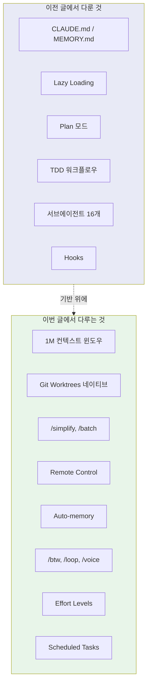
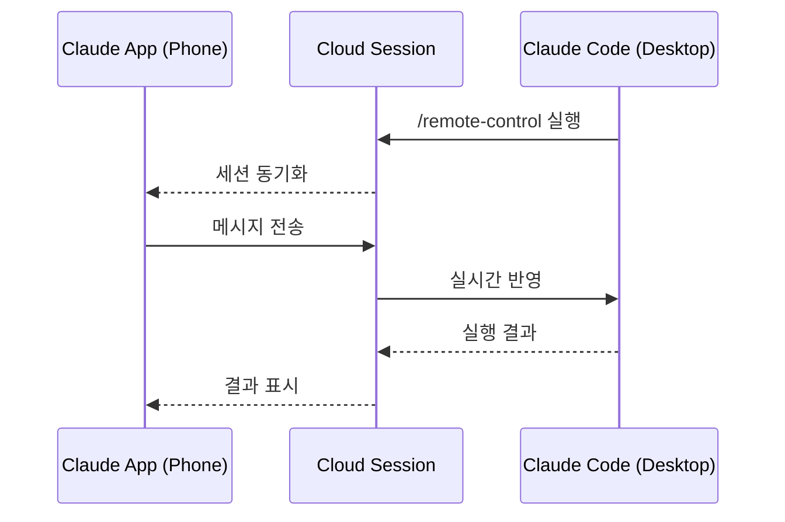

## 개요

[이전 글: Claude Code 실전 가이드 — 컨텍스트 관리부터 워크플로우까지](/posts/2026-03-19-claude-code-practical-guide/)에서는 CLAUDE.md, Lazy Loading, TDD 워크플로우, 서브에이전트 등 Claude Code의 핵심 사용 전략을 정리했다. 불과 5일 만에 후속편을 쓰게 된 이유는 단순하다 — Claude Code가 최근 2개월간 쏟아낸 신기능의 양이 그만큼 압도적이기 때문이다. Cole Medin의 [You're Hardly Using What Claude Code Has to Offer, it's Insane](https://www.youtube.com/watch?v=uegyRTOrXSU) 영상을 바탕으로, 이전 글에서 다루지 않은 9가지 핵심 신기능을 정리한다.

<!--more-->



## 1M 컨텍스트 윈도우 — 그러나 250K가 실질적 한계

Sonnet과 Opus 모두 1M(백만) 토큰 컨텍스트 윈도우가 GA(General Availability)되었다. 약 750,000 단어를 단기 기억에 담을 수 있다는 뜻이다. 이론적으로는 전체 코드베이스를 한 번에 읽힐 수 있다.

**그러나 실전에서의 한계는 분명하다.** Cole Medin의 반복적인 테스트에 따르면, **250K~300K 토큰을 넘어가면 환각(hallucination)이 급격히 증가**한다. `/context` 명령으로 현재 토큰 사용량을 수시로 확인하고, 250K에 가까워지면 memory compaction을 하거나 handoff prompt를 작성해서 새 세션으로 넘어가는 것이 좋다.

> 이전 글에서 "Context is milk — 시간이 지나면 상한다"고 했는데, 1M 윈도우가 열려도 이 원칙은 변하지 않는다. **신선한 200K가 부풀어진 500K보다 낫다.**

## Git Worktrees 네이티브 지원

이전 글에서 `git worktree` 명령어를 수동으로 실행하는 방법을 소개했다. 이제는 **Claude Code가 워크트리를 네이티브로 지원**한다.

```bash
# 이전: 수동으로 worktree 생성 후 각각에서 claude 실행
git worktree add ../project-feature-a feature-a
cd ../project-feature-a && claude

# 현재: Claude Code 내에서 직접 생성
# .claude/worktrees/ 폴더에 자동 관리
```

핵심 변화는 `.claude/worktrees/` 폴더에서 워크트리가 자동으로 관리된다는 것이다. 별도의 git 명령 없이 Claude Code 안에서 바로 워크트리를 만들고, 각각에서 독립적인 작업을 진행할 수 있다. 실제 개발에서는 항상 여러 feature branch와 PR을 동시에 다루므로, 이 기능은 병렬 작업의 진입 장벽을 크게 낮춘다.

## /simplify — 과잉 엔지니어링 방지

LLM이 코드를 생성할 때 가장 흔한 문제 중 하나가 **과잉 엔지니어링**이다. 불필요한 추상화, 과도한 에러 핸들링, 쓸데없는 유틸리티 함수가 끼어든다. Anthropic이 내부에서 쓰다가 공개한 빌트인 커맨드가 바로 `/simplify`다.

구현을 완료한 직후 `/simplify`를 실행하면, Claude가 코드를 리뷰하면서 불필요한 복잡성을 제거한다. 수동으로 "이거 너무 복잡한데 단순화해줘"라고 매번 타이핑하던 것을 한 명령으로 자동화한 셈이다.

## /batch — 대규모 리팩토링의 병렬 처리

`/batch`는 대규모 변경 사항을 병렬로 처리하는 커맨드다. 내부적으로 작업을 분할하고 여러 서브에이전트에게 분배한다.

```
/batch replace all console.log calls with structured logger from utils/logger
```

이 한 줄로 Claude가:
1. 코드베이스를 스캔해서 모든 `console.log`를 찾고
2. 작업을 서브에이전트들에게 분배하고
3. 각 에이전트가 병렬로 변환을 수행하고
4. 결과를 취합해서 PR을 생성한다

대규모 마이그레이션, 린팅 규칙 변경, API 버전 업그레이드 등 "단순하지만 파일이 많은" 리팩토링에 최적이다.

## Remote Control — 폰에서 데스크탑 제어

가장 인상적인 신기능 중 하나다. Claude Code 세션에서 `/remote-control`을 실행하면 클라우드 세션이 생성되고, **Claude 모바일 앱에서 그 세션에 접속**할 수 있다.



폰에서 보내는 메시지가 데스크탑의 Claude Code 세션에 실시간으로 반영된다. 이동 중에도 빌드 상태를 확인하거나, 간단한 수정 지시를 내릴 수 있다. 데스크탑 앞에 앉아 있지 않아도 개발을 계속할 수 있는 것이다.

## Auto-memory — Claude가 스스로 기억하는 시스템

이전 글에서 `CLAUDE.md`(팀 공유 규칙)와 `MEMORY.md`(개인 학습)를 분리하는 전략을 다뤘다. Auto-memory는 여기서 한 단계 더 나아간다 — **Claude가 세션을 넘나들며 스스로 기억을 축적**한다.

| 구분 | CLAUDE.md | Auto-memory |
|------|-----------|-------------|
| 관리 방식 | 사용자가 수동 작성 | Claude가 자동 축적 |
| 저장 위치 | 프로젝트 루트 | `~/.claude/memory/` |
| 내용 | 팀 규칙, 컨벤션 | 실수 패턴, 프로젝트 인사이트 |
| 결정론성 | 높음 (우리가 통제) | 낮음 (Claude가 판단) |
| 비활성화 | N/A | 가능 |

기본적으로 활성화되어 있으며, 비활성화할 수도 있다. Cole Medin의 조언:
- **최대한의 통제**를 원한다면 → CLAUDE.md만 사용
- **Claude에게 자율성**을 주고 싶다면 → CLAUDE.md + Auto-memory 병행

실전에서는 둘을 병행하는 것을 추천한다. Auto-memory가 축적한 내용을 주기적으로 확인하고, 유용한 것은 CLAUDE.md로 승격시키면 된다.

## /btw — 컨텍스트를 오염시키지 않는 질문

작업 중에 "이 라이브러리의 이 함수가 뭐하는 거지?" 같은 빠른 질문이 떠올랐을 때, 메인 세션에서 물어보면 컨텍스트가 불필요하게 커진다. `/btw`는 **사이드카 대화**를 열어서 메인 컨텍스트를 건드리지 않고 질문할 수 있게 해준다.

```
/btw CRUD가 뭐의 약자야?
→ (답변 확인)
→ Escape로 닫기
→ 메인 세션은 그대로 유지
```

**주의:** `/btw` 모드에서는 Claude가 도구를 사용할 수 없다. 코드베이스 탐색이 필요한 질문은 서브에이전트를 쓰고, 단순 지식 질문만 `/btw`로 처리하라.

## /loop — 반복 작업 예약

특정 프롬프트를 일정 간격으로 반복 실행하는 커맨드다.

```bash
# 5분마다 배포 상태 확인
/loop 5m check if the deployment finished and give me a status update

# 30분마다 테스트 실행
/loop 30m run all tests and alert if any are failing
```

CI/CD 파이프라인 모니터링, 주기적 테스트 실행, 외부 웹사이트 폴링 등에 유용하다. 다른 Claude Code 인스턴스에서 작업하면서 `/loop`으로 품질 게이트를 돌리는 패턴이 특히 강력하다.

## /voice — 네이티브 음성 입력

`/voice`로 음성 입력을 활성화할 수 있다. 특히 Plan 모드에서 브레인덤프를 할 때 타이핑보다 훨씬 빠르다.

Cole Medin은 Aqua Voice, WhisperFlow, Whispering(오픈소스) 같은 외부 도구가 아직 네이티브보다 약간 더 정확하다고 평가했지만, 별도 도구를 설치하지 않고 바로 쓸 수 있다는 점에서 진입 장벽이 낮다.

## Effort Levels — 토큰 사용량 조절

모델의 추론 깊이를 조절할 수 있다. `/effort` 또는 세션 시작 시 좌우 화살표로 변경 가능하다.

| 레벨 | 적합한 작업 | 토큰 사용량 |
|------|------------|------------|
| **Low** | 간단한 수정, 포맷팅 | 최소 |
| **Medium** (기본) | 일반 코딩, 버그 수정 | 보통 |
| **High** | 복잡한 문제 해결 | 높음 |
| **Max** (Opus 전용) | 극도로 어려운 디버깅 | 최대 |

5시간 또는 주간 토큰 한도에 걸리지 않으려면, 간단한 작업에서 Low를 적극 활용하고 정말 어려운 문제에만 High/Max를 쓰는 것이 좋다.

## Scheduled Tasks & Cron Jobs

`/loop`이 세션 내 반복이라면, Scheduled Tasks는 **세션 바깥에서** 작동한다.

- **일회성 리마인더**: "3시에 릴리스 브랜치 push 알려줘"
- **Cron Jobs**: 반복적으로 실행할 작업을 예약. 매일 아침 코드 품질 리포트를 생성하거나, 매시간 특정 API의 상태를 체크하는 등의 자동화가 가능하다.

## 인사이트

이전 글에서 "Claude Code는 도구가 아니라 시스템이다"라고 했다. 이번 신기능들은 그 시스템의 범위를 **시간과 공간 모두에서 확장**한다.

**공간의 확장:** Remote Control로 데스크탑 밖으로, Git Worktrees로 단일 브랜치 밖으로, `/batch`로 단일 파일 밖으로 작업 범위가 넓어졌다.

**시간의 확장:** Auto-memory로 세션을 넘어선 학습이, `/loop`과 Scheduled Tasks로 사용자가 자리를 비운 시간에도 작업이 이어진다.

**인지 부하의 감소:** `/simplify`가 과잉 엔지니어링을, `/btw`가 컨텍스트 오염을, Effort Levels가 토큰 낭비를 줄여준다.

5일 전 글에서 다룬 CLAUDE.md, Plan 모드, TDD, 서브에이전트가 **기초 체력**이라면, 이번 글의 기능들은 **장비 업그레이드**다. 기초 체력 없이 장비만 좋아선 안 되지만, 기초가 탄탄한 상태에서 이 도구들을 활용하면 생산성이 확실히 한 단계 올라간다.

---

*출처: [You're Hardly Using What Claude Code Has to Offer, it's Insane](https://www.youtube.com/watch?v=uegyRTOrXSU) — Cole Medin*
