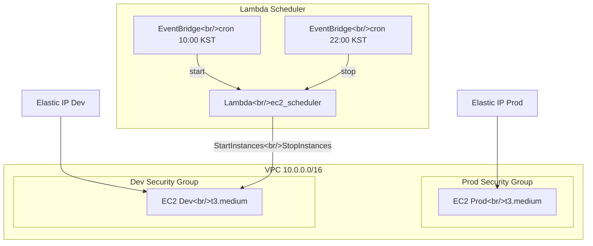
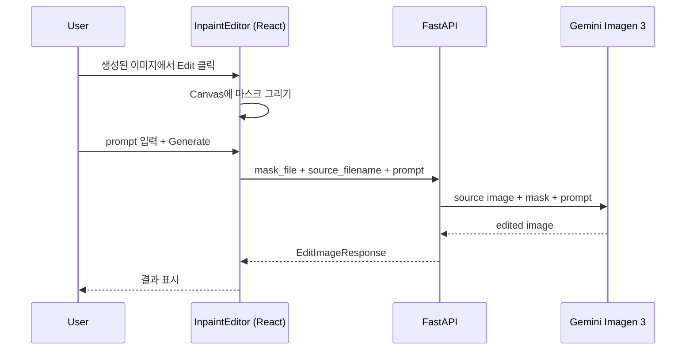

## 개요

[이전 글: #3 — 검색 파이프라인 고도화와 생성 이미지 비교 모드](/posts/2026-03-20-hybrid-search-dev3/)

이번 #4에서는 23개 커밋에 걸쳐 세 가지 큰 작업 스트림을 진행했다.

1. **main.py 라우터 분리** — 비대해진 단일 파일을 5개 route 모듈로 쪼개는 리팩토링
2. **Terraform Dev 서버 구축** — AWS EC2 + Lambda Scheduler로 비용 효율적인 개발 환경 구성
3. **Inpaint 에디터 구현** — Figma 디자인부터 Canvas 기반 마스크 에디터, API, DB migration까지

<!--more-->

## main.py 라우터 분리

### 왜 분리했나

코드 리뷰 중 `main.py`가 앱 초기화, 글로벌 상태, 라우트 핸들러를 전부 담고 있어서 변경 충돌이 잦고 탐색이 어려운 문제가 있었다. 특히 generation, search, images 관련 엔드포인트가 하나의 파일에 섞여 있으니 새 기능(Inpaint 등)을 추가할 때마다 diff가 커졌다.

### 어떻게 분리했나

FastAPI의 `APIRouter`를 활용해서 5개 모듈로 순차적으로 추출했다.

```
backend/src/routes/
├── meta.py        # health, API info, frontend serving
├── images.py      # GET /images, upload, selection logging
├── search.py      # POST /search, hybrid/simple
├── history.py     # GET /api/history/generations
├── generation.py  # POST /api/generate-image
├── edit.py        # POST /api/edit-image (나중에 추가)
└── auth.py        # Google OAuth (기존)
```

각 route 모듈은 글로벌 상태(`images_data`, `hybrid_pipeline` 등)에 접근할 때 `from backend.src import main as app_module`을 함수 본문 안에서 import하는 패턴을 유지했다. 순환 참조를 피하면서도 별도 DI 컨테이너 없이 간결하게 처리하는 방식이다.

분리 후 `main.py`는 약 140줄로 줄었고, 앱 생성 + lifespan + CORS + 라우터 등록만 남게 되었다.

### 리팩토링 원칙

- **한 번에 하나의 모듈만 추출**: meta → images → search → history → generation 순서로, 매번 커밋 후 동작 확인
- **기존 URL 경로 변경 없음**: `prefix` 설정으로 API 계약 유지
- **import 패턴 통일**: 모든 route 모듈이 동일한 방식으로 글로벌 상태에 접근


## Terraform Dev 서버 구축

### 배경

로컬 개발 환경에서는 ML 모델 로딩과 이미지 처리가 느리고, 팀원 간 환경 차이도 있었다. AWS에 dev 서버를 하나 올리되, 사용하지 않는 시간에는 자동으로 꺼서 비용을 절약하고 싶었다.

### 아키텍처 결정

VPC를 새로 만들 것인지, 기존 prod VPC를 공유할 것인지 논의했다. 결론은 **Option B: VPC 공유, Security Group 분리**. 소규모 프로젝트에서 VPC를 이중으로 관리하는 것은 오버헤드가 크고, Security Group 레벨에서 충분히 격리할 수 있다고 판단했다.



### 주요 리소스

| 리소스 | 용도 |
|---|---|
| `aws_security_group.dev_sg` | SSH(22), HTTP(80), Backend(8000), Vite(5173) 허용 |
| `aws_instance.dev_server` | Ubuntu 24.04 LTS, t3.medium, gp3 40GB |
| `aws_eip.dev_eip` | 고정 IP (서버 재시작해도 유지) |
| `aws_key_pair.dev_key` | dev 전용 SSH 키페어 |
| `aws_lambda_function` | EC2 start/stop 실행 |
| `aws_scheduler_schedule` (start) | 매일 10:00 KST 시작 |
| `aws_scheduler_schedule` (stop) | 매일 22:00 KST 중지 |

### Lambda Scheduler 구조

EventBridge Scheduler가 Lambda를 호출할 때 `action`과 `instance_id`를 JSON payload로 전달한다. Lambda는 단순히 `boto3`로 `start_instances` 또는 `stop_instances`를 호출하는 역할만 한다.

IAM 권한은 최소 권한 원칙을 적용했다. Lambda Role은 해당 인스턴스에 대해서만 `ec2:StartInstances`, `ec2:StopInstances`, `ec2:DescribeInstances`를 허용하고, EventBridge Scheduler Role은 해당 Lambda 함수만 invoke할 수 있도록 제한했다.

하루 12시간(10:00~22:00) 운영이므로, 24시간 대비 약 **50% 비용 절감** 효과가 있다.


## Inpaint 에디터 구현

### 설계 과정

Figma에서 InpaintFullPage 디자인을 확인한 뒤, design spec과 implementation plan을 먼저 작성했다. 전체 흐름은 다음과 같다.



### Backend 변경사항

**DB Migration**: `generation_logs` 테이블에 `is_inpaint` Boolean 컬럼 추가. 기존 생성 이력과 inpaint 생성을 구분하기 위해서다.

**Schemas**: `EditImageRequest`와 `EditImageResponse`를 새로 정의했다. Request는 `source_filename`, `prompt`, `swap_filename`, `parent_generation_id`, `image_count`를 받고, mask는 multipart `File`로 별도 전송한다.

JSON 데이터와 파일을 함께 전송해야 하므로, JSON payload를 `Form` 필드의 문자열로 받아서 파싱하는 방식을 택했다. FastAPI에서 `File`과 `Body`(JSON)를 동시에 사용할 수 없는 제약 때문이다.

**Service**: `generate_edit_image` 헬퍼를 추가해서, 기존 `generate_single_image`와 구조를 맞추되 Gemini API 호출 시 source image + mask image + (optional) swap image를 contents에 포함하도록 했다.

### Frontend: InpaintEditor 컴포넌트

Canvas 기반 마스크 에디팅 컴포넌트를 구현했다. 주요 기능:

- 원본 이미지 위에 Canvas overlay로 브러시 마스크 그리기
- 브러시 크기 조절
- Undo/Clear 지원
- 마스크 영역을 흰색 PNG로 export해서 API에 전송

`App.tsx`의 상태로 `editingImage`를 추가하고, 생성된 이미지의 Edit 버튼 클릭 시 InpaintEditor가 표시되도록 연결했다.


## 커밋 로그

| # | 커밋 메시지 | 변경 요약 |
|---|---|---|
| 1 | refactor: extract routes/meta.py with APIRouter | meta 라우트 분리 |
| 2 | refactor: extract routes/images.py with APIRouter | images 라우트 분리 |
| 3 | refactor: extract routes/search.py with APIRouter | search 라우트 분리 |
| 4 | refactor: extract routes/history.py with APIRouter | history 라우트 분리 |
| 5 | refactor: extract routes/generation.py with APIRouter | generation 라우트 분리 |
| 6 | docs: add dev server Terraform design spec | Terraform 설계 스펙 문서 |
| 7 | docs: add dev server Terraform implementation plan | Terraform 구현 계획 문서 |
| 8 | chore: add SSH key pair public keys | 공개키 파일 추가 |
| 9 | feat: manage SSH key pairs via Terraform aws_key_pair | SSH 키페어 Terraform 관리 |
| 10 | feat: add dev security group | dev 전용 Security Group |
| 11 | feat: add dev EC2 instance and Elastic IP | dev EC2 t3.medium + EIP |
| 12 | feat: add dev Lambda scheduler with IAM role and policy | Lambda + IAM 권한 |
| 13 | feat: add dev EventBridge scheduler (10:00-22:00 KST) | EventBridge cron 스케줄 |
| 14 | docs: add inpaint & swap feature design spec | 기능 설계 스펙 문서 |
| 15 | docs: add inpaint & swap implementation plan | 구현 계획 문서 |
| 16 | feat: add is_inpaint column to generation_logs | Alembic migration |
| 17 | feat: add EditImageRequest/Response schemas | Pydantic schema 추가 |
| 18 | feat: add generate_edit_image service helper | Gemini API 서비스 헬퍼 |
| 19 | feat: add POST /api/edit-image endpoint | edit.py 라우트 모듈 |
| 20 | feat: add editImage API function and is_inpaint types | frontend api.ts |
| 21 | feat: add InpaintEditor component | Canvas 마스크 에디터 |
| 22 | feat: integrate InpaintEditor with edit button and app state | App.tsx 통합 |
| 23 | fix: correct image_count field name and add Form annotation | 필드명 수정 |


## 인사이트

**리팩토링은 기능 추가 전에 하는 게 맞다.** main.py 라우터 분리를 먼저 했기 때문에 Inpaint 에디터의 `edit.py`를 추가할 때 기존 코드를 건드릴 필요 없이 새 모듈만 등록하면 됐다. 분리하지 않았다면 main.py에 150줄이 더 추가되었을 것이다.

**Terraform은 prod/dev를 같은 파일에서 관리해도 된다.** 별도 workspace나 디렉토리 분리 없이 하나의 `main.tf`에 prod/dev 리소스를 모두 선언했다. 프로젝트 규모가 작을 때는 이 방식이 전체 인프라를 한눈에 파악하기 좋다.

**File + JSON 동시 전송은 FastAPI에서 까다롭다.** `File`과 `Body`를 동시에 사용할 수 없어서 JSON payload를 `Form` 문자열로 받아 파싱하는 우회 방식을 썼다. multipart form data의 본질적인 제약이다.

**Lambda Scheduler는 소규모 dev 서버에 최적이다.** AWS Instance Scheduler 같은 무거운 솔루션 대신 Lambda + EventBridge 조합으로 구현하면 추가 비용이 거의 0에 가깝고, Terraform으로 관리하기도 쉽다.
