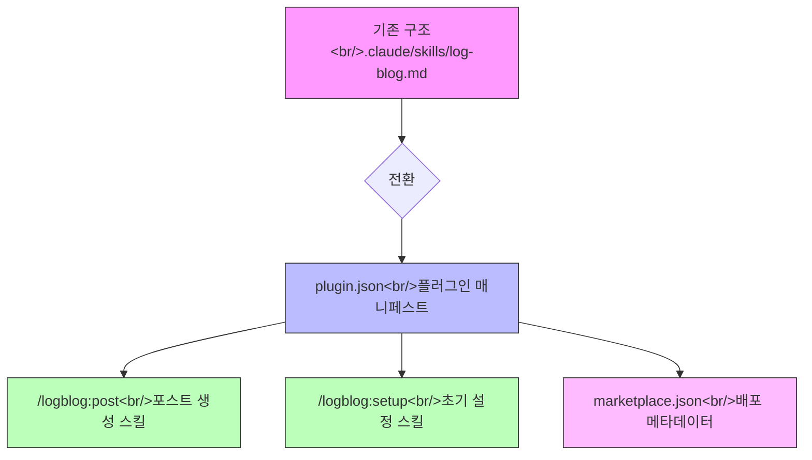

## 개요

[이전 글: #2 — Unified Skill Flow와 --since-last-run 추적](/posts/2026-03-20-log-blog-dev2/)

이번 글에서는 두 가지 큰 흐름을 다룬다. 첫째, YouTube oEmbed 메타데이터와 시리즈 연속성 감지 같은 기능 개선. 둘째, `.claude/skills/` 디렉토리에 놓던 단독 스킬을 Claude Code 플러그인 구조로 전환한 작업이다. 9개 커밋, 총 7개 세션에 걸친 작업 기록이다.

<!--more-->

## YouTube oEmbed 메타데이터 개선

기존에는 YouTube 링크를 블로그 포스트에 포함할 때 제목 정도만 가져왔다. 이번에 두 가지를 개선했다.

**oEmbed API 활용.** YouTube의 oEmbed endpoint를 호출해서 썸네일, 작성자, 영상 제목 등 메타데이터를 자동으로 수집한다. Hugo shortcode에서 이 정보를 활용할 수 있게 했다.

**transcript-api v1.x 마이그레이션.** `youtube-transcript-api` 라이브러리가 v1.x로 메이저 업데이트되면서 API가 바뀌었다. 기존의 `YouTubeTranscriptApi.get_transcript()` 호출 방식에서 새로운 인터페이스로 전환했다. 이 작업은 단순한 의존성 업데이트지만, transcript 기반 요약 기능이 블로그 포스트 생성에 핵심이므로 빠르게 대응할 필요가 있었다.

## 시리즈 연속성 감지

Log-Blog의 핵심 기능 중 하나는 시리즈물 관리다. 같은 프로젝트에 대해 `#1`, `#2`, `#3`을 이어서 쓸 때, 이전 글 이후의 커밋만 골라내야 한다.

기존에는 날짜 기반으로 커밋을 필터링했다. 문제는 날짜가 부정확하다는 것이다. 포스트 발행일과 마지막 작업일이 다를 수 있고, 타임존 이슈도 있다.

해결책은 간단했다. Hugo frontmatter에 `last_commit` 필드를 추가하고, `sessions` 명령에서 이 SHA를 읽어 해당 커밋 이후의 변경사항만 수집하는 것이다. 날짜 파싱의 모호함이 사라지고, 정확히 이전 포스트가 커버한 지점부터 이어갈 수 있게 되었다.

## 플러그인 전환

이번 개발 사이클에서 가장 큰 작업이다. 7번째 세션에서 약 7시간을 투자했다.

### 왜 플러그인인가

`.claude/skills/` 디렉토리에 스킬 파일을 직접 넣는 방식은 동작하지만, 배포와 업데이트에 한계가 있다. 사용자가 수동으로 파일을 복사해야 하고, 버전 관리도 안 된다. Claude Code의 플러그인 시스템을 사용하면 설치와 업데이트를 자동화할 수 있다.

### 구조 설계

### plugin.json 매니페스트

플러그인의 진입점이다. `author` 필드는 처음에 문자열로 넣었다가 스키마 검증에서 실패했다. 객체 형태(`{ "name": "...", "url": "..." }`)여야 한다는 걸 에러 메시지를 보고 알았다. 사소하지만 이런 게 한 커밋을 잡아먹는다.

### 스킬 마이그레이션

기존 `/log-blog` 스킬을 `/logblog:post`로 이름을 바꿨다. 콜론(`:`) 구분자는 Claude Code 플러그인의 네임스페이스 컨벤션이다. 플러그인 이름이 접두사가 되고, 콜론 뒤가 개별 스킬 이름이 된다. 스킬의 내부 로직은 그대로 유지하되, 경로 참조와 호출 방식만 플러그인 구조에 맞게 조정했다.

### /logblog:setup 스킬

새로 추가한 스킬이다. 블로그를 처음 세팅하는 사용자를 위해 end-to-end 설정을 자동화한다.

- Hugo 프로젝트 구조 확인
- 설정 파일 생성
- 필요한 디렉토리 구조 생성
- Git 연동 확인

5번째 세션에서 `/logblog:post`를 호출했는데 스킬을 찾지 못하는 문제가 있었다. 플러그인 설치 전이라 당연한 결과였지만, 이 경험이 setup 스킬의 필요성을 확인시켜 줬다.

## 마켓플레이스 배포

`marketplace.json`은 Claude Code 플러그인 레지스트리에 등록하기 위한 메타데이터 파일이다. 플러그인 이름, 설명, 버전, 저장소 URL, 지원하는 스킬 목록 등을 포함한다. 아직 공식 마켓플레이스가 활성화되지 않은 상태이므로, 현재는 GitHub 저장소 URL을 통한 직접 설치 방식을 사용한다. 마켓플레이스가 열리면 바로 등록할 수 있도록 준비해 둔 셈이다.

## 커밋 로그

| # | 커밋 메시지 | 비고 |
|:---:|--------|------|
| 1 | feat: add YouTube oEmbed metadata and migrate to transcript-api v1.x | 기능 개선 |
| 2 | feat: detect series updates via last_commit SHA in sessions command | 시리즈 연속성 |
| 3 | docs: add logblog plugin design spec | 설계 문서 |
| 4 | docs: add logblog plugin implementation plan | 구현 계획 |
| 5 | feat: add logblog Claude Code plugin manifest | plugin.json |
| 6 | feat: migrate /log-blog skill to /logblog:post in plugin structure | 스킬 이전 |
| 7 | feat: add /logblog:setup skill for end-to-end blog setup | setup 스킬 |
| 8 | fix: plugin.json author field must be object, not string | 스키마 수정 |
| 9 | feat: add marketplace.json for plugin distribution | 마켓플레이스 |

## 인사이트

**문서 먼저, 코드 나중.** 7번째 세션에서 설계 문서와 구현 계획을 먼저 작성하고 코드를 짰다. 412분이라는 긴 세션이었지만, 방향이 흔들리지 않았다. 플러그인 구조라는 새로운 영역에서는 특히 이 순서가 중요했다.

**스키마는 추측하지 말고 검증하라.** `plugin.json`의 `author` 필드 타입을 틀린 게 대표적이다. 새로운 포맷을 다룰 때는 예제나 스키마 정의를 먼저 확인해야 한다.

**실패한 호출이 기능을 만든다.** 5번째 세션에서 스킬 호출이 실패한 경험이 `/logblog:setup` 스킬을 만드는 동기가 되었다. 사용자가 겪을 첫 경험을 직접 겪어보는 것, 이것이 가장 정확한 요구사항 수집이다.

**네이밍은 생태계를 따른다.** `/log-blog`에서 `/logblog:post`로의 변경은 단순 이름 변경이 아니다. 플러그인 생태계의 네임스페이스 컨벤션을 따르는 것이다. 독자적 네이밍보다 생태계 관습을 따르는 편이 장기적으로 유리하다.
