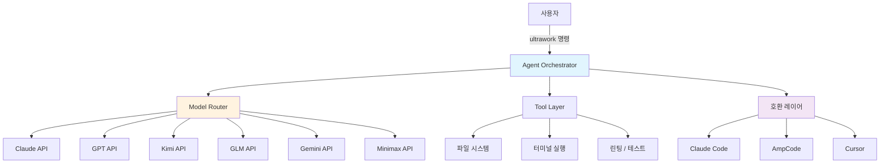
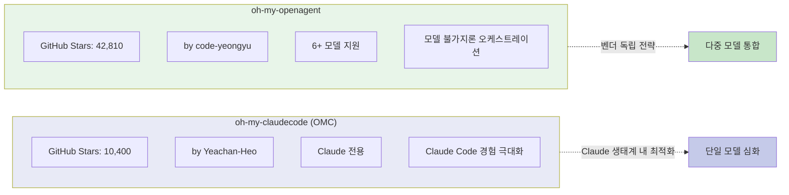

## 개요

[oh-my-openagent](https://github.com/code-yeongyu/oh-my-openagent)(이전 이름: oh-my-opencode)는 특정 LLM에 종속되지 않는 **모델 불가지론(model-agnostic) 에이전트 오케스트레이터**다. GitHub 스타 42,810개를 기록하며, TypeScript 기반 6M+ 라인 규모의 프로젝트로 성장했다.

이전에 소개한 [oh-my-claudecode(OMC)](/posts/2026-03-20-oh-my-claudecode/)가 Claude Code 전용 확장이었다면, oh-my-openagent는 근본적으로 다른 접근을 취한다. Claude, GPT, Kimi, GLM, Gemini, Minimax 등 **어떤 모델이든** 하나의 인터페이스로 통합하는 것이 목표다.

<!--more-->

## 핵심 철학 — 벤더 종속의 거부

oh-my-openagent의 철학은 한 문장으로 요약된다:

> "Anthropic wants you locked in. Claude Code's a nice prison, but it's still a prison."

Claude Code는 훌륭한 도구다. 하지만 Anthropic 생태계 안에 사용자를 가두는 구조이기도 하다. 실제로 Anthropic은 이 프로젝트(당시 OpenCode) 때문에 API 접근을 차단한 전력이 있다. 이는 역설적으로 oh-my-openagent의 존재 이유를 증명해 주었다 — 단일 벤더에 의존하면 언제든 문이 닫힐 수 있다.

이 프로젝트는 **SUL-1.0 라이선스**를 채택했다. 그리고 Sisyphus Labs에서 상용화 버전을 구축 중이다.

### 구독 비용 비교

모델 불가지론 접근의 실질적 장점은 비용 최적화에서도 드러난다:

| 서비스 | 월 비용 | 비고 |
|--------|---------|------|
| ChatGPT | $20 | GPT-4o 기반 |
| Kimi Code | $0.99 | 가성비 최강 |
| GLM | $10 | 중간 가격대 |
| Claude Pro | $20 | Claude Code 포함 |

하나의 도구로 이 모든 모델을 오가며 작업할 수 있다는 것이 핵심이다.

## 아키텍처

oh-my-openagent의 킬러 피처는 `ultrawork` 커맨드다. 한 줄 명령으로 에이전트가 코드 분석, 수정, 테스트, 린팅까지 전체 워크플로우를 자동 수행한다.

### 주요 구성 요소

1. **Agent Orchestrator** — 작업을 분석하고 최적의 모델과 도구 조합을 결정한다
2. **Model Router** — 작업 특성에 따라 Claude, GPT, Kimi 등 적절한 모델로 라우팅한다
3. **Tool Layer** — 파일 시스템 접근, 터미널 실행, 린팅/테스트 등 실제 작업을 수행한다
4. **호환 레이어** — Claude Code, AmpCode, Cursor 등 기존 도구와의 통합을 지원한다

최근 커밋에서는 background-agent의 stale timeout 처리가 개선되었는데, 이는 장시간 실행되는 에이전트 작업의 안정성을 높이기 위한 것이다.

## OMC와의 비교

oh-my-claudecode(OMC)와 oh-my-openagent는 이름이 비슷하지만 철학과 범위가 완전히 다르다.

| 항목 | oh-my-claudecode (OMC) | oh-my-openagent |
|------|----------------------|-----------------|
| **GitHub Stars** | 10,400 | 42,810 |
| **지원 모델** | Claude 전용 | Claude, GPT, Kimi, GLM, Gemini, Minimax |
| **철학** | Claude Code를 더 좋게 | 특정 모델에 종속되지 않겠다 |
| **킬러 피처** | Claude 특화 프롬프트/워크플로우 | `ultrawork` 통합 커맨드 |
| **언어** | TypeScript | TypeScript |
| **접근 방식** | 단일 모델 심화 (depth) | 다중 모델 통합 (breadth) |
| **라이선스** | MIT | SUL-1.0 |
| **상용화** | 커뮤니티 주도 | Sisyphus Labs 상용화 진행 |

**OMC는 Claude가 최고의 모델이라는 전제 하에** Claude Code 경험을 극대화한다. **oh-my-openagent는 어떤 모델이 최고인지는 작업마다 다르다**는 전제 하에 모델 선택권을 사용자에게 돌려준다. 두 프로젝트는 경쟁이 아니라 서로 다른 질문에 대한 답이다.

## 커뮤니티 반응

42,810개의 스타가 말해주듯, 커뮤니티의 반응은 폭발적이다. 몇 가지 실제 리뷰를 보자:

- **"Cursor 구독을 취소했다"** — 별도의 IDE 구독 없이 oh-my-openagent 하나로 충분하다는 의견
- **"하루 만에 ESLint 경고 8,000개를 처리했다"** — `ultrawork` 커맨드의 자동화 능력을 보여주는 사례
- **"45,000줄짜리 Tauri 앱을 하룻밤 만에 SaaS로 전환했다"** — 대규모 리팩터링에서의 생산성

이런 리뷰들의 공통점은 **자동화 범위의 넓이**다. 단순한 코드 완성이 아니라, 프로젝트 전체를 아우르는 작업을 한 번의 명령으로 수행할 수 있다는 점이 기존 도구와의 차별점이다.

## 인사이트 — AI 코딩 생태계의 분기점

oh-my-openagent의 부상은 AI 코딩 도구 생태계에서 중요한 신호를 보내고 있다.

### 1. 벤더 종속에 대한 피로감

Anthropic이 OpenCode를 차단한 사건은 개발자 커뮤니티에 경종을 울렸다. 아무리 좋은 도구라도 플랫폼 사업자의 한마디에 접근이 끊길 수 있다. oh-my-openagent의 42K+ 스타는 이 불안감에 대한 시장의 응답이다.

### 2. "최고의 모델"은 없다

GPT가 잘하는 작업, Claude가 잘하는 작업, Kimi가 가성비 좋은 작업이 각각 다르다. 모델 불가지론 접근은 이 현실을 인정하고, 작업 특성에 따라 최적의 모델을 선택할 수 있게 해 준다.

### 3. CLI 에이전트의 수렴 진화

Claude Code, Cursor, AmpCode 등 다양한 도구가 결국 비슷한 형태(터미널 기반 에이전트 + 도구 사용)로 수렴하고 있다. oh-my-openagent는 이 수렴을 한 발 앞서 읽고, 모든 도구를 하나의 인터페이스로 통합하는 메타 레이어를 구축했다.

### 4. OMC와 oh-my-openagent, 양립 가능한 미래

단일 모델 심화(OMC)와 다중 모델 통합(oh-my-openagent)은 상호 배타적이지 않다. Claude가 주력 모델인 개발자는 OMC로 Claude 경험을 최적화하면서, oh-my-openagent로 다른 모델을 보조적으로 활용할 수 있다. 생태계가 성숙할수록 이런 레이어드 접근이 표준이 될 가능성이 높다.

---

AI 코딩 도구의 경쟁이 "어떤 모델이 좋은가"에서 "어떻게 모델을 조합하는가"로 이동하고 있다. oh-my-openagent는 그 전환점에 서 있는 프로젝트다.
