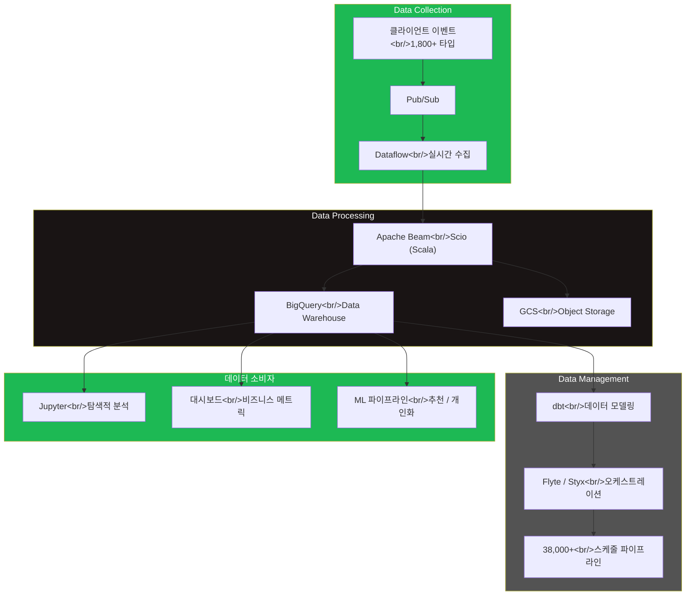
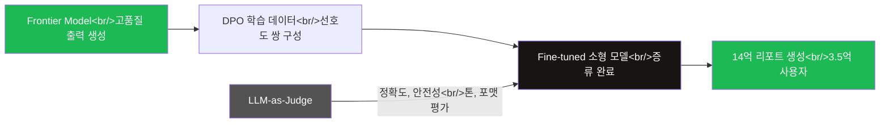
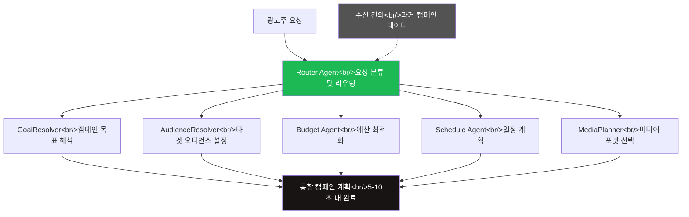

## 개요

2024년 9월, 인프런 온라인 밋업에서 스포티파이 현직 데이터 엔지니어가 자신의 커리어 전환과 실무 경험을 공유했다. 네이버에서 4.5년간 Spring 백엔드 개발을 하다가 Scala + Spark 경험을 기반으로 스포티파이 데이터 엔지니어로 전환한 이야기였다. 약 1년이 지난 지금, 스포티파이 엔지니어링 블로그에는 하루 1.4조 데이터 포인트를 처리하는 플랫폼, AI 모델 증류 파이프라인, 멀티 에이전트 광고 시스템까지 — 데이터 엔지니어링의 범위가 극적으로 확장된 흔적이 남아있다. 밋업에서 들은 현장의 목소리와 공식 블로그의 기술 상세를 교차하면, 데이터 엔지니어라는 역할이 어디로 향하고 있는지 더 선명하게 보인다.

<!--more-->

## 밋업 핵심 내용

### 도메인 전환의 현실

발표자는 백엔드 엔지니어에서 데이터 엔지니어로 전환하면서 겪은 인식의 변화를 솔직하게 전했다. 데이터 엔지니어링이라고 하면 Spark 파이프라인을 떠올리기 쉽지만, 실제 업무의 상당 부분은 **SQL 기반 프로덕트 개발**, **데이터 모델링**, **대시보드 설계**에 집중된다.

> "데이터 생성자와 사용자를 이어주는 연결고리"

이것이 발표자가 정의한 데이터 엔지니어의 본질이었다.

### Engineering vs Science

밋업에서 강조된 구분:

| 구분 | Data Engineering | Data Science |
|------|-----------------|--------------|
| **핵심 활동** | 자동화, 최적화 | 가설 검증 |
| **주요 산출물** | 파이프라인, 데이터 모델 | 분석 리포트, 메트릭 설계 |
| **도구** | SQL, Scala, dbt | Python, Jupyter, 통계 모델 |

### 조직 구조

- **Platform Org**: 백엔드 인프라, 대규모 수집 시스템, Schema Evolution, Data Warehouse
- **Business Org**: 도메인별 데이터 수집, 데이터 모델링, 품질 모니터링
- **Data Scientist**: 분석, 메트릭 설계, 대시보드

### 현직자가 강조한 것들

1. **SQL 유창함이 핵심이다** — 복잡한 프레임워크보다 SQL을 정확하게 쓰는 능력이 실무에서 더 중요하다
2. **Nitpicking이 중요하다** — 데이터 품질은 사소한 불일치를 끈질기게 파고드는 데서 나온다
3. **누구나 데이터에 접근한다** — BigQuery와 Jupyter를 통해 엔지니어가 아닌 사람도 직접 데이터를 탐색한다
4. **AI가 검증과 이해를 대체하지 못한다** — 자동화가 아무리 발전해도 데이터를 이해하고 검증하는 역량은 사람의 몫이다

## 2026년 스포티파이 데이터 플랫폼

2024년 4월 스포티파이 엔지니어링 블로그에 공개된 플랫폼 규모는 밋업에서 언급된 수치를 구체화한다.

### 규모

- **하루 1.4조(trillion) 데이터 포인트** 처리
- **1,800개 이상의 이벤트 타입** 수집
- **38,000개 이상의 활성 스케줄 파이프라인** 운영
- **100명 이상의 엔지니어**가 데이터 플랫폼 전담
- 밋업에서 언급된 하루 약 1,200억 건의 사용자 인터랙션 로그는 이 1.4조의 부분집합이다

### 플랫폼 아키텍처

밋업에서 발표자가 설명한 Platform Org / Business Org 구분이 블로그에서는 **Data Collection / Data Processing / Data Management** 세 영역으로 구체화되어 있다. 공식적으로 나눈 세 영역은 다음과 같다:

- **Data Collection**: 클라이언트 이벤트 수집, Schema Evolution, 실시간 스트리밍
- **Data Processing**: 배치 및 스트리밍 파이프라인, 대규모 변환
- **Data Management**: 메타데이터 관리, 데이터 카탈로그, 품질 모니터링

## Wrapped 2025의 데이터 파이프라인

2026년 3월에 공개된 Wrapped 2025 기술 포스트는 데이터 엔지니어링과 AI가 만나는 지점을 보여준다.

### 규모와 제약

- **3.5억 사용자**에게 **14억 개의 개인화 리포트** 생성
- 개인별 청취 데이터를 기반으로 LLM이 자연어 요약을 생성

### AI 모델 증류 파이프라인

Wrapped 팀은 흥미로운 접근을 취했다. Frontier 모델의 출력을 학습 데이터로 사용해 더 작고 빠른 모델을 fine-tuning하는 **Model Distillation** 방식이다.

핵심 설계 결정들:

1. **DPO(Direct Preference Optimization)**: Frontier 모델의 좋은 출력과 나쁜 출력을 쌍으로 구성해 선호도 학습
2. **LLM-as-Judge 평가**: 정확도(accuracy), 안전성(safety), 톤(tone), 포맷(formatting) 네 축으로 품질 검증
3. **Column-oriented Storage 설계**: 3.5억 사용자의 동시 접근에서 Race Condition을 방지하기 위한 저장소 설계

> "At this scale, the LLM call is the easy part."

이 한 문장이 데이터 엔지니어링의 본질을 관통한다. LLM API를 호출하는 것은 쉽다. 14억 건을 안정적으로, 정확하게, 안전하게 생성하고 전달하는 파이프라인 — 그것이 진짜 엔지니어링이다.

## 멀티 에이전트 광고 아키텍처

2026년 2월에 공개된 멀티 에이전트 광고 시스템은 데이터 엔지니어링이 AI 에이전트 인프라로 확장되는 최전선을 보여준다.

### 문제

광고 캠페인 기획에는 타겟 오디언스 설정, 예산 배분, 스케줄링, 미디어 포맷 선택 등 복잡한 의사결정이 필요하다. 기존에는 **15~30분**이 걸리던 수동 작업이다.

### 해결: 6개의 전문 에이전트

### 기술 스택

| 구성 요소 | 기술 |
|-----------|------|
| Agent Framework | Google ADK 0.2.0 |
| LLM | Vertex AI (Gemini 2.5 Pro) |
| 통신 | gRPC |
| 학습 데이터 | 수천 건의 과거 캠페인 |

**15~30분 → 5~10초**. 데이터 엔지니어링 관점에서 주목할 점은 에이전트 자체보다 그 뒤의 데이터 파이프라인이다. 수천 건의 과거 캠페인 데이터를 정제하고, 에이전트가 참조할 수 있는 형태로 구조화하고, 실시간으로 서빙하는 것 — 이것이 데이터 엔지니어의 영역이다.

## 데이터 엔지니어 스킬트리 2026

밋업에서 언급된 기술 스택과 2026년 채용 공고를 교차하면, 현재 스포티파이 데이터 엔지니어에게 요구되는 역량이 선명해진다.

### 2024년 밋업 vs 2026년 채용 비교

| 영역 | 2024 밋업 언급 | 2026 채용 요구 |
|------|---------------|---------------|
| **언어** | SQL, Scala, Python | SQL, Python, Scala (순서 변화 주목) |
| **처리 엔진** | Spark | Spark, Apache Beam, Scio, Flink |
| **클라우드** | GCP, BigQuery, GCS | GCP, BigQuery, Dataflow, GCS |
| **오케스트레이션** | 언급 없음 | Flyte, Styx |
| **AI/ML** | 간접 언급 | LLM 파이프라인, Model Distillation |
| **에이전트** | 없음 | Multi-Agent 인프라 |

1년 사이에 **Apache Beam / Scio / Flink**가 Spark와 나란히 필수로 올라왔고, **LLM 파이프라인과 에이전트 인프라**가 데이터 엔지니어 영역에 진입했다.

## 인사이트: 1년간의 변화

### 밋업의 예언이 맞았다

발표자가 강조한 "AI가 검증과 이해를 대체하지 못한다"는 메시지는 Wrapped 2025의 사례에서 정확히 입증되었다. LLM-as-Judge를 도입했지만, 그 평가 기준(정확도, 안전성, 톤, 포맷)을 설계하고 파이프라인에 통합하는 것은 결국 엔지니어의 몫이었다.

### 데이터 엔지니어의 범위 확장

2024년 밋업에서 데이터 엔지니어는 "데이터 생성자와 사용자를 이어주는 연결고리"였다. 2026년에는 그 사용자에 **AI 에이전트**가 추가되었다. 에이전트에게 데이터를 서빙하고, 에이전트의 출력을 검증하고, 에이전트 시스템의 데이터 파이프라인을 구축하는 것이 새로운 업무 영역이 되었다.

### 변하지 않는 것

규모가 1,200억에서 1.4조로 10배 이상 커졌고, AI 에이전트와 LLM 파이프라인이 등장했지만, 발표자가 강조한 세 가지는 여전히 유효하다:

1. **SQL 유창함** — BigQuery가 여전히 중심이고, dbt가 데이터 모델링의 표준이다
2. **Nitpicking** — 14억 건의 Wrapped 리포트에서 하나의 오류도 허용되지 않는다
3. **연결고리로서의 정체성** — 생성자와 사용자 사이, 이제는 생성자와 에이전트 사이까지

밋업에서 들은 현직자의 목소리와 1년 후의 공식 기술 블로그를 겹쳐보면, 데이터 엔지니어링은 단순히 파이프라인을 만드는 일에서 **AI 시대의 데이터 인프라를 설계하는 일**로 진화하고 있다. 그리고 그 중심에는 여전히 — 데이터를 정확하게 이해하고, 끈질기게 검증하는 사람이 있다.
