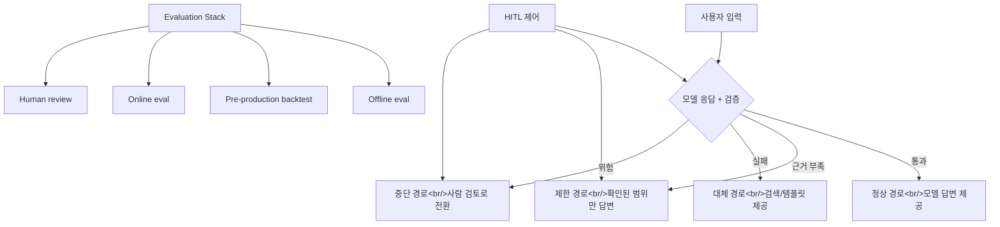

## 개요

TILNOTE의 글 "AI 앱에서 진짜 중요한 것"을 분석했다. 핵심 메시지는 명확하다 — **진짜 문제는 모델이 잘 말하는 순간이 아니라, 애매하게 틀릴 때 시스템이 어떻게 행동하느냐**에 있다. Deterministic Fallback, HITL, Evaluation Stack 세 가지 패턴을 프로덕션 관점에서 정리한다. 관련 포스트: [바이브 코딩 보안 점검 가이드](/posts/2026-03-25-ai-code-security/)

<!--more-->

---

## 왜 이 세 가지인가

글은 구체적인 사례로 시작한다. 고객지원 AI가 환불 정책을 안내하는 상황:

> 사용자: "지난달 결제 건 환불 가능한가요? 카드 취소로 처리해 주세요."
> 모델: "네, 최근 30일 이내 결제 건은 자동 환불 가능합니다. 바로 진행할게요."

문제는 실제 정책에 "디지털 상품 사용 이력이 있으면 환불 불가" 조항이 있고, 자동 환불은 상담사 승인 대상이라는 점이다. 사고의 본질은 "모델이 틀렸다"가 아니라 **"시스템이 틀렸을 때 멈추도록 설계되지 않았다"**에 있다.

NIST AI 600-1도 생성형 AI는 별도의 위험 관리, 측정, 운영 통제가 필요하다고 정리하고, Anthropic과 OpenAI 모두 성공 기준 정의와 평가 설계를 우선하라고 안내한다.

---

## 1. Deterministic Fallback — 모르면 안전한 길로

많은 개발자가 temperature를 낮추고 프롬프트를 다듬으면 안정적일 거라 기대한다. 어느 정도는 맞지만, 그건 출력 흔들림을 줄이는 것이지 시스템을 결정적으로 만드는 것이 아니다.

실무에서 필요한 건 **모델이 실패했을 때 미리 정한 경로로 강등되는 구조**다:

| 단계 | 경로 | 동작 |
|------|------|------|
| 1 | 정상 | 모델 답변 + 검증 통과 |
| 2 | 제한 | 근거가 확인된 범위만 답변 |
| 3 | 대체 | 검색 결과, 정책 문서, 템플릿만 제공 |
| 4 | 중단 | 사람 검토로 전환 |

핵심은 **실패를 모델의 감각에 맡기지 않고, 코드로 정의된 상태 전이로 바꾸는 것**이다.

고객지원 봇의 안전한 흐름:
1. FAQ/정책 문서 검색 먼저
2. 근거 충분할 때만 답변
3. 근거 약하면 상담 연결
4. 환불 같은 액션은 자동 실행 금지

코드 생성 도구도 마찬가지다. 위험한 구조는 "코드 직접 반영"이고, 현실적 구조는 "패치 제안 → 테스트 → 리뷰 → 사람이 머지"다. Anthropic의 Tool Use 문서가 이 구조를 잘 설명한다 — 모델이 도구를 직접 실행하지 않고, 호출을 **제안**하면 앱이 실행을 담당한다.

---

## 2. HITL — 사람은 승인 버튼이 아니라 제어 장치

HITL(Human-in-the-Loop)을 "마지막에 사람 한 번 본다"로 이해하면 불완전하다. 실무에서 중요한 HITL은 **사람이 시스템 흐름을 멈추고, 수정하고, 다시 이어가게 하는 제어 장치**다.

글에서 강조하는 구분:

| 수동적 HITL | 능동적 HITL |
|------------|-----------|
| 최종 승인만 담당 | 흐름 중간에 개입 |
| 결과 확인 | 원인 수정 |
| 배치 리뷰 | 실시간 제어 |

능동적 HITL은 에이전트 워크플로우에서 특히 중요하다. 에이전트가 10단계 작업 중 3단계에서 잘못된 방향으로 가고 있을 때, 10단계가 끝나고 승인하는 것이 아니라 3단계에서 멈추고 방향을 수정할 수 있어야 한다.

---

## 3. Evaluation Stack — 평가는 회귀 방지 장치

OpenAI의 eval 가이드는 "생성형 AI는 본질적으로 variability가 있기 때문에, 기존 소프트웨어 테스트만으로는 충분하지 않다"고 설명한다.

4단계 평가 체계:

1. **Offline eval**: 고정 데이터셋에서 모델 성능 측정. 가장 빠르고 저렴
2. **Pre-production backtest**: 실제 트래픽 로그로 새 버전을 시뮬레이션
3. **Online eval**: A/B 테스트, 카나리 배포. 실제 사용자에게 점진적 노출
4. **Human review**: 사람이 직접 출력을 검토. 가장 비싸지만 가장 신뢰

핵심은 평가가 **리더보드(벤치마크 경쟁)가 아니라 회귀 방지 장치**라는 관점이다. 새 프롬프트나 모델 변경이 기존에 잘 되던 것을 망가뜨리지 않는지 확인하는 것이 목적이다.

---

## 오늘 바로 적용할 수 있는 순서

글에서 제안하는 실무 적용 순서:

1. **출력 구조화** — 자유 텍스트가 아닌 JSON 등 구조화된 형태로
2. **위험한 액션 한 단계 낮추기** — 직접 실행 → 제안으로
3. **fallback 조건을 코드로 정의** — confidence 기반 분기
4. **실패 사례 모아 eval 세트 만들기** — 작은 것부터
5. **사람 검토 로그 보존** — 향후 eval 데이터로 활용

---

## 흔한 실수

- "프롬프트를 잘 짜면 된다" → 프롬프트는 출력 흔들림 감소, 시스템 안전성과는 별개
- "guardrail만 달면 된다" → 입력 필터링은 일부일 뿐, 출력 경로 설계가 핵심
- "사람이 마지막에 확인하면 된다" → 수동적 HITL은 규모에서 실패
- "벤치마크가 좋으면 프로덕션도 좋다" → eval은 회귀 방지지, 성능 보증이 아님

---

## 인사이트

이 글이 가치 있는 이유는 "모델을 더 똑똑하게 만드는 기술"이 아니라 "모델이 흔들려도 제품이 같이 흔들리지 않게 만드는 설계"에 집중한다는 점이다. NIST, Anthropic, OpenAI의 공식 가이드를 근거로 삼으면서도 실무 적용 순서를 구체적으로 제시한다. 현재 진행 중인 trading-agent와 hybrid-search 프로젝트 모두에서, 특히 자동 매매나 이미지 생성 같은 "되돌리기 어려운 액션"에 대해 Deterministic Fallback 패턴을 적용할 수 있다.
