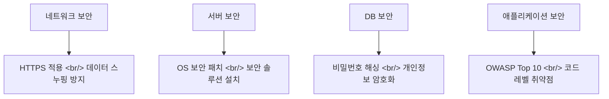
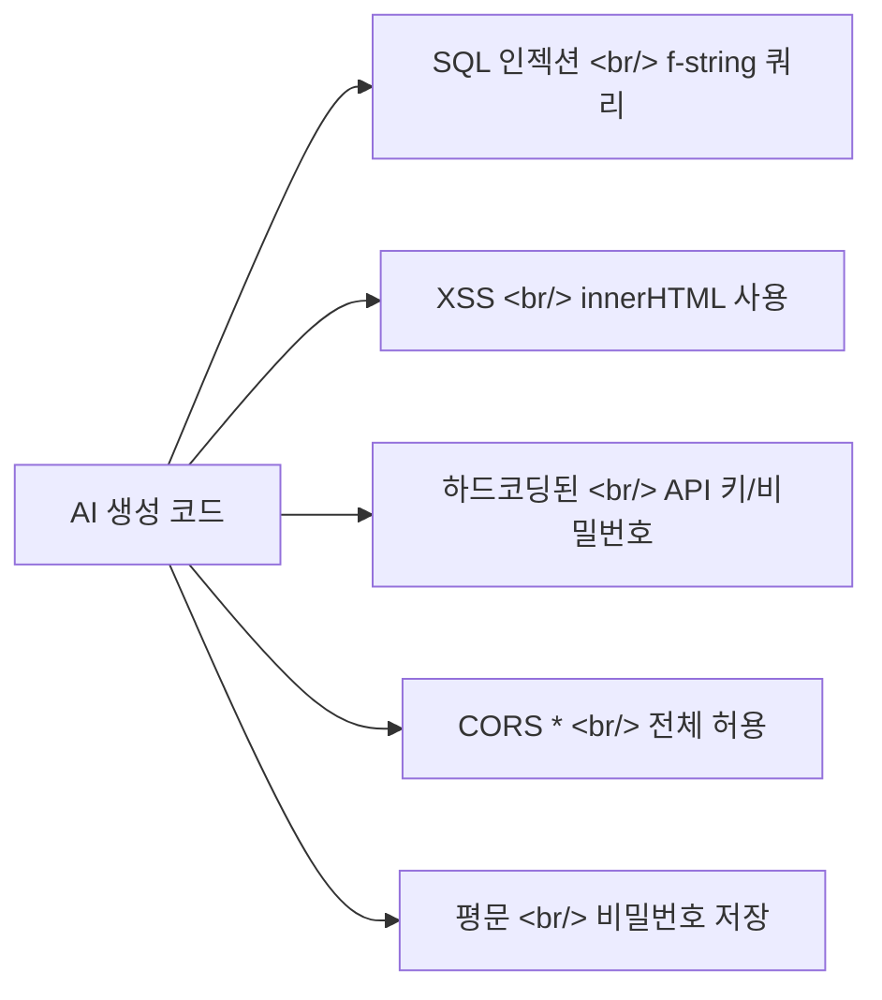

## 개요

바이브 코딩으로 웹사이트를 만드는 것은 쉬워졌지만, 보안은 여전히 사람의 몫이다. 기술루트 알렉의 영상 [AI가 짠 코드, 그대로 배포하면 털립니다](https://www.youtube.com/watch?v=kNqOW6G5sh8)에서 다룬 내용을 기반으로, AI 생성 코드의 보안 취약점을 체계적으로 점검하는 방법과 자동 스캐닝 도구를 정리한다.

<!--more-->

---

## 보안의 4개 레이어

웹 애플리케이션 보안은 크게 4개 구간으로 나뉜다.

바이브 코딩으로 간단한 웹페이지(HTML/CSS/JS)만 올렸다면 네트워크/서버/DB 보안은 상대적으로 단순하다. 하지만 **애플리케이션 보안** — 코드 안에 숨어있는 취약점 — 은 반드시 점검해야 한다.

---

## OWASP Top 10 — 반드시 알아야 할 웹 보안 위협

[OWASP(Open Worldwide Application Security Project)](https://owasp.org/www-project-top-ten/)는 매년 웹 애플리케이션의 주요 보안 위협을 발표한다.

### 1. 접근 제어 실패 (Broken Access Control)
권한이 없는 사용자가 다른 사용자의 데이터나 기능에 접근 가능한 상태. API 호출 시 권한 검증이 누락되면 발생한다.

### 2. 암호화 실패 (Cryptographic Failures)
비밀번호를 평문으로 저장하거나, 약한 해싱 알고리즘을 사용하는 경우.

### 3. 인젝션 (Injection)
SQL 쿼리, OS 명령어, LDAP 쿼리에 악성 코드를 삽입해 실행시키는 공격. AI가 생성한 코드에서 가장 흔하게 발견되는 취약점 중 하나다.

### 4. 보안이 고려되지 않은 설계 (Insecure Design)
기능 구현에만 집중하고 보안 아키텍처를 무시한 설계.

### 5. 보안 설정 오류 (Security Misconfiguration)
기본 비밀번호 미변경, 불필요한 기능 활성화, 에러 메시지를 통한 정보 노출.

### 6. 취약한 컴포넌트 (Vulnerable Components)
알려진 취약점이 있는 라이브러리나 패키지를 사용하는 경우.

### 7. 인증 실패 (Authentication Failures)
세션 관리 미흡, 약한 비밀번호 정책, 무차별 대입 공격 미방어.

### 8. 소프트웨어 무결성 오류 (Software Integrity Failures)
CI/CD 파이프라인에서 코드나 의존성의 무결성을 검증하지 않는 경우.

### 9. 로깅 및 모니터링 실패 (Logging & Monitoring Failures)
공격 시도를 탐지하지 못하는 상태.

### 10. SSRF (Server-Side Request Forgery)
서버가 공격자가 지정한 URL로 요청을 보내도록 유도하는 공격.

---

## AI가 자주 만드는 보안 실수

바이브 코딩에서 특히 주의해야 할 패턴:

- **SQL 인젝션**: `f"SELECT * FROM users WHERE id = {user_id}"` — 파라미터 바인딩 미사용
- **XSS**: `element.innerHTML = userInput` — 사용자 입력을 직접 HTML로 삽입
- **비밀 정보 하드코딩**: `API_KEY = "sk-abc123..."` — 환경 변수 미사용
- **CORS 전체 허용**: `Access-Control-Allow-Origin: *` — 모든 도메인 허용
- **평문 저장**: 비밀번호를 해싱 없이 DB에 직접 저장

---

## 자동 보안 스캐닝 도구

영상에서 소개된 방식처럼, URL을 입력하면 자동으로 보안 점검을 수행하는 도구를 활용할 수 있다.

### 정적 분석 (SAST)
코드 자체를 분석해 취약점을 찾는다:
- **Semgrep**: 패턴 매칭 기반 보안 스캐너
- **Bandit**: Python 전용 보안 분석기
- **ESLint Security Plugin**: JavaScript 보안 규칙

### 동적 분석 (DAST)
실행 중인 애플리케이션을 스캔한다:
- **OWASP ZAP**: 무료 웹 애플리케이션 보안 스캐너
- **Nikto**: 웹 서버 취약점 스캐너

### 의존성 취약점 검사
사용 중인 라이브러리의 알려진 취약점을 확인한다:
- `npm audit` / `pip audit` / `safety check`
- **Snyk**: SCA(Software Composition Analysis) 도구

---

## Claude Code에서 보안 점검 통합하기

Claude Code로 코드를 작성할 때 보안을 강화하는 방법:

1. **CLAUDE.md에 보안 규칙 명시**: "SQL 쿼리는 반드시 파라미터 바인딩 사용", "사용자 입력은 항상 sanitize"
2. **코드 리뷰 시 보안 관점 추가**: `/review` 시 OWASP Top 10 기준으로 검토 요청
3. **배포 전 자동 스캔**: CI/CD 파이프라인에 Semgrep이나 Bandit 통합
4. **환경 변수 분리**: `.env` 파일을 `.gitignore`에 포함하고, 비밀 정보는 환경 변수로만 접근

---

## 인사이트

바이브 코딩의 편리함에 빠져 보안을 간과하기 쉽다. AI가 생성한 코드는 기능적으로 정확하더라도, OWASP Top 10 취약점을 내포하고 있을 수 있다. 특히 SQL 인젝션, XSS, 비밀 정보 하드코딩은 AI가 가장 자주 만드는 보안 실수다. 배포 전에 Semgrep이나 OWASP ZAP 같은 자동 스캐닝 도구로 한 번만 점검해도 대부분의 기본적인 취약점을 잡을 수 있다. 보안은 코드 작성 후의 추가 단계가 아니라, 프롬프트 시점부터 고려해야 하는 기본 요소다.
