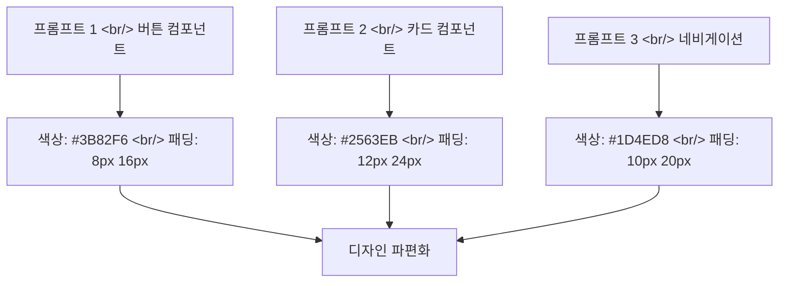
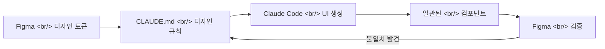

## 개요

바이브 코딩으로 앱을 만들 때 가장 큰 문제 중 하나는 디자인의 일관성이다. AI가 생성한 UI는 기능적으로 작동하지만, 색상, 간격, 타이포그래피가 화면마다 제각각인 경우가 많다. 피튜브의 주간 라이브에서 소개된 [Claude Code & 피그마로 일관된 디자인 하는 방법](https://www.figma.com/community/file/1618087083451142362) Figma 커뮤니티 파일과 [Figmapedia](https://figmapedia.com/) 리소스를 분석하고, 실전 워크플로우를 정리한다.

<!--more-->

---

## 문제: 바이브 코딩에서의 디자인 파편화

Claude Code로 UI를 생성하면 각 프롬프트마다 독립적으로 스타일이 결정된다. 컴포넌트 A는 `#3B82F6` 파란색, 컴포넌트 B는 `#2563EB` 파란색 — 미묘하게 다른 색상이 누적되면 전체적으로 정돈되지 않은 느낌을 준다.



---

## 해결책: Figma 디자인 토큰 → Claude Code 컨텍스트

### 1단계: Figma에서 디자인 시스템 정의

Figma 커뮤니티 파일에서 제안하는 방식은 디자인 토큰을 체계적으로 정의하는 것이다:

- **Color Tokens**: Primary, Secondary, Neutral, Semantic (Success/Warning/Error)
- **Spacing Scale**: 4px 단위 (4, 8, 12, 16, 24, 32, 48, 64)
- **Typography Scale**: Heading 1~6, Body, Caption, Label
- **Border Radius**: 4px, 8px, 12px, 16px, Full
- **Shadow Scale**: sm, md, lg, xl

### 2단계: CLAUDE.md에 디자인 규칙 명시

```markdown
# Design System

## Colors
- Primary: #3B82F6 (Blue 500)
- Primary Hover: #2563EB (Blue 600)
- Background: #FFFFFF
- Surface: #F8FAFC (Slate 50)
- Text Primary: #0F172A (Slate 900)

## Spacing
- Base unit: 4px
- Component padding: 8px 16px (sm), 12px 24px (md), 16px 32px (lg)

## Typography
- Font: Inter
- Heading: 600 weight, 1.25 line-height
- Body: 400 weight, 1.5 line-height
```

이 규칙을 CLAUDE.md에 포함하면, Claude Code가 모든 UI 생성 시 동일한 디자인 토큰을 참조한다.

### 3단계: 컴포넌트 단위 프롬프팅



---

## Figmapedia — 디자인 용어를 정확하게

[Figmapedia](https://figmapedia.com/)는 디자인 용어사전 & 리소스 플랫폼이다. "AI로 검색해도 잘 나오지 않는 실무 디자인 정보"를 정리해놓은 사이트로, Claude Code에 디자인 관련 프롬프트를 작성할 때 정확한 용어를 사용하는 데 도움이 된다.

주요 카테고리:
- **피그마 용어 & 정보**: Figma 고유 기능과 용어 설명
- **프롬프트 피디아**: AI 코딩에 활용할 수 있는 디자인 프롬프트 모음
- **버튼 컴포넌트 내부/외부 여백**: 실무에서 자주 혼동되는 패딩/마진 규칙

Claude Code에 "버튼의 내부 여백을 줄여줘"라고 프롬프팅할 때, padding과 margin의 차이를 정확하게 인지하고 있어야 원하는 결과를 얻을 수 있다. Figmapedia가 이런 간극을 메워준다.

---

## 실전 팁: Claude Code + Figma 워크플로우

### 디자인 스크린샷 기반 프롬프팅

Figma에서 디자인을 완성한 뒤, 스크린샷을 Claude Code에 전달하면 시각적 참조를 기반으로 코드를 생성한다:

```
이 Figma 디자인을 React 컴포넌트로 구현해줘.
디자인 토큰은 CLAUDE.md의 Design System 섹션을 따라줘.
```

### Tailwind CSS 토큰 매핑

Figma 디자인 토큰을 Tailwind의 `tailwind.config.js`로 변환하면, Claude Code가 생성하는 코드에서 자동으로 일관된 스타일이 적용된다.

### 검증 루프

1. Claude Code로 컴포넌트 생성
2. 브라우저에서 렌더링 확인
3. Figma 원본과 시각적 비교
4. 차이가 있으면 피드백 → 재생성

---

## 인사이트

바이브 코딩의 "디자인 품질 문제"는 기술적 한계가 아니라 컨텍스트 부족의 문제다. Claude Code에 명확한 디자인 토큰과 규칙을 제공하면, 일관된 UI를 생성할 수 있다. Figma 디자인 시스템 → CLAUDE.md 규칙 → Claude Code 생성이라는 파이프라인을 구축하면, 디자이너 없이도 프로덕션 수준의 UI 일관성을 유지할 수 있다. Figmapedia 같은 리소스는 개발자가 디자인 영역의 정확한 어휘를 익히는 데 유용하며, 이는 AI에게 더 정확한 지시를 내리는 것으로 직결된다.
