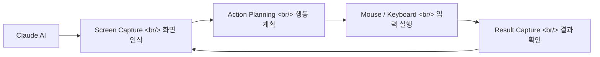
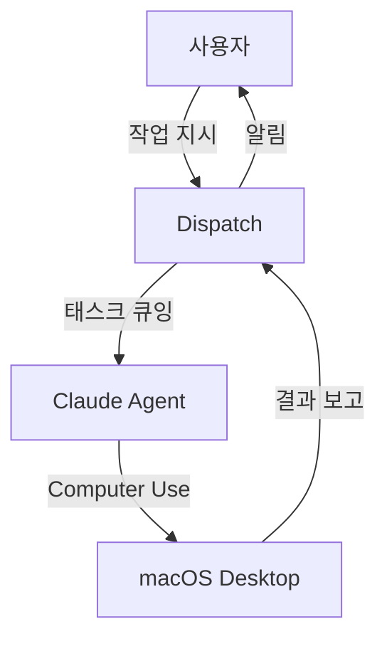

## 개요

Anthropic이 Claude에게 컴퓨터의 마우스, 키보드, 화면을 직접 제어하는 기능을 정식 출시했다. Claude Code Desktop 및 Cowork과 연동되어 실제 GUI를 조작할 수 있고, Dispatch와 결합하면 자리를 비운 상태에서도 원격으로 Claude가 작업을 수행한다. macOS에 먼저 출시되었으며, Windows는 수 주 내 지원 예정이다.

<!--more-->

---

## Computer Use란 무엇인가

기존 Claude Code는 터미널 안에서 CLI 명령어를 실행하는 방식으로 동작했다. Computer Use는 이 범위를 GUI 전체로 확장한다. Claude가 화면을 스크린샷으로 인식하고, 마우스 클릭, 키보드 입력, 드래그 등의 액션을 실행할 수 있다.

핵심 제약: Computer Use는 아직 초기 단계다. Claude는 사람보다 **훨씬 느리고 신중하게** 동작한다. 이는 의도된 설계로, 안전성을 우선시하기 때문이다.

---

## Claude Code Desktop & Cowork 연동

Claude Code Desktop에서 Computer Use를 활성화하면, 코딩 작업 중 IDE나 브라우저를 직접 조작할 수 있다. 예를 들어:

- **레거시 앱 자동화**: API가 없는 GUI 전용 앱의 반복 작업 자동화
- **네이티브 앱 디버깅**: Xcode, Android Studio 등에서 직접 빌드/테스트 실행
- **브라우저 테스트**: 실제 브라우저에서 UI 인터랙션 테스트

Cowork 모드에서는 Claude가 사용자와 동시에 같은 화면에서 작업하며, 사용자가 실시간으로 Claude의 동작을 관찰하고 개입할 수 있다.

---

## Dispatch — 원격 비동기 작업

Computer Use의 진정한 잠재력은 [Dispatch](https://docs.anthropic.com/en/docs/agents-and-tools/computer-use)와 결합할 때 나타난다.

자리를 비운 상태에서도 Claude가 컴퓨터를 조작하도록 지시할 수 있다. 예를 들어 "이 스프레드시트의 데이터를 정리해서 이메일로 보내줘" 같은 복합 작업을 비동기로 처리한다.

---

## 기존 Claude Code Remote Control과의 관계

이전에 Claude Code에는 이미 원격 제어 기능(Remote Control)이 있었다. Computer Use와의 차이를 정리하면:

| 기능 | Remote Control | Computer Use |
|------|---------------|-------------|
| 범위 | 터미널 CLI 명령어 | GUI 전체 (마우스/키보드) |
| 대상 | 파일 시스템, 셸 | 모든 데스크톱 앱 |
| 속도 | 즉시 실행 | 느리고 신중함 |
| 안전성 | 샌드박스 내 | 화면 전체 접근 |
| 활용 | 코딩, 빌드, 테스트 | 레거시 자동화, GUI 테스트 |

두 기능은 보완 관계다. CLI로 처리 가능한 작업은 Remote Control이 효율적이고, GUI가 필수적인 작업에만 Computer Use를 사용하는 것이 권장된다.

---

## 실전 활용 시나리오

### 레거시 앱 자동화

API가 없는 엔터프라이즈 소프트웨어(ERP, CRM 등)의 반복 작업을 자동화할 수 있다. 데이터 입력, 보고서 생성, 승인 프로세스 등 매일 수행하는 GUI 작업을 Claude에게 위임한다.

### 크로스 앱 워크플로우

여러 앱을 오가며 수행하는 복합 작업을 단일 명령으로 실행한다. 예를 들어 Figma에서 디자인을 캡처 → VS Code에서 코드 수정 → 브라우저에서 결과 확인하는 전체 흐름을 자동화한다.

### QA 테스트

실제 UI에서의 사용자 경험을 테스트한다. Playwright나 Selenium 같은 자동화 도구와 달리, Computer Use는 시각적으로 화면을 인식하므로 CSS 셀렉터 변경에 영향받지 않는 강건한 테스트가 가능하다.

---

## 현재 한계

- **속도**: 사람보다 훨씬 느림 — 각 단계에서 스크린샷을 분석하고 계획을 세우므로 대기 시간 발생
- **정확도**: 복잡한 UI에서 잘못된 요소를 클릭할 가능성
- **플랫폼**: macOS 우선 출시, Windows는 아직 미지원
- **보안**: 화면 전체에 접근하므로, 민감한 정보가 표시된 상태에서의 사용 주의 필요

---

## 인사이트

Claude Computer Use는 AI 에이전트가 "코드 생성기"에서 "디지털 작업자"로 진화하는 중요한 전환점이다. CLI 환경에 갇혀 있던 AI가 GUI 전체를 다룰 수 있게 되면서, 자동화 가능한 작업의 범위가 극적으로 넓어졌다. 아직 초기 단계라 속도와 정확도에 한계가 있지만, Dispatch와의 결합으로 비동기 원격 작업이 가능해진 점은 개발자 워크플로우에 실질적인 변화를 가져올 수 있다. 특히 레거시 시스템 자동화와 크로스 앱 워크플로우에서 Claude Code의 Remote Control과 Computer Use를 조합하면, 거의 모든 컴퓨터 작업을 AI에게 위임할 수 있는 시대가 가까워지고 있다.
