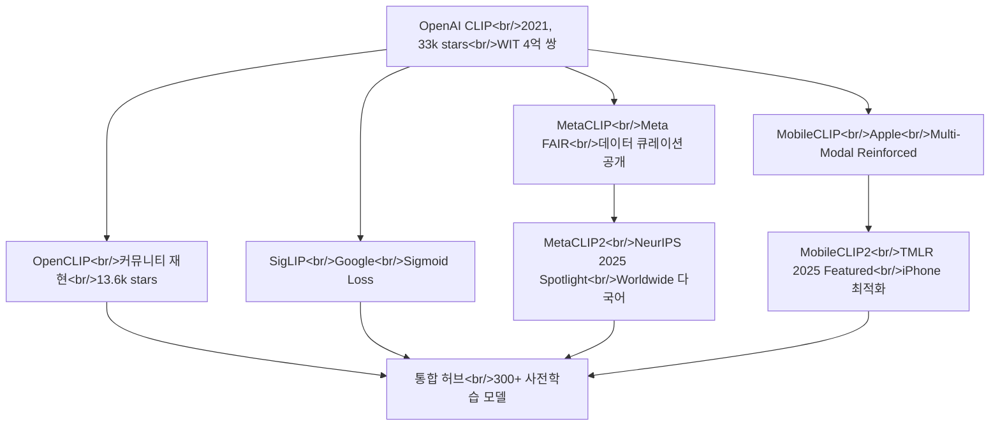

## 개요

이미지-텍스트 임베딩 모델의 핵심인 CLIP 계열 생태계를 집중 리서치했다. OpenAI의 오리지널 CLIP부터 Meta의 MetaCLIP2(NeurIPS 2025 Spotlight), Apple의 MobileCLIP2(TMLR 2025 Featured), 커뮤니티 기반 OpenCLIP, Google의 SigLIP까지 — 현재 hybrid-image-search 프로젝트의 임베딩 모델 선정을 위한 비교 분석이다. 관련 시리즈: [Hybrid Image Search 개발기 #5](/posts/2026-03-25-hybrid-search-dev5/)

<!--more-->



---

## OpenAI CLIP — 모든 것의 시작

[openai/CLIP](https://github.com/openai/CLIP)(33k stars)은 2021년 발표된 Contrastive Language-Image Pre-Training 모델이다. 이미지와 텍스트를 같은 임베딩 공간에 매핑하는 접근법을 대중화했고, 이후 모든 CLIP 변형의 기반이 되었다.

핵심 아이디어는 놀랍도록 단순하다 — 4억 개의 (이미지, 텍스트) 쌍에서 contrastive learning으로 학습하면, ImageNet의 128만 라벨링 이미지 없이도 zero-shot으로 이미지를 분류할 수 있다. 기본 사용법도 직관적이다:

```python
import clip
model, preprocess = clip.load("ViT-B/32", device=device)

image_features = model.encode_image(image)
text_features = model.encode_text(text)

logits_per_image, logits_per_text = model(image, text)
probs = logits_per_image.softmax(dim=-1).cpu().numpy()
# prints: [[0.9927937  0.00421068 0.00299572]]
```

`encode_image()`와 `encode_text()`로 각각 벡터를 뽑고, 코사인 유사도를 계산하면 끝이다. API는 `clip.available_models()`로 사용 가능한 모델 목록을 확인하고, `clip.load(name)`으로 모델과 전처리 함수를 로드하는 구조다.

**한계**: 학습 데이터 WIT(WebImageText)는 비공개이고, 최대 모델은 ViT-L/14까지다. 이 두 가지 한계가 후속 연구들의 동기가 되었다.

---

## OpenCLIP — 사실상의 CLIP 허브

[mlfoundations/open_clip](https://github.com/mlfoundations/open_clip)(13.6k stars)은 CLIP의 오픈소스 재구현이자, 현재 CLIP 생태계의 사실상 허브다. LAION-2B, DataComp-1B 같은 공개 대규모 데이터셋에서 학습한 **300개 이상의 사전학습 모델**을 제공한다.

성능 비교가 핵심이다:

| 모델 | 학습 데이터 | 해상도 | 학습 샘플 수 | ImageNet zero-shot |
|------|------------|--------|-------------|-------------------|
| ViT-B-16 | DataComp-1B | 224px | 13B | 73.5% |
| ViT-L-14 | DataComp-1B | 224px | 13B | **79.2%** |
| ViT-H-14 | LAION-2B | 224px | 32B | 78.0% |
| ViT-bigG-14 | LAION-2B | 224px | 34B | **80.1%** |
| ViT-L-14 (OpenAI 원본) | WIT | 224px | 13B | 75.5% |

OpenCLIP ViT-L-14가 같은 아키텍처의 OpenAI 원본 대비 **3.7%p 높은 정확도**를 달성했다. 학습 데이터가 같은 모델 아키텍처에서 이 정도 차이를 만든다는 것은 데이터 큐레이션의 중요성을 명확히 보여준다.

MetaCLIP, SigLIP, MobileCLIP 등 주요 변형 모델이 모두 OpenCLIP을 통해 로드 가능하다. `open_clip.create_model_and_transforms()`로 통합 인터페이스를 제공하기 때문에, 모델 비교 실험에서 코드 변경 없이 모델만 교체할 수 있다.

---

## MetaCLIP2 — 다국어 확장과 NeurIPS 2025 Spotlight

[facebookresearch/metaclip](https://github.com/facebookresearch/metaclip)(1.8k stars)은 Meta FAIR의 프로젝트로, CLIP의 데이터 큐레이션 과정 자체를 재현 가능하게 만든 것이 핵심 기여다. 최신 MetaCLIP2("worldwide")는 NeurIPS 2025 Spotlight으로 선정되었다.

MetaCLIP2의 가장 중요한 발견은 **영어와 비영어 데이터가 서로를 상호 강화(mutually benefit)**한다는 것이다. 기존 multilingual CLIP들은 다국어를 추가하면 영어 성능이 떨어지는 "다국어의 저주(curse of multilinguality)"가 있었다. MetaCLIP2는 데이터 큐레이션 파이프라인 자체를 다국어로 설계하여 이 문제를 해결했다.

학술적 성과도 인상적이다:
- ICLR 2024 Spotlight (MetaCLIP 1.0)
- CVPR 2024, EMNLP 2024 (Altogether 합성 캡션)
- **NeurIPS 2025 Spotlight** (MetaCLIP2 Worldwide)

distillation 모델과 학습/평가 코드가 모두 공개되어 있고, HuggingFace 컬렉션과 OpenCLIP에서 바로 사용 가능하다. 한국어 이미지 검색을 다루는 hybrid-search 프로젝트 관점에서, 다국어 CLIP의 성능이 영어 전용 모델을 넘어선다는 점은 모델 선택에 직접적인 영향을 준다.

---

## MobileCLIP2 — 모바일 디바이스의 최전선

[apple/ml-mobileclip](https://github.com/apple/ml-mobileclip)(1.5k stars)은 Apple의 Multi-Modal Reinforced Training 기반 경량 CLIP 모델이다. MobileCLIP2는 TMLR 2025 Featured Certification을 받았다.

벤치마크 결과가 강력하다:

> **MobileCLIP2-S4**는 SigLIP-SO400M/14과 동등한 정확도를 **2배 적은 파라미터**로 달성하고, DFN ViT-L/14 대비 **2.5배 낮은 레이턴시**(iPhone 12 Pro Max 기준)를 보인다.

특히 다른 CLIP 변형들과 차별화되는 점은 **iOS 앱 데모(`ios_app/`)**를 포함한다는 것이다. Swift 코드로 실시간 zero-shot 이미지 분류를 모바일에서 직접 실행할 수 있다. 학습 코드는 OpenCLIP 기반이며, DFNDR과 DataCompDR 데이터셋을 사용한다.

MobileCLIP의 핵심 기술인 Multi-Modal Reinforced Training은 대형 teacher 모델의 지식을 경량 student 모델로 증류(distillation)하되, 이미지와 텍스트 양쪽에서 동시에 reinforcement를 적용하는 방식이다. 대규모 데이터 생성 코드는 별도 레포([ml-mobileclip-dr](https://github.com/apple/ml-mobileclip-dr))로 공개되어 있다.

---

## SigLIP과 HuggingFace 임베딩 모델 생태계

Google의 **SigLIP**(Sigmoid Loss for Language-Image Pre-Training)은 CLIP의 softmax contrastive loss를 sigmoid loss로 대체한 변형이다. `google/siglip-so400m-patch14-384`가 대표 모델로, HuggingFace에서 10개 모델 컬렉션으로 제공된다.

SigLIP의 장점은 배치 크기에 덜 민감하다는 것이다. 원본 CLIP은 큰 배치에서 더 좋은 성능을 보이는데, sigmoid loss는 각 쌍을 독립적으로 처리하여 배치 크기 의존도를 줄인다.

### HuggingFace 모델 허브 탐색

HuggingFace의 세 가지 허브를 함께 탐색했다:

- **Image Feature Extraction Models** — CLIP 계열 모델들이 트렌딩 상위를 차지. `pipeline_tag=image-feature-extraction`으로 필터링하면 현재 활발한 모델들을 확인 가능
- **Zero-Shot Image Classification Models** — 라벨 없이 이미지를 분류하는 모델들. CLIP 기반이 대다수
- **MTEB Leaderboard** — Massive Text Embedding Benchmark. 텍스트 임베딩 성능을 38개 데이터셋에서 종합 평가. 이미지 임베딩과 직접 비교할 수는 없지만, 멀티모달 모델의 텍스트 쪽 성능을 가늠하는 데 참고

---

## 모델 선정 기준 정리

리서치 결과를 hybrid-search 프로젝트 관점에서 정리하면:

| 기준 | 최적 모델 | 이유 |
|------|----------|------|
| 정확도 우선 | OpenCLIP ViT-bigG-14 | ImageNet 80.1% |
| 다국어 (한국어) | MetaCLIP2 | 다국어 성능 SoTA |
| 모바일 배포 | MobileCLIP2-S4 | SigLIP 동급, 2배 경량 |
| 범용 + 생태계 | OpenCLIP ViT-L-14 | 79.2%, 가장 넓은 지원 |

---

## 빠른 링크

- [HuggingFace Image Feature Extraction Models](https://huggingface.co/models?pipeline_tag=image-feature-extraction&sort=trending&search=clip)
- [HuggingFace Zero-Shot Classification Models](https://huggingface.co/models?pipeline_tag=zero-shot-image-classification&sort=trending)
- [MTEB Leaderboard](https://huggingface.co/spaces/mteb/leaderboard)

---

## 인사이트

2021년 CLIP 발표 이후 4년간 생태계가 놀라울 정도로 성숙했다. OpenCLIP이 통합 허브 역할을 하면서 Meta, Apple, Google의 연구가 하나의 인터페이스로 수렴하고 있다. 모델 선택은 더 이상 "어떤 CLIP을 쓸까"가 아니라 "어떤 축을 최적화할까"의 문제가 되었다 — 정확도, 다국어, 모바일, 학습 가능성 각각에서 최적 모델이 다르다. MetaCLIP2의 다국어 상호 강화 발견은 한국어 이미지 검색에 직접 적용 가능한 인사이트이고, MobileCLIP2의 모바일 최적화는 향후 앱 배포 시 검토할 가치가 있다.
