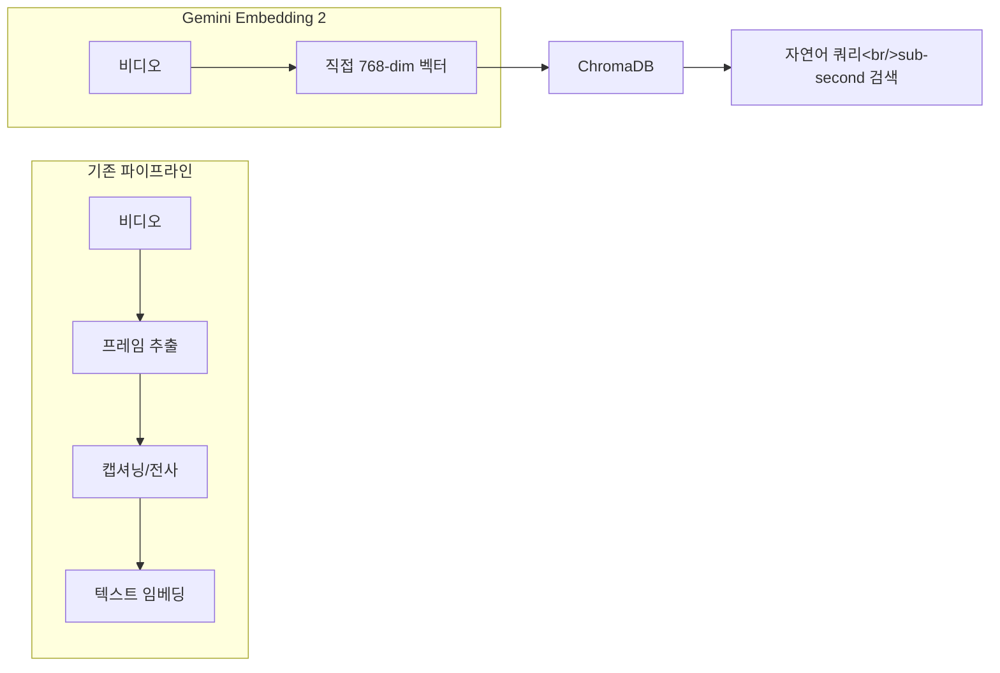

## 개요

Hacker News에서 434포인트, 108개 댓글을 기록한 프로젝트를 분석했다. Gemini Embedding 2가 비디오를 직접 768차원 벡터에 임베딩할 수 있게 되면서, 기존의 전사(transcription) → 텍스트 임베딩 파이프라인이 불필요해졌다. 이 기술로 구현된 sub-second 비디오 검색 CLI와, HN 커뮤니티에서 벌어진 감시 사회(panopticon) 논쟁을 함께 다룬다. 이전 포스트 [CLIP 모델 생태계](/posts/2026-03-25-clip-ecosystem/)와 이어지는 임베딩 시리즈다.

<!--more-->

---

## 비디오 직접 임베딩이란

기존 비디오 검색의 한계는 명확했다. 비디오에서 의미를 추출하려면 프레임을 캡셔닝하거나 오디오를 전사한 뒤 텍스트를 임베딩해야 했다. 이 과정에서 시각적 맥락이 손실되고, 파이프라인 복잡도가 증가하며, "green car cutting me off" 같은 시각적 쿼리에는 전사 기반으로는 답할 수 없었다.

Gemini Embedding 2는 이 중간 단계를 완전히 제거한다. 30초 비디오 클립을 **텍스트 쿼리와 직접 비교 가능한 768차원 벡터**로 변환한다. 전사도, 프레임 캡셔닝도, 중간 텍스트도 없다. 비디오와 텍스트가 같은 벡터 공간에 네이티브로 투영된다.

---

## 구현: CLI 비디오 검색 도구

프로젝트 제작자 sohamrj가 구현한 CLI 도구의 아키텍처:

1. **인덱싱**: 긴 영상을 청크로 분할 → Gemini Embedding 2로 각 청크 임베딩 → ChromaDB에 저장
2. **검색**: 자연어 쿼리를 같은 모델로 임베딩 → ChromaDB에서 벡터 유사도 검색
3. **출력**: 매칭된 클립을 자동 트리밍하여 반환

**비용**: 영상 1시간당 약 **$2.50**. still-frame 감지로 유휴 구간을 건너뛰기 때문에 보안 카메라나 Tesla 센트리 모드 영상은 훨씬 저렴하다.

CLIP 기반 이미지 임베딩이 정적 이미지에 대해 해준 것을 Gemini가 동적 비디오에 대해 실현한 셈이다. [CLIP 모델 생태계 포스트](/posts/2026-03-25-clip-ecosystem/)에서 다룬 이미지-텍스트 임베딩의 자연스러운 확장이다.

---

## HN 커뮤니티 토론: 감시 사회 논쟁

108개 댓글 중 기술 구현보다 사회적 함의에 대한 논의가 더 뜨거웠다.

### 핵심 우려: Panopticon

macNchz의 최상위 댓글이 핵심을 찔렀다:

> "우리는 카메라로 가득 찬 세계에 살고 있지만, 아무도 모든 영상을 실제로 볼 수 없다는 사실 덕분에 어느 정도의 반익명성을 유지하고 있다. 하지만 이 기술은 그 전제를 바꾼다."

카메라 소유자, 제조사, 정부가 자연어 파라미터로 특정 인물이나 활동에 대한 알림을 설정할 수 있게 되면 — 범죄 감지, 반려견 미수거 신고 같은 그럴듯한 사례로 시작해 — 결국 규제 없는 panopticon으로 이어질 수 있다는 우려다.

### 이미 현실: Fusus 플랫폼

citruscomputing은 실제 시의회 미팅에서 목격한 사례를 공유했다. ALPR(자동 번호판 인식) 카메라 계약을 논의하는 자리에서, 카메라 벤더의 **Fusus** 플랫폼을 알게 되었다고 한다. 이 플랫폼은:
- 다양한 카메라 시스템을 통합하는 대시보드
- **자연어로 비디오 피드를 쿼리**하는 기능
- **민간 배포 카메라와의 연동** 계획

시 예산으로 50대 ALPR만 배치했지만, 이웃의 카메라가 경찰의 AI 시스템에 직접 피딩되는 미래는 시간문제라는 지적이다.

### 기술적 논의

기술 측면에서는:
- **비용 효율성**: $2.50/hr는 대규모 감시에는 아직 비싸지만, 가격 하락 추세를 고려하면 시간문제
- **정확도**: 텍스트 기반 검색 대비 시각적 쿼리의 정확도 향상이 핵심 가치
- **ChromaDB vs 대안**: 벡터 DB 선택에 대한 논의도 활발

---

## 임베딩 기술 비교

| 구분 | CLIP (이미지) | Gemini Embedding 2 (비디오) |
|------|-------------|---------------------------|
| 입력 | 정적 이미지 | 동적 비디오 (30초 청크) |
| 차원 | 512~1024 (모델별) | 768 |
| 중간 단계 | 없음 (직접 임베딩) | 없음 (직접 임베딩) |
| 비용 | 무료 (로컬 실행) | ~$2.50/hr (API) |
| 오픈소스 | OpenCLIP 등 다수 | 비공개 (API only) |

---

## 인사이트

비디오 직접 임베딩은 텍스트 중간 단계를 제거한다는 점에서 기술적으로 깔끔한 진보다. 하지만 HN 토론이 보여주듯, 이 기술의 사회적 함의는 기술적 우아함을 훨씬 넘어선다. 모든 영상을 인덱싱하고 자연어로 검색할 수 있는 세상은 "할 수 있는가"의 문제가 아니라 "해야 하는가"의 문제다. Fusus 같은 플랫폼이 이미 경찰에 배포되고 있다는 사실은, 규제 논의가 기술 발전 속도를 따라가지 못하고 있음을 보여준다. hybrid-image-search 프로젝트에서도 비디오 검색 확장을 고려할 때 이러한 윤리적 지점을 함께 검토해야 할 것이다.
