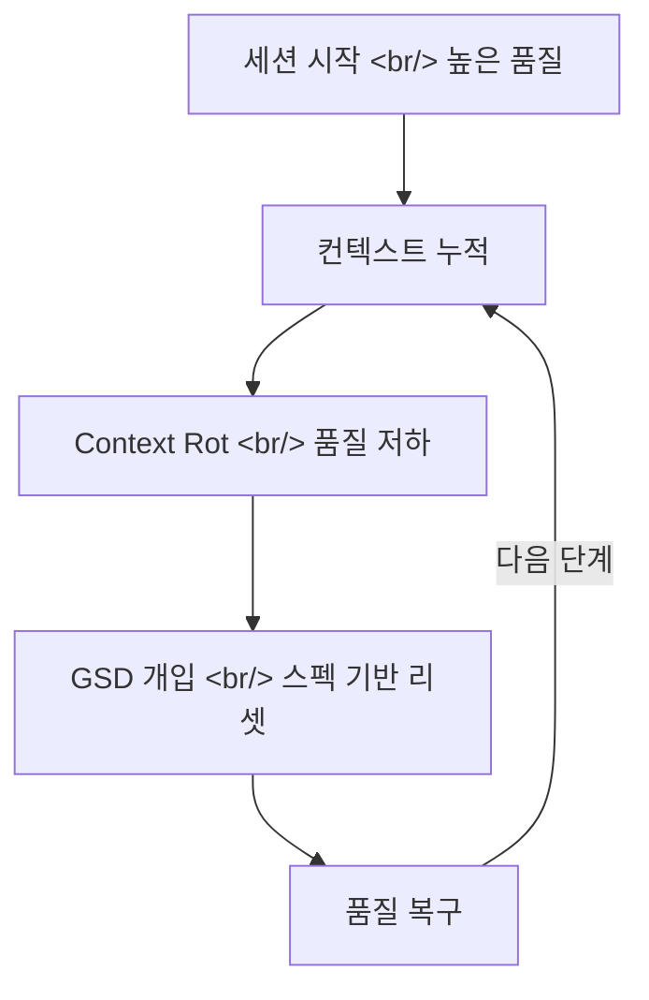
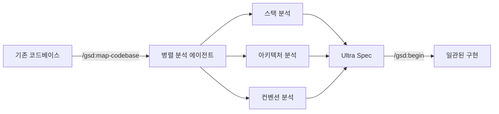

## 개요

[Get Shit Done(GSD)](https://github.com/gsd-build/get-shit-done)은 Claude Code, Gemini CLI, OpenCode, Codex, Copilot, Antigravity 등 주요 AI 코딩 도구에서 동작하는 메타 프롬프팅 시스템이다. GitHub 스타 40,799개를 기록하며, "context rot — 컨텍스트 윈도우가 채워질수록 발생하는 품질 저하"를 정면으로 해결한다. Amazon, Google, Shopify, Webflow 엔지니어들이 실전에서 사용한다고 알려져 있다.

<!--more-->

---

## Context Rot이란

AI 코딩 에이전트와 긴 대화를 나눌수록 코드 품질이 떨어지는 현상이다. 컨텍스트 윈도우가 이전 대화로 채워지면서, 초반에는 정확했던 AI가 점점 같은 실수를 반복하고, 일관성 없는 코드를 생성한다.

GSD의 핵심 주장은 이 문제가 LLM의 한계가 아니라 **컨텍스트 엔지니어링의 부재**라는 것이다.

---

## GSD의 핵심 메커니즘

### 스펙 기반 개발

GSD의 워크플로우는 세 단계로 구성된다:

1. **`/gsd:new-project`** — 프로젝트 초기화
   - 목표, 제약 조건, 기술 선호도를 질문
   - 정보가 충분해지면 "Ultra Spec" 생성 (스펙 문서)
   - 페이즈별 구현 계획 자동 생성

2. **`/gsd:begin`** — 구현 시작
   - 스펙을 기반으로 단계별 작업 실행
   - 각 단계 완료 시 체크포인트 생성
   - Context rot 발생 시 스펙에서 컨텍스트 복구

3. **`/gsd:continue`** — 중단 후 재개
   - 이전 상태를 스펙에서 읽어 복원
   - 새 세션에서도 일관성 유지

### 기존 코드베이스 지원

`/gsd:map-codebase` 명령어로 기존 프로젝트를 분석한다. 병렬 에이전트가 스택, 아키텍처, 컨벤션, 관심사를 파악하고, 이후 `/gsd:new-project`에서 이 분석 결과를 활용한다.

---

## 멀티 런타임 지원

GSD의 독특한 점은 특정 AI 코딩 도구에 종속되지 않는다는 것이다:

| 런타임 | 설치 | 명령어 형식 |
|--------|------|------------|
| Claude Code | `~/.claude/` | `/gsd:help` |
| Gemini CLI | `~/.gemini/` | `/gsd:help` |
| OpenCode | `~/.config/opencode/` | `/gsd-help` |
| Codex | `~/.codex/` (skills) | `$gsd-help` |
| Copilot | `~/.github/` | `/gsd:help` |
| Antigravity | `~/.gemini/antigravity/` | `/gsd:help` |

설치는 `npx get-shit-done-cc@latest` 한 줄로 완료되며, 인터랙티브 프롬프트에서 런타임과 설치 위치를 선택한다.

---

## 유사 도구와의 비교

GSD의 창시자 TÂCHES는 BMAD, Speckit, Taskmaster 등 기존 스펙 기반 도구를 직접 사용해본 뒤 불만을 느끼고 GSD를 만들었다고 밝힌다.

| 특성 | GSD | BMAD/Speckit |
|------|-----|-------------|
| 철학 | 최소 워크플로우 | 엔터프라이즈 프로세스 |
| 복잡도 | 3개 핵심 명령어 | 스프린트, 스토리 포인트, 회고 |
| 대상 | 솔로 개발자/소규모 팀 | 팀/조직 |
| Context rot | 스펙 기반 자동 복구 | 명시적 해결책 없음 |

GSD의 슬로건인 "The complexity is in the system, not in your workflow"가 이 차이를 요약한다. 사용자에게 보이는 워크플로우는 단순하지만, 내부적으로 XML 프롬프트 포매팅, 서브에이전트 오케스트레이션, 상태 관리가 동작한다.

---

## 인사이트

GSD는 바이브 코딩의 근본적인 문제 — context rot — 에 대한 실용적인 해결책이다. 단순히 "좋은 프롬프트를 쓰세요"가 아니라, 스펙 문서라는 영구 저장소를 두고 컨텍스트를 주기적으로 리셋하는 구조적 접근이다. 40K 스타라는 수치는 이 문제가 얼마나 보편적인지 보여준다. Claude Code의 CLAUDE.md, Plan 모드, Memory 시스템도 같은 문제를 다루지만, GSD는 이를 하나의 통합 워크플로우로 묶었다는 점에서 차별화된다. 런타임 불가지론적 설계 덕분에 Claude Code를 쓰다가 Gemini CLI로 전환해도 같은 스펙을 공유할 수 있다는 점도 실전에서 유용하다.
