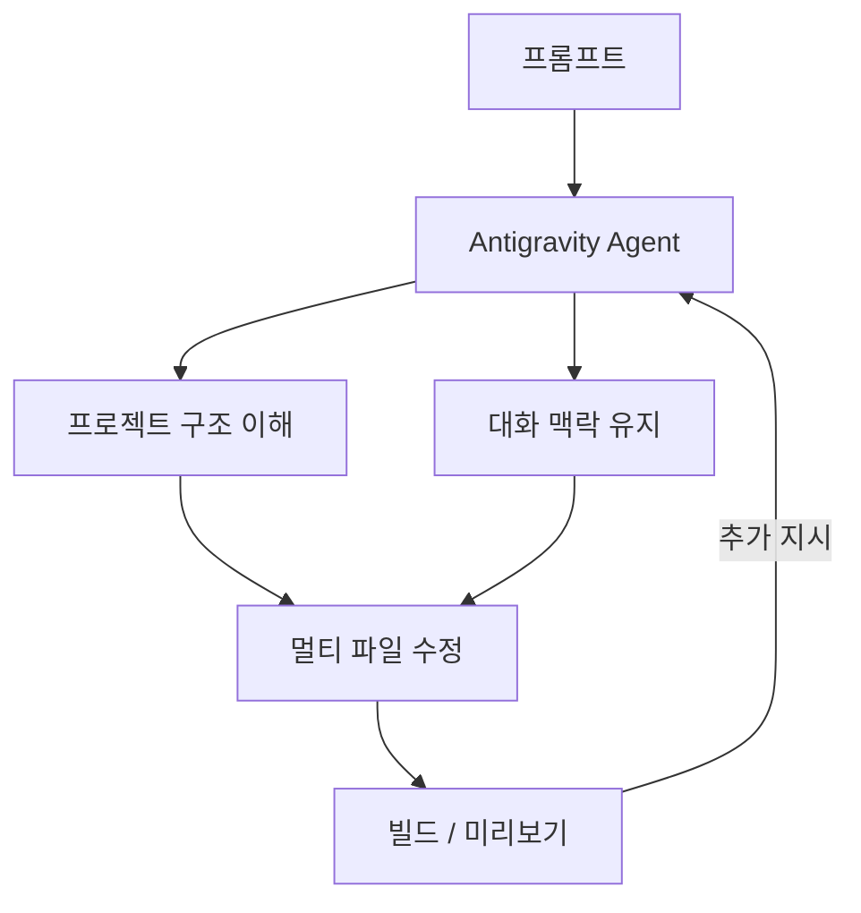
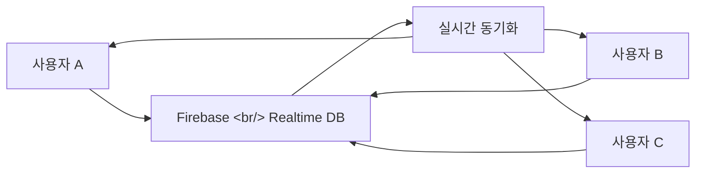

## 개요

Google AI Studio가 프롬프트만으로 배포 가능한 풀스택 앱을 만드는 "바이브 코딩" 경험을 대폭 강화했다. 핵심은 **Antigravity 코딩 에이전트**와 **Firebase 통합**이다. 실시간 멀티플레이, DB, 인증, 외부 API 연동, 시크릿 관리, 세션 저장까지 한 흐름에서 처리한다. [TILNOTE 정리](https://tilnote.io/pages/69bcbbd106e26362da15f629)를 기반으로 핵심 기능과 활용 전략을 분석한다.

<!--more-->

---

## Antigravity 에이전트: 더 긴 기억, 더 큰 수정

Antigravity는 Google AI Studio에 내장된 코딩 에이전트다. 기존 AI Studio의 코드 생성과 달리, 프로젝트 구조와 대화 맥락을 더 깊게 유지한다.

"이 기능 추가해줘" 같은 짧은 지시로도 여러 파일에 걸친 수정과 연쇄 작업을 정확히 수행한다. 코드를 "조각조각 수선"하는 것이 아니라, 앱 전체를 이해하는 편집자로서 반복 개선 속도를 높인다.

---

## Firebase 내장 통합

앱이 데이터를 저장하거나 사용자 계정이 필요해지는 순간을 에이전트가 먼저 감지한다. 사용자가 승인하면 Firebase를 연결해 백엔드를 구성한다.

### 제공 서비스

| 서비스 | 용도 |
|--------|------|
| Cloud Firestore | 데이터 저장 (NoSQL) |
| Firebase Authentication | 로그인 (Google OAuth 등) |
| Realtime Database | 실시간 동기화 |

핵심은 개발자가 Firebase 콘솔에서 수동으로 프로젝트를 생성하고 SDK를 연결하는 과정을 에이전트가 자동으로 처리한다는 점이다.

---

## 실시간 멀티플레이와 협업

이번 업데이트의 야심작은 동시 접속과 실시간 동기화가 필요한 앱을 만들 수 있게 한 것이다.

공식 예시로 제시된 앱들:
- 실시간 멀티플레이 레이저 태그
- 3D 파티클 기반 협업 공간
- 물리 기반 3D 게임 (클로 머신)
- Google Maps 연동 유틸리티
- 레시피 생성 및 가족/친구 협업 앱

공통점은 화면(UI)만 그럴듯한 것이 아니라, 동기화·데이터·연동·인증 중 최소 하나 이상이 들어간 "진짜 앱" 형태라는 점이다.

---

## 외부 서비스 연동과 Secrets Manager

지도, 결제, 외부 DB 같은 실제 서비스와 연결하려면 API 키가 필수다. Antigravity는 키가 필요한 시점을 감지하고, Settings 탭의 **Secrets Manager**에 안전하게 보관하도록 안내한다.

코드에 API 키를 하드코딩하는 실수를 구조적으로 방지하며, 운영 환경에 가까운 형태로 연동을 진행할 수 있다.

---

## 프레임워크 지원

React, Angular에 더해 **Next.js가 기본 지원**되었다. Settings 패널에서 프레임워크를 선택하는 흐름으로, 라우팅/서버 렌더링/풀스택 패턴을 활용하는 앱으로 자연스럽게 확장할 수 있다.

프레임워크 선택 기준:
- **React**: 빠른 UI 실험, 클라이언트 중심 앱
- **Angular**: 대규모 엔터프라이즈 앱, 구조화된 프로젝트
- **Next.js**: SEO, 서버 기능, 풀스택 패턴이 중요한 앱

---

## Claude Code와의 비교

| 특성 | Google AI Studio + Antigravity | Claude Code |
|------|-------------------------------|-------------|
| 환경 | 웹 브라우저 | 터미널 CLI |
| 백엔드 통합 | Firebase 자동 연결 | 수동 설정 |
| 배포 | Firebase Hosting 원클릭 | 수동 또는 스크립트 |
| 멀티플레이 | Realtime DB 내장 | 직접 구현 필요 |
| 코드 접근 | 웹 에디터 내 | 전체 파일 시스템 |
| 유연성 | 프레임워크 제한적 | 모든 스택 가능 |
| 심화 작업 | 프로토타입 수준 | 프로덕션 수준 |

---

## 활용 전략

이 업데이트를 효과적으로 활용하려면:

1. **운영 조건을 프롬프트에 포함**: "사용자 여러 명이 동시에 쓰고, 로그인 후 내 데이터가 저장되며, 외부 서비스와 연결된다"
2. **Firebase 통합을 일찍 승인**: 구조를 먼저 잡으면 시행착오 감소
3. **Secrets Manager 기본 사용**: API 키 하드코딩 방지
4. **프레임워크 선택**: SEO/서버 기능 → Next.js, 빠른 실험 → React

---

## 인사이트

Google AI Studio의 이번 업데이트는 "프롬프트 → 프로덕션"의 간극을 좁히는 방향으로 진화하고 있다. Firebase 통합으로 백엔드 설정의 마찰을 제거하고, Antigravity 에이전트의 긴 컨텍스트 유지로 반복 개선 속도를 높였다. Claude Code가 전문 개발자를 위한 도구라면, AI Studio는 "앱 아이디어가 있지만 인프라 설정이 장벽인" 사용자를 위한 도구로 포지셔닝된다. 두 도구를 조합하면 — AI Studio로 빠르게 프로토타입을 만들고, Claude Code로 프로덕션 수준으로 정제하는 — 효과적인 개발 파이프라인이 가능하다.
