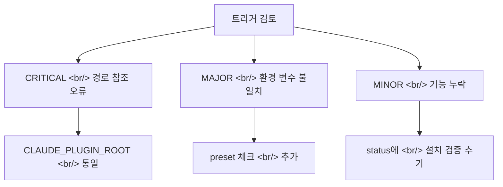

## 개요

[이전 글: #2 — Marketplace-First 전환과 v2a/v2b 설계 및 구현](/posts/2026-03-20-harnesskit-dev2/)

이번 #3에서는 12개 커밋에 걸쳐 두 가지 핵심 작업을 진행했다. 첫째, 플러그인이 올바르게 트리거되는지 전체 검토하고 5개 수정 사항을 적용했다. 둘째, 마켓플레이스 플러그인 추천 시스템을 검증 기반으로 재설계하고, 도구 시퀀스를 3단계 슬라이딩 윈도우로 업그레이드했다.

<!--more-->

---

## 플러그인 트리거 전체 검토

### 문제 진단

`plugin.json`의 스킬 정의, hooks 실행 경로, 스킬 파일 내부 로직을 종합 검토한 결과, 5개의 트리거링 문제를 발견했다.



### 핵심 수정 1: CLAUDE_PLUGIN_ROOT 통일

스킬과 hooks에서 플러그인 디렉토리를 참조하는 방식이 제각각이었다. `claude plugin path` 명령어, 하드코딩된 경로, 상대 경로 등이 혼재했다. 이를 `CLAUDE_PLUGIN_ROOT` 환경 변수로 통일하고, `dirname` 기반 fallback을 추가했다.

```bash
# Before: 다양한 참조 방식 혼재
PLUGIN_DIR="$(claude plugin path harnesskit)"
PLUGIN_DIR="/Users/lsr/.claude/plugins/cache/harnesskit/..."

# After: 통일된 참조
PLUGIN_DIR="${CLAUDE_PLUGIN_ROOT:-$(cd "$(dirname "$0")/.." && pwd)}"
```

### 핵심 수정 2: post-edit hooks에 preset 체크 추가

`post-edit-lint.sh`와 `post-edit-typecheck.sh`가 preset 설정 전에도 실행되어 오류가 발생했다. preset 존재 여부를 체크하고, 미설정 시 건너뛰도록 수정했다.

---

## 마켓플레이스 검증 추천 시스템

### 기존 문제

`/harnesskit:init`에서 마켓플레이스 플러그인을 추천할 때, 실시간 검색에 의존해 불안정하고 결과가 일관되지 않았다.

### 해결: 사전 검증된 추천 목록

`marketplace-recommendations.json` 파일에 검증된 플러그인 목록을 유지하고, `update-recommendations.sh` 스크립트로 주기적으로 크롤링/갱신하도록 변경했다.


`/harnesskit:insights`에서도 `recommendations.json`을 참조해 개선 제안을 할 때 검증된 플러그인만 추천하도록 연동했다.

---

## 3단계 슬라이딩 윈도우 도구 시퀀스

도구 사용 패턴 분석의 정밀도를 높이기 위해 기존 단순 카운트 방식에서 3단계 슬라이딩 윈도우로 업그레이드했다. `tool:summary` 형식으로 도구 사용 시퀀스를 기록하고, 패턴을 감지해 개선을 제안한다.

---

## 플러그인 설치 검증

`/harnesskit:status` 스킬에 플러그인 설치 상태를 검증하는 기능을 추가했다. 스킬 파일 존재 여부, hooks 실행 권한, 설정 파일 무결성을 한눈에 확인할 수 있다.

---

## 커밋 로그

| 메시지 | 변경 |
|--------|------|
| feat: add plugin installation verification to status | skills |
| feat: upgrade tool sequence to 3-step sliding window | skills |
| feat: add recommendations.json reference to insights | skills |
| feat: rewrite init marketplace discovery with verified recs | skills |
| feat: add update-recommendations.sh for marketplace crawling | scripts |
| feat: add verified marketplace-recommendations.json | templates |
| refactor: migrate skills from 'claude plugin path' to CLAUDE_PLUGIN_ROOT | skills |
| refactor: unify PLUGIN_DIR to CLAUDE_PLUGIN_ROOT with fallback | hooks |
| fix: add preset check to post-edit hooks + CLAUDE_PLUGIN_ROOT fallback | hooks |
| docs: add implementation plan for plugin trigger fixes | docs |
| docs: address spec review — fix CRITICAL and MAJOR issues | docs |
| docs: add spec for plugin trigger review — 5 fixes | docs |

---

## 인사이트

플러그인 개발에서 "동작하는 것"과 "올바르게 트리거되는 것"은 다른 문제다. 로컬 개발 환경에서는 경로가 고정되어 있어 문제가 없지만, 다른 사용자의 환경에서는 플러그인 캐시 경로, 환경 변수, preset 상태가 모두 다르다. `CLAUDE_PLUGIN_ROOT` 하나로 통일한 것은 작은 변경이지만, 플러그인의 이식성을 근본적으로 개선했다. 마켓플레이스 추천을 실시간 검색에서 사전 검증 목록으로 전환한 것도 같은 맥락이다 — 불확실성을 줄이고 일관된 경험을 보장하는 방향이다.
