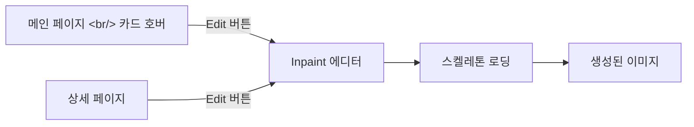

## 개요

[이전 글: #4 — 라우터 분리, Terraform Dev 서버, Inpaint 에디터](/posts/2026-03-24-hybrid-search-dev4/)

이번 #5에서는 13개 커밋에 걸쳐 세 가지 작업 스트림을 진행했다. 첫째, Inpaint 에디터의 UX를 개선하고 메인 페이지에서 바로 접근 가능하게 만들었다. 둘째, EC2 Dev 서버에 Google OAuth를 연동하고 이미지 로딩 문제를 해결했다. 셋째, 이미지 생성의 중복 방지와 모달 닫기 등 전반적인 안정성을 강화했다.

<!--more-->

---

## Inpaint 에디터 UX 개선

### 카드 호버에서 Inpaint 진입

기존에는 이미지 상세 페이지에서만 Inpaint를 사용할 수 있었다. 이번에 메인 페이지 카드에 호버 시 "Edit" 버튼을 추가하고, 클릭하면 바로 Inpaint 에디터가 열리도록 개선했다.

### 스켈레톤 로딩 카드

Inpaint 생성 중 메인 페이지에 스켈레톤 로딩 카드를 표시해, 생성 진행 상황을 시각적으로 확인할 수 있게 했다.

### Undo 히스토리 수정

Inpaint 에디터에서 stroke 시작 전에 `saveHistory()`를 호출하도록 수정했다. 기존에는 stroke 완료 후에 저장해서, undo 시 이전 상태가 아닌 현재 상태가 복원되는 버그가 있었다.

---

## EC2 Dev 서버 배포

### Google OAuth 연동

Dev 서버에 처음 접속했을 때 로그인이 안 되는 문제가 있었다. 원인은 두 가지:

1. **`VITE_GOOGLE_CLIENT_ID` 미설정** — Vite의 환경 변수는 빌드 타임에 인라인되므로, EC2에서 빌드 시 `.env`에 설정되어 있어야 한다
2. **GCP OAuth 승인된 출처 미등록** — EC2의 URL(`http://ec2-xxx.compute.amazonaws.com:5173`)을 GCP 콘솔의 승인된 JavaScript 출처에 추가해야 한다

### 이미지 표시 문제

서버에서 검색과 리랭킹은 정상 동작하지만 이미지가 404로 표시되는 문제가 있었다. 원인은 README의 "데이터 준비" 단계를 건너뛴 것 — 이미지 파일이 split zip으로 저장되어 있어 압축 해제가 필요했다.

추가로 `fix: add recursive image search for nested directory structures` — 디렉토리 구조가 중첩된 경우에도 이미지를 찾을 수 있도록 수정했다.

---

## 생성 안정성 강화

### 중복 생성 방지

Enter 키를 빠르게 연타하면 이미지가 2개 생성되는 버그를 수정했다. `handleGenerate` 진입 시 `generatingCount > 0`이면 즉시 리턴하는 가드를 추가했다. 이후 더 근본적인 해결을 위해 lock 대신 500ms debounce로 전환했다.

### ESC 키로 모달 닫기

모든 modal/popup 컴포넌트에 ESC 키 이벤트를 추가했다.

### 톤/앵글 참조 프롬프트 강화

자동 주입 시스템에서 톤/앵글이 의도치 않게 생성 결과에 영향을 주는 문제를 수정했다. 참조 프롬프트를 강화해 톤/앵글이 순수한 메타데이터로만 사용되도록 했다.

### aspect_ratio 유효성 검증

Gemini edit API에 전달하기 전에 `aspect_ratio` 값을 검증하고, 재생성(regeneration)과 inpaint 간에 `aspect_ratio`와 `resolution`이 보존되도록 수정했다.

---

## 클립보드 폴백

상세 페이지의 프롬프트 복사 버튼이 일부 환경에서 동작하지 않는 문제를 수정했다. `navigator.clipboard.writeText()`이 실패할 경우 `execCommand('copy')` 폴백을 추가했다.

---

## ML 모델 백그라운드 로딩

서버 시작 시 ML 모델 로딩이 완료될 때까지 로그인 페이지가 응답하지 않는 문제를 수정했다. 모델 로딩을 백그라운드 태스크로 전환해 서버 시작 즉시 로그인이 가능하도록 개선했다.

---

## 커밋 로그

| 메시지 | 변경 |
|--------|------|
| fix: add clipboard fallback for prompt copy button | FE |
| fix: strengthen tone/angle reference prompt | BE |
| fix: validate aspect_ratio before Gemini edit API | BE |
| fix: preserve aspect_ratio and resolution across regen/inpaint | BE+FE |
| feat: show skeleton loading cards during inpaint generation | FE |
| feat: add inpaint edit button to card hover | FE |
| fix: replace generation lock with 500ms debounce | FE |
| fix: load ML models in background so login works during startup | BE |
| feat: add ESC key to close all modal/popup components | FE |
| fix: prevent duplicate image generation on rapid Enter | FE |
| fix: add recursive image search for nested directories | BE |
| add allowed host | BE |
| fix: save undo history before stroke begins in InpaintEditor | FE |

---

## 인사이트

이번 스프린트는 "만든 기능을 실제 환경에서 안정적으로 동작하게 만드는" 작업이 중심이었다. Inpaint 에디터를 로컬에서 만들고 EC2에 배포하니 예상치 못한 문제(OAuth, 이미지 경로, 환경 변수)가 줄줄이 나왔다. 특히 Vite의 빌드 타임 환경 변수(`import.meta.env.*`)는 서버 배포 시 반드시 빌드 전에 설정되어야 한다는 점을 다시 확인했다. 중복 생성 방지를 lock에서 debounce로 전환한 것은 UX 관점에서 더 자연스러운 해결이었다.
