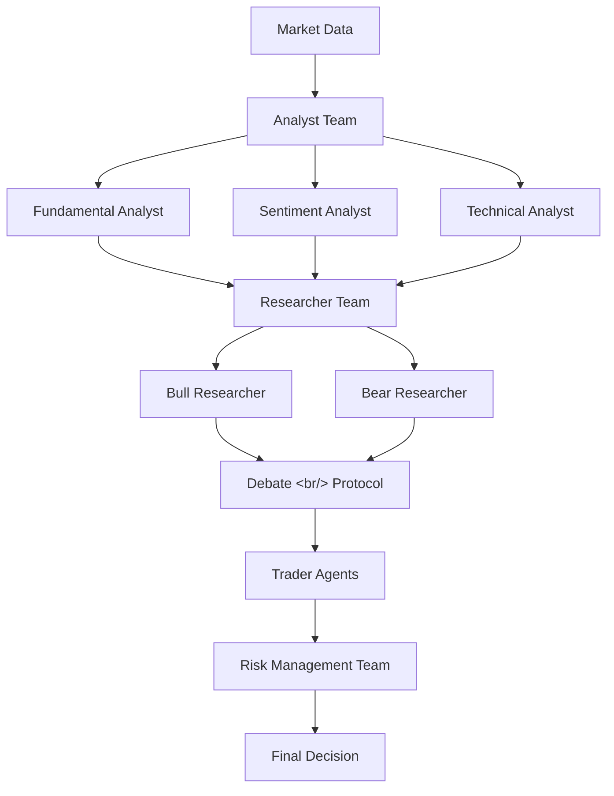
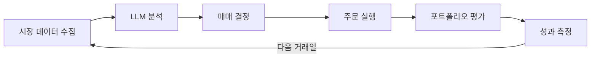
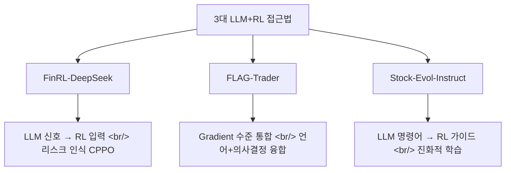

## 개요

LLM 기반 주식 트레이딩 에이전트가 2025~2026년 사이 폭발적으로 성장하고 있다. 단순 감성 분석을 넘어, 멀티 에이전트 아키텍처로 트레이딩 펌 전체를 시뮬레이션하거나, 강화학습(RL)과 결합해 실시간 리스크 관리까지 수행하는 단계에 이르렀다. 이 글에서는 주요 오픈소스 프레임워크 4종과 학술 논문 3편을 분석하고, 실제 트레이딩 에이전트를 개발하는 관점에서 어떤 인사이트를 얻을 수 있는지 정리한다.

<!--more-->

---

## TradingAgents — 트레이딩 펌을 LLM으로 시뮬레이션하다

[TradingAgents](https://github.com/TauricResearch/TradingAgents)는 UCLA와 MIT 연구팀이 개발한 멀티 에이전트 트레이딩 프레임워크다. GitHub 스타 40,795개를 기록하며, LLM 트레이딩 분야에서 가장 큰 커뮤니티를 보유하고 있다.

### 아키텍처: 트레이딩 펌의 조직 구조를 그대로 재현

TradingAgents의 핵심 아이디어는 실제 트레이딩 회사의 역할 분담을 LLM 에이전트로 구현하는 것이다.

- **Analyst Team**: 펀더멘탈, 감성, 기술 분석을 각각 전담하는 에이전트
- **Researcher Team**: Bull/Bear 관점에서 시장 상황을 평가하고 토론
- **Trader Agents**: 다양한 위험 선호도를 가진 트레이더 에이전트
- **Risk Management Team**: 포지션 노출을 감시하고 최종 의사결정

### 실험 결과

백테스팅에서 기존 기준 모델 대비 누적 수익률, 샤프 비율, 최대 낙폭 모두에서 유의미한 개선을 보였다. 특히 Bull/Bear 토론 프로토콜이 단일 의견 에이전트 대비 더 균형 잡힌 판단을 이끌어낸다는 점이 주목할 만하다.

### 기술 스택

Python 기반 229K 라인 규모로, v0.2.2까지 진화했다. 최근 커밋에서는 5단계 등급 체계 표준화, 포트폴리오 매니저 리팩토링, 거래소 수식 티커 보존 등의 개선이 이루어졌다.

---

## PrimoAgent — 멀티 에이전트 주식 분석

[PrimoAgent](https://github.com/ivebotunac/PrimoAgent)는 멀티 에이전트 아키텍처를 주식 분석에 적용한 프레임워크다. TradingAgents가 트레이딩 실행까지 포괄하는 반면, PrimoAgent는 분석 파이프라인에 집중한다.

각 에이전트가 서로 다른 분석 영역(재무제표, 뉴스 감성, 기술적 지표)을 담당하고, 최종 분석 보고서를 통합 생성하는 구조다. 소규모 팀이나 개인 투자자가 기관 수준의 리서치 프로세스를 자동화하려는 용도에 적합하다.

---

## AlpacaTradingAgent — LLM 금융 트레이딩 에이전트

[AlpacaTradingAgent](https://github.com/huygiatrng/AlpacaTradingAgent)는 Alpaca Markets API와 LLM을 결합한 자동 트레이딩 시스템이다. 실제 주식 매매를 수행할 수 있다는 점에서 백테스팅에 머무는 학술 프레임워크와 차별화된다.

Alpaca의 페이퍼 트레이딩 API를 통해 실제 시장 데이터로 위험 없이 전략을 검증한 뒤, 실전 매매로 전환할 수 있는 파이프라인을 제공한다.

---

## stock-analysis-agent — 한국 주식 리서치 자동화

[stock-analysis-agent](https://github.com/kipeum86/stock-analysis-agent)는 Claude Code를 활용해 한국 및 미국 주식에 대한 기관급 리서치를 자동화하는 오픈소스 프로젝트다. 한국 시장 특유의 데이터 소스(DART 전자공시, 네이버 금융 등)를 지원한다는 점이 핵심이다.

[기존 분석 글](/posts/2026-03-16-stock-analysis-agent/)에서 다룬 바와 같이, 이 프로젝트는 한국 주식 시장의 데이터 접근성 문제를 LLM + MCP 아키텍처로 해결하려는 시도다.

---

## StockBench — LLM 에이전트는 실제로 수익을 낼 수 있는가?

칭화대학교 연구팀이 발표한 [StockBench](https://arxiv.org/html/2510.02209v1)는 "LLM 에이전트가 실제 시장에서 수익성 있게 거래할 수 있는가?"라는 질문에 정면으로 답하는 벤치마크다.

### 벤치마크 설계

StockBench는 실제 시장 데이터를 사용한 백트레이딩 환경을 구축하고, 표준화된 에이전트 워크플로우를 정의한다.

### 주요 발견

- **투자 대상 규모의 영향**: 종목 수가 많아질수록 LLM 에이전트의 성과가 저하되는 경향
- **워크플로우 오류 분석**: 매매 결정 과정에서 발생하는 오류 유형 분류
- **데이터 소스 기여도**: 어떤 데이터 소스가 수익률에 가장 큰 영향을 미치는지 ablation study

이 벤치마크는 LLM 트레이딩 에이전트의 실전 적용 가능성을 냉정하게 평가한다는 점에서 중요하다. "LLM이 주식으로 돈을 벌 수 있다"는 주장에 대한 과학적 검증 도구로 기능한다.

---

## LLM + 강화학습: 최신 논문 3편 분석

[AI for Life 블로그](https://www.slavanesterov.com/2025/05/3-llmrl-advances-in-equity-trading-2025.html)에서 정리한 2025년 주요 LLM+RL 트레이딩 논문 3편을 분석한다.

### 1. FinRL-DeepSeek: LLM 기반 리스크 인식 RL

하이브리드 트레이딩 에이전트로, 딥 RL에 LLM의 뉴스 분석 신호를 결합한다. CVaR-Proximal Policy Optimization(CPPO) 알고리즘을 확장해 매일 LLM이 생성한 투자 추천과 리스크 평가 점수를 RL 에이전트에 주입한다.

핵심은 단순 감성 분석을 넘어, DeepSeek V3, Qwen-2.5, Llama 3.3 등 LLM을 프롬프팅해 뉴스에서 미묘한 리스크/수익 인사이트를 추출하는 것이다. Nasdaq-100 지수에 대한 1999~2023년 백테스트에서 리스크 관리 성능이 크게 향상되었다.

### 2. FLAG-Trader: LLM과 Gradient RL의 융합

LLM의 언어 이해 능력과 RL의 연속 의사결정 능력을 gradient 수준에서 통합하는 접근법이다. LLM이 시장 텍스트 데이터를 처리하고, RL 에이전트가 이를 기반으로 매매를 학습한다.

### 3. Stock-Evol-Instruct: LLM 가이드 RL 트레이딩

LLM이 생성한 진화적 명령어(evolutionary instructions)로 RL 에이전트의 학습을 가이드하는 방식이다. 전통적 RL의 보상 설계 어려움을 LLM의 자연어 피드백으로 우회한다.

---

## 자체 프로젝트와의 연결

현재 개발 중인 [trading-agent](/posts/2026-03-20-trading-agent-dev5/) 프로젝트와 비교하면:

| 특성 | TradingAgents | 자체 trading-agent |
|------|--------------|-------------------|
| 시장 | 미국 주식 | 한국 주식 (KIS API) |
| 에이전트 수 | 10+ (분석+트레이딩+리스크) | 6 (뉴스/매크로 포함) |
| 데이터 소스 | Yahoo Finance, Reddit | DART, 네이버, KIS |
| 실행 | 백테스팅 중심 | 실매매 지원 (MCP) |
| UI | CLI | React 대시보드 |

TradingAgents의 Bull/Bear 토론 프로토콜과 StockBench의 벤치마킹 방법론은 자체 프로젝트에도 적용할 가치가 있다. 특히 리스크 관리 팀 에이전트 패턴과 DCF/PER 기반 밸류에이션 비교는 현재 구현 중인 기능과 직접 연결된다.

---

## 인사이트

LLM 트레이딩 에이전트 생태계의 현재 상황은 "멀티 에이전트 = 트레이딩 펌 시뮬레이션"이라는 공식이 표준으로 자리잡고 있음을 보여준다. 단일 LLM이 모든 분석과 결정을 내리는 시대는 끝났고, 역할별 전문화된 에이전트가 토론하고 합의하는 구조가 일관되게 더 나은 성과를 보인다.

학술 연구 쪽에서는 LLM+RL 하이브리드가 주류가 되고 있다. LLM의 텍스트 이해와 RL의 시퀀셜 결정을 결합하면, 순수 LLM이나 순수 RL보다 리스크 조정 수익률이 높아진다는 실증이 쌓이고 있다.

StockBench 같은 벤치마크의 등장은 이 분야가 "데모 수준"에서 "과학적 검증 가능한 수준"으로 성숙하고 있다는 신호다. 자체 트레이딩 에이전트 개발에서도 TradingAgents의 조직 구조 패턴, StockBench의 평가 프레임워크, FinRL-DeepSeek의 리스크 관리 방법론을 참고하여 한국 시장에 맞게 적용할 수 있을 것이다.
