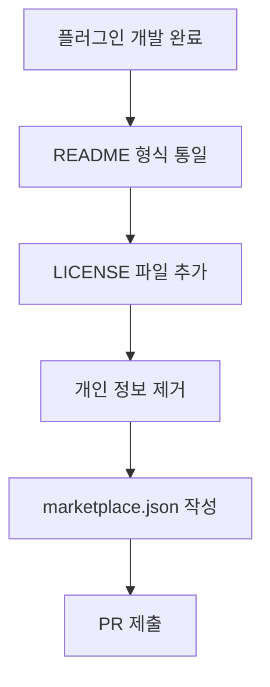

## 개요

[이전 글: #3 — 스킬에서 플러그인으로의 전환](/posts/2026-03-24-log-blog-dev3/)

이번 #4에서는 2개 커밋으로 log-blog 플러그인을 Claude Code 공식 마켓플레이스에 등록하기 위한 준비 작업을 진행했다. README를 공식 플러그인 형식에 맞춰 재작성하고, LICENSE 파일 추가 및 개인 정보 제거 작업을 완료했다.

<!--more-->

---

## 공식 마켓플레이스 등록 요건

Claude Code 공식 마켓플레이스(`anthropics/claude-plugins-official`)에 플러그인을 등록하려면 몇 가지 요건을 충족해야 한다.

### README 재작성

기존 README는 개발 노트 성격이 강했다. 공식 플러그인 README 형식에 맞춰 다음 구조로 재작성했다:

- **Overview**: 플러그인이 무엇을 하는지 한 문장 설명
- **Skills**: 사용 가능한 스킬 목록과 설명
- **Installation**: 설치 방법
- **CLI Usage**: CLI 명령어 가이드
- **Requirements**: 필수 의존성
- **Troubleshooting**: 자주 발생하는 문제 해결

### LICENSE 파일 추가

MIT 라이선스를 추가했다. 마켓플레이스 등록 시 라이선스가 명시되어 있어야 한다.

### 개인 정보 제거

`plugin.json`의 author 필드와 기타 설정에서 개인 이메일 등의 정보를 정리했다. 공개 배포 시 불필요한 개인 정보가 노출되지 않도록 했다.

---

## 커밋 로그

| 메시지 | 변경 |
|--------|------|
| docs: rewrite README to match official Claude Code plugin format | docs |
| fix: add LICENSE file, unify author, remove personal info for marketplace review | config |

---

## 인사이트

플러그인 개발의 마지막 마일은 코드가 아니라 패키징이다. 기능이 완벽해도 README가 불친절하거나 라이선스가 없으면 마켓플레이스 심사를 통과할 수 없다. 이번 작업은 규모는 작지만, `.claude/skills/` 디렉토리의 로컬 스킬에서 시작해 공식 마켓플레이스에 등록 가능한 플러그인으로 진화하는 여정의 마지막 단계다.
