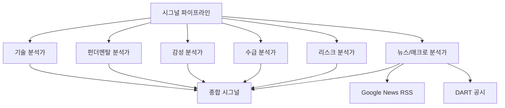

## 개요

[이전 글: #5 — Backend 안정화와 데이터 파이프라인 개선](/posts/2026-03-20-trading-agent-dev5/)

이번 #6에서는 35개 커밋에 걸쳐 세 가지 큰 작업 스트림을 진행했다. 첫째, 6번째 전문가(뉴스/매크로 분석가)를 시그널 파이프라인에 추가하고 DART 기반 분석을 대폭 강화했다. 둘째, DCF 밸류에이션, 포트폴리오 리스크, 시그널 히스토리 등 심화 분석 기능을 구현했다. 셋째, 프론트엔드에 ScheduleManager, SignalDetailModal, 투자 메모 내보내기 등 대규모 UI 확장을 진행했다.

<!--more-->

---

## 시그널 파이프라인 확장

### 뉴스/매크로 분석가 — 6번째 전문가

기존 5인 전문가 체제(기술, 펀더멘탈, 감성, 수급, 리스크)에 **뉴스/매크로 분석가**를 추가했다. Google News RSS를 fallback으로 활용해 뉴스 수집의 안정성을 높였다.



### DART 데이터 대폭 강화

DART 전자공시 시스템에서 가져오는 데이터를 크게 확장했다:

- **내부자 거래 데이터** (`feat: add DART insider trading data`) — 임원 매수/매도 동향
- **외국인/기관 투자자 동향** (`feat: add foreign/institutional investor trend`) — 수급 흐름 분석
- **촉매 캘린더** (`feat: add catalyst calendar with DART disclosures`) — 실적 발표, 공시 일정을 타임라인 UI로 시각화
- **피어 비교** (`feat: add peer comparison with sector-based DART valuation`) — 동종 업계 밸류에이션 비교

### 8개 신규 DB 테이블

새로운 분석 기능을 지원하기 위해 8개 테이블과 ANALYST 역할, 메타데이터 초기화를 한 번에 추가했다.

---

## 심화 분석 기능

### DCF 밸류에이션

현금흐름할인법(DCF) 밸류에이션 모듈을 구현했다. 민감도 테이블과 히트맵을 포함해 WACC/성장률 변화에 따른 적정 주가 범위를 시각화한다.

```python
# DCF sensitivity heatmap 핵심 로직
for wacc in wacc_range:
    for growth in growth_range:
        intrinsic_value = calculate_dcf(fcf, wacc, growth, terminal_growth)
        heatmap[wacc][growth] = intrinsic_value
```

### 포트폴리오 리스크 분석

실제 포트폴리오 데이터를 기반으로 VaR(Value at Risk), 베타, 섹터 집중도를 계산한다. 상관관계 매트릭스 히트맵으로 포지션 간 상관성을 시각화한다.

- **VaR 계산**: Historical simulation 방식으로 95%/99% 신뢰구간의 최대 손실 추정
- **베타**: KOSPI200 대비 포트폴리오 베타 계산
- **섹터 집중도**: NAVER Finance에서 KOSPI200 종목별 섹터 데이터를 수집해 섹터 분포 분석

### 시그널 히스토리 스냅샷

시그널을 시점별로 저장하고, 과거 시그널과 비교할 수 있는 타임라인 기능을 추가했다.

---

## 프론트엔드 대규모 확장

### ScheduleManager

크론 편집과 즉시 실행(run-now) 버튼을 포함하는 스케줄 관리 컴포넌트를 구현했다. 에이전트 이름과 친근한 태스크 레이블 표시, 크론 시간(시:분) 기준 정렬 기능을 포함한다.

### SignalDetailModal

시그널을 클릭하면 관련 주문 내역까지 드릴다운할 수 있는 상세 모달을 추가했다. 전문가 의견 확장, risk_notes 표시, compact/expanded 뷰 토글도 함께 구현했다.

### 투자 메모 내보내기

시그널 데이터를 기반으로 HTML 및 DOCX 형식의 투자 메모를 생성하는 기능을 추가했다. `python-docx`를 사용해 Word 문서 형식으로 내보낼 수 있다.

### 기타 UI 개선

| 컴포넌트 | 변경 |
|----------|------|
| OrderHistory | fill_price, order_type, 시그널 링크 표시 |
| PositionsTable | market_value 컬럼 추가 |
| ReportViewer | 거래 PnL 컬럼, rr_score 색상 코딩 |
| DashboardView | report.generated 이벤트 핸들링 |
| Settings | initial_capital, min_rr_score 설정 |

---

## MCP 미들웨어 수정

Session 1에서 `ctx.set_state()`와 `ctx.get_state()`가 async 메서드인데 `await` 없이 호출되던 문제를 발견하고 수정했다. 서버 로그에 반복적으로 나타나던 "MCP tool call failed" 에러의 원인이었다.

```python
# Before
ctx.set_state(factory.CONTEXT_STARTED_AT, started_dt.strftime("%Y-%m-%d %H:%M:%S"))

# After
await ctx.set_state(factory.CONTEXT_STARTED_AT, started_dt.strftime("%Y-%m-%d %H:%M:%S"))
```

auto-reconnect 로직도 추가해 MCP 연결 실패 시 자동 복구되도록 개선했다.

---

## 단위 테스트

DCF 밸류에이션과 포트폴리오 리스크 서비스에 대한 단위 테스트를 추가했다.

---

## 커밋 로그

| 메시지 | 변경 |
|--------|------|
| feat: sort schedule tasks by cron time ascending | UI |
| feat: show agent name and friendly task labels in ScheduleManager | UI |
| style: align new components with existing design system | UI |
| fix: use import type for ScheduledTask (Vite ESM) | FE |
| feat: add Google News RSS fallback for news stability | BE |
| feat: add compact/expanded view toggle to SignalCard | UI |
| feat: add DOCX investment memo export | BE |
| feat: add real portfolio beta and correlation heatmap | BE |
| feat: add DCF sensitivity heatmap table | UI |
| test: add unit tests for DCF and portfolio risk | TEST |
| feat: populate kospi200 sector data from NAVER | BE |
| fix: await async MCP context methods + auto-reconnect | BE |
| fix: replace explicit any types | FE |
| feat: add investment memo HTML export | BE |
| feat: add VaR, beta, sector concentration risk | BE |
| feat: add DCF valuation with sensitivity table | BE |
| feat: add signal history snapshots and timeline | BE+FE |
| feat: add peer comparison with DART valuation | BE |
| feat: add news/macro analyst as 6th expert | BE |
| feat: add catalyst calendar with DART disclosures | BE+FE |
| feat: add DART insider trading data | BE |
| feat: add foreign/institutional investor trend | BE |
| feat: add 8 new DB tables, ANALYST role, metadata init | BE |
| fix: resolve lint errors in DashboardView/SignalCard | FE |
| feat: add report.generated event handling | FE |
| feat: add initial_capital and min_rr_score to settings | BE+FE |
| feat: add ScheduleManager with cron editing | FE |
| feat: add trade PnL column and rr_score color coding | FE |
| feat: add SignalDetailModal with orders drilldown | FE |
| feat: add expert opinion expansion and risk_notes | FE |
| feat: use correct performance endpoint with selector | FE |
| feat: add market_value to PositionsTable | FE |
| feat: show fill_price, order_type, signal link | FE |
| feat: add missing type fields | FE |
| feat: add missing API service functions | FE |

---

## 인사이트

이번 스프린트는 trading-agent의 분석 깊이와 프론트엔드 완성도를 동시에 끌어올린 대규모 확장이었다. 6번째 전문가 추가로 시그널 파이프라인이 더 균형 잡힌 의사결정을 내릴 수 있게 되었고, DCF/VaR/베타 같은 기관급 분석 도구가 추가되면서 단순 시그널 생성을 넘어 종합 투자 분석 플랫폼으로 진화하고 있다. DART 데이터 활용 범위가 내부자 거래, 수급 동향, 공시 캘린더까지 확장되면서, 한국 주식 시장 특화 트레이딩 에이전트로서의 차별점이 더욱 뚜렷해졌다.
